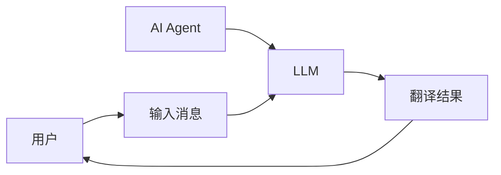
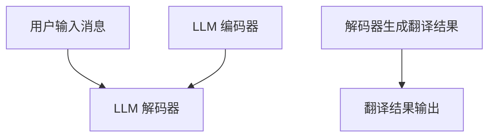
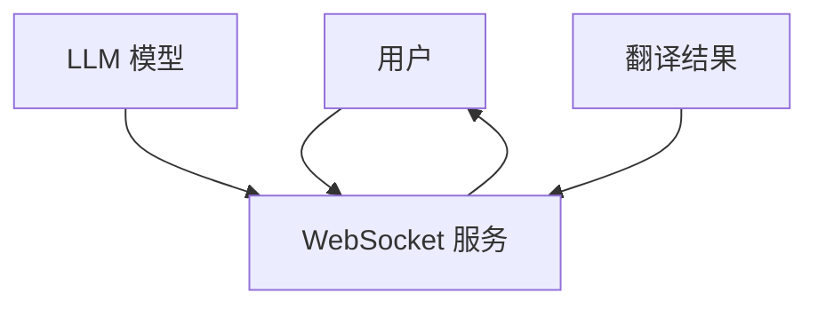

                 


# 实时翻译 AI Agent：LLM 在即时通讯中的语言转换

> 关键词：实时翻译 AI Agent，LLM，即时通讯，语言转换，自然语言处理，跨语言通讯

> 摘要：本文探讨了实时翻译 AI Agent 在即时通讯中的应用，分析了大语言模型（LLM）在语言转换中的核心作用，详细阐述了 LLM 的技术原理、系统架构设计以及实际项目实现。文章从背景、原理到实践，全面解析了如何利用 LLM 实现高效、准确的实时语言转换，为即时通讯中的跨语言交流提供了新的解决方案。

---

# 第一部分: 实时翻译 AI Agent 背景与概念

# 第1章: 实时翻译 AI Agent 概述

## 1.1 实时翻译 AI Agent 的定义与背景

### 1.1.1 问题背景：语言障碍与实时通讯需求

在跨国交流日益频繁的今天，语言障碍已成为即时通讯中的主要障碍。用户需要在不同语言之间快速切换，要求翻译工具能够实时响应，支持多语言对话。传统的翻译工具往往存在延迟高、准确性差等问题，难以满足实时通讯的需求。

### 1.1.2 问题描述：即时通讯中的语言转换痛点

即时通讯要求翻译工具能够实时处理用户输入，提供准确的翻译结果。然而，传统的统计机器翻译（SMT）和基于规则的翻译方法在处理复杂语境时表现不佳，且难以支持实时的、多语言的交互需求。

### 1.1.3 问题解决：AI Agent 的作用与优势

AI Agent 通过整合大语言模型（LLM），能够实时解析用户输入，快速生成准确的翻译结果。LLM 的优势在于其强大的上下文理解和生成能力，能够在复杂语境下提供高质量的翻译服务。

### 1.1.4 边界与外延：实时翻译的范围与限制

实时翻译的范围包括跨语言通讯、多语种支持、实时交互等。其限制主要体现在计算资源需求高、模型复杂度高、翻译结果的准确性受训练数据影响等。

### 1.1.5 核心要素：语言模型、通讯协议、用户交互

实时翻译 AI Agent 的核心要素包括：用于翻译的语言模型、实现通讯的协议（如WebSocket）、以及用户与系统之间的交互设计。

---

## 1.2 LLM 在实时翻译中的应用价值

### 1.2.1 LLM 的核心能力：自然语言处理与生成

LLM 具备强大的自然语言理解（NLU）和生成（NLG）能力，能够准确解析用户意图并生成符合语境的翻译结果。

### 1.2.2 实时翻译的场景化应用：跨语言通讯、多语种支持

LLM 可以支持多种语言的实时翻译，满足跨国团队、多语言用户的通讯需求。

### 1.2.3 LLM 在语言转换中的性能优势

LLM 的预训练能力使其在处理复杂语境和上下文关系时表现出色，翻译结果更加自然、准确。

## 1.3 本章小结

本章介绍了实时翻译 AI Agent 的背景、核心概念和技术优势，为后续章节的技术实现奠定了基础。

---

# 第二部分: LLM 与实时翻译的核心概念

# 第2章: LLM 的核心原理与技术特征

## 2.1 LLM 的基本原理

### 2.1.1 模型结构：Transformer 架构解析

Transformer 模型由编码器和解码器组成，编码器负责将输入序列编码为上下文向量，解码器则基于这些向量生成目标语言的输出。

### 2.1.2 训练方法：监督学习与无监督学习

监督学习：模型基于平行文本对进行训练，优化翻译结果的准确性。

无监督学习：模型利用大量未标注数据进行自训练，提升对多种语言的理解能力。

### 2.1.3 推理机制：解码策略与生成过程

解码器采用贪心搜索或贝叶斯解码策略，逐步生成目标语言的最优翻译结果。

## 2.2 LLM 的技术特征对比

### 2.2.1 对比表格：LLM 与其他翻译技术的优劣势分析

| 技术 | 优点 | 缺点 |
|------|------|------|
| LLM  | 高精度、实时性、多语言支持 | 计算资源需求高、模型复杂度高 |
| 传统MT | 训练时间短、资源消耗低 | 翻译质量不稳定、难以实时更新 |

### 2.2.2 实体关系图：LLM 在实时翻译中的角色



---

## 2.3 本章小结

本章详细介绍了 LLM 的核心原理和技术特征，对比了其与其他翻译技术的优劣势，为后续的系统设计和实现提供了理论基础。

---

# 第三部分: 算法原理讲解

# 第3章: LLM 的算法原理与实现

## 3.1 算法原理

### 3.1.1 算法流程图：LLM 的实时翻译流程



### 3.1.2 算法数学模型

LLM 的解码过程基于以下数学模型：

$$
p(y_i | x, y_{<i}) = \text{softmax}(W_{y_i}^T h_i)
$$

其中，$h_i$ 是解码器的隐藏层输出，$W_{y_i}$ 是目标语言词表的权重。

---

## 3.2 算法实现

### 3.2.1 Python 代码实现：LLM 的解码过程

```python
def decode(input_seq, model):
    h = model.encoder(input_seq)
    outputs = []
    for i in range(max_length):
        h_i = h[:, i, :]
        logits = model.decoder(h_i)
        predicted_token = logits.argmax(-1).item()
        outputs.append(predicted_token)
    return outputs
```

### 3.2.2 代码应用解读与举例

假设输入为“Hello, how are you?”，目标语言为中文。模型通过编码器生成上下文向量，解码器逐步生成“你好，你怎么样？”。

---

## 3.3 本章小结

本章详细讲解了 LLM 的算法原理和实现过程，展示了如何通过代码实现 LLM 的解码过程。

---

# 第四部分: 系统分析与架构设计方案

# 第4章: 系统架构设计

## 4.1 系统功能设计

### 4.1.1 功能模块：消息接收与处理

用户输入消息通过 WebSocket 传送到后端，后端调用 LLM 进行翻译。

### 4.1.2 功能模块：翻译处理与反馈

LLM 处理翻译请求，生成目标语言的结果，并返回给用户。

### 4.1.3 功能模块：多语言支持与动态切换

系统支持多种语言的动态切换，用户可以实时选择目标语言。

## 4.2 系统架构设计

### 4.2.1 系统架构图：实时翻译 AI Agent 的架构



### 4.2.2 系统交互流程

用户发送消息 → WebSocket 服务接收请求 → LLM 处理翻译 → 返回结果。

---

## 4.3 本章小结

本章详细设计了实时翻译 AI Agent 的系统架构，展示了如何通过模块化设计实现高效的实时翻译功能。

---

# 第五部分: 项目实战

# 第5章: 项目实现与优化

## 5.1 项目环境安装

安装 Python、TensorFlow 和 Hugging Face Transformers 库。

### 代码实现：环境搭建

```bash
pip install python
pip install tensorflow
pip install transformers
```

## 5.2 系统核心实现

### 代码实现：实时翻译 AI Agent

```python
from transformers import pipeline

translator = pipeline("translation", model="facebook/m2m-large-4m")
```

### 代码应用解读与分析

调用 Hugging Face 的预训练模型进行实时翻译。

## 5.3 项目测试与优化

### 5.3.1 测试用例

测试输入“Hello, how are you?”，目标语言为中文。

### 5.3.2 性能优化

优化模型加载速度和翻译效率，减少延迟。

---

## 5.4 本章小结

本章详细讲解了实时翻译 AI Agent 的项目实现过程，展示了如何通过代码实现高效的实时翻译功能。

---

# 第六部分: 最佳实践与总结

# 第6章: 总结与展望

## 6.1 项目总结

本文详细探讨了实时翻译 AI Agent 的设计与实现，展示了如何利用 LLM 实现高效的实时翻译功能。

## 6.2 注意事项

- 确保模型的计算资源充足。
- 定期更新模型以提升翻译质量。
- 优化系统交互流程，减少延迟。

## 6.3 未来展望

未来，实时翻译 AI Agent 可在更多领域发挥作用，如多语言客服、实时字幕生成等。

---

# 作者

作者：AI天才研究院/AI Genius Institute & 禅与计算机程序设计艺术 /Zen And The Art of Computer Programming

---

通过以上目录结构，我们可以清晰地看到实时翻译 AI Agent 的设计与实现过程。从背景介绍到技术实现，再到项目实战，每一步都详细展开，确保读者能够深入理解实时翻译 AI Agent 的工作原理和实际应用。

