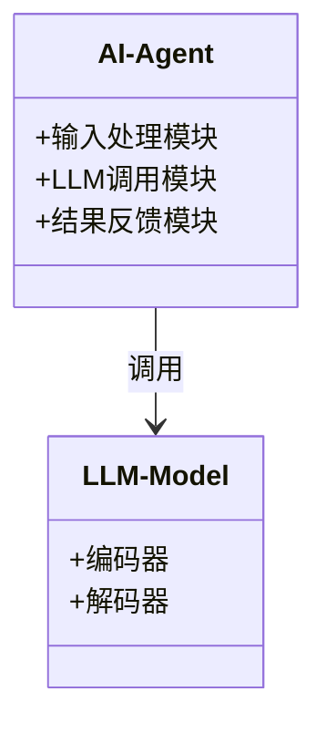
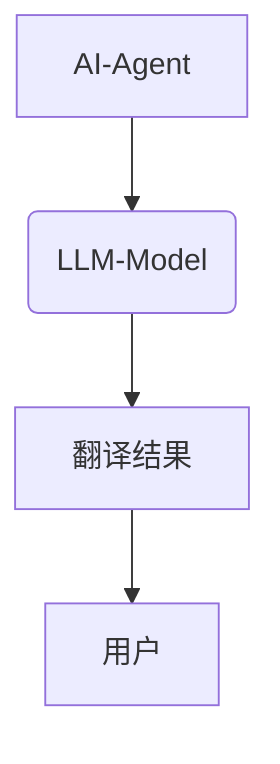
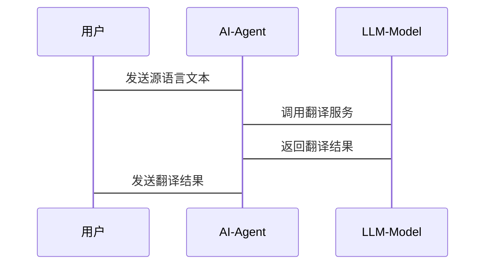

                 


# 实时语言转换AI Agent：LLM在多语言环境中的应用

## 关键词：实时语言转换，AI Agent，LLM，多语言环境，大语言模型，机器翻译，自然语言处理

## 摘要：本文深入探讨了实时语言转换AI Agent的实现与应用，结合大语言模型（LLM）的技术优势，分析了多语言环境下的翻译需求、技术挑战及解决方案。通过系统架构设计、算法原理和项目实战的详细讲解，本文为读者提供了从理论到实践的完整指南，帮助开发者和研究人员更好地理解和应用实时语言转换技术。

---

# 第1章: 实时语言转换的背景与重要性

## 1.1 问题背景

### 1.1.1 多语言交流的挑战
在全球化的背景下，跨语言交流变得越来越频繁。然而，语言障碍仍然是阻碍有效沟通的主要问题。传统的人工翻译效率低下，而基于规则的机器翻译在准确性和流畅性上存在明显不足。

### 1.1.2 实时翻译的需求场景
实时翻译在多种场景中具有重要应用价值，例如国际会议、跨国商务沟通、旅游导航等。用户需要在交流过程中即时获得语言转换结果，而不能容忍延迟或误差。

### 1.1.3 当前技术的局限性
现有的机器翻译技术在处理复杂语境、长句结构和多语言支持方面仍有不足。传统方法依赖预定义的规则和词典，难以适应语言的多样性和动态变化。

## 1.2 问题描述

### 1.2.1 多语言转换的核心问题
实时语言转换需要在极短的时间内完成高质量的翻译，同时支持多种语言的互译。这要求模型具备强大的语言理解和生成能力。

### 1.2.2 实时性对技术的要求
实时翻译需要快速响应，这意味着模型必须具备高效的推理能力和低延迟的处理机制。

### 1.2.3 用户体验的关键因素
用户体验是实时语言转换技术成功与否的关键。准确的翻译结果、快速的响应速度和友好的交互界面是用户最关注的三个因素。

## 1.3 解决方案与技术路线

### 1.3.1 大语言模型（LLM）的优势
LLM基于海量数据训练，具备强大的语言理解和生成能力。它能够处理复杂的语境和上下文信息，支持多种语言的转换。

### 1.3.2 实时语言转换的实现路径
通过结合LLM和AI Agent技术，构建实时语言转换系统。AI Agent负责接收输入、调用LLM进行翻译，并将结果返回给用户。

### 1.3.3 技术架构的选择与优化
选择轻量级的模型和高效的推理引擎，优化系统的响应速度和资源利用率。

## 1.4 本章小结
本章介绍了实时语言转换的背景和重要性，分析了当前技术的局限性，并提出了基于LLM和AI Agent的技术解决方案。

---

# 第2章: 大语言模型（LLM）的核心原理

## 2.1 LLM的基本概念

### 2.1.1 大语言模型的定义
大语言模型（LLM）是指基于深度学习技术训练的大型神经网络模型，具备处理自然语言任务的能力，包括文本生成、翻译、问答等。

### 2.1.2 LLM与传统机器翻译的区别
LLM与传统机器翻译的主要区别在于，LLM采用端到端的深度学习模型，能够自动学习语言的结构和语义，而传统方法依赖人工规则和统计模型。

### 2.1.3 LLM的核心技术特点
- 巨量数据训练：利用海量的多语言数据进行训练，提升模型的泛化能力。
- 神经网络架构：采用Transformer架构，具备强大的序列建模能力。
- 自动学习：无需手动设定规则，模型能够自动学习语言规律。

## 2.2 LLM的训练与优化

### 2.2.1 巨量数据训练的重要性
通过训练大规模的多语言数据，模型能够更好地理解和生成多种语言。

### 2.2.2 模型调优的关键技术
- 参数微调：在特定任务上对模型进行微调，提升任务相关的性能。
- 适应性优化：针对多语言环境进行优化，提升模型对不同语言的适应性。

### 2.2.3 多语言模型的适应性
多语言模型能够在同一模型中支持多种语言的转换，减少资源消耗和计算复杂度。

## 2.3 LLM在实时语言转换中的应用

### 2.3.1 LLM的实时推理能力
LLM具备高效的推理能力，能够在短时间内完成高质量的翻译任务。

### 2.3.2 多语言模型的切换机制
通过设计高效的切换机制，模型可以在不同语言之间快速切换，满足实时转换的需求。

### 2.3.3 模型的可扩展性与稳定性
LLM具备良好的扩展性，可以轻松支持更多语言的转换。同时，通过优化算法和架构设计，模型的稳定性得到了保障。

## 2.4 本章小结
本章详细介绍了大语言模型的核心原理，分析了其在实时语言转换中的应用优势。

---

# 第3章: 实时语言转换AI Agent的核心概念

## 3.1 AI Agent的基本概念

### 3.1.1 AI Agent的定义
AI Agent是一种智能代理系统，能够感知环境、理解用户需求并执行相应的操作。它具备自主决策和问题解决能力。

### 3.1.2 AI Agent的分类
- 简单反射型代理：基于简单的规则执行任务。
- 基于模型的反射型代理：具备环境模型，能够根据模型进行决策。
- 目标驱动型代理：根据预设目标执行任务。

### 3.1.3 AI Agent的核心功能
- 感知环境：通过传感器或接口获取环境信息。
- 理解需求：解析用户意图和需求。
- 执行操作：根据需求调用相关服务或资源。
- 反馈结果：将处理结果反馈给用户。

## 3.2 实时语言转换的关键技术

### 3.2.1 实时语言转换的定义
实时语言转换是指在极短的时间内完成语言之间的转换，满足用户的即时需求。

### 3.2.2 实时转换的实现流程
1. 接收输入：获取用户的源语言文本。
2. 分析需求：识别源语言和目标语言。
3. 调用LLM：使用LLM完成翻译任务。
4. 返回结果：将翻译结果反馈给用户。

### 3.2.3 实时转换的性能优化
- 并行计算：通过并行处理提升翻译速度。
- 缓存机制：缓存常用翻译结果，减少重复计算。

## 3.3 LLM与AI Agent的结合

### 3.3.1 LLM作为AI Agent的核心模块
LLM作为AI Agent的核心模块，负责语言理解和生成任务。

### 3.3.2 AI Agent的交互设计
设计友好的交互界面，提升用户体验。

### 3.3.3 LLM在多语言环境中的应用
通过LLM的支持，AI Agent能够实现多种语言的实时转换。

## 3.4 本章小结
本章详细介绍了实时语言转换AI Agent的核心概念，分析了其与LLM的结合方式。

---

# 第4章: 实时语言转换AI Agent的算法原理

## 4.1 模型训练流程

### 4.1.1 数据预处理
- 数据清洗：去除噪声数据。
- 数据标注：标注语言种类和语义信息。
- 数据分块：将数据划分为训练集、验证集和测试集。

### 4.1.2 模型训练过程
1. 初始化模型参数。
2. 进行前向传播，计算预测结果。
3. 计算损失函数，进行反向传播。
4. 更新模型参数。

### 4.1.3 模型评估与优化
- 评估指标：使用BLEU、ROUGE等指标评估翻译质量。
- 参数调整：优化学习率、批量大小等超参数。

## 4.2 模型推理流程

### 4.2.1 输入处理
- 接收用户输入的源语言文本。
- 分析文本内容，确定目标语言。

### 4.2.2 推理过程
- 将源语言文本输入LLM模型，生成目标语言文本。
- 输出翻译结果。

### 4.2.3 输出结果的处理与反馈
- 对翻译结果进行校验和优化。
- 将结果返回给用户。

## 4.3 算法优化与加速

### 4.3.1 算法优化策略
- 知识蒸馏：通过蒸馏技术减小模型规模，提升推理速度。
- 剪枝技术：去除冗余的模型参数，降低计算复杂度。

### 4.3.2 模型压缩技术
- 量化压缩：通过降低数据精度减少模型大小。
- 模型剪枝：去除不重要的神经元和参数。

### 4.3.3 并行计算与分布式训练
- 使用多线程或分布式计算加速模型训练和推理。

## 4.4 本章小结
本章详细介绍了实时语言转换AI Agent的算法原理，分析了模型训练和推理的优化策略。

---

# 第5章: 系统架构设计

## 5.1 问题场景介绍
实时语言转换系统需要满足以下需求：
- 支持多种语言的实时转换。
- 提供高效的响应速度。
- 具备良好的扩展性和可维护性。

## 5.2 项目介绍

### 5.2.1 项目目标
构建一个基于LLM的实时语言转换AI Agent，支持多种语言的互译。

### 5.2.2 项目范围
- 支持的语言种类：中文、英文、法语、西班牙语等。
- 系统架构：模块化设计，便于扩展和维护。

## 5.3 系统功能设计

### 5.3.1 领域模型（mermaid类图）


### 5.3.2 系统架构设计（mermaid架构图）


### 5.3.3 系统接口设计
- 输入接口：接收源语言文本和目标语言。
- 输出接口：返回翻译结果。

## 5.4 系统交互设计（mermaid序列图）



## 5.5 本章小结
本章详细介绍了实时语言转换系统的架构设计，包括系统功能设计、架构图和交互流程。

---

# 第6章: 项目实战

## 6.1 环境安装

### 6.1.1 安装Python环境
```bash
python --version
pip install --upgrade pip
```

### 6.1.2 安装必要的库
```bash
pip install transformers
pip install torch
```

## 6.2 系统核心实现源代码

### 6.2.1 AI Agent实现
```python
class AI-Agent:
    def __init__(self, llm_model):
        self.llm_model = llm_model

    def process_input(self, input_text, target_language):
        # 调用LLM进行翻译
        translated_text = self.llm_model.translate(input_text, target_language)
        return translated_text
```

### 6.2.2 LLM模型实现
```python
class LLM-Model:
    def __init__(self, model_name):
        self.model = AutoModelForSeq2Seq.from_pretrained(model_name)

    def translate(self, input_text, target_language):
        # 具体实现根据模型接口而定
        return self.model.translate(input_text, target_language)
```

## 6.3 代码应用解读与分析

### 6.3.1 代码功能分析
AI-Agent类负责接收输入、调用LLM模型并返回结果。LLM-Model类负责具体的翻译任务。

### 6.3.2 代码优化建议
- 使用更高效的模型架构。
- 优化输入输出接口，提高处理速度。

## 6.4 实际案例分析

### 6.4.1 案例1：中文到英文翻译
输入：你好，今天天气很好。
输出：Hello, the weather is nice today.

### 6.4.2 案例2：英文到法语翻译
输入：Hello, how are you?
输出：Bonjour, comment allez-vous?

## 6.5 本章小结
本章通过实际项目案例，详细介绍了实时语言转换AI Agent的实现过程，包括环境安装、代码实现和案例分析。

---

# 第7章: 最佳实践与总结

## 7.1 最佳实践Tips

### 7.1.1 模型优化
- 使用更高效的模型架构。
- 优化参数设置，提升翻译质量。

### 7.1.2 系统性能优化
- 使用并行计算加速推理。
- 优化内存使用，降低资源消耗。

## 7.2 小结
本文详细介绍了实时语言转换AI Agent的实现与应用，结合大语言模型的技术优势，分析了系统的架构设计和实现细节。

## 7.3 注意事项

### 7.3.1 数据隐私
处理用户数据时，需要注意隐私保护，避免数据泄露。

### 7.3.2 模型更新
定期更新模型，保持翻译质量。

## 7.4 拓展阅读
建议读者深入研究大语言模型的优化技术、多语言模型的设计方法以及实时翻译的前沿研究。

---

# 作者：AI天才研究院/AI Genius Institute & 禅与计算机程序设计艺术 /Zen And The Art of Computer Programming

