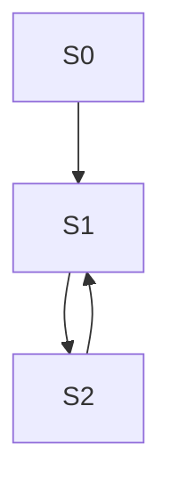
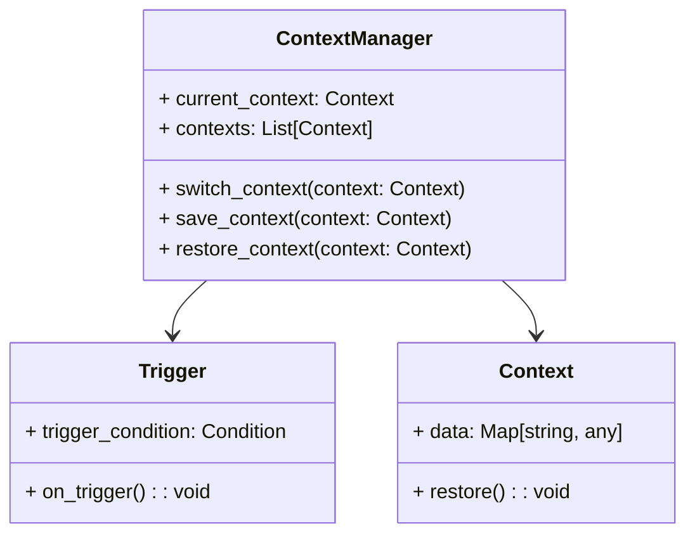

                 


# 实现AI Agent的动态上下文切换机制

> 关键词：AI Agent，动态上下文切换，多任务处理，上下文管理，任务切换

> 摘要：AI Agent在现代智能系统中扮演着越来越重要的角色，其动态上下文切换机制是实现高效任务处理和多任务管理的核心技术。本文从AI Agent的基本概念出发，详细探讨了动态上下文切换机制的核心原理、算法实现、系统架构设计以及实际项目中的应用。通过理论分析和实践案例的结合，本文为读者提供了一套完整的动态上下文切换解决方案，帮助AI Agent在复杂的任务环境中实现高效的上下文管理与切换。

---

# 第一部分: AI Agent与动态上下文切换机制概述

## 第1章: AI Agent与动态上下文切换机制概述

### 1.1 AI Agent的基本概念

#### 1.1.1 AI Agent的定义
AI Agent（人工智能代理）是指能够感知环境、做出决策并执行动作的智能实体。它可以是一个软件程序、一个机器人，或者一个复杂的系统，其核心目标是通过自主决策和行动来实现特定任务。

#### 1.1.2 AI Agent的类型与特点
AI Agent可以分为多种类型，常见的包括：
- **反应式AI Agent**：基于当前感知做出实时反应，适用于需要快速响应的任务。
- **认知式AI Agent**：具有复杂的推理和规划能力，能够处理复杂任务。
- **协作式AI Agent**：能够与其他Agent或人类协同工作，共同完成任务。
- **学习型AI Agent**：能够通过经验改进自身的性能。

#### 1.1.3 动态上下文切换的定义与背景
动态上下文切换是指AI Agent在执行任务过程中，根据环境变化或任务需求，动态地切换当前处理的上下文，以适应新的任务或环境条件。动态上下文切换的核心在于快速、准确地管理多个上下文之间的切换，确保AI Agent能够在复杂环境中高效运行。

---

### 1.2 动态上下文切换的重要性

#### 1.2.1 上下文切换的必要性
在实际应用中，AI Agent通常需要处理多个任务或在多个场景之间切换。例如，在智能客服系统中，AI Agent可能需要在处理客户咨询的同时，监控系统状态并实时调整响应策略。

#### 1.2.2 动态上下文切换的核心价值
- 提高任务处理的灵活性和适应性。
- 优化资源利用率，避免任务之间的冲突。
- 提升用户体验，通过快速切换上下文满足多样化的需求。

#### 1.2.3 动态上下文切换的应用场景
- 多任务处理：在同一时间处理多个任务。
- 动态任务分配：根据环境变化实时调整任务优先级。
- 异构环境适配：在不同环境或平台上无缝切换。

---

### 1.3 本章小结
本章主要介绍了AI Agent的基本概念及其动态上下文切换的背景和重要性。通过定义和分类，读者可以理解动态上下文切换在现代智能系统中的核心地位，以及其在实际应用中的广泛需求。

---

# 第二部分: 动态上下文切换机制的核心概念与原理

## 第2章: 动态上下文切换机制的核心概念

### 2.1 动态上下文切换的原理

#### 2.1.1 上下文切换的触发条件
上下文切换的触发条件通常包括以下几种：
- **时间触发**：在特定时间点切换上下文。
- **事件触发**：检测到特定事件时切换上下文。
- **优先级触发**：当某个任务的优先级高于当前任务时切换上下文。

#### 2.1.2 上下文切换的策略
常见的上下文切换策略包括：
- **抢占式切换**：直接中断当前任务，切换到高优先级任务。
- **非抢占式切换**：等待当前任务完成后再切换到新任务。
- **条件式切换**：在满足特定条件时切换上下文。

#### 2.1.3 上下文切换的实现方式
- **基于状态机的切换**：通过状态转移实现上下文切换。
- **基于规则的切换**：根据预定义规则动态切换上下文。
- **基于优先级的切换**：根据任务优先级自动切换上下文。

---

### 2.2 动态上下文切换的核心要素

#### 2.2.1 上下文管理器
上下文管理器是动态上下文切换的核心组件，负责管理所有上下文的生命周期，包括创建、激活、切换和销毁。

#### 2.2.2 上下文切换触发器
触发器用于检测是否需要切换上下文，通常基于事件、时间或优先级等条件。

#### 2.2.3 上下文存储与恢复机制
为了确保上下文切换的高效性，需要一个可靠的存储和恢复机制，确保在切换时能够快速保存当前状态，并在切换后快速恢复。

---

### 2.3 动态上下文切换的实现模型

#### 2.3.1 基于状态机的上下文切换模型
基于状态机的模型通过定义状态转移规则，实现上下文之间的切换。例如，可以使用状态机来表示不同任务之间的切换逻辑。

```mermaid
stateDiagram
    [*] -- (开始)
    state A
    state B
    A --> B : 切换到上下文B
    B --> A : 切换到上下文A
```

#### 2.3.2 基于规则的上下文切换模型
基于规则的模型通过预定义的规则来动态切换上下文。例如，当检测到特定事件时，触发切换到新的上下文。

#### 2.3.3 基于优先级的上下文切换模型
基于优先级的模型根据任务的优先级动态切换上下文，优先级高的任务优先执行。

---

### 2.4 本章小结
本章详细介绍了动态上下文切换的核心概念，包括切换的原理、策略、实现方式以及核心要素。通过状态机和规则模型的分析，读者可以理解动态上下文切换的实现机制。

---

## 第3章: 动态上下文切换机制的数学模型与算法原理

### 3.1 动态上下文切换的数学模型

#### 3.1.1 上下文切换的概率模型
概率模型可以用来描述上下文切换的概率分布。例如，可以使用马尔可夫链模型来描述上下文切换的过程。

$$ P(s_{t+1} | s_t) $$

其中，$P(s_{t+1} | s_t)$ 表示从状态 $s_t$ 切换到状态 $s_{t+1}$ 的概率。

#### 3.1.2 上下文切换的马尔可夫链模型
马尔可夫链模型可以用来描述上下文切换的马尔可夫过程，其中每个状态代表一个上下文。



#### 3.1.3 上下文切换的贝叶斯网络模型
贝叶斯网络模型可以用来描述上下文切换的条件概率关系。

$$ P(s_{t+1} | e_t) $$

其中，$e_t$ 表示时间 $t$ 的事件。

---

### 3.2 动态上下文切换算法的实现

#### 3.2.1 基于优先级的上下文切换算法
基于优先级的切换算法通过比较任务优先级来决定是否切换上下文。以下是算法的伪代码实现：

```python
def context_switch(priority_current, priority_new):
    if priority_new > priority_current:
        switch_context(new_context)
    else:
        continue_current()
```

---

### 3.3 本章小结
本章通过数学模型和算法实现，详细探讨了动态上下文切换的实现原理。通过概率模型和马尔可夫链模型的分析，读者可以理解上下文切换的动态过程。

---

# 第三部分: 动态上下文切换机制的系统架构与实现

## 第4章: 动态上下文切换系统的架构设计

### 4.1 系统架构概述

#### 4.1.1 系统功能模块划分
动态上下文切换系统通常包括以下功能模块：
- 上下文管理器
- 切换触发器
- 上下文存储与恢复模块

#### 4.1.2 系统组件之间的关系
系统组件之间的关系可以通过类图表示：



---

## 第5章: 动态上下文切换系统的实现

### 5.1 系统实现概述

#### 5.1.1 环境搭建
动态上下文切换系统的实现需要以下环境：
- Python 3.8+
- Mermaid图生成工具
- Git版本控制工具

#### 5.1.2 核心代码实现
以下是动态上下文切换的核心代码实现：

```python
class ContextManager:
    def __init__(self):
        self.current_context = None
        selfcontexts = []

    def switch_context(self, new_context):
        if self.current_context is not None:
            self.save_context(self.current_context)
        self.current_context = new_context
        self.restore_context(self.current_context)

    def save_context(self, context):
        # 实现上下文保存逻辑
        pass

    def restore_context(self, context):
        # 实现上下文恢复逻辑
        pass
```

---

## 第6章: 项目实战与案例分析

### 6.1 项目背景与需求分析

#### 6.1.1 项目背景
在智能客服系统中，AI Agent需要在处理客户咨询的同时，实时监控系统状态并动态切换任务。

#### 6.1.2 项目需求
- 实现多任务处理
- 实现动态上下文切换
- 提升用户体验

---

### 6.2 系统实现与代码分析

#### 6.2.1 环境搭建
- 安装必要的依赖
- 配置开发环境

#### 6.2.2 核心代码实现
以下是动态上下文切换机制的核心代码实现：

```python
class Agent:
    def __init__(self):
        self.context_manager = ContextManager()

    def handle_task(self, task):
        # 切换到新的上下文
        self.context_manager.switch_context(task.context)
        # 处理任务
        self.process_task(task)
        # 切换回原上下文
        self.context_manager.switch_context(self.current_context)

    def process_task(self, task):
        # 处理具体任务
        pass
```

---

## 第7章: 总结与展望

### 7.1 总结
本文详细探讨了动态上下文切换机制的核心原理、系统架构设计以及实际项目中的应用。通过理论分析和实践案例的结合，为读者提供了一套完整的动态上下文切换解决方案。

---

### 7.2 展望
未来，动态上下文切换机制将在更多领域得到广泛应用。随着AI技术的不断发展，动态上下文切换机制将更加智能化和高效化。

---

### 7.3 最佳实践 Tips

- 在实现动态上下文切换时，需确保上下文切换的快速性和准确性。
- 定期监控和优化上下文切换策略，以提升系统性能。
- 在实际项目中，结合具体需求选择合适的切换策略。

---

作者：AI天才研究院/AI Genius Institute & 禅与计算机程序设计艺术 /Zen And The Art of Computer Programming

