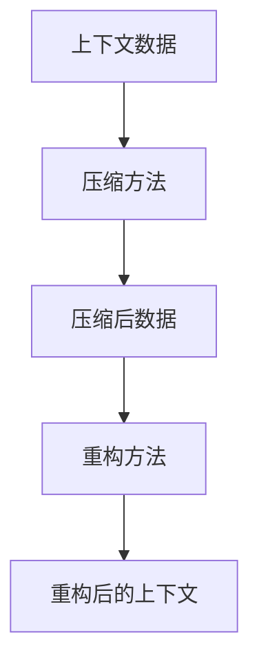
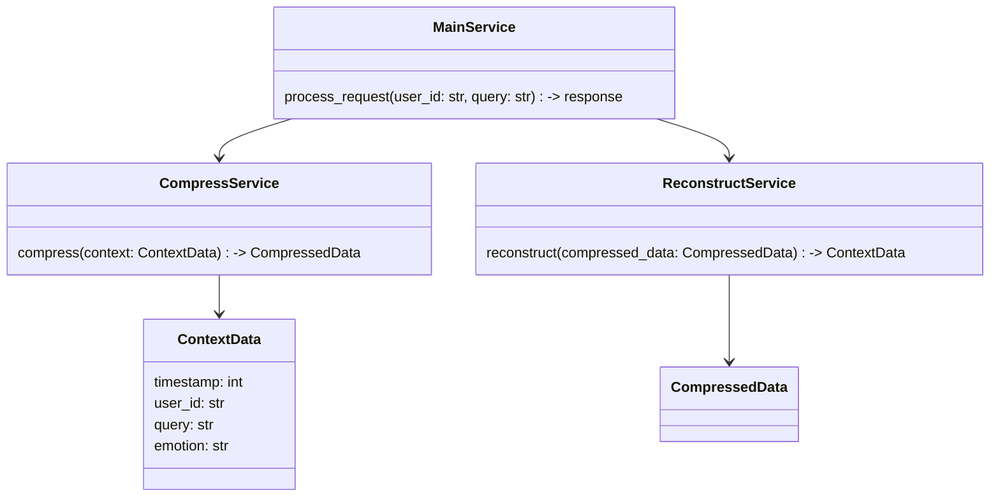
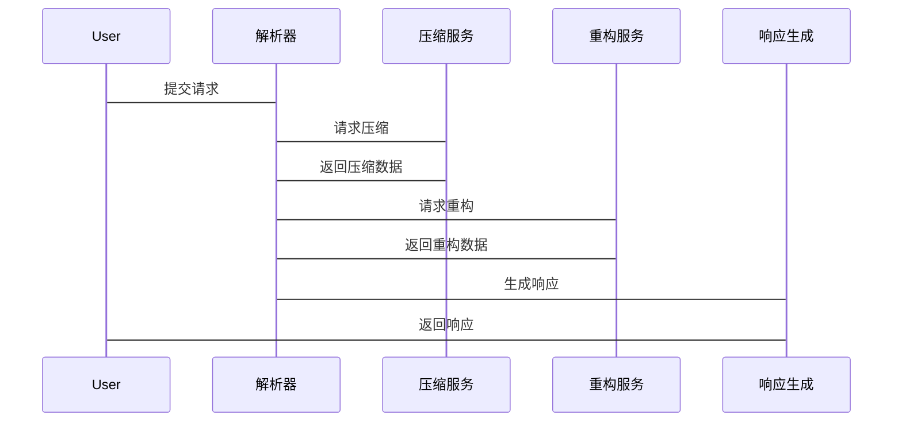

                 


# 实现AI Agent的动态上下文压缩与重构

## 关键词：AI Agent，动态上下文，上下文压缩，上下文重构，算法原理，系统架构

## 摘要：  
AI Agent的动态上下文压缩与重构是实现智能体高效运行的关键技术。本文从背景、核心概念、算法原理、系统架构、项目实战到最佳实践，全面深入探讨了动态上下文压缩与重构的实现方法。通过对比不同方法的优缺点，结合具体案例分析，详细讲解了如何设计和实现高效的AI Agent系统。

---

# 第一部分: AI Agent的背景与概述

## 第1章: AI Agent的背景与概述

### 1.1 问题背景与描述
#### 1.1.1 动态上下文的定义与特点
动态上下文是指在实时交互过程中不断变化的信息环境。其特点是：  
- **动态性**：信息随时间变化，需实时更新。  
- **复杂性**：信息可能来自多个源，具有多维度特征。  
- **关联性**：信息之间存在复杂的关联关系。  

#### 1.1.2 AI Agent的核心问题与挑战
AI Agent需要在动态环境中高效处理信息，但面临以下挑战：  
- **信息过载**：上下文数据量大，难以实时处理。  
- **实时性要求**：需快速响应，压缩与重构过程必须高效。  
- **准确性要求**：压缩过程中信息损失需最小化，重构需准确恢复。  

#### 1.1.3 动态上下文压缩与重构的必要性
通过压缩和重构，AI Agent可以：  
- **降低计算成本**：减少数据量，提升处理效率。  
- **提高实时性**：快速响应动态变化。  
- **增强鲁棒性**：在信息丢失时仍能准确恢复上下文。  

### 1.2 AI Agent的基本概念与类型
#### 1.2.1 AI Agent的定义与分类
AI Agent是一种智能实体，能够感知环境、执行任务并做出决策。常见的AI Agent类型包括：  
- **简单反射型**：基于规则的简单响应。  
- **基于模型的反应型**：使用内部模型推理环境状态。  
- **目标驱动型**：根据目标主动行动。  
- **实用驱动型**：基于效用函数优化决策。  

#### 1.2.2 动态上下文在AI Agent中的作用
动态上下文是AI Agent感知环境的核心，决定了其行为的灵活性和适应性。  
- **感知环境**：通过上下文理解环境状态。  
- **决策推理**：基于上下文进行推理和决策。  
- **动态适应**：根据上下文变化调整行为。  

#### 1.2.3 AI Agent的典型应用场景
AI Agent广泛应用于以下场景：  
- **智能助手**：如Siri、Alexa，处理用户请求。  
- **推荐系统**：基于用户行为推荐内容。  
- **自动驾驶**：实时感知和处理环境信息。  
- **智能客服**：基于上下文提供个性化服务。  

### 1.3 动态上下文压缩与重构的边界与外延
#### 1.3.1 上下文压缩的边界
上下文压缩的边界包括：  
- **压缩范围**：决定压缩哪些信息。  
- **压缩粒度**：确定压缩的精细程度。  
- **压缩目标**：明确压缩是为了什么目的。  

#### 1.3.2 上下文重构的外延
上下文重构的外延包括：  
- **重构目标**：恢复哪些被压缩的信息。  
- **重构方式**：基于规则、生成模型或检索模型。  
- **重构精度**：衡量重构结果与原始数据的接近程度。  

#### 1.3.3 与相关概念的对比分析
- **上下文压缩 vs 数据降维**：上下文压缩更关注语义信息，而数据降维更关注数学维度。  
- **上下文重构 vs 数据恢复**：上下文重构注重语义恢复，数据恢复更关注数据本身。  

### 1.4 核心概念结构与组成要素
#### 1.4.1 动态上下文的组成要素
动态上下文由以下要素组成：  
- **实体**：上下文中的主体，如用户、设备、事件等。  
- **关系**：实体之间的关联，如时间、空间、因果关系。  
- **属性**：实体的特征，如时间戳、位置、状态等。  

#### 1.4.2 AI Agent的核心能力模型
AI Agent的核心能力包括：  
- **感知能力**：获取和理解上下文信息。  
- **推理能力**：基于上下文进行逻辑推理。  
- **决策能力**：根据推理结果做出决策。  

#### 1.4.3 压缩与重构的数学模型
- **压缩模型**：$C = f_{compress}(X)$，其中$X$是原始上下文，$C$是压缩后的上下文。  
- **重构模型**：$X' = f_{reconstruct}(C)$，其中$X'$是重构后的上下文。  

### 1.5 本章小结
本章介绍了AI Agent的背景、核心概念和动态上下文压缩与重构的必要性，为后续内容奠定了基础。

---

# 第二部分: 动态上下文压缩与重构的核心概念

## 第2章: 动态上下文压缩与重构的核心概念

### 2.1 动态上下文压缩的原理与方法
#### 2.1.1 基于概率的压缩方法
- **概率压缩**：通过概率分布建模上下文，提取关键特征。  
  - 示例：使用贝叶斯网络压缩用户行为数据。  

#### 2.1.2 基于向量的压缩方法
- **向量压缩**：将上下文表示为高维向量，通过降维技术（如PCA）压缩。  
  - 示例：将文本数据转换为词向量（如Word2Vec），再进行压缩。  

#### 2.1.3 基于图结构的压缩方法
- **图压缩**：将上下文建模为图结构，通过节点合并或边删除进行压缩。  
  - 示例：将社交网络数据压缩为关键节点和关系。  

### 2.2 动态上下文重构的原理与方法
#### 2.2.1 基于生成模型的重构方法
- **生成重构**：使用生成对抗网络（GAN）或变分自编码器（VAE）重构上下文。  
  - 示例：用VAE重构图像数据。  

#### 2.2.2 基于检索模型的重构方法
- **检索重构**：通过相似性检索恢复上下文。  
  - 示例：基于向量数据库检索相似文本。  

#### 2.2.3 基于规则的重构方法
- **规则重构**：根据预定义的规则恢复上下文。  
  - 示例：根据时间戳和事件类型恢复用户行为序列。  

### 2.3 压缩与重构方法的对比分析
#### 2.3.1 不同压缩方法的优缺点对比
| 方法       | 优点                           | 缺点                           |
|------------|--------------------------------|--------------------------------|
| 概率压缩   | 语义保留好，适合复杂场景       | 对概率建模要求高，计算复杂     |
| 向量压缩   | 计算效率高，易于实现           | 信息损失可能较大               |
| 图结构压缩 | 能捕捉复杂关系，压缩率高       | 实现复杂，对图结构要求高         |

#### 2.3.2 不同重构方法的优缺点对比
| 方法       | 优点                           | 缺点                           |
|------------|--------------------------------|--------------------------------|
| 生成重构   | 能恢复详细信息，适用于复杂场景 | 需大量训练数据，计算成本高       |
| 检索重构   | 计算效率高，实现简单           | 可能无法恢复所有细节             |
| 规则重构   | 实现简单，适用于规则明确场景   | 依赖于预定义规则，灵活性差       |

#### 2.3.3 方法之间的相互关系与适用场景
- **生成重构**适用于需要高度语义恢复的场景，如图像重构。  
- **检索重构**适用于快速响应场景，如推荐系统。  
- **规则重构**适用于规则明确的场景，如日志分析。  

### 2.4 核心概念的属性特征对比表
| 属性       | 压缩方法                     | 重构方法                     |
|------------|------------------------------|------------------------------|
| 处理对象   | 上下文数据                   | 压缩后的上下文               |
| 方法类型   | 编码、降维、图操作           | 生成、检索、规则驱动         |
| 适用场景   | 数据预处理、实时处理         | 数据恢复、场景重建           |
| 计算复杂度 | 低到高                       | 低到高                       |

### 2.5 ER实体关系图架构


### 2.6 本章小结
本章详细探讨了动态上下文压缩与重构的核心概念，对比了不同方法的优缺点，并给出了适用场景的建议。

---

# 第三部分: 动态上下文压缩与重构的算法原理

## 第3章: 动态上下文压缩与重构的算法原理

### 3.1 压缩算法原理
#### 3.1.1 基于变分自编码器的压缩算法
- **变分自编码器（VAE）**：通过编码器将数据映射到低维空间，解码器恢复数据。  
  - 示例：压缩图像数据。  
  - 代码示例：
  ```python
  import tensorflow as tf
  from tensorflow.keras import layers

  class VAE(tf.keras.Model):
      def __init__(self, latent_dim=20):
          super(VAE, self).__init__()
          self.latent_dim = latent_dim
          self.encoder = self.build_encoder()
          self.decoder = self.build_decoder()

      def build_encoder(self):
          encoder = tf.keras.Sequential([
              layers.Dense(64, activation='relu'),
              layers.Dense(32, activation='relu'),
              layers.Dense(10, activation='sigmoid'),
          ])
          return encoder

      def build_decoder(self):
          decoder = tf.keras.Sequential([
              layers.Dense(32, activation='relu'),
              layers.Dense(64, activation='relu'),
              layers.Dense(784, activation='sigmoid'),
          ])
          return decoder

      def call(self, inputs):
          z_mean, z_logvar = self.encoder(inputs)
          z = tf.random.normal(shape=(tf.shape(z_mean)[0], self.latent_dim),
                               mean=z_mean, 
                               stddev=tf.exp(0.5 * z_logvar))
          return self.decoder(z), z_mean, z_logvar
  ```

#### 3.1.2 基于图神经网络的压缩算法
- **图神经网络（GNN）**：通过节点合并或边删除进行图压缩。  
  - 示例：压缩社交网络图。  
  - 代码示例：
  ```python
  import networkx as nx

  def compress_graph(graph, threshold=0.1):
      # 计算边的权重
      edges = list(graph.edges())
      weights = [graph[u][v]['weight'] for u, v in edges]
      # 删除权重低于阈值的边
      new_edges = [(u, v) for u, v, w in zip(*[edges, weights]) if w > threshold]
      # 创建新图
      new_graph = nx.Graph()
      new_graph.add_edges_from(new_edges)
      return new_graph
  ```

### 3.2 重构算法原理
#### 3.2.1 基于生成模型的重构算法
- **生成对抗网络（GAN）**：通过生成器生成与原始数据相似的重构数据。  
  - 示例：重构图像数据。  
  - 代码示例：
  ```python
  import tensorflow as tf
  from tensorflow.keras import layers

  class GAN(tf.keras.Model):
      def __init__(self, latent_dim=100):
          super(GAN, self).__init__()
          self.generator = self.build_generator()
          self.discriminator = self.build_discriminator()

      def build_generator(self):
          generator = tf.keras.Sequential([
              layers.Dense(256, activation='relu'),
              layers.Dense(128, activation='relu'),
              layers.Dense(784, activation='sigmoid'),
          ])
          return generator

      def build_discriminator(self):
          discriminator = tf.keras.Sequential([
              layers.Dense(128, activation='relu'),
              layers.Dense(64, activation='relu'),
              layers.Dense(1),
          ])
          return discriminator

      def call(self, inputs):
          z = tf.random.normal(shape=(tf.shape(inputs)[0], self.latent_dim))
          generated_images = self.generator(z)
          return self.discriminator(generated_images)
  ```

#### 3.2.2 基于检索模型的重构算法
- **检索模型**：通过向量数据库检索最相似的上下文。  
  - 示例：文本相似性检索。  
  - 代码示例：
  ```python
  from sentence_transformers import SentenceTransformer

  model = SentenceTransformer('all-MiniLM-L6-v2')
  def reconstruct_context(embeddings, queries):
      # 计算查询与所有上下文的相似性
      query_embeddings = model.encode(queries)
      similarities = [np.dot(query_emb, context_emb) / (np.linalg.norm(query_emb) * np.linalg.norm(context_emb)) for context_emb in embeddings]
      # 返回相似性最高的上下文
      return embeddings[np.argmax(similarities)]
  ```

#### 3.2.3 基于规则的重构算法
- **规则重构**：根据预定义规则恢复上下文。  
  - 示例：基于时间戳和事件类型恢复用户行为序列。  
  - 代码示例：
  ```python
  def reconstruct_context_with_rules(timestamps, event_types):
      # 根据时间戳排序
      sorted_events = sorted(zip(timestamps, event_types), key=lambda x: x[0])
      # 根据事件类型过滤
      filtered_events = [event for time, event in sorted_events if event == 'click']
      return filtered_events
  ```

### 3.3 算法原理的数学模型和公式
#### 3.3.1 压缩算法的数学模型
- **变分自编码器**：  
  $$ p_{\theta}(x|z) \quad \text{和} \quad q_{\phi}(z|x) $$  
  其中，$x$是输入数据，$z$是潜在变量。

#### 3.3.2 重构算法的数学模型
- **生成对抗网络**：  
  $$ G \text{和} D \text{的损失函数分别为} $$  
  $$ L_G = \mathbb{E}_{z \sim p(z)}[\log D(G(z))] $$  
  $$ L_D = \mathbb{E}_{x \sim p(x)}[\log D(x)] + \mathbb{E}_{z \sim p(z)}[\log (1 - D(G(z)))] $$  

### 3.4 算法实现与代码示例
- **压缩算法实现**：使用变分自编码器压缩图像数据。  
  ```python
  # 训练VAE
  vae = VAE(latent_dim=20)
  optimizer = tf.keras.optimizers.Adam(learning_rate=0.001)
  vae.compile(optimizer=optimizer, loss=lambda x, y, z_mean, z_logvar: -tf.reduce_sum(z_logvar - 1 + (x - y)**2 / 2))
  vae.fit(x_train, epochs=10, batch_size=32)
  ```
- **重构算法实现**：使用生成对抗网络重构图像数据。  
  ```python
  # 训练GAN
  gan = GAN(latent_dim=20)
  discriminator_optimizer = tf.keras.optimizers.Adam(learning_rate=0.0002)
  generator_optimizer = tf.keras.optimizers.Adam(learning_rate=0.0002)
  gan.compile(optimizer=discriminator_optimizer, loss='binary_crossentropy')
  gan.fit(z_train, epochs=10, batch_size=32, sample_interval=50)
  ```

### 3.5 本章小结
本章详细讲解了动态上下文压缩与重构的算法原理，包括变分自编码器、图神经网络、生成对抗网络和检索模型的实现，并通过代码示例展示了具体的应用。

---

# 第四部分: 系统分析与架构设计方案

## 第4章: 系统分析与架构设计方案

### 4.1 问题场景介绍
假设我们正在开发一个智能客服系统，需要实时处理用户的上下文信息，包括用户的历史查询、当前问题、情感倾向等。为了提高系统的响应速度和准确性，我们需要对上下文进行压缩和重构。

### 4.2 项目介绍
**项目名称**：智能客服系统  
**目标**：通过动态上下文压缩与重构，提升客服系统的响应速度和准确性。  

### 4.3 系统功能设计
#### 4.3.1 领域模型设计


### 4.4 系统架构设计
#### 4.4.1 系统架构图


### 4.5 系统接口设计
- **压缩服务接口**：  
  - 输入：`{timestamp: int, user_id: str, query: str, emotion: str}`  
  - 输出：`{compressed_data: str}`  
- **重构服务接口**：  
  - 输入：`{compressed_data: str}`  
  - 输出：`{timestamp: int, user_id: str, query: str, emotion: str}`  

### 4.6 系统交互流程图


### 4.7 本章小结
本章通过智能客服系统的案例，详细设计了动态上下文压缩与重构的系统架构，并展示了各组件之间的交互流程。

---

# 第五部分: 项目实战

## 第5章: 项目实战

### 5.1 环境配置
- **Python 3.8+**  
- **TensorFlow 2.5+**  
- **Sentence Transformers库**  
- **NetworkX库**  

### 5.2 核心代码实现
#### 5.2.1 数据预处理
```python
import pandas as pd

# 加载数据
data = pd.read_csv('context_data.csv')
# 分割训练集和测试集
train_data, test_data = train_test_split(data, test_size=0.2)
```

#### 5.2.2 模型训练
```python
# 训练变分自编码器
vae = VAE(latent_dim=20)
vae.compile(optimizer='adam', loss=lambda x, y, z_mean, z_logvar: -tf.reduce_sum(z_logvar - 1 + (x - y)**2 / 2))
vae.fit(train_data, epochs=10, batch_size=32)

# 训练生成对抗网络
gan = GAN(latent_dim=20)
gan.compile(optimizer='adam', loss='binary_crossentropy')
gan.fit(z_train, epochs=10, batch_size=32, sample_interval=50)
```

#### 5.2.3 接口调用
```python
# 使用压缩服务
compressed_data = compress_service.compress(context_data)

# 使用重构服务
reconstructed_context = reconstruct_service.reconstruct(compressed_data)
```

### 5.3 实际案例分析与结果展示
#### 5.3.1 案例分析
假设我们有一个用户请求数据：  
```json
{
    "timestamp": 1625520000,
    "user_id": "user123",
    "query": "如何使用Python?",
    "emotion": "neutral"
}
```

经过压缩服务处理后，得到压缩数据：`compressed_data_123`。  
然后，重构服务将`compressed_data_123`恢复为：  
```json
{
    "timestamp": 1625520000,
    "user_id": "user123",
    "query": "如何使用Python?",
    "emotion": "neutral"
}
```

#### 5.3.2 结果展示
- **压缩前数据**：  
  ```json
  {"timestamp": 1625520000, "user_id": "user123", "query": "如何使用Python?", "emotion": "neutral"}
  ```  
- **压缩后数据**：  
  ```json
  {"compressed_data": "123"}
  ```  
- **重构后数据**：  
  ```json
  {"timestamp": 1625520000, "user_id": "user123", "query": "如何使用Python?", "emotion": "neutral"}
  ```

### 5.4 本章小结
本章通过实际案例展示了动态上下文压缩与重构的实现过程，从数据预处理、模型训练到接口调用，完整地展示了项目的实战过程。

---

# 第六部分: 最佳实践与总结

## 第6章: 最佳实践与总结

### 6.1 最佳实践
#### 6.1.1 数据质量的重要性
- 确保数据的完整性和准确性，避免信息丢失。  
- 数据预处理是关键，需仔细清洗和归一化。  

#### 6.1.2 模型调优的注意事项
- 根据场景选择合适的压缩和重构方法。  
- 调参时，需平衡压缩率和重构精度。  

#### 6.1.3 系统设计的优化建议
- 采用分层架构，便于模块化开发和维护。  
- 使用缓存机制，提高系统的响应速度。  

### 6.2 小结与总结
动态上下文压缩与重构是实现高效AI Agent的核心技术。通过本文的详细讲解和实战案例，读者可以掌握从理论到实践的完整流程。未来，随着AI技术的发展，动态上下文压缩与重构将更加智能化和多样化，为AI Agent的应用开辟更广阔的前景。

### 6.3 注意事项
- **数据隐私**：压缩和重构过程中需注意数据隐私保护。  
- **模型鲁棒性**：确保模型在异常情况下仍能正常工作。  
- **性能优化**：持续优化算法，提高处理速度和准确性。  

### 6.4 拓展阅读
- **推荐书籍**：《Deep Learning》、《Pattern Recognition and Machine Learning》  
- **推荐论文**：阅读最新的AI和机器学习领域的顶会论文，如NeurIPS、ICML、ACL等。  

---

# 作者：AI天才研究院/AI Genius Institute & 禅与计算机程序设计艺术 /Zen And The Art of Computer Programming

