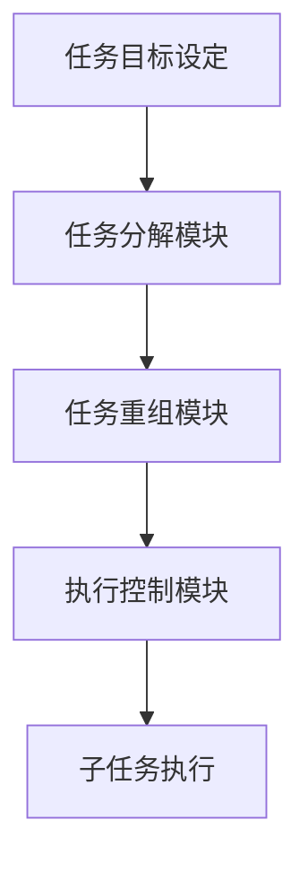

                 


# 实现AI Agent的动态任务分解与重组能力

> 关键词：AI Agent，动态任务分解，任务重组，算法原理，系统架构，项目实战

> 摘要：本文深入探讨了AI Agent的动态任务分解与重组能力的实现方法。从基本概念、核心原理到算法设计，再到系统架构和项目实战，全面分析了动态任务分解与重组的关键技术，结合实际案例，为读者提供了理论与实践相结合的解决方案。

---

## 第一部分：AI Agent的动态任务分解与重组概述

### 第1章：AI Agent的基本概念与背景

#### 1.1 AI Agent的定义与特点

AI Agent（人工智能代理）是指能够感知环境、自主决策并执行任务的智能实体。AI Agent具备以下特点：

- **自主性**：能够在没有外部干预的情况下独立运作。
- **反应性**：能够实时感知环境并做出相应的反应。
- **目标导向性**：具备明确的目标，并能够通过行为来实现目标。
- **学习能力**：能够通过经验改进自身的行为和决策能力。

AI Agent广泛应用于自动驾驶、智能助手、机器人控制等领域。

#### 1.2 动态任务分解与重组的必要性

在复杂的动态环境中，AI Agent需要具备动态调整任务的能力。动态任务分解与重组能力是指AI Agent能够根据环境变化，将任务分解为更小的子任务，并在需要时重新组合任务以适应新的环境需求。

- **动态任务分解的背景**：在动态环境中，任务往往无法一次性完成，需要分阶段进行。动态任务分解能够帮助AI Agent更好地适应环境变化。
- **动态任务重组的意义**：当环境发生变化时，AI Agent需要重新调整任务的顺序或组合方式，以确保任务能够顺利完成。
- **动态任务分解与重组的边界**：动态任务分解与重组的能力并非无限制，需要根据具体场景和任务目标进行约束。

#### 1.3 问题背景与目标

- **问题背景分析**：在动态环境中，任务可能受到时间、资源、环境变化等多种因素的影响，传统的静态任务分解方法难以适应。
- **问题描述**：如何设计一种动态任务分解与重组的方法，使得AI Agent能够根据环境变化灵活调整任务结构。
- **问题解决的目标**：实现一种动态任务分解与重组的方法，使得AI Agent能够在复杂动态环境中高效完成任务。
- **边界与外延**：动态任务分解与重组能力的实现需要结合具体场景和任务目标，避免过度复杂化。

---

## 第二部分：动态任务分解与重组的核心概念

### 第2章：动态任务分解与重组的核心原理

#### 2.1 动态任务分解的原理

动态任务分解是指将复杂任务分解为多个子任务，并根据环境变化动态调整分解方式。其核心原理包括：

- **分解的基本原理**：将复杂任务分解为更小的子任务，每个子任务具有明确的目标和约束条件。
- **分解的策略与方法**：根据任务的复杂性和环境变化，选择合适的分解策略，例如基于优先级的分解、基于约束的分解等。
- **分解的数学模型**：通过数学模型描述任务分解的过程，例如使用分解树或分解图来表示子任务之间的关系。

#### 2.2 动态任务重组的原理

动态任务重组是指根据环境变化重新组合子任务以适应新的任务需求。其核心原理包括：

- **重组的基本原理**：将已有的子任务重新组合，形成新的任务结构。
- **重组的策略与方法**：根据环境变化和任务目标，选择合适的重组策略，例如基于优先级的重组、基于约束的重组等。
- **重组的数学模型**：通过数学模型描述任务重组的过程，例如使用重组树或重组图来表示子任务之间的关系。

#### 2.3 动态任务分解与重组的关系

动态任务分解与重组是相互关联的过程。分解为重组提供了子任务的基础，而重组则根据环境变化调整任务结构。两者的协同机制是实现动态任务调整的关键。

- **分解与重组的关系分析**：分解为重组提供子任务，重组为分解提供新的任务结构。
- **分解与重组的相互作用**：环境变化驱动分解，任务目标变化驱动重组。
- **分解与重组的协同机制**：通过分解和重组的协同，实现任务的动态调整。

---

### 第3章：动态任务分解与重组的核心要素

#### 3.1 动态任务分解的核心要素

- **任务目标**：任务的最终目标决定了分解的方式。
- **子任务关系**：子任务之间的依赖关系影响分解的顺序。
- **环境约束**：环境中的资源和约束条件影响分解的策略。

#### 3.2 动态任务重组的核心要素

- **任务目标**：任务的最终目标决定了重组的方式。
- **子任务关系**：子任务之间的依赖关系影响重组的顺序。
- **环境变化**：环境中的动态变化影响重组的策略。

#### 3.3 动态任务分解与重组的核心要素对比

| 核心要素 | 动态任务分解 | 动态任务重组 |
|----------|--------------|--------------|
| 关键目标 | 子任务的划分  | 任务结构的调整 |
| 关键约束 | 子任务的依赖关系 | 任务目标的变化 |
| 关键策略 | 分解策略 | 重组策略 |

---

## 第三部分：动态任务分解与重组的算法原理

### 第4章：动态任务分解算法

#### 4.1 基于优先级的分解算法

基于优先级的分解算法是一种常见的动态任务分解方法。其实现步骤如下：

1. **确定任务目标**：明确任务的最终目标。
2. **分解子任务**：将任务目标分解为多个子任务。
3. **确定子任务优先级**：根据环境约束和任务目标，确定子任务的优先级。
4. **执行子任务**：按照优先级顺序执行子任务。

其数学模型如下：

$$ \text{优先级} = f(\text{任务目标}, \text{环境约束}) $$

#### 4.2 基于约束的分解算法

基于约束的分解算法是一种灵活的动态任务分解方法。其实现步骤如下：

1. **确定任务目标**：明确任务的最终目标。
2. **分解子任务**：将任务目标分解为多个子任务。
3. **确定子任务约束条件**：根据环境约束，确定子任务的约束条件。
4. **执行子任务**：根据约束条件动态调整子任务的执行顺序。

其数学模型如下：

$$ \text{子任务} = \{ t_i | t_i \subseteq \text{任务目标}, t_i \text{满足约束条件} \} $$

---

## 第四部分：动态任务分解与重组的系统架构

### 第5章：动态任务分解与重组的系统架构

#### 5.1 系统功能模块设计

- **任务目标设定模块**：负责设定任务的最终目标。
- **任务分解模块**：负责将任务目标分解为子任务。
- **任务重组模块**：负责根据环境变化重组子任务。
- **执行控制模块**：负责协调子任务的执行顺序。

#### 5.2 系统架构图



#### 5.3 系统接口设计

- **任务目标接口**：用于设定任务的最终目标。
- **分解接口**：用于分解任务目标为子任务。
- **重组接口**：用于重组子任务以适应环境变化。
- **执行接口**：用于协调子任务的执行顺序。

---

## 第五部分：动态任务分解与重组的项目实战

### 第6章：动态任务分解与重组的项目实战

#### 6.1 环境配置

- **开发环境**：Python 3.8及以上版本，安装必要的库（如numpy、scipy）。
- **运行环境**：支持多线程或多进程的计算环境。

#### 6.2 核心代码实现

```python
def dynamic_task_decomposition(task, constraints):
    # 分解任务为目标子任务
    sub_tasks = []
    for constraint in constraints:
        if constraint.check(task):
            sub_tasks.append(task.decompose(constraint))
    return sub_tasks

def dynamic_task_recomposition(sub_tasks, new_task):
    # 根据新任务目标重组子任务
    recomposed_tasks = []
    for task in sub_tasks:
        if task.is_compatible(new_task):
            recomposed_tasks.append(task.recompose(new_task))
    return recomposed_tasks
```

---

## 第六部分：总结与展望

### 第7章：总结与展望

#### 7.1 总结

动态任务分解与重组是实现AI Agent动态适应能力的关键技术。通过本文的分析，我们可以看到，动态任务分解与重组需要结合任务目标、环境约束和子任务关系，采用合适的算法和系统架构来实现。

#### 7.2 展望

随着人工智能技术的不断发展，动态任务分解与重组的能力将更加重要。未来的研究方向包括：

- 更高效的动态任务分解算法。
- 更灵活的动态任务重组策略。
- 更智能的任务执行控制方法。

---

作者：AI天才研究院/AI Genius Institute & 禅与计算机程序设计艺术 /Zen And The Art of Computer Programming

