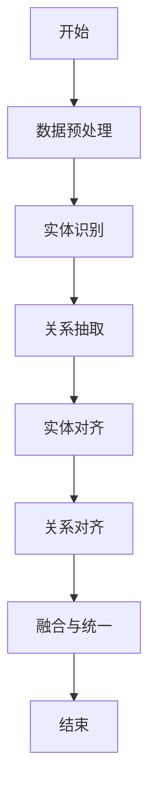

                 


# 实现AI Agent的动态知识图谱对齐与融合

## 关键词：AI Agent, 知识图谱, 对齐, 融合, 动态知识图谱, 知识表示, 知识融合

## 摘要：  
本文详细探讨了AI Agent在动态知识图谱对齐与融合中的实现方法。首先介绍了动态知识图谱对齐与融合的背景和问题，分析了其核心概念与联系，接着深入讲解了对齐算法的原理和实现，最后通过系统分析与架构设计、项目实战等部分，全面阐述了动态知识图谱对齐与融合的实现过程。本文结合理论与实践，为AI Agent在知识图谱领域的应用提供了系统的解决方案和最佳实践。

---

# 第1章: 动态知识图谱对齐与融合的背景与问题

## 1.1 问题背景

### 1.1.1 知识图谱的基本概念与特点

知识图谱是一种以图结构形式表示知识的语义网络，其中节点表示实体或概念，边表示实体之间的关系。知识图谱具有以下特点：

- **可扩展性**：支持大规模数据的整合与表示。
- **语义性**：通过实体和关系的语义信息，能够表示复杂的知识结构。
- **动态性**：支持实时更新和动态扩展。

### 1.1.2 AI Agent的定义与应用场景

AI Agent（智能体）是指在计算机系统中能够感知环境并采取行动以实现目标的实体。AI Agent在知识图谱中的应用主要体现在以下几个方面：

- **智能问答**：通过知识图谱提供准确的知识检索服务。
- **推荐系统**：基于知识图谱进行个性化推荐。
- **语义理解**：通过知识图谱提升自然语言处理的准确性。

### 1.1.3 动态知识图谱对齐与融合的必要性

在实际应用中，AI Agent需要处理来自多个来源的异构知识图谱，这些图谱可能在结构、语义或实体表示上存在差异。动态知识图谱对齐与融合的目标是将这些异构图谱统一到一个一致的知识表示空间中，以支持AI Agent的高效推理和决策。

---

## 1.2 问题描述

### 1.2.1 知识图谱对齐的核心问题

知识图谱对齐的核心问题在于如何将不同来源的实体和关系进行匹配，使得它们在语义上一致。具体挑战包括：

- **实体映射**：如何在不同的图谱中找到对应实体。
- **关系对齐**：如何将不同图谱中的关系进行统一表示。
- **语义一致性**：如何确保对齐后的知识在语义上保持一致。

### 1.2.2 动态知识图谱的挑战

动态知识图谱的挑战主要体现在以下几个方面：

- **实时更新**：需要支持实时的知识更新和动态扩展。
- **异构性**：不同来源的知识图谱可能在结构、语义或实体表示上存在差异。
- **高效性**：需要在大规模数据下实现高效的对齐与融合。

### 1.2.3 对齐与融合的目标与意义

对齐与融合的目标是将多个异构知识图谱统一到一个一致的知识表示空间中，支持AI Agent的高效推理和决策。其意义在于：

- **提升语义理解能力**：通过对齐与融合，AI Agent能够更好地理解复杂语义关系。
- **增强知识推理能力**：通过对齐后的知识图谱，AI Agent可以进行更准确的知识推理。
- **支持动态应用需求**：动态知识图谱对齐与融合能够满足实时应用的需求。

---

## 1.3 问题解决思路

### 1.3.1 对齐与融合的基本方法

对齐与融合的基本方法包括：

- **基于符号的对齐方法**：通过符号匹配或规则匹配实现实体对齐。
- **基于嵌入的对齐方法**：通过节点嵌入技术实现实体对齐。
- **基于图结构的对齐方法**：通过图结构分析实现实体对齐。

### 1.3.2 动态知识图谱的更新机制

动态知识图谱的更新机制包括：

- **实时更新**：支持实时的知识更新和动态扩展。
- **异构图谱的整合**：能够处理来自不同来源的异构知识图谱。
- **高效的对齐算法**：能够在大规模数据下实现高效的对齐与融合。

### 1.3.3 AI Agent中的知识图谱应用

AI Agent中的知识图谱应用包括：

- **智能问答**：通过知识图谱提供准确的知识检索服务。
- **推荐系统**：基于知识图谱进行个性化推荐。
- **语义理解**：通过知识图谱提升自然语言处理的准确性。

### 1.3.4 边界与外延

动态知识图谱对齐与融合的边界包括：

- **知识图谱的范围**：明确知识图谱的边界和范围。
- **对齐的范围**：明确对齐的实体和关系范围。
- **融合的范围**：明确融合的知识表示范围。

动态知识图谱对齐与融合的外延包括：

- **知识图谱的扩展**：支持知识图谱的动态扩展。
- **对齐算法的优化**：优化对齐算法的性能和准确性。
- **融合方法的改进**：改进融合方法的准确性和效率。

---

## 1.4 概念结构与核心要素

### 1.4.1 知识图谱对齐的核心要素

知识图谱对齐的核心要素包括：

- **实体对齐**：通过符号匹配或嵌入技术实现实体的对齐。
- **关系对齐**：通过图结构分析实现关系的对齐。
- **语义一致性**：通过对齐后的知识图谱确保语义一致性。

### 1.4.2 动态知识图谱的组成

动态知识图谱的组成包括：

- **实体**：知识图谱中的基本单元，表示具体的概念或事物。
- **关系**：实体之间的关系，表示实体之间的联系。
- **属性**：实体的属性，表示实体的特征或性质。

### 1.4.3 对齐与融合的流程框架

对齐与融合的流程框架包括：

- **数据预处理**：对知识图谱进行清洗和预处理。
- **实体对齐**：通过符号匹配或嵌入技术实现实体的对齐。
- **关系对齐**：通过图结构分析实现关系的对齐。
- **融合与统一**：将对齐后的知识图谱进行融合与统一。

---

## 1.5 概念结构与核心要素

### 1.5.1 知识图谱对齐的核心要素

知识图谱对齐的核心要素包括：

- **实体对齐**：通过符号匹配或嵌入技术实现实体的对齐。
- **关系对齐**：通过图结构分析实现关系的对齐。
- **语义一致性**：通过对齐后的知识图谱确保语义一致性。

### 1.5.2 动态知识图谱的组成

动态知识图谱的组成包括：

- **实体**：知识图谱中的基本单元，表示具体的概念或事物。
- **关系**：实体之间的关系，表示实体之间的联系。
- **属性**：实体的属性，表示实体的特征或性质。

### 1.5.3 对齐与融合的流程框架

对齐与融合的流程框架包括：

- **数据预处理**：对知识图谱进行清洗和预处理。
- **实体对齐**：通过符号匹配或嵌入技术实现实体的对齐。
- **关系对齐**：通过图结构分析实现关系的对齐。
- **融合与统一**：将对齐后的知识图谱进行融合与统一。

---

## 1.6 知识图谱对齐的实体关系图

### 1.6.1 实体关系图的构建

实体关系图的构建可以通过以下步骤实现：

1. **数据预处理**：对知识图谱进行清洗和预处理。
2. **实体识别**：通过自然语言处理技术识别实体。
3. **关系抽取**：通过关系抽取技术提取实体之间的关系。
4. **图构建**：将实体和关系构建为图结构。

### 1.6.2 实体关系的动态更新

实体关系的动态更新可以通过以下步骤实现：

1. **实时数据获取**：获取新的数据。
2. **实体识别**：通过自然语言处理技术识别实体。
3. **关系抽取**：通过关系抽取技术提取实体之间的关系。
4. **图更新**：将新的实体和关系更新到知识图谱中。

### 1.6.3 实体关系的对齐与融合

实体关系的对齐与融合可以通过以下步骤实现：

1. **实体对齐**：通过符号匹配或嵌入技术实现实体的对齐。
2. **关系对齐**：通过图结构分析实现关系的对齐。
3. **融合与统一**：将对齐后的知识图谱进行融合与统一。

---

## 1.7 知识图谱对齐的算法流程图

### 1.7.1 对齐算法的流程图



### 1.7.2 实体对齐的算法实现

以下是一个简单的实体对齐算法实现：

```python
def entity_alignment(graph1, graph2):
    # 通过符号匹配实现实体对齐
    aligned_entities = []
    for entity1 in graph1.nodes:
        for entity2 in graph2.nodes:
            if entity1 == entity2:
                aligned_entities.append((entity1, entity2))
    return aligned_entities
```

### 1.7.3 关系对齐的算法实现

以下是一个简单的关系对齐算法实现：

```python
def relation_alignment(graph1, graph2):
    # 通过图结构分析实现关系对齐
    aligned_relations = []
    for relation1 in graph1.edges:
        for relation2 in graph2.edges:
            if relation1 == relation2:
                aligned_relations.append((relation1, relation2))
    return aligned_relations
```

---

## 1.8 本章小结

本章详细介绍了动态知识图谱对齐与融合的背景与问题，分析了其核心概念与联系，并通过实例说明了对齐与融合的流程和方法。下一章将深入探讨对齐与融合的核心算法原理。

---

## 总结

通过上述分析，我们对动态知识图谱对齐与融合的背景、问题、核心概念和算法流程有了全面的理解。接下来的章节将详细讲解对齐与融合的算法实现和系统设计，为实现AI Agent的动态知识图谱对齐与融合提供系统的解决方案。

