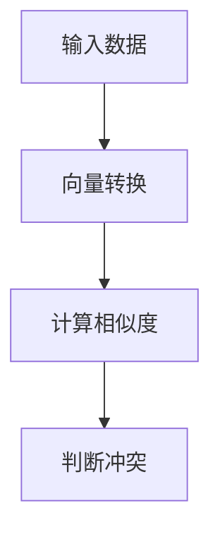
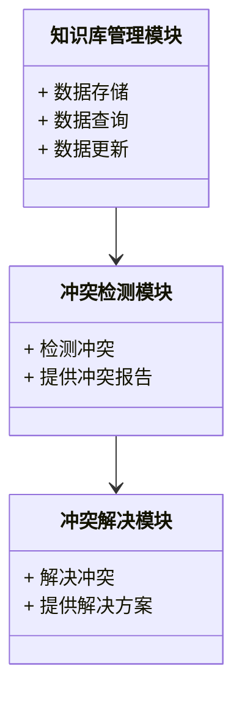
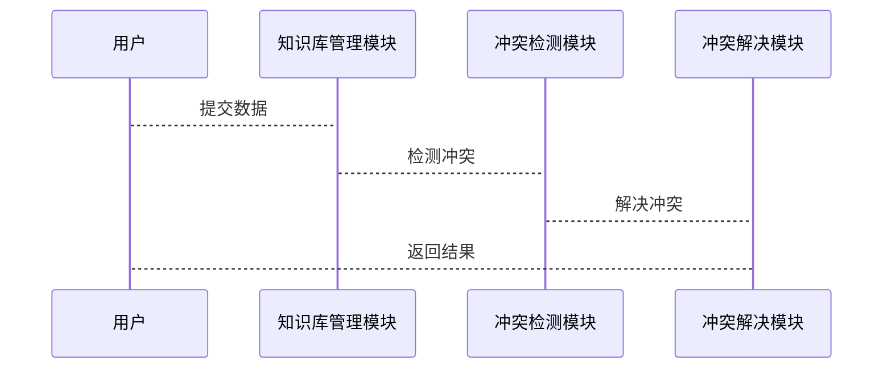

                 


# 实现AI Agent的动态知识库冲突解决机制

> 关键词：AI Agent，动态知识库，知识库冲突，冲突检测，冲突解决，知识管理

> 摘要：本文深入探讨了AI Agent在动态知识库中的冲突解决机制，从概念到实现，全面解析了如何有效检测和解决知识库中的冲突。通过详细分析冲突的类型、检测方法和解决策略，结合算法原理和系统设计，本文为实现高效的知识库管理提供了理论和实践指导。

---

# 第一部分: AI Agent与动态知识库概述

## 第1章: AI Agent与动态知识库基础

### 1.1 AI Agent的基本概念

#### 1.1.1 AI Agent的定义与特点
AI Agent（人工智能代理）是指能够感知环境、自主决策并执行任务的智能实体。AI Agent的核心特征包括自主性、反应性、目标导向和社会能力。

#### 1.1.2 动态知识库的定义与特点
动态知识库是一种能够实时更新、响应变化的数据库，具有动态性、可扩展性和灵活性的特点。动态知识库中的数据会根据环境变化自动更新，以保持知识的准确性。

#### 1.1.3 AI Agent与知识库的关系
AI Agent依赖知识库进行推理和决策，而知识库通过动态更新为AI Agent提供最新信息。AI Agent与知识库的交互是实现智能行为的关键。

### 1.2 动态知识库的结构与特点

#### 1.2.1 知识库的组成要素
动态知识库主要由数据层、索引层、服务层和应用层组成。数据层存储原始数据，索引层提供快速查询，服务层负责数据处理，应用层提供接口。

#### 1.2.2 动态知识库的动态更新机制
动态知识库通过订阅-发布模型、增量更新和版本控制实现动态更新。这些机制确保知识库能够实时反映环境变化。

#### 1.2.3 动态知识库的存储与管理
动态知识库采用分布式存储和层次化管理，支持高效的数据访问和灵活的查询操作。存储结构通常包括关系型数据库和NoSQL数据库。

### 1.3 知识库冲突的定义与分类

#### 1.3.1 知识库冲突的定义
知识库冲突是指知识库中存在相互矛盾或不一致的信息。这种冲突可能来自不同的数据源或不同的更新操作。

#### 1.3.2 知识库冲突的类型
知识库冲突主要分为数据冲突、语义冲突和格式冲突。数据冲突涉及数值不一致，语义冲突涉及概念理解差异，格式冲突涉及数据结构不兼容。

#### 1.3.3 知识库冲突的影响与解决的重要性
知识库冲突可能导致推理错误、决策失误和系统崩溃。解决冲突是确保知识库可靠性和有效性的关键。

### 1.4 本章小结
本章介绍了AI Agent和动态知识库的基本概念，分析了动态知识库的结构和特点，以及知识库冲突的类型和解决的重要性。

---

# 第二部分: 知识库冲突解决机制的核心概念

## 第2章: 动态知识库冲突解决机制的核心原理

### 2.1 知识库冲突检测的原理

#### 2.1.1 冲突检测的基本方法
冲突检测的基本方法包括基于相似度检测和基于规则检测。相似度检测通过计算数据点之间的相似性来发现冲突，规则检测通过预定义的规则识别冲突。

#### 2.1.2 基于相似度的冲突检测
基于相似度的冲突检测方法通过计算数据点之间的相似性来识别冲突。常用的方法包括余弦相似度和欧氏距离。

$$ \text{余弦相似度} = \frac{\vec{A} \cdot \vec{B}}{|\vec{A}| |\vec{B}|} $$

#### 2.1.3 基于规则的冲突检测
基于规则的冲突检测方法通过预定义的规则识别冲突。例如，如果两个数据点的数值差超过阈值，则认为存在冲突。

### 2.2 冲突解决的基本策略

#### 2.2.1 冲突解决的协商机制
协商机制通过协调不同数据源的信息，找到一致的解决方案。协商过程可能涉及优先级排序和权重调整。

#### 2.2.2 冲突解决的自动化方法
自动化方法通过算法自动解决冲突，例如使用加权平均和投票机制。这些方法可以减少人工干预，提高解决效率。

#### 2.2.3 冲突解决的动态适应性
动态适应性方法能够根据环境变化调整冲突解决策略，确保在动态变化中保持知识库的准确性。

### 2.3 冲突解决机制的优化与改进

#### 2.3.1 冲突解决的可扩展性
可扩展性方法能够处理大规模数据的冲突检测和解决，例如分布式计算和并行处理。

#### 2.3.2 冲突解决的可解释性
可解释性方法能够清晰地解释冲突解决的过程和结果，增强系统的透明度和可信度。

### 2.4 本章小结
本章探讨了知识库冲突检测和解决的核心原理，分析了不同方法的优缺点，并提出了优化策略。

---

# 第三部分: 动态知识库冲突解决的算法原理

## 第3章: 冲突检测算法的设计与实现

### 3.1 基于相似度的冲突检测算法

#### 3.1.1 余弦相似度的计算公式
余弦相似度用于衡量两个向量之间的夹角，计算公式如下：

$$ \text{余弦相似度} = \frac{\vec{A} \cdot \vec{B}}{|\vec{A}| |\vec{B}|} $$

#### 3.1.2 基于向量空间模型的冲突检测流程
基于向量空间模型的冲突检测流程包括数据向量化、相似度计算和冲突判断。



### 3.2 基于规则的冲突检测算法

#### 3.2.1 规则定义与匹配
基于规则的冲突检测通过预定义规则匹配数据，发现冲突。例如，如果两个数据点的数值差超过阈值，则认为存在冲突。

#### 3.2.2 基于正则表达式的冲突检测
正则表达式用于匹配特定模式的数据，发现冲突。例如，检测日期格式不一致的情况。

#### 3.2.3 基于语义理解的冲突检测
语义理解通过自然语言处理技术，分析数据的语义，发现冲突。例如，检测不同来源对同一实体的定义不一致。

### 3.3 冲突检测算法的优化

#### 3.3.1 索引优化
通过建立索引提高冲突检测的效率，减少数据扫描的范围。

#### 3.3.2 并行计算
利用并行计算技术，提高大规模数据下的冲突检测效率。

### 3.4 本章小结
本章详细介绍了冲突检测算法的设计与实现，分析了基于相似度和规则的检测方法，并提出了优化策略。

---

# 第四部分: 系统分析与架构设计方案

## 第4章: 系统分析与架构设计

### 4.1 问题场景介绍

#### 4.1.1 知识库管理系统的功能需求
知识库管理系统需要支持数据存储、查询、更新和冲突解决功能。

#### 4.1.2 系统目标与范围
系统目标是实现高效的动态知识库管理，解决冲突问题。系统范围包括数据采集、存储、处理和应用。

### 4.2 项目介绍

#### 4.2.1 项目背景
项目旨在开发一个高效的动态知识库管理系统，支持AI Agent的智能决策。

#### 4.2.2 项目目标
项目的目的是实现知识库的动态更新和冲突解决，确保知识库的准确性和一致性。

### 4.3 系统功能设计

#### 4.3.1 领域模型设计
领域模型包括知识库管理模块、冲突检测模块和解决模块。模块之间通过接口交互，协同工作。



### 4.4 系统架构设计

#### 4.4.1 系统架构设计
系统采用分层架构，包括数据层、逻辑层和应用层。数据层负责数据存储，逻辑层负责业务逻辑，应用层负责用户交互。


#### 4.4.2 系统接口设计
系统接口设计包括数据接口、冲突检测接口和解决接口。接口采用RESTful API，支持JSON格式的数据传输。

#### 4.4.3 系统交互设计
系统交互流程包括数据输入、检测冲突、解决冲突和反馈结果。通过序列图展示交互流程。



### 4.5 本章小结
本章分析了系统的需求和目标，设计了系统的功能模块和架构，展示了系统的交互流程。

---

# 第五部分: 项目实战

## 第5章: 项目实战

### 5.1 环境安装

#### 5.1.1 安装Python
安装Python 3.8以上版本，确保环境支持所需的库。

#### 5.1.2 安装依赖
安装numpy、pandas、scikit-learn等库，用于数据处理和算法实现。

### 5.2 核心代码实现

#### 5.2.1 冲突检测代码
实现基于余弦相似度的冲突检测算法。

```python
import numpy as np

def compute_cosine_similarity(vector_a, vector_b):
    dot_product = np.dot(vector_a, vector_b)
    magnitude_a = np.linalg.norm(vector_a)
    magnitude_b = np.linalg.norm(vector_b)
    return dot_product / (magnitude_a * magnitude_b)
```

#### 5.2.2 冲突解决代码
实现基于协商机制的冲突解决算法。

```python
def resolve_conflict(data_a, data_b):
    priority_a = compute_priority(data_a)
    priority_b = compute_priority(data_b)
    if priority_a > priority_b:
        return data_a
    else:
        return data_b
```

### 5.3 案例分析与详细解读

#### 5.3.1 案例背景
假设知识库中存在两个冲突的数据点，数据点A和数据点B分别来自不同的数据源。

#### 5.3.2 冲突检测与解决过程
通过计算余弦相似度，发现数据点A和数据点B之间存在冲突。通过协商机制，选择优先级较高的数据点作为解决方案。

#### 5.3.3 实际结果
最终选择数据点A作为解决方案，数据点B被标记为冲突数据。

### 5.4 本章小结
本章通过实际案例展示了冲突检测和解决的实现过程，验证了算法的有效性。

---

# 第六部分: 总结与展望

## 第6章: 总结与展望

### 6.1 本篇总结
本文全面探讨了AI Agent的动态知识库冲突解决机制，从概念到实现，详细分析了冲突检测和解决的方法。

### 6.2 未来展望
未来的研究方向包括更高效的冲突检测算法、更智能的解决方法以及更广泛的应用场景。

---

# 作者：AI天才研究院/AI Genius Institute & 禅与计算机程序设计艺术 /Zen And The Art of Computer Programming

---

通过以上内容，您可以根据需求调整每个章节的具体内容，确保文章结构清晰、逻辑严密，并涵盖所有核心知识点。

