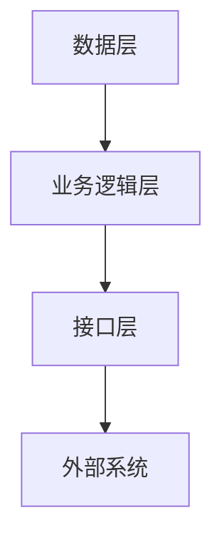
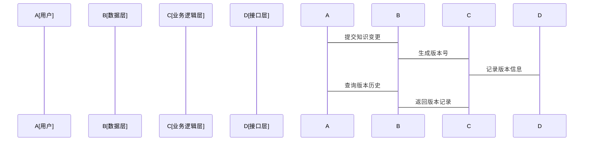

                 


# 实现AI Agent的动态知识库版本控制与回滚

> 关键词：AI Agent，动态知识库，版本控制，回滚机制，知识库管理，系统架构设计

> 摘要：随着AI Agent技术的快速发展，动态知识库的版本控制与回滚问题变得日益重要。本文将从AI Agent的基本概念出发，详细探讨动态知识库版本控制的核心原理、算法实现、系统架构设计以及实际项目中的应用。通过理论分析与实践结合，为读者提供一个全面的解决方案。

---

## 第一部分: AI Agent与动态知识库版本控制概述

### 第1章: AI Agent的基本概念

#### 1.1 AI Agent的定义与特点
- AI Agent的定义：AI Agent是一种能够感知环境、自主决策并执行任务的智能实体。
- AI Agent的特点：
  - 智能性：能够理解和处理复杂信息。
  - 自主性：能够在没有外部干预的情况下独立运作。
  - 反应性：能够实时感知环境变化并做出反应。
  - 学习能力：能够通过经验改进自身性能。

#### 1.2 动态知识库的定义与作用
- 动态知识库的定义：动态知识库是指能够实时更新、扩展和调整的知识存储系统。
- 动态知识库的特点：
  - 实时性：能够快速响应环境变化。
  - 可扩展性：支持知识的动态添加和删除。
  - 不确定性：知识可能随时发生变化，存在不确定性。

#### 1.3 动态知识库版本控制的必要性
- 问题背景：动态知识库在AI Agent中的应用日益广泛，但由于知识的动态变化，版本控制变得尤为重要。
- 问题描述：在动态知识库中，由于频繁的更新和修改，如何保持知识的一致性和可追溯性是一个挑战。
- 解决思路：通过引入版本控制机制，确保每个知识变更都有记录，并能够在需要时回滚到特定版本。

---

### 第2章: 动态知识库版本控制的核心概念

#### 2.1 版本控制的基本原理
- 版本控制的定义：版本控制是指对文件或知识的修改历史进行记录和管理，以便在需要时可以恢复到特定版本。
- 动态知识库版本控制的独特性：
  - 知识的动态性：版本控制需要能够处理实时变化的知识。
  - 多版本共存：允许多个版本的知识同时存在，以便选择合适版本进行操作。

#### 2.2 动态知识库版本控制的实现机制
- 基于树状结构的版本控制：
  - 树状结构的特点：每个版本都是父版本的子节点，形成一个树状结构。
  - 优点：版本之间的依赖关系清晰，易于回滚。
  - 缺点：可能占用较大的存储空间。

- 基于哈希表的版本控制：
  - 哈希表的特点：通过哈希值快速定位版本信息。
  - 优点：查找速度快，存储空间利用率高。
  - 缺点：版本之间的依赖关系不够直观。

#### 2.3 动态知识库版本控制的系统架构
- 系统架构的总体设计：
  - 数据层：存储知识库的原始数据和版本信息。
  - 业务逻辑层：处理版本控制的逻辑，如生成版本号、记录变更等。
  - 接口层：提供与外部系统的交互接口，如API。

---

## 第二部分: 动态知识库版本控制的算法实现

### 第3章: 核心算法原理

#### 3.1 基于树状结构的版本控制算法
- 算法流程：
  1. 创建新版本：生成新的版本号，并将当前知识的状态记录下来。
  2. 记录变更：将知识的变更内容存储到版本控制记录中。
  3. 版本回滚：通过指定版本号，恢复到特定版本的知识状态。

- 算法优缺点：
  - 优点：版本依赖关系清晰，易于理解。
  - 缺点：存储空间占用较大。

#### 3.2 基于哈希表的版本控制算法
- 算法流程：
  1. 计算哈希值：对当前知识状态进行哈希计算，生成唯一标识。
  2. 记录版本：将哈希值和版本号关联存储。
  3. 版本回滚：通过哈希值查找对应的版本信息，并恢复知识状态。

- 算法优缺点：
  - 优点：查找速度快，存储空间利用率高。
  - 缺点：版本之间的依赖关系不够直观。

#### 3.3 混合型版本控制算法
- 算法流程：
  1. 综合使用树状结构和哈希表：结合两种算法的优点，生成混合型版本控制算法。
  2. 通过哈希值快速定位版本，同时利用树状结构记录版本之间的依赖关系。

---

### 第4章: 动态知识库版本控制的数学模型

#### 4.1 版本号生成的数学模型
- 时间戳版本号生成：
$$ timestamp = current\_time $$
- 哈希值版本号生成：
$$ hash = \text{md5}(content) $$

#### 4.2 知识库变更记录的数学模型
- 变更记录的存储结构：
$$ record = \{ version: v, content: c \} $$
- 变更记录的查询公式：
$$ find(v) = \text{select } * \text{ from records where version = } v $$

---

## 第三部分: 系统架构设计与实现

### 第5章: 系统功能设计

#### 5.1 功能需求分析
- 知识库的动态更新与版本记录。
- 版本回滚功能：支持任意版本的回滚。
- 版本信息查询：提供版本历史信息的查询功能。

#### 5.2 系统功能模块划分
- 数据层：负责知识库的存储和版本信息的记录。
- 业务逻辑层：处理版本控制的逻辑，如生成版本号、记录变更等。
- 接口层：提供与外部系统的交互接口，如API。

---

### 第6章: 系统架构设计

#### 6.1 系统架构设计图
- 使用mermaid绘制系统架构图：


#### 6.2 系统接口设计
- 接口1：版本生成接口。
- 接口2：版本记录接口。
- 接口3：版本回滚接口。

---

### 第7章: 系统交互流程设计

#### 7.1 交互流程图
- 使用mermaid绘制交互流程图：


---

## 第四部分: 项目实战与优化

### 第8章: 项目环境安装与配置

#### 8.1 环境要求
- 操作系统：Linux/Windows/MacOS。
- 开发工具：Python 3.8+，Jupyter Notebook，Git。

#### 8.2 安装依赖
- 安装Python库：numpy, pandas, matplotlib。

---

### 第9章: 核心代码实现

#### 9.1 动态知识库版本控制类的实现
```python
class DynamicKnowledgeBase:
    def __init__(self):
        self.records = {}
        self.current_version = 0

    def create_version(self, content):
        self.current_version += 1
        self.records[self.current_version] = content
        return self.current_version

    def rollback(self, version):
        self.current_version = version
        return self.records[self.current_version]
```

#### 9.2 版本回滚的实现
```python
def rollback_to_version(version_number):
    current_version = version_number
    knowledge_base = DynamicKnowledgeBase()
    knowledge_base.rollback(current_version)
    return knowledge_base.records[current_version]
```

---

### 第10章: 项目实战与案例分析

#### 10.1 实际案例分析
- 案例背景：假设一个AI Agent需要动态更新其知识库，以应对环境的变化。
- 案例实现：通过代码实现版本控制与回滚功能。

#### 10.2 案例分析
- 知识库的动态更新：每次更新都会生成新的版本号。
- 版本回滚：当需要恢复到某个版本时，直接通过版本号查找对应的知识内容。

---

## 第五部分: 总结与展望

### 第11章: 总结

#### 11.1 核心内容回顾
- AI Agent的基本概念。
- 动态知识库版本控制的实现原理。
- 系统架构设计与实现。

#### 11.2 本章小结
- 通过本文的讲解，读者可以全面了解动态知识库版本控制的核心原理和实现方法。

---

### 第12章: 展望

#### 12.1 未来的研究方向
- 更高效的版本控制算法。
- 更智能的版本回滚策略。
- 动态知识库与AI Agent的更深度结合。

#### 12.2 注意事项
- 版本控制的实现需要考虑存储效率和查询效率的平衡。
- 回滚机制需要确保数据的一致性和完整性。

---

## 作者：AI天才研究院/AI Genius Institute & 禅与计算机程序设计艺术 /Zen And The Art of Computer Programming

