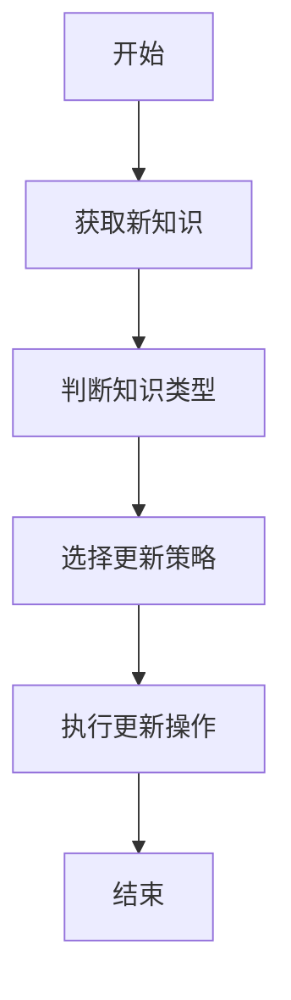
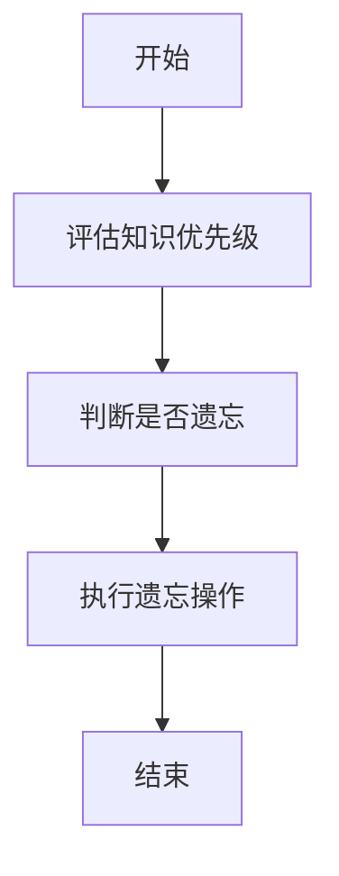
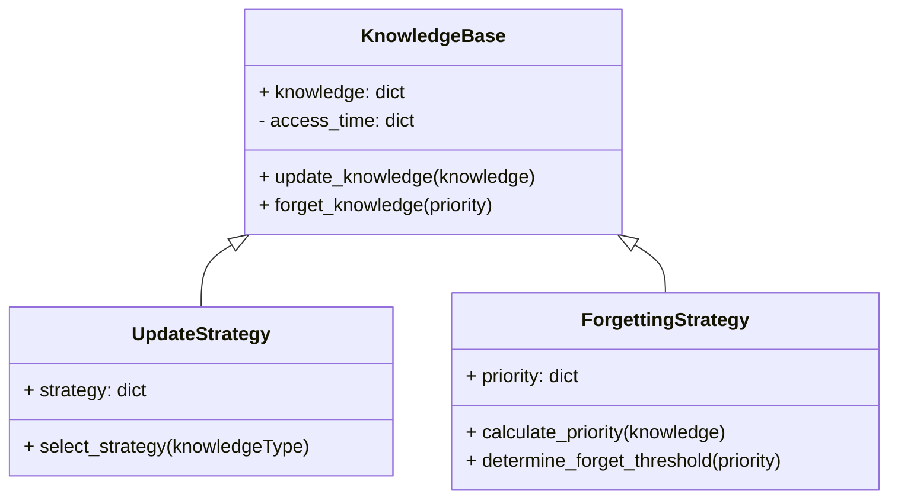
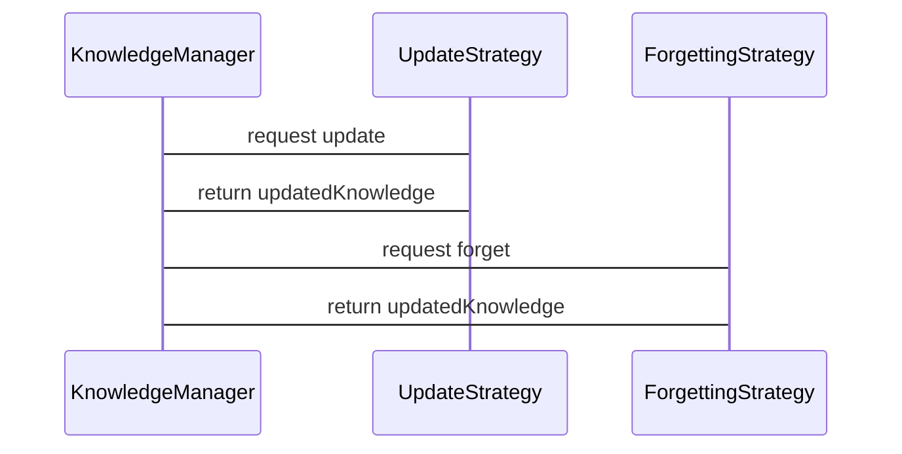

                 


# 实现AI Agent的动态知识更新与遗忘机制

> 关键词：AI Agent, 知识更新, 遗忘机制, 动态知识管理, 算法原理, 系统架构, 项目实战

> 摘要：本文详细探讨了AI Agent的动态知识更新与遗忘机制的实现方法。通过分析问题背景、核心概念、算法原理、系统架构设计以及项目实战，本文为读者提供了全面的解决方案和实现思路。从理论到实践，本文帮助读者理解如何在AI Agent中实现高效的知识管理。

---

## 第一部分：AI Agent的动态知识更新与遗忘机制概述

### 第1章：问题背景与核心概念

#### 1.1 问题背景

随着人工智能技术的快速发展，AI Agent（智能体）在各个领域的应用越来越广泛。AI Agent需要具备动态适应环境的能力，能够根据新的信息不断更新知识库，并在必要时遗忘过时或不再需要的信息。这种动态知识管理的能力是实现高效、智能决策的基础。

- **AI Agent的基本概念**：AI Agent是一种能够感知环境、执行任务并做出决策的智能系统。它需要与外部环境交互，处理动态信息，并根据需求调整自身的知识库。
- **知识更新的必要性**：AI Agent需要不断吸收新的知识，以适应环境的变化。例如，在自然语言处理中，模型需要不断更新词汇表和语义理解规则。
- **动态知识管理的挑战**：知识的更新和遗忘需要在保持系统稳定性和高效性的同时，确保信息的有效性和相关性。

#### 1.2 核心概念与问题描述

- **动态知识更新的定义**：动态知识更新是指AI Agent在运行过程中，根据新的输入信息，动态调整知识库的过程。
- **遗忘机制的定义**：遗忘机制是指AI Agent在知识库中移除不再需要或过时的信息的过程。
- **问题解决目标**：实现AI Agent的动态知识更新与遗忘机制，确保知识库的高效性和准确性。
- **边界与外延**：动态知识更新和遗忘机制仅关注知识的更新和删除，不涉及知识的存储和检索过程。

#### 1.3 概念结构与核心要素

- **知识表示的核心要素**：包括知识的表示形式（如符号、语义网络）、知识的来源（如数据、规则）、知识的更新频率等。
- **更新与遗忘机制的关系**：动态知识更新和遗忘机制相辅相成，前者负责引入新知识，后者负责移除无用知识。
- **核心概念的对比表格**

| 比较项             | 动态知识更新          | 遗忘机制            |
|--------------------|----------------------|--------------------|
| 目标               | 增加新知识           | 移除无用知识         |
| 触发条件           | 新信息输入           | 知识过时或低效       |
| 实现方式           | 数据融合、规则更新   | 时间衰减、优先级评估 |
| 优势               | 提高决策准确性       | 减少知识冗余         |

---

## 第二部分：核心概念与联系

### 第2章：动态知识更新与遗忘机制的核心原理

#### 2.1 动态知识更新的原理

- **知识表示的多样性**：AI Agent可以使用多种知识表示形式，如符号、语义网络、知识图谱等。
- **知识更新的触发条件**：包括时间触发（定期更新）、事件触发（特定事件触发更新）和用户触发（用户主动更新）。
- **更新策略的分类**：包括全量更新（替换原有知识）、增量更新（添加新知识）和混合更新（结合替换和添加）。

#### 2.2 遗忘机制的原理

- **遗忘的必要性**：知识库的无限增长会导致存储和处理效率下降，遗忘机制可以优化知识库。
- **遗忘曲线模型**：根据艾宾浩斯遗忘曲线，知识的遗忘速度与时间呈指数关系。
- **遗忘机制的实现方式**：包括基于时间的遗忘（根据知识的访问时间进行遗忘）、基于优先级的遗忘（根据知识的重要性进行遗忘）和基于上下文的遗忘（根据知识的使用场景进行遗忘）。

#### 2.3 更新与遗忘机制的联系

- **机制之间的相互作用**：动态知识更新和遗忘机制共同作用，确保知识库的高效性和准确性。
- **动态平衡的实现**：AI Agent需要在知识的新增和遗忘之间找到平衡点，以保持知识库的活力。
- **实例分析**：例如，在推荐系统中，动态知识更新用于添加新的用户偏好，遗忘机制用于移除过时的用户行为数据。

---

## 第三部分：算法原理讲解

### 第3章：动态知识更新与遗忘的算法原理

#### 3.1 动态知识更新算法

- **算法流程图（Mermaid）**



- **算法实现代码**

```python
def dynamic_knowledge_update(newKnowledge):
    currentKnowledge = get_current_knowledge()
    knowledgeType = determine_knowledge_type(newKnowledge)
    updateStrategy = select_update_strategy(knowledgeType)
    updatedKnowledge = apply_update_strategy(updateStrategy, currentKnowledge, newKnowledge)
    save_updated_knowledge(updatedKnowledge)
    return updatedKnowledge
```

- **数学模型与公式**

更新概率的计算公式为：
$$更新概率 = \frac{知识的重要性}{时间衰减因子}$$

---

#### 3.2 遗忘机制算法

- **算法流程图（Mermaid）**



- **算法实现代码**

```python
def forgetting_mechanism():
    currentKnowledge = get_current_knowledge()
    knowledgePriority = calculate_priority(currentKnowledge)
    forgetThreshold = determine_forget_threshold(knowledgePriority)
    updatedKnowledge = remove_low_priority_knowledge(currentKnowledge, forgetThreshold)
    save_updated_knowledge(updatedKnowledge)
    return updatedKnowledge
```

- **数学模型与公式**

遗忘概率的计算公式为：
$$遗忘概率 = 1 - e^{-\lambda t}$$

其中，$\lambda$ 是遗忘速率，$t$ 是时间。

---

#### 3.3 更新与遗忘的联合优化

- **联合优化的数学模型**

目标函数为：
$$目标函数 = \text{更新收益} - \text{遗忘损失}$$

约束条件包括：
- 知识库的大小限制
- 更新和遗忘操作的时间约束

---

## 第四部分：系统分析与架构设计

### 第4章：系统分析与架构设计方案

#### 4.1 问题场景介绍

AI Agent需要在动态环境中处理大量的知识信息，包括用户输入、传感器数据、外部接口调用等。为了保持知识库的高效性，需要实现动态知识更新与遗忘机制。

#### 4.2 系统功能设计

- **领域模型（Mermaid 类图）**



- **系统架构设计（Mermaid 架构图）**


- **系统接口设计**

接口定义：

```python
interface KnowledgeManager:
    def update_knowledge(newKnowledge):
        pass

    def forget_knowledge(priorityThreshold):
        pass
```

- **系统交互（Mermaid 序列图）**



---

## 第五部分：项目实战

### 第5章：项目实战

#### 5.1 环境安装

- **安装Python环境**：确保Python版本为3.6以上。
- **安装依赖库**：`pip install mermaid、numpy、matplotlib`

#### 5.2 系统核心实现源代码

```python
class KnowledgeBase:
    def __init__(self):
        self.knowledge = {}
        self.access_time = {}

    def update_knowledge(self, newKnowledge):
        # 更新知识库
        self.knowledge.update(newKnowledge)
        # 更新访问时间
        for key in newKnowledge:
            self.access_time[key] = time.time()

    def forget_knowledge(self, priorityThreshold):
        # 计算知识优先级
        priority = self.calculate_priority()
        # 移除优先级低于阈值的知识
        for key, value in priority.items():
            if value < priorityThreshold:
                del self.knowledge[key]

    def calculate_priority(self):
        # 根据访问时间计算优先级
        current_time = time.time()
        priority = {}
        for key, access_time in self.access_time.items():
            priority[key] = 1 / (current_time - access_time + 1)
        return priority
```

#### 5.3 代码应用解读与分析

- **KnowledgeBase类**：负责管理知识库，包括知识的更新和遗忘。
- **update_knowledge方法**：根据新的知识内容更新知识库，并记录访问时间。
- **forget_knowledge方法**：根据知识优先级移除低优先级的知识。
- **calculate_priority方法**：根据知识的访问时间计算优先级。

#### 5.4 实际案例分析与详细讲解

**案例：智能助手的动态知识更新与遗忘**

假设智能助手需要管理用户的偏好知识，包括用户的使用习惯和偏好。

- **初始化知识库**：空知识库。
- **更新知识**：用户输入新的偏好信息，知识库更新。
- **计算优先级**：根据用户的访问时间计算知识优先级。
- **遗忘机制**：定期移除低优先级的知识，保持知识库的高效性。

---

## 第六部分：总结与展望

### 第6章：总结与展望

#### 6.1 最佳实践 tips

- 定期更新知识库，保持知识的准确性。
- 根据实际需求选择合适的更新和遗忘策略。
- 使用高效的算法和数据结构，优化知识管理的性能。

#### 6.2 小结

本文详细探讨了AI Agent的动态知识更新与遗忘机制的实现方法，从背景到算法，从系统架构到项目实战，为读者提供了全面的解决方案。

#### 6.3 注意事项

- 知识的更新和遗忘需要权衡系统的稳定性和高效性。
- 确保知识的表示和存储方式能够支持动态更新和遗忘操作。
- 定期监控知识库的状态，及时调整更新和遗忘策略。

#### 6.4 拓展阅读

- 《动态知识管理：理论与应用》
- 《AI Agent的智能决策算法》
- 《知识图谱的构建与应用》

---

**作者：AI天才研究院/AI Genius Institute & 禅与计算机程序设计艺术 /Zen And The Art of Computer Programming**

---

通过本文的详细讲解，读者可以全面理解AI Agent的动态知识更新与遗忘机制的实现方法，并能够在实际项目中应用这些技术。希望本文对读者有所帮助，进一步推动AI Agent技术的发展。

