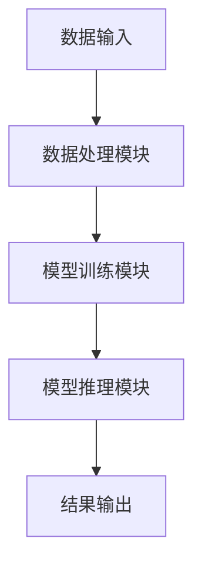

                 


# 实现AI Agent的多语言支持

## 关键词：AI Agent，多语言支持，自然语言处理，跨语言迁移学习，机器翻译

## 摘要：本文详细探讨了实现AI Agent多语言支持的关键技术与方法。首先介绍了AI Agent的基本概念和多语言支持的重要性，接着分析了多语言支持的核心问题与挑战。随后，深入讲解了自然语言处理和多语言模型的基础知识，以及跨语言迁移学习和机器翻译算法的原理。通过系统架构设计和项目实战，展示了如何在实际项目中实现多语言支持，并总结了相关经验与最佳实践。

---

# 第一部分: 引言与背景

## 第1章: AI Agent与多语言支持的背景

### 1.1 AI Agent的基本概念

#### 1.1.1 AI Agent的定义与特点
AI Agent（人工智能代理）是指能够感知环境、自主决策并执行任务的智能实体。AI Agent的特点包括智能性、自主性、反应性、社交性和学习能力。这些特点使得AI Agent能够在多种场景中应用，如智能助手、自动驾驶、智能客服等。

#### 1.1.2 多语言支持的重要性
随着全球化的发展，AI Agent需要能够理解并处理多种语言，以满足不同用户的语言需求。多语言支持不仅提升了用户体验，还扩大了AI Agent的应用范围。例如，在国际化市场中，支持多种语言可以提高产品的竞争力。

#### 1.1.3 当前技术背景与发展趋势
当前，自然语言处理（NLP）技术的快速发展为AI Agent的多语言支持提供了技术支持。深度学习模型，如BERT、GPT等，已经在多语言处理中取得了显著成果。未来，随着AI技术的进一步发展，多语言支持将更加智能化和个性化。

### 1.2 多语言支持的核心问题

#### 1.2.1 多语言支持的定义
多语言支持是指AI Agent能够理解和生成多种语言文本的能力。这不仅包括语言的识别和翻译，还包括跨语言的语义理解和生成。

#### 1.2.2 多语言支持的核心问题
多语言支持的核心问题包括跨语言语义理解、语言模型的训练、跨语言数据的处理等。这些问题需要结合NLP技术、机器学习算法和系统架构设计来解决。

#### 1.2.3 多语言支持的边界与外延
多语言支持的边界在于AI Agent能够处理的语言种类和任务范围。外延则包括与多语言支持相关的技术，如跨语言迁移学习、多语言模型的优化等。

---

## 第2章: 多语言支持的核心问题

### 2.1 多语言支持的定义

#### 2.1.1 多语言支持的范围
多语言支持的范围包括跨语言的文本理解、翻译、生成和对话。这些功能需要结合语言模型和任务需求来实现。

#### 2.1.2 多语言支持的核心问题
多语言支持的核心问题包括跨语言数据的稀缺性、模型的泛化能力、计算资源的分配等。这些问题需要在系统设计和算法优化中综合考虑。

#### 2.1.3 多语言支持的边界与外延
多语言支持的边界在于AI Agent能够处理的语言种类和任务范围。外延则包括与多语言支持相关的技术，如跨语言迁移学习、多语言模型的优化等。

---

# 第二部分: 多语言支持的核心概念与技术基础

## 第3章: 自然语言处理基础

### 3.1 NLP基础概念

#### 3.1.1 词性标注
词性标注是指将文本中的每个词标注其词性（如名词、动词、形容词等）。词性标注是NLP中的基础任务，为后续的句法分析和语义理解提供基础。

#### 3.1.2 语法分析
语法分析是指对文本的语法结构进行分析，包括句法树的构建和依存关系的分析。语法分析有助于理解句子的结构和语义。

#### 3.1.3 文本生成
文本生成是指根据输入生成相应的文本输出，如回答问题、撰写文章等。文本生成需要结合语言模型和生成算法来实现。

### 3.2 多语言NLP的挑战

#### 3.2.1 跨语言理解的难点
跨语言理解的难点包括语言的语义差异、语法结构的多样性、文化背景的差异等。这些问题使得跨语言理解比单语言理解更加复杂。

#### 3.2.2 跨语言生成的挑战
跨语言生成的挑战包括生成语言的准确性、流畅性、文化适配性等。这些问题需要结合多语言模型和生成算法来解决。

#### 3.2.3 跨语言数据的稀缺性
跨语言数据的稀缺性是指某些语言的数据量较少，导致模型的训练效果不佳。为了解决这一问题，可以采用数据增强、迁移学习等技术。

## 第4章: 多语言模型的训练与优化

### 4.1 多语言模型的训练策略

#### 4.1.1 联合训练
联合训练是指在同一模型中同时训练多种语言的任务。联合训练可以利用跨语言的共享特征，提升模型的泛化能力。

#### 4.1.2 跨语言迁移学习
跨语言迁移学习是指利用一种语言的数据来辅助另一种语言的模型训练。这种方法特别适用于数据稀缺的语言。

#### 4.1.3 多任务学习
多任务学习是指在同一模型中同时学习多个任务。多任务学习可以利用任务之间的共享特征，提升模型的性能。

### 4.2 多语言模型的优化方法

#### 4.2.1 参数共享
参数共享是指在模型中共享某些参数，以减少参数数量并提升模型的泛化能力。参数共享是多语言模型的重要优化方法。

#### 4.2.2 跨语言注意力机制
跨语言注意力机制是指在模型中引入注意力机制，用于跨语言的信息交互。跨语言注意力机制可以提升模型的跨语言理解能力。

#### 4.2.3 跨语言损失函数
跨语言损失函数是指在多语言模型中使用的损失函数，用于衡量模型的输出与真实值之间的差异。跨语言损失函数需要考虑不同语言之间的差异。

---

## 第5章: 机器翻译算法原理

### 5.1 神经机器翻译模型

#### 5.1.1 编码器-解码器结构
编码器-解码器结构是神经机器翻译模型的基本结构。编码器将源语言文本编码为向量表示，解码器将向量解码为目标语言文本。

#### 5.1.2 注意力机制
注意力机制是指在翻译过程中，模型关注源语言文本中的重要部分。注意力机制可以提升翻译的准确性和流畅性。

#### 5.1.3 多层感知机
多层感知机是指具有多个隐藏层的神经网络模型。多层感知机可以用于编码器和解码器的非线性变换。

### 5.2 多语言机器翻译

#### 5.2.1 多语言翻译模型
多语言翻译模型是指能够同时支持多种语言翻译的模型。多语言翻译模型可以采用联合训练、参数共享等技术来实现。

#### 5.2.2 跨语言翻译的挑战
跨语言翻译的挑战包括语言之间的语义差异、语法结构的多样性等。这些问题需要结合多语言模型和翻译算法来解决。

---

# 第三部分: 多语言支持的算法原理与数学模型

## 第6章: 多语言模型的算法原理

### 6.1 跨语言迁移学习的算法

#### 6.1.1 迁移学习的定义
迁移学习是指将一种任务的知识迁移到另一种任务。跨语言迁移学习是指将一种语言的知识迁移到另一种语言。

#### 6.1.2 迁移学习的算法
跨语言迁移学习的算法包括特征提取、参数共享、任务适配等。这些算法需要结合多语言数据和任务需求来实现。

#### 6.1.3 迁移学习的数学模型
跨语言迁移学习的数学模型可以表示为：
$$
P(y|x) = \frac{P(y|x, l)}{P(l)}
$$
其中，$l$表示语言，$y$表示目标标签，$x$表示输入特征。

---

## 第7章: 多语言模型的数学模型

### 7.1 多语言模型的数学表示

#### 7.1.1 多语言模型的参数表示
多语言模型的参数表示可以表示为：
$$
\theta = \{ \theta_1, \theta_2, ..., \theta_n \}
$$
其中，$\theta_i$表示第$i$个参数。

#### 7.1.2 多语言模型的损失函数
多语言模型的损失函数可以表示为：
$$
L(\theta) = \sum_{i=1}^n L_i(\theta)
$$
其中，$L_i(\theta)$表示第$i$个任务的损失函数。

#### 7.1.3 多语言模型的优化目标
多语言模型的优化目标是：
$$
\min_{\theta} L(\theta)
$$
在优化过程中，可以采用梯度下降、Adam等优化算法。

---

## 第8章: 多语言模型的训练过程

### 8.1 多语言模型的训练步骤

#### 8.1.1 数据预处理
数据预处理包括数据清洗、分词、标注等。数据预处理是训练多语言模型的基础。

#### 8.1.2 模型训练
模型训练包括参数初始化、正向传播、反向传播、参数更新等步骤。模型训练需要结合多语言数据和训练算法。

#### 8.1.3 模型评估
模型评估包括准确率、召回率、F1值等指标。模型评估需要结合多语言任务的需求。

---

## 第9章: 多语言模型的优化技巧

### 9.1 参数共享的优化技巧

#### 9.1.1 参数共享的策略
参数共享的策略包括全局参数共享、局部参数共享等。参数共享可以减少参数数量并提升模型的泛化能力。

#### 9.1.2 参数共享的实现
参数共享的实现可以通过模型结构设计和训练过程中的参数管理来实现。

#### 9.1.3 参数共享的效果
参数共享可以提升模型的跨语言理解能力和生成能力。

### 9.2 跨语言注意力机制的优化

#### 9.2.1 注意力机制的改进
注意力机制的改进包括引入位置编码、句法信息等。注意力机制的改进可以提升模型的语义理解能力。

#### 9.2.2 注意力机制的实现
注意力机制的实现可以通过神经网络模型和矩阵运算来实现。

#### 9.2.3 注意力机制的效果
注意力机制可以提升模型的跨语言理解和生成能力。

---

## 第10章: 多语言模型的系统架构设计

### 10.1 系统架构设计的原则

#### 10.1.1 模块化设计
模块化设计是指将系统划分为多个模块，每个模块负责特定的功能。模块化设计可以提升系统的可维护性和扩展性。

#### 10.1.2 分布式设计
分布式设计是指将系统部署在多个节点上，利用分布式计算提升系统的性能和扩展性。

#### 10.1.3 可扩展性设计
可扩展性设计是指设计能够适应数据和任务规模增长的系统架构。可扩展性设计可以通过负载均衡、分片等技术实现。

### 10.2 多语言模型的系统架构

#### 10.2.1 模块划分
多语言模型的系统架构可以划分为数据处理模块、模型训练模块、模型推理模块等。

#### 10.2.2 模块交互
模块之间的交互包括数据传递、参数同步、结果返回等。模块交互需要设计高效的接口和协议。

#### 10.2.3 系统架构图


---

## 第11章: 多语言模型的系统实现

### 11.1 系统实现的关键技术

#### 11.1.1 数据预处理技术
数据预处理技术包括文本清洗、分词、标注等。数据预处理是训练多语言模型的基础。

#### 11.1.2 模型训练技术
模型训练技术包括参数初始化、正向传播、反向传播、参数更新等步骤。模型训练需要结合多语言数据和训练算法。

#### 11.1.3 模型推理技术
模型推理技术包括输入处理、模型调用、结果返回等步骤。模型推理需要结合多语言任务的需求。

### 11.2 系统实现的代码示例

#### 11.2.1 数据预处理代码
```python
import pandas as pd
from sklearn.model_selection import train_test_split

# 加载数据
data = pd.read_csv('data.csv')

# 划分训练集和测试集
train_data, test_data = train_test_split(data, test_size=0.2)
```

#### 11.2.2 模型训练代码
```python
import torch
import torch.nn as nn
import torch.optim as optim

# 定义模型
class MultiLanguageModel(nn.Module):
    def __init__(self, vocab_size):
        super(MultiLanguageModel, self).__init__()
        self.embedding = nn.Embedding(vocab_size, 100)
        self.rnn = nn.RNN(100, 50)
        self.fc = nn.Linear(50, vocab_size)

    def forward(self, x):
        embeds = self.embedding(x)
        out, _ = self.rnn(embeds)
        out = self.fc(out)
        return out

# 初始化模型和优化器
model = MultiLanguageModel(vocab_size)
optimizer = optim.Adam(model.parameters(), lr=0.01)
criterion = nn.CrossEntropyLoss()

# 训练模型
for epoch in range(num_epochs):
    for inputs, labels in train_loader:
        outputs = model(inputs)
        loss = criterion(outputs, labels)
        optimizer.zero_grad()
        loss.backward()
        optimizer.step()
```

#### 11.2.3 模型推理代码
```python
# 加载模型
model.load_state_dict(torch.load('model.pth'))

# 推理过程
def predict(text):
    with torch.no_grad():
        inputs = preprocess(text)
        outputs = model(inputs)
        return outputs.argmax(dim=1).item()

# 使用模型进行推理
result = predict("Hello, how are you?")
print(result)
```

---

## 第12章: 多语言模型的系统优化

### 12.1 系统优化的策略

#### 12.1.1 并行计算
并行计算是指利用多核处理器或GPU加速模型的训练和推理过程。并行计算可以显著提升系统的性能。

#### 12.1.2 模型剪枝
模型剪枝是指去除模型中冗余的参数或结构，以减少模型的大小和计算量。模型剪枝可以提升模型的推理速度和资源利用率。

#### 12.1.3 模型量化
模型量化是指将模型的参数从浮点数转换为低位整数，以减少模型的存储空间和计算量。模型量化可以提升模型的推理效率。

### 12.2 系统优化的代码示例

#### 12.2.1 并行计算代码
```python
import torch
from torch.nn.parallel import DataParallel

# 初始化模型
model = MultiLanguageModel(vocab_size)
model = DataParallel(model)

# 分散数据
inputs = torch.stack([x for x in inputs], dim=0).cuda()

# 前向传播
outputs = model(inputs)
```

#### 12.2.2 模型剪枝代码
```python
import torch.nn.utils.prune as prune

# 剪枝模型
prune.global_unstructured(
    [model.embedding.weight],
    prune.L2FilterPrune,
    amount=0.2
)
```

#### 12.2.3 模型量化代码
```python
import torch.quantization

# 量化模型
model.qconfig = torch.quantization.default_qconfig
torch.quantization.prepare(model, inplace=True)
torch.quantization.convert(model, inplace=True)
```

---

## 第13章: 多语言模型的总结与展望

### 13.1 总结

#### 13.1.1 多语言支持的重要性
多语言支持是实现AI Agent智能化的重要基础。通过多语言支持，AI Agent可以更好地服务于全球用户。

#### 13.1.2 多语言模型的核心技术
多语言模型的核心技术包括自然语言处理、跨语言迁移学习、机器翻译等。这些技术需要结合系统架构设计和算法优化来实现。

#### 13.1.3 多语言模型的实现要点
多语言模型的实现要点包括数据预处理、模型训练、模型推理、系统优化等。这些实现要点需要综合考虑技术和工程实践。

### 13.2 未来展望

#### 13.2.1 多语言模型的发展方向
多语言模型的发展方向包括模型的轻量化、模型的自适应、模型的实时性等。未来，多语言模型将更加智能化和个性化。

#### 13.2.2 多语言支持的未来趋势
多语言支持的未来趋势包括支持更多语言、提升模型的跨语言理解能力、结合其他AI技术（如视觉、语音）等。未来，多语言支持将更加广泛和深入。

#### 13.2.3 多语言模型的应用前景
多语言模型的应用前景广阔，包括智能客服、多语言翻译、跨语言对话等。未来，多语言模型将在更多领域得到广泛应用。

---

# 作者：AI天才研究院/AI Genius Institute & 禅与计算机程序设计艺术 /Zen And The Art of Computer Programming

