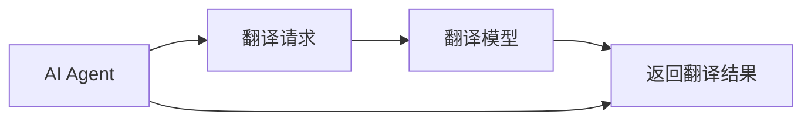
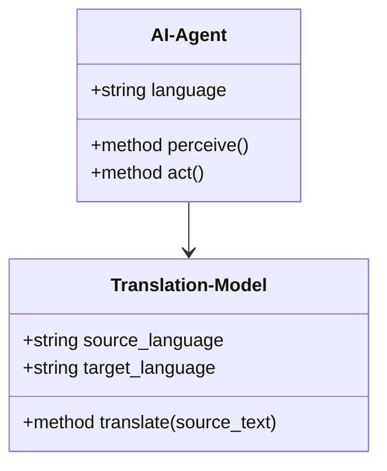
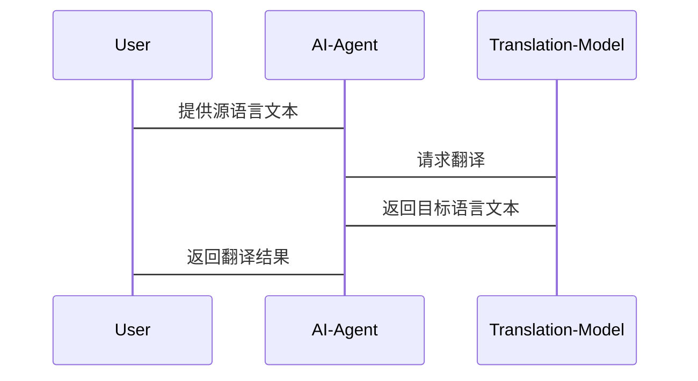

                 


# 实现AI Agent的多语言翻译能力

## 关键词：AI Agent, 多语言翻译, 自然语言处理, 神经机器翻译, 系统架构设计

## 摘要：本文详细探讨了如何实现AI Agent的多语言翻译能力，从背景介绍到核心算法，再到系统架构设计和项目实战，全面解析了AI Agent具备多语言翻译能力的关键技术与实现方法。

---

# 第1章: AI Agent与多语言翻译的背景介绍

## 1.1 AI Agent的基本概念

### 1.1.1 AI Agent的定义
AI Agent（人工智能代理）是指能够感知环境、自主决策并执行任务的智能实体。它可以是一个软件程序，也可以是一个物理设备，其核心目标是通过感知和行动来优化特定目标的实现。

### 1.1.2 AI Agent的核心功能
- **感知能力**：通过传感器或数据接口获取环境信息。
- **决策能力**：基于感知信息进行分析和推理，制定行动计划。
- **执行能力**：通过执行器或接口将决策转化为具体行动。

### 1.1.3 AI Agent的应用场景
- **智能家居**：控制家中的设备，提供智能化服务。
- **智能助手**：如Siri、Alexa等，帮助用户完成日常任务。
- **自动驾驶**：车辆通过感知环境进行自主驾驶。

## 1.2 多语言翻译的必要性

### 1.2.1 多语言翻译的定义
多语言翻译是指将一种语言的文本或语音转换为另一种语言的过程，旨在克服语言障碍，实现跨语言交流。

### 1.2.2 多语言翻译的挑战
- **语言多样性**：不同语言的语法、词汇差异大，增加了翻译的复杂性。
- **语境理解**：翻译需要考虑上下文，避免误解。
- **文化差异**：语言背后的文化差异可能影响翻译的准确性。

### 1.2.3 多语言翻译的应用场景
- **跨国通信**：帮助企业在全球范围内进行有效沟通。
- **旅游服务**：为游客提供多语言支持，解决语言障碍。
- **教育领域**：帮助学习者学习外语。

## 1.3 AI Agent与多语言翻译的结合

### 1.3.1 AI Agent具备多语言翻译能力的意义
- **提升用户体验**：使AI Agent能够服务于更多用户，支持多种语言交流。
- **增强功能**：通过多语言支持，AI Agent可以扩展其应用场景。
- **全球化需求**：在跨国环境中，多语言能力是必要的。

### 1.3.2 多语言翻译在AI Agent中的作用
- **信息处理**：将用户输入的多种语言信息转换为统一语言进行处理。
- **响应生成**：根据用户语言生成相应的回复，提升交互体验。
- **跨语言数据分析**：支持多语言数据的收集和分析，提升AI Agent的智能水平。

### 1.3.3 当前技术发展现状
- **技术进步**：神经机器翻译（NMT）技术的发展显著提升了翻译质量。
- **开源工具**：如OpenAI的GPT系列模型支持多语言处理，降低了实现门槛。
- **应用场景扩展**：多语言翻译在智能客服、跨境电商等领域的应用日益广泛。

## 1.4 本章小结
本章从AI Agent的基本概念出发，阐述了多语言翻译的必要性和应用场景，并分析了AI Agent具备多语言翻译能力的意义。通过结合当前技术发展现状，为后续章节的深入探讨奠定了基础。

---

# 第2章: AI Agent的多语言翻译核心概念与联系

## 2.1 AI Agent的核心概念

### 2.1.1 自然语言处理（NLP）的基本原理
NLP的目标是使计算机能够理解、生成人类语言。主要技术包括词干提取、句法分析、实体识别等。

### 2.1.2 翻译模型的工作原理
翻译模型通过分析源语言和目标语言之间的关系，生成准确的翻译结果。传统的统计机器翻译（SMT）依赖于语言对齐和概率模型，而神经机器翻译（NMT）通过深度学习模型捕捉语言特征。

### 2.1.3 AI Agent的交互机制
AI Agent通过自然语言处理技术与用户进行交互，理解用户意图并生成相应的响应。多语言翻译能力使其能够支持多种语言的交互。

## 2.2 多语言翻译技术的核心原理

### 2.2.1 统计机器翻译与神经机器翻译的区别
- **统计机器翻译（SMT）**：基于语言对齐和概率模型，通过大量平行语料训练翻译规则。
- **神经机器翻译（NMT）**：采用端到端的深度学习模型，通过神经网络直接学习源语言到目标语言的映射关系。

### 2.2.2 神经机器翻译模型的结构
NMT模型通常包括编码器和解码器两个部分。编码器将源语言句子编码为一个固定长度的向量，解码器根据编码结果生成目标语言句子。

### 2.2.3 多语言翻译的挑战与解决方案
- **数据稀疏性**：某些语言的平行语料较少，影响翻译质量。
- **语言差异性**：不同语言的语法结构差异大，增加了模型训练的难度。
- **解决方案**：通过多任务学习、预训练模型等技术提升多语言翻译的性能。

## 2.3 AI Agent与多语言翻译的关系

### 2.3.1 AI Agent如何调用多语言翻译服务
AI Agent通过调用翻译API（如Google Translate API）或集成翻译模型，将用户输入的源语言文本转换为目标语言。

### 2.3.2 多语言翻译如何增强AI Agent的能力
- **跨语言交互**：支持多种语言的用户与AI Agent进行交流。
- **多语言内容处理**：能够处理和分析多种语言的数据，提升AI Agent的智能水平。

### 2.3.3 AI Agent与翻译模型的协同工作
AI Agent通过翻译模型将用户输入转换为内部处理语言，完成任务后，再将结果翻译为目标语言，返回给用户。

## 2.4 核心概念对比分析

### 2.4.1 翻译技术对比表格
| 技术类型      | 统计机器翻译（SMT） | 神经机器翻译（NMT） |
|---------------|---------------------|---------------------|
| 基础原理      | 基于语言对齐和概率模型 | 基于深度学习模型     |
| 优缺点         | 优点：规则明确；缺点：翻译质量受限 | 优点：翻译质量高；缺点：计算资源消耗大 |
| 应用场景       | 小语种翻译           | 大语种和小语种翻译   |

### 2.4.2 AI Agent功能对比表格
| 功能类型      | 单语言AI Agent | 多语言AI Agent |
|---------------|----------------|----------------|
| 交互语言       | 一种语言        | 多种语言         |
| 翻译能力       | 无              | 支持多语言翻译    |
| 用户群体       | 单一语种用户     | 多语种用户         |

## 2.5 ER实体关系图


---

# 第3章: 多语言翻译技术的算法原理

## 3.1 神经机器翻译模型的结构

### 3.1.1 编码器结构
编码器将源语言句子转换为一个固定长度的向量，捕捉句子的主要信息。

### 3.1.2 解码器结构
解码器根据编码器生成的向量，逐步生成目标语言句子。

### 3.1.3 注意力机制
注意力机制通过计算源语言句子中每个词的重要性，帮助模型更好地理解上下文。

## 3.2 翻译算法的实现流程

### 3.2.1 数据预处理
- **分词**：将文本分割成单词或短语。
- **对齐**：建立源语言和目标语言句子之间的对应关系。
- **训练数据准备**：将平行语料分为源语言和目标语言两部分。

### 3.2.2 模型训练
- **选择模型架构**：如Transformer模型。
- **定义损失函数**：通常使用交叉熵损失函数。
- **优化器选择**：如Adam优化器。
- **训练过程**：通过反向传播更新模型参数。

## 3.3 算法实现代码示例

### 3.3.1 简单神经机器翻译模型的实现
```python
import tensorflow as tf
from tensorflow.keras import layers

# 定义编码器
def encoder(input_shape):
    encoder_input = layers.Input(shape=input_shape)
    encoder_lstm = layers.LSTM(128, return_sequences=True)(encoder_input)
    encoder_output = layers.Dropout(0.2)(encoder_lstm)
    return encoder_output

# 定义解码器
def decoder(input_shape, encoder_output):
    decoder_input = layers.Input(shape=input_shape)
    decoder_lstm = layers.LSTM(128, return_sequences=True)(decoder_input)
    attention = layers.Dense(128, activation='softmax')(decoder_lstm)
    context = layers.Dot((None, 128, 1), normalized=True)([decoder_lstm, attention])
    output = layers.Dense( target_vocab_size, activation='softmax' )(context)
    return output

# 定义整个翻译模型
def translate_model(source_vocab_size, target_vocab_size):
    encoder_output = encoder((source_vocab_size,))(encoder_input)
    decoder_output = decoder((target_vocab_size,), encoder_output)
    return decoder_output
```

### 3.3.2 翻译过程的数学模型
编码器将源语言句子表示为向量：
$$
\mathbf{z} = \text{Encoder}(\mathbf{x})
$$
解码器根据编码向量生成目标语言句子：
$$
\mathbf{y} = \text{Decoder}(\mathbf{z})
$$
注意力机制通过计算源语言和目标语言之间的相似性：
$$
\alpha_{i,j} = \text{softmax}(e^{a_{i,j}})
$$
其中，$a_{i,j}$ 是注意力计算结果。

---

# 第4章: 系统分析与架构设计

## 4.1 系统功能设计

### 4.1.1 领域模型设计


### 4.1.2 系统架构设计


## 4.2 接口与交互设计

### 4.2.1 系统接口设计
- **输入接口**：接收用户输入的源语言文本。
- **输出接口**：返回目标语言的翻译结果。

### 4.2.2 交互流程图


---

# 第5章: 项目实战

## 5.1 环境安装与配置

### 5.1.1 安装Python与TensorFlow
安装Python 3.8及以上版本，并通过pip安装TensorFlow 2.0及以上版本。

### 5.1.2 安装翻译库
安装`googletrans`库以调用Google的翻译API：
```bash
pip install googletrans==4.0.0-rc1
```

## 5.2 系统核心功能实现

### 5.2.1 翻译功能实现
使用`googletrans`库实现多语言翻译：
```python
from googletrans import Translator

def translate_text(text, target_lang):
    translator = Translator()
    translated = translator.translate(text, dest=target_lang)
    return translated.text

# 示例
text_to_translate = "Hello, how are you?"
target_language = "es"  # 西班牙语
result = translate_text(text_to_translate, target_language)
print(result)  # 输出："Hola, ¿cómo estás?"
```

### 5.2.2 翻译模型优化
通过预训练的多语言模型提升翻译质量：
```python
from transformers import AutoTokenizer, AutoModelForTranslation

model_name = "facebook/m2m-100-418-million"
tokenizer = AutoTokenizer.from_pretrained(model_name)
model = AutoModelForTranslation.from_pretrained(model_name)

def translate_with_model(text, target_lang):
    inputs = tokenizer(text, return_tensors="pt")
    outputs = model.generate(**inputs, forced_bos_token_id=tokenizer.get_special_tokens_mask(
        tokenizer.bos_token_id, is bos=True)[0], max_length=100)
    translated = tokenizer.decode(outputs[0], skip_special_tokens=True)
    return translated

text_to_translate = "Hello, how are you?"
result = translate_with_model(text_to_translate, "es")
print(result)  # 输出：Hola, ¿cómo estás?
```

## 5.3 项目小结
通过集成现有的翻译库和预训练模型，可以快速实现AI Agent的多语言翻译能力。选择合适的翻译工具和技术栈，能够显著提升开发效率和系统性能。

---

# 第6章: 最佳实践与注意事项

## 6.1 最佳实践

### 6.1.1 翻译模型选择
- 根据具体需求选择合适的翻译模型，如预训练模型或定制化模型。
- 使用开源库（如Hugging Face的Transformers库）提供的多语言模型。

### 6.1.2 翻译质量优化
- 提供高质量的平行语料以提升翻译准确性。
- 使用后处理技术（如语言模型校正）优化翻译结果。

### 6.1.3 性能优化
- 使用缓存机制减少重复翻译请求。
- 优化模型加载流程，提升响应速度。

## 6.2 注意事项

### 6.2.1 数据隐私
- 确保用户数据的安全性和隐私性，避免数据泄露。

### 6.2.2 文化敏感性
- 注意不同语言和文化背景下的表达差异，避免冒犯用户。

### 6.2.3 模型可解释性
- 提供翻译结果的可解释性，帮助用户理解翻译的依据。

## 6.3 拓展阅读
- **《Neural Machine Translation》**：深入理解神经机器翻译的原理。
- **《Effective Machine Learning》**：学习如何优化机器学习模型的性能。

---

# 作者：AI天才研究院/AI Genius Institute & 禅与计算机程序设计艺术 /Zen And The Art of Computer Programming

---

以上是《实现AI Agent的多语言翻译能力》的技术博客文章的详细目录和内容概要。希望这篇文章能够为读者提供清晰的思路和实用的知识，帮助他们理解并实现AI Agent的多语言翻译能力。

