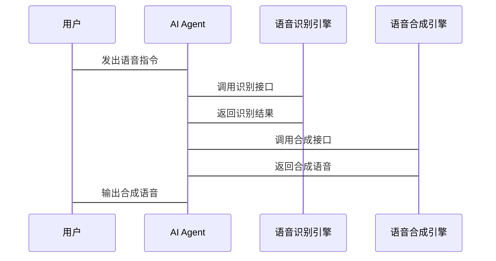

                 


# 实现AI Agent的多语言语音识别与合成

> 关键词：AI Agent, 多语言语音识别, 多语言语音合成, 语音交互, 语音引擎, 系统架构设计

> 摘要：本文详细探讨了实现AI Agent的多语言语音识别与合成的技术细节。从背景介绍到系统架构设计，再到项目实战，系统地分析了多语言语音处理的核心概念、算法原理和实现方案。通过丰富的代码示例和图表，帮助读者深入理解如何构建一个支持多种语言的智能语音交互系统。

---

## 第一部分: AI Agent的多语言语音识别与合成概述

### 第1章: AI Agent与多语言语音处理的背景

#### 1.1 问题背景与描述

随着人工智能技术的快速发展，AI Agent（智能代理）在各个领域的应用越来越广泛。语音交互作为人机交互的重要方式，需要支持多种语言，以满足全球用户的需求。然而，多语言语音处理技术的实现面临着诸多挑战，如不同语言的语音特征差异、语言模型的适应性等。

#### 1.1.1 人工智能与语音交互的发展现状

语音交互技术近年来取得了显著进展，从简单的语音识别到复杂的语音合成，技术不断成熟。然而，多语言支持仍然是一个挑战，尤其是在处理语法结构复杂、词汇差异大的语言时。

#### 1.1.2 多语言语音处理的必要性

在全球化的背景下，支持多语言的语音交互能够提升用户体验，扩大市场覆盖范围。AI Agent需要能够理解并生成多种语言的语音，以满足不同地区用户的需求。

#### 1.1.3 AI Agent在多语言语音交互中的角色

AI Agent作为用户与系统之间的桥梁，负责接收用户的语音输入、进行语义理解，并生成相应的语音输出。在多语言场景下，AI Agent需要具备跨语言的处理能力。

---

#### 1.2 多语言语音识别与合成的核心问题

多语言语音处理的核心问题包括语音识别的准确性、语音合成的自然度以及多语言模型的切换与适配。这些技术难点直接影响用户体验和系统的性能。

#### 1.2.1 语音识别的挑战

不同语言的语音特征差异大，如音调、音节结构等。此外，语言间的干扰也增加了识别的难度。

#### 1.2.2 多语言语音合成的技术难点

多语言语音合成需要处理不同语言的声学特征，如发音、语调等。同时，合成器需要能够适应多种语言的语法和语义结构。

#### 1.2.3 AI Agent中的多语言语音交互流程

用户发出语音指令，AI Agent将其转化为文本，进行语义理解后生成相应内容，并通过语音合成模块输出目标语言的语音。

---

#### 1.3 问题解决思路与边界

为了实现多语言语音交互，需要构建一个多语言语音处理系统，包括语音识别引擎、语言模型、语音合成引擎等模块。系统需要支持多种语言的切换，并确保各模块协同工作。

#### 1.3.1 多语言语音处理的整体解决方案

整合多种语言的语音识别和合成模型，提供统一的接口进行交互。

#### 1.3.2 技术边界与实现范围

明确系统的功能边界，如支持的语言种类、语音质量要求等。

#### 1.3.3 系统架构的初步设想

初步设计系统架构，包括前端语音采集、后端处理模块等。

---

### 第2章: 多语言语音识别与合成的核心概念

#### 2.1 AI Agent中的语音交互模型

AI Agent通过语音交互与用户进行沟通，支持多种语言的识别和合成。

#### 2.1.1 用户、AI Agent、语音引擎的实体关系

用户与AI Agent交互，AI Agent调用语音识别引擎进行识别，并通过语音合成引擎生成语音输出。

#### 2.1.2 多语言语音处理的流程分解

语音输入→识别→语义理解→生成→合成→输出。

#### 2.1.3 核心概念的ER实体关系图

```mermaid
erDiagram
    user) +----- 操作语音交互
    aiAgent) +----- 调用语音引擎
    voiceEngine) +----- 提供识别和合成服务
```

---

#### 2.2 语音识别与合成的技术原理

语音识别和合成是多语言处理的核心技术，需要处理不同语言的特征。

#### 2.2.1 语音识别的基本原理

将语音信号转化为文本，涉及声学模型、语言模型和解码器。

#### 2.2.2 多语言语音合成的实现机制

基于语音生成模型，生成目标语言的语音信号。

#### 2.2.3 AI Agent中的语音交互流程

用户发出语音指令，AI Agent进行识别、理解并生成相应语音输出。

---

## 第3章: 多语言语音识别与合成的算法原理

### 3.1 语音识别算法的实现流程

语音识别涉及声学模型、语言模型和解码器的协同工作。

#### 3.1.1 声学模型的构建

使用深度学习模型（如卷积神经网络）提取语音特征。

#### 3.1.2 语言模型的训练

基于大量文本数据训练语言模型，用于识别结果的校正。

#### 3.1.3 解码器的工作原理

根据声学模型和语言模型生成最终的识别结果。

---

### 3.2 多语言语音合成的算法实现

语音合成基于语音生成模型，支持多种语言的语音生成。

#### 3.2.1 合成器的结构设计

包括声学模型、语音生成模块和控制模块。

#### 3.2.2 多语言语音生成的模型训练

训练多语言语音生成模型，使其能够生成不同语言的语音。

#### 3.2.3 合成器的优化策略

优化语音合成的质量和自然度。

---

### 3.3 AI Agent中的语音交互算法

AI Agent需要协调语音识别和合成模块，实现多语言交互。

#### 3.3.1 语音识别与合成的协同工作

识别结果作为合成输入，生成相应的语音输出。

#### 3.3.2 多语言模型的切换与适配

根据用户语言切换识别和合成模型。

#### 3.3.3 语音质量的评估与优化

通过评估指标优化语音质量。

---

## 第4章: 多语言语音处理的系统架构设计

### 4.1 系统功能设计

#### 4.1.1 用户需求分析

用户需要通过多种语言与AI Agent进行交互。

#### 4.1.2 系统功能模块划分

包括语音采集模块、语音识别模块、语义理解模块、语音合成模块。

#### 4.1.3 界面设计与交互流程

设计用户友好的界面，优化交互流程。

---

### 4.2 系统架构设计

#### 4.2.1 分层架构设计

分为数据采集层、处理层和应用层。

#### 4.2.2 模块间的依赖关系

各模块之间通过接口进行通信。

#### 4.2.3 系统扩展性设计

支持新语言的快速接入和扩展。

---

### 4.3 系统接口设计

#### 4.3.1 接口定义

定义语音识别和合成的API接口。

#### 4.3.2 接口交互流程

用户调用接口，系统返回结果。

#### 4.3.3 交互流程图



---

## 第5章: 多语言语音处理的项目实战

### 5.1 环境搭建与工具安装

#### 5.1.1 开发环境的配置

安装必要的开发工具和库。

#### 5.1.2 语音处理库的安装与配置

安装如Kaldi、PyTorch等工具。

---

### 5.2 系统核心实现源代码

#### 5.2.1 语音识别模块

```python
import torch
from torch import nn

# 定义声学模型
class AcousticModel(nn.Module):
    def __init__(self):
        super().__init__()
        self.conv = nn.Conv1d(1, 128, kernel_size=3, padding=1)
        self.pool = nn.MaxPool1d(2)
        self.fc = nn.Linear(128, 512)
        
    def forward(self, x):
        x = self.conv(x)
        x = self.pool(x)
        x = x.permute(0, 2, 1)
        x = self.fc(x)
        return x
```

---

#### 5.2.2 语音合成模块

```python
import numpy as np
from scipy.io import soundfile

# 定义语音合成函数
def synthesize_speech(text, language):
    # 文本转语音
    pass

# 示例用法
text = "Hello, how are you?"
language = "en"
synthesize_speech(text, language)
```

---

### 5.3 代码应用解读与分析

详细解读代码的功能和实现逻辑。

---

### 5.4 案例分析与详细讲解

通过实际案例分析，展示多语言语音处理的效果和优化方向。

---

## 第6章: 最佳实践与小结

### 6.1 最佳实践 tips

总结实现多语言语音处理的最佳实践，如选择合适的工具和优化策略。

### 6.2 小结

回顾全文内容，总结实现AI Agent的多语言语音识别与合成的关键点。

### 6.3 注意事项

提醒读者在实际开发中需要注意的问题。

### 6.4 拓展阅读

推荐相关的技术资料和进一步学习的方向。

---

## 作者

作者：AI天才研究院/AI Genius Institute & 禅与计算机程序设计艺术 /Zen And The Art of Computer Programming

---

以上是文章的完整目录和内容概述，具体内容将按照上述结构详细展开，确保每个部分都包含丰富的技术细节和实践案例。

