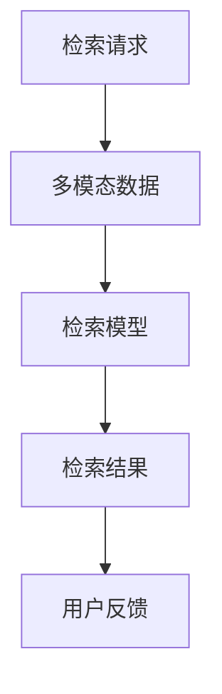
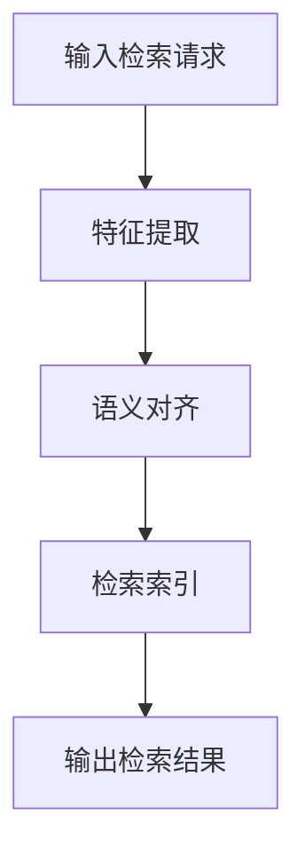
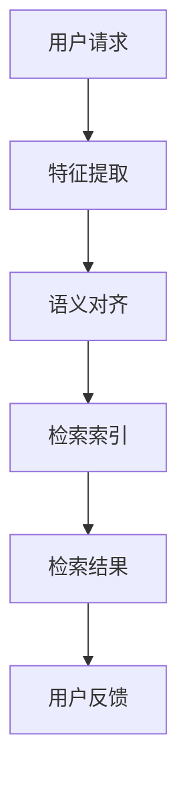
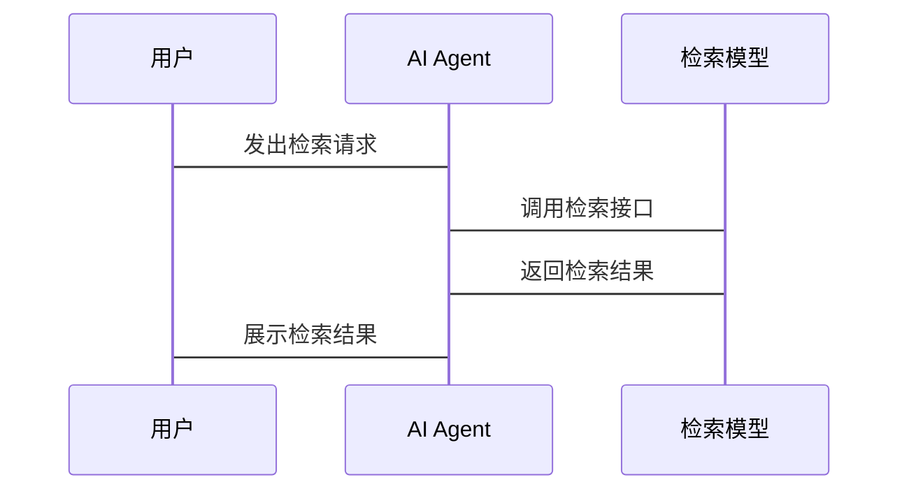

                 


# 实现AI Agent的跨模态检索能力

> 关键词：AI Agent，跨模态检索，多模态数据，检索模型，系统架构

> 摘要：本文详细探讨了AI Agent实现跨模态检索能力的核心概念、算法原理、系统架构设计以及项目实战。通过逐步分析，帮助读者理解如何将多模态数据与AI Agent相结合，构建高效的信息检索系统。

---

## 第1章 背景介绍

### 1.1 问题背景

#### 1.1.1 跨模态检索的定义与特点
跨模态检索（Cross-modal Retrieval）是指在不同数据类型之间进行信息检索的技术。例如，从文本中检索图像，或从图像中检索文本。其特点包括：
- **多模态性**：处理多种数据类型。
- **语义关联**：理解不同模态之间的语义关系。
- **高效性**：快速检索相关结果。

#### 1.1.2 AI Agent在跨模态检索中的作用
AI Agent作为智能体，能够主动理解用户需求，并利用跨模态检索技术提供更精准的服务。例如，当用户输入一段文本时，AI Agent可以通过跨模态检索找到相关的图像或视频，提供更丰富的信息。

#### 1.1.3 当前技术发展的现状与挑战
当前，跨模态检索技术已取得显著进展，但仍面临以下挑战：
- **语义鸿沟**：不同模态之间的语义理解差异。
- **计算复杂度**：处理多模态数据需要更高的计算资源。
- **模型泛化能力**：模型在不同数据集上的表现差异。

### 1.2 问题描述

#### 1.2.1 跨模态检索的核心问题
- 如何在不同模态之间建立有效的语义映射。
- 如何提高检索的准确性和效率。

#### 1.2.2 AI Agent在跨模态检索中的需求
AI Agent需要具备以下能力：
- **多模态理解**：理解多种数据类型。
- **跨模态检索**：在不同模态之间进行信息检索。
- **动态适应**：根据用户反馈调整检索策略。

#### 1.2.3 跨模态检索的实际应用场景
- **智能客服**：通过文本和语音检索相关信息。
- **图像搜索**：通过图像检索相关文本或视频。
- **推荐系统**：根据用户行为推荐相关内容。

### 1.3 问题解决

#### 1.3.1 跨模态检索的主要技术手段
- **特征提取**：将不同模态的数据转换为统一特征空间。
- **语义对齐**：通过对比学习对齐不同模态的特征。
- **检索优化**：利用索引技术优化检索效率。

#### 1.3.2 AI Agent如何实现跨模态检索能力
AI Agent通过集成跨模态检索模型，能够根据用户输入的多种模态数据，检索相关结果并返回给用户。

#### 1.3.3 跨模态检索与AI Agent的结合方式
- **模型集成**：将跨模态检索模型嵌入AI Agent中。
- **接口调用**：AI Agent通过调用跨模态检索API获取结果。

### 1.4 边界与外延

#### 1.4.1 跨模态检索的边界条件
- **数据类型限制**：仅支持特定模态的数据。
- **检索范围限制**：仅在限定的数据集中检索。

#### 1.4.2 AI Agent能力的边界
- **功能限制**：仅支持特定场景下的跨模态检索。
- **性能限制**：检索速度和准确性受限于硬件和算法。

#### 1.4.3 跨模态检索的外延应用
- **多模态生成**：生成与检索结果相关的多种模态数据。
- **实时检索**：支持实时数据的跨模态检索。

### 1.5 概念结构与核心要素

#### 1.5.1 跨模态检索的核心要素
- **检索请求**：用户的查询或输入数据。
- **多模态数据**：多种类型的数据源。
- **检索模型**：处理和检索的算法或模型。
- **检索结果**：检索到的相关数据或信息。

#### 1.5.2 AI Agent能力的核心要素
- **感知能力**：理解用户输入的能力。
- **决策能力**：选择合适的检索模型。
- **执行能力**：调用检索模型并返回结果。

#### 1.5.3 跨模态检索与AI Agent的关系
跨模态检索为AI Agent提供多模态数据处理能力，而AI Agent则通过跨模态检索技术为用户提供更智能的服务。

---

## 第2章 跨模态检索的核心概念与联系

### 2.1 跨模态检索的原理

#### 2.1.1 跨模态检索的基本原理
跨模态检索通过将不同模态的数据映射到统一的特征空间，实现语义上的对齐和检索。

#### 2.1.2 跨模态检索的主要技术
- **特征提取**：如使用BERT提取文本特征，使用ResNet提取图像特征。
- **语义对齐**：通过对比学习对齐特征向量。
- **检索优化**：使用ANN（Approximate Nearest Neighbor）索引技术优化检索速度。

#### 2.1.3 跨模态检索的关键挑战
- **语义鸿沟**：不同模态之间语义理解的差异。
- **计算复杂度**：处理多模态数据需要更高的计算资源。
- **模型泛化能力**：模型在不同数据集上的表现差异。

### 2.2 跨模态检索与AI Agent的关系

#### 2.2.1 跨模态检索如何增强AI Agent的能力
- **提升用户体验**：通过提供多模态检索结果，增强用户体验。
- **增强决策能力**：AI Agent可以通过跨模态检索获取更多相关信息，提高决策准确性。

#### 2.2.2 AI Agent如何实现跨模态检索
AI Agent通过集成跨模态检索模型，能够根据用户输入的多种模态数据，检索相关结果并返回给用户。

#### 2.2.3 跨模态检索与AI Agent的协同工作模式
- **协同学习**：AI Agent与检索模型共同优化。
- **动态调整**：根据用户反馈动态调整检索策略。

### 2.3 跨模态检索的核心概念对比

#### 2.3.1 跨模态检索与单模态检索的对比
| 特性         | 跨模态检索                  | 单模态检索                  |
|--------------|----------------------------|-----------------------------|
| 数据类型     | 文本、图像、音频等多种       | 单一数据类型（如文本或图像） |
| 复杂度       | 较高                        | 较低                        |
| 应用场景     | 多场景                     | 单一场景                     |

#### 2.3.2 跨模态检索与多模态检索的对比
| 特性         | 跨模态检索                  | 多模态检索                  |
|--------------|----------------------------|-----------------------------|
| 是否跨越模态  | 是                          | 否                          |
| 检索方式     | 跨越不同模态进行检索         | 在单一模态内部进行检索       |
| 应用场景     | 需要跨模态信息交互           | 多模态数据处理               |

#### 2.3.3 跨模态检索与其他检索技术的对比
| 特性         | 跨模态检索                  | 基于内容的检索               | 基于关键词的检索             |
|--------------|----------------------------|-----------------------------|-----------------------------|
| 检索依据     | 多模态数据的语义关系         | 内容特征                      | 关键词匹配                   |
| 适用场景     | 需要跨模态信息交互           | 特定内容检索                  | 简单文本检索                 |

### 2.4 跨模态检索的ER实体关系图



---

## 第3章 跨模态检索的算法原理

### 3.1 算法概述

#### 3.1.1 跨模态检索的算法流程


#### 3.1.2 跨模态检索的核心算法
- **特征提取**：使用预训练模型（如BERT、ResNet）提取特征向量。
- **语义对齐**：通过对比学习对齐不同模态的特征向量。
- **检索索引**：构建ANN索引加速检索过程。

### 3.2 算法实现

#### 3.2.1 特征提取代码示例
```python
import torch
from transformers import BertTokenizer, BertModel

# 文本特征提取
def text_feature_extraction(text):
    tokenizer = BertTokenizer.from_pretrained('bert-base-uncased')
    model = BertModel.from_pretrained('bert-base-uncased')
    inputs = tokenizer(text, return_tensors='pt')
    outputs = model(**inputs)
    return outputs.last_hidden_state.squeeze()

# 图像特征提取
def image_feature_extraction(image):
    model = torch.hub.load('pytorch/vision:v0.6.0', 'resnet18', pretrained=True)
    transform = torch.nn.Sequential(
        torch.nn.Resize((224, 224)),
        torch.nn.ToTensor(),
        torch.nn.Normalize(mean=[0.485, 0.456, 0.406], std=[0.229, 0.224, 0.225])
    )
    image = transform(image).unsqueeze(0)
    outputs = model(image)
    return outputs.squeeze()
```

#### 3.2.2 语义对齐算法
```python
import torch
import torch.nn as nn

class ContrastiveLoss(nn.Module):
    def __init__(self, temperature=0.1):
        super(ContrastiveLoss, self).__init__()
        self.temperature = temperature

    def forward(self, feature1, feature2):
        # 计算余弦相似度
        similarity = (feature1 @ feature2.T) / self.temperature
        # 计算损失
        loss = (1 - torch.diag(similarity)).mean()
        return loss
```

#### 3.2.3 检索优化
```python
import faiss

# 构建ANN索引
index = faiss.IndexFlatL2(vector_size)
index.add(all_features)
# 检索
def search(query_feature, index, k=5):
    D, I = index.search(query_feature, k)
    return I
```

### 3.3 算法的数学公式

#### 3.3.1 余弦相似度公式
$$ \text{similarity} = \frac{\vec{a} \cdot \vec{b}}{\|\vec{a}\| \|\vec{b}\|} $$

#### 3.3.2 对比损失函数
$$ L = -\frac{1}{N}\sum_{i=1}^{N} \log(\text{sim}(\vec{a}_i, \vec{b}_i)) - \frac{1}{N}\sum_{i=1}^{N} \log(1 - \text{sim}(\vec{a}_i, \vec{b}_j)) $$

---

## 第4章 系统分析与架构设计

### 4.1 系统架构设计

#### 4.1.1 项目背景
本项目旨在构建一个支持跨模态检索的AI Agent系统，能够处理文本、图像等多种数据类型。

#### 4.1.2 系统功能设计
- **特征提取模块**：提取多模态数据特征。
- **语义对齐模块**：对齐不同模态的特征向量。
- **检索模块**：基于ANN索引进行高效检索。

#### 4.1.3 系统架构图


### 4.2 接口与交互设计

#### 4.2.1 系统接口
- **输入接口**：接受文本、图像等多种数据类型。
- **输出接口**：返回检索结果。

#### 4.2.2 交互流程


---

## 第5章 项目实战

### 5.1 环境安装

```bash
pip install transformers faiss-cpu torch
```

### 5.2 核心代码实现

#### 5.2.1 特征提取代码
```python
def extract_features(text, image):
    text_feature = text_feature_extraction(text)
    image_feature = image_feature_extraction(image)
    return text_feature, image_feature
```

#### 5.2.2 语义对齐与检索
```python
def semantic_alignment(features):
    loss = ContrastiveLoss()
    aligned_features = []
    for feature in features:
        aligned_feature = feature / (torch.norm(feature) + 1e-8)
        aligned_features.append(aligned_feature)
    return aligned_features
```

### 5.3 实际案例分析

#### 5.3.1 案例背景
用户输入文本“猫”，系统检索相关图像。

#### 5.3.2 案例实现
```python
text = "猫"
image = load_image("cat.jpg")

text_feature = text_feature_extraction(text)
image_feature = image_feature_extraction(image)

aligned_text_feature = semantic_alignment([text_feature])
aligned_image_feature = semantic_alignment([image_feature])

index = faiss.IndexFlatL2(aligned_image_feature.shape[-1])
index.add(aligned_image_feature)

query_feature = aligned_text_feature
D, I = index.search(query_feature, 5)
print(I)
```

---

## 第6章 最佳实践

### 6.1 总结
跨模态检索为AI Agent提供了强大的多模态数据处理能力，能够显著提升用户体验。

### 6.2 小结
通过本文的介绍，读者可以深入了解AI Agent实现跨模态检索能力的核心概念、算法原理和系统架构设计。

### 6.3 注意事项
- **数据多样性**：确保训练数据的多样性。
- **模型优化**：持续优化检索模型的性能。
- **用户体验**：注重用户体验设计。

### 6.4 拓展阅读
- **文献推荐**：推荐几篇经典的跨模态检索论文。
- **工具推荐**：推荐相关的开源工具和库。

---

## 作者信息

作者：AI天才研究院/AI Genius Institute & 禅与计算机程序设计艺术 /Zen And The Art of Computer Programming

