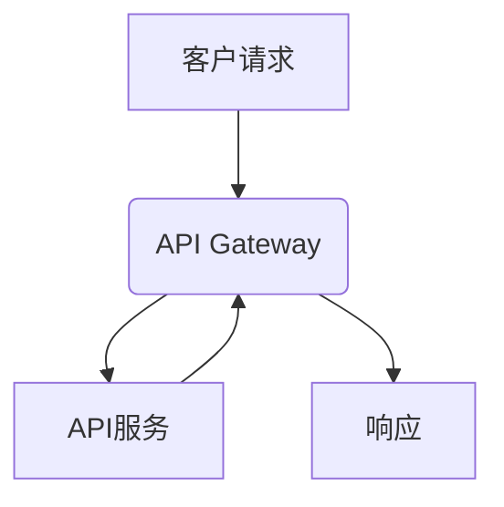
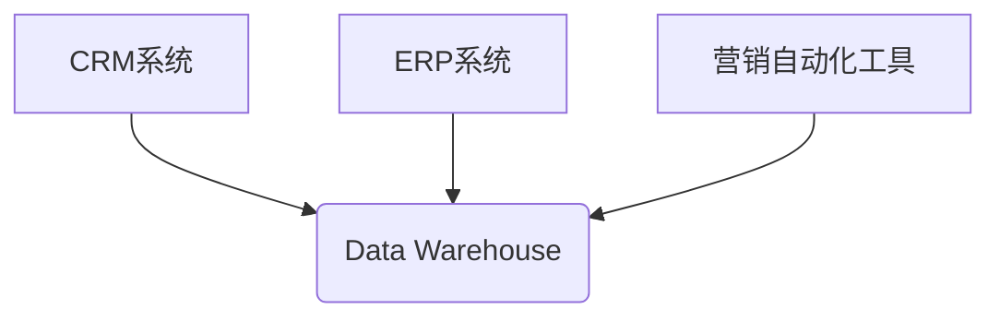
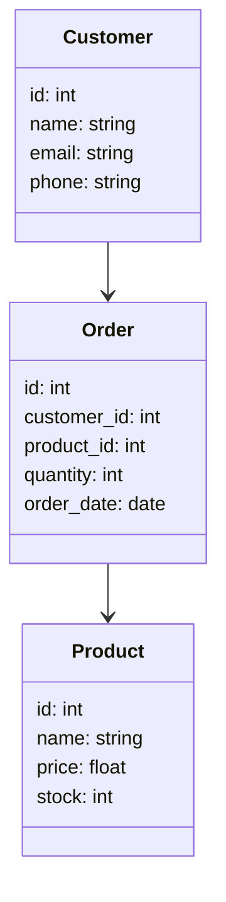
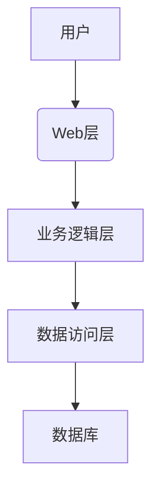
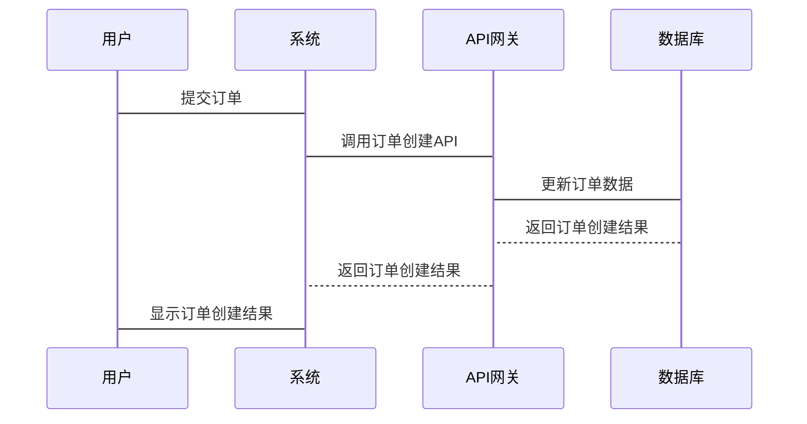

                 


# 客户关系管理集成

> 关键词：客户关系管理（CRM）、系统集成、数据同步、API、数据仓库

> 摘要：本文详细探讨了客户关系管理（CRM）集成的各个方面，从基本概念到技术实现，再到实际应用案例，帮助读者全面理解CRM集成的核心原理和实施方法。文章内容包括CRM集成的背景、核心概念、技术原理、系统架构设计、项目实战以及最佳实践，旨在为企业信息化建设提供理论和实践指导。

---

## 第1章: 客户关系管理集成的背景与概念

### 1.1 客户关系管理（CRM）的基本概念

#### 1.1.1 什么是客户关系管理
客户关系管理（Customer Relationship Management，CRM）是一种企业管理和优化客户关系的策略和实践。它通过收集、分析和利用客户数据，帮助企业更好地了解客户需求、提高客户满意度、增加客户忠诚度，从而实现业务目标。

CRM不仅涉及客户数据的管理，还包括与客户互动的所有环节，例如销售、市场营销、客户服务和技术支持等。

#### 1.1.2 CRM的核心目标
CRM的核心目标包括：
1. **提高客户满意度**：通过个性化服务和及时响应客户需求，提升客户体验。
2. **增加客户忠诚度**：通过建立长期客户关系，减少客户流失。
3. **优化业务流程**：通过整合各个业务环节的数据，提高运营效率。
4. **提高销售额**：通过精准营销和销售预测，提升销售额和市场份额。

#### 1.1.3 CRM的演进与发展趋势
CRM经历了从简单的客户信息管理到复杂的客户关系管理系统的演进。现代CRM系统通常集成了销售、市场营销、客户服务、数据分析等多种功能，并且与企业资源计划（ERP）系统、营销自动化工具等其他系统进行深度集成。

随着人工智能（AI）、大数据和云计算等技术的发展，CRM系统正朝着智能化、个性化和实时化方向发展。

---

### 1.2 客户关系管理集成的定义与内涵

#### 1.2.1 集成的定义
CRM集成是指将多个独立的CRM系统或其他相关系统（如ERP、营销自动化工具等）整合在一起，通过数据共享、流程协同和功能互补，实现企业各个业务环节的无缝连接。

CRM集成的核心目标是消除信息孤岛，确保数据的一致性和实时性，从而提高企业的整体运营效率和客户满意度。

#### 1.2.2 CRM集成的核心特征
1. **数据一致性**：确保不同系统中的数据保持一致。
2. **实时性**：数据能够实时同步，保证信息的及时性。
3. **功能互补**：通过集成不同系统，实现功能上的互补和协同。
4. **可扩展性**：集成系统能够灵活扩展，适应企业发展的需求。

#### 1.2.3 CRM集成的范围与边界
CRM集成的范围通常包括以下内容：
- **客户数据集成**：整合来自不同渠道的客户数据，确保数据的完整性和准确性。
- **业务流程集成**：将CRM系统与其他业务系统（如ERP、营销自动化工具）进行集成，实现业务流程的协同。
- **数据分析集成**：将CRM数据与其他分析工具进行集成，支持数据驱动的决策。

CRM集成的边界通常由企业的业务需求和技术架构决定，需要明确哪些系统需要集成，以及集成的深度和广度。

---

### 1.3 客户关系管理集成的重要性

#### 1.3.1 提升企业效率
CRM集成能够消除信息孤岛，减少重复劳动，提高业务流程的效率。例如，通过CRM与ERP系统的集成，可以实现销售订单与库存管理的无缝对接，避免库存错误和订单延迟。

#### 1.3.2 增强客户体验
通过CRM集成，企业可以实现跨渠道的客户互动，提供一致的客户体验。例如，客户可以通过电话、邮件或在线聊天等多种渠道与企业互动，而企业可以通过集成的CRM系统统一管理这些互动。

#### 1.3.3 优化资源分配
CRM集成可以帮助企业更好地分配资源，提高资源利用率。例如，通过CRM与营销自动化工具的集成，企业可以实现精准营销，避免资源浪费。

---

### 1.4 当前CRM集成的现状与挑战

#### 1.4.1 现有CRM系统的局限性
- **数据孤岛**：许多企业仍然使用多个独立的CRM系统或工具，导致数据分散，难以统一管理。
- **功能不足**：单一的CRM系统可能无法满足企业的所有需求，需要与其他系统集成。
- **数据冗余**：由于多个系统之间的数据重复和不一致，导致数据冗余和管理复杂。

#### 1.4.2 集成中的主要问题
- **数据格式不统一**：不同系统之间的数据格式和结构可能不同，导致数据转换和同步的困难。
- **接口兼容性问题**：不同系统之间的接口可能不兼容，导致集成复杂。
- **数据安全与隐私**：集成过程中可能涉及敏感数据的传输和存储，需要确保数据安全和隐私保护。

#### 1.4.3 技术与管理上的挑战
- **技术复杂性**：CRM集成涉及多种技术和工具，需要专业的技术团队进行实施。
- **管理复杂性**：集成后的系统需要进行统一的管理和维护，增加了管理复杂性。
- **成本问题**：CRM集成可能需要大量的资源投入，包括技术开发、设备采购和人员培训等。

---

### 1.5 本章小结
本章介绍了CRM的基本概念、核心目标和发展趋势，重点阐述了CRM集成的定义、核心特征和重要性。同时，分析了当前CRM集成的现状和主要挑战，为后续章节的深入讨论奠定了基础。

---

## 第2章: 客户关系管理集成的核心概念与联系

### 2.1 数据模型与实体关系

#### 2.1.1 数据模型的定义
数据模型是描述数据的结构和关系的抽象模型。在CRM集成中，数据模型通常包括客户、订单、产品、服务请求等核心实体。

#### 2.1.2 实体关系图（ER图）的构建
通过构建ER图，可以清晰地展示各个实体之间的关系。例如：

```mermaid
erd
  id Customer "客户编号"
  id Order "订单编号"
  id Product "产品编号"
  Customer --- Order
  Order --> Product
```

#### 2.1.3 核心实体间的关联关系
- **客户与订单的关系**：一个客户可以有多个订单，每个订单对应一个客户。
- **订单与产品的关系**：一个订单可以包含多个产品，每个产品对应一个订单。
- **客户与服务请求的关系**：一个客户可以有多个服务请求，每个服务请求对应一个客户。

---

### 2.2 集成模式与技术选型

#### 2.2.1 数据集成模式
- **全量集成**：将所有数据一次性同步，适用于数据量较小的场景。
- **增量集成**：仅同步新增或修改的数据，适用于数据量较大的场景。

#### 2.2.2 系统集成模式
- **API集成**：通过调用API接口实现系统之间的数据交互。
- **数据同步集成**：通过数据同步工具实现数据的实时或批量同步。

#### 2.2.3 API与数据同步的选择
选择API集成还是数据同步集成，需要根据具体的业务需求和系统特性来决定。例如：

- **API集成**适用于需要实时交互的场景，例如在线订单处理。
- **数据同步集成**适用于需要批量处理的场景，例如每日的销售数据同步。

---

### 2.3 集成工具与技术

#### 2.3.1 ETL工具的作用
ETL（Extract, Transform, Load）工具用于将数据从源系统提取出来，进行转换和清洗，然后加载到目标系统中。常用的ETL工具有：
- **Informatica**
- **DataStage**
- **ETL Plus**

#### 2.3.2 API网关的使用
API网关可以作为API的统一入口，提供API的路由、认证、监控和日志记录等功能。例如：



#### 2.3.3 数据仓库的构建
数据仓库用于存储和管理大量的数据，支持数据分析和挖掘。例如：



---

### 2.4 集成的业务流程

#### 2.4.1 从需求到设计
- **需求分析**：明确CRM集成的目标和范围。
- **系统设计**：设计系统的数据模型、接口和架构。

#### 2.4.2 从设计到实施
- **开发**：编写代码实现集成功能。
- **测试**：进行单元测试、集成测试和用户验收测试。

#### 2.4.3 从实施到优化
- **部署**：将系统部署到生产环境。
- **监控**：实时监控系统运行状态，及时发现和解决问题。
- **优化**：根据反馈和数据分析结果，优化系统性能和功能。

---

### 2.5 本章小结
本章重点介绍了CRM集成的核心概念，包括数据模型、集成模式和工具技术。通过ER图和系统架构图，展示了CRM集成的复杂性和系统性，为后续章节的深入讨论奠定了基础。

---

## 第3章: 客户关系管理集成的技术原理

### 3.1 数据清洗与转换

#### 3.1.1 数据清洗的必要性
数据清洗是为了消除数据中的错误和不一致，例如：
- **重复数据**：同一数据多次出现。
- **数据格式不统一**：例如日期格式不一致。
- **数据缺失**：某些字段为空。

#### 3.1.2 数据转换的步骤
数据转换通常包括以下步骤：
1. **数据抽取**：从源系统中提取数据。
2. **数据清洗**：删除或修复错误数据。
3. **数据转换**：将数据转换为目标系统的格式。
4. **数据加载**：将数据加载到目标系统中。

#### 3.1.3 数据标准化的实现
数据标准化是将数据转换为统一的格式，例如：

```python
# 示例代码：数据标准化
def standardize_date(date_str):
    from datetime import datetime
    try:
        date_obj = datetime.strptime(date_str, "%d/%m/%Y")
        return date_obj.strftime("%Y-%m-%d")
    except ValueError:
        return None
```

---

### 3.2 数据同步与整合

#### 3.2.1 数据同步的机制
数据同步可以通过以下机制实现：
- **实时同步**：数据发生变化时立即同步。
- **批量同步**：定期批量同步数据，适用于数据量较大的场景。

#### 3.2.2 数据整合的流程
数据整合的流程包括：
1. **数据抽取**：从各个系统中抽取数据。
2. **数据清洗**：删除重复和错误数据。
3. **数据整合**：将数据整合到统一的数据仓库中。
4. **数据加载**：将整合后的数据加载到目标系统中。

#### 3.2.3 数据冲突的处理
数据冲突是指同一数据在不同系统中存在不同的值。处理数据冲突的方法包括：
- **优先级规则**：根据优先级处理数据冲突，例如优先处理源系统的数据。
- **手动处理**：由人工介入处理数据冲突。

---

### 3.3 数据分析与挖掘

#### 3.3.1 数据分析的目标
数据分析的目标包括：
- **客户画像**：通过分析客户数据，构建客户画像。
- **销售预测**：通过分析历史销售数据，预测未来的销售趋势。
- **客户分群**：通过分析客户行为数据，将客户分为不同的群体。

#### 3.3.2 数据挖掘的核心算法
常用的数据挖掘算法包括：
- **聚类分析**：例如K-Means算法。
- **分类分析**：例如决策树算法。
- **回归分析**：例如线性回归算法。

#### 3.3.3 数据挖掘的结果应用
数据挖掘的结果可以用于：
- **精准营销**：根据客户画像进行精准营销。
- **风险控制**：根据销售预测进行库存管理和风险控制。
- **客户分群**：根据客户分群进行差异化服务。

---

### 3.4 本章小结
本章详细介绍了CRM集成中的数据清洗、数据同步和数据分析的技术原理，重点讲解了数据转换、数据整合和数据挖掘的具体实现方法。

---

## 第4章: 客户关系管理集成的系统架构设计

### 4.1 项目需求分析

#### 4.1.1 项目背景介绍
某企业需要将现有的CRM系统与ERP系统进行集成，以实现销售订单与库存管理的无缝对接。

#### 4.1.2 项目目标
- **数据同步**：实现CRM系统与ERP系统之间的数据同步。
- **流程协同**：实现销售订单的自动创建和库存更新。

#### 4.1.3 项目范围
- **数据范围**：客户信息、订单信息、产品信息。
- **功能范围**：订单创建、库存更新、数据同步。

---

### 4.2 系统功能设计

#### 4.2.1 领域模型
领域模型是系统设计的重要部分，通常用类图表示。例如：



#### 4.2.2 系统架构设计
系统架构设计通常包括以下层次：
1. **数据访问层**：负责与数据库交互。
2. **业务逻辑层**：负责业务逻辑的实现。
3. **用户界面层**：负责与用户交互。

例如：



#### 4.2.3 系统接口设计
系统接口设计通常包括以下内容：
- **API接口**：例如RESTful API。
- **数据同步接口**：例如通过文件或数据库同步。

#### 4.2.4 系统交互流程
系统交互流程通常包括以下步骤：
1. **用户请求**：用户通过界面提交请求。
2. **接口调用**：系统通过接口调用其他系统。
3. **数据处理**：系统对数据进行处理。
4. **响应返回**：系统将处理结果返回给用户。

例如：



---

### 4.3 本章小结
本章通过一个具体的项目案例，详细介绍了系统架构设计的过程，包括领域模型、系统架构图、接口设计和交互流程图。通过这些设计，可以实现CRM系统与其他系统的无缝集成。

---

## 第5章: 客户关系管理集成的项目实战

### 5.1 项目背景与目标

#### 5.1.1 项目背景
某企业需要将CRM系统与ERP系统进行集成，以实现销售订单与库存管理的无缝对接。

#### 5.1.2 项目目标
- **数据同步**：实现CRM系统与ERP系统之间的数据同步。
- **流程协同**：实现销售订单的自动创建和库存更新。

---

### 5.2 环境配置与工具安装

#### 5.2.1 环境配置
- **操作系统**：Windows 10
- **开发工具**：PyCharm
- **数据库**：MySQL
- **API工具**：Postman

#### 5.2.2 工具安装
- **Python**：安装Python 3.8及以上版本。
- **JDBC驱动**：安装MySQL的JDBC驱动。

---

### 5.3 核心代码实现

#### 5.3.1 数据同步代码
以下是一个简单的数据同步代码示例：

```python
# 示例代码：数据同步
import pymysql

def sync_data():
    # 连接CRM数据库
    db_crm = pymysql.connect(
        host="localhost",
        user="crm_user",
        password="crm_password",
        database="crm"
    )
    
    # 连接ERP数据库
    db_erp = pymysql.connect(
        host="localhost",
        user="erp_user",
        password="erp_password",
        database="erp"
    )
    
    # 提取CRM数据
    cursor_crm = db_crm.cursor()
    cursor_crm.execute("SELECT * FROM orders")
    orders = cursor_crm.fetchall()
    
    # 同步到ERP系统
    cursor_erp = db_erp.cursor()
    for order in orders:
        cursor_erp.execute("INSERT INTO sales_order VALUES (%s, %s, %s, %s, %s)",
                           (order[0], order[1], order[2], order[3], order[4]))
    
    db_erp.commit()
    db_crm.close()
    db_erp.close()

sync_data()
```

#### 5.3.2 数据转换代码
以下是一个数据转换代码示例：

```python
# 示例代码：数据转换
def convert_data():
    # 从CSV文件中读取数据
    import csv
    with open("crm_data.csv", "r") as file:
        reader = csv.reader(file)
        data = list(reader)
    
    # 数据转换
    converted_data = []
    for row in data:
        converted_row = {
            "customer_id": int(row[0]),
            "order_id": int(row[1]),
            "product_id": int(row[2]),
            "quantity": int(row[3]),
            "order_date": row[4]
        }
        converted_data.append(converted_row)
    
    # 将转换后的数据保存到数据库
    import pymysql
    db = pymysql.connect(
        host="localhost",
        user="admin",
        password="admin_password",
        database="data_warehouse"
    )
    
    cursor = db.cursor()
    for row in converted_data:
        cursor.execute("INSERT INTO orders VALUES (%s, %s, %s, %s, %s)",
                       (row["customer_id"], row["order_id"], row["product_id"], row["quantity"], row["order_date"]))
    
    db.commit()
    db.close()

convert_data()
```

---

### 5.4 数据同步与测试

#### 5.4.1 数据同步测试
在数据同步完成后，需要进行数据同步测试，确保数据正确同步。

#### 5.4.2 系统测试
系统测试包括功能测试、性能测试和安全测试。

---

### 5.5 项目部署与总结

#### 5.5.1 项目部署
将集成系统部署到生产环境，确保系统的稳定运行。

#### 5.5.2 项目总结
总结项目的实施过程，分析成功与不足，为未来的优化提供参考。

---

## 第6章: 客户关系管理集成的最佳实践与注意事项

### 6.1 集成中的注意事项

#### 6.1.1 数据安全
在CRM集成过程中，需要特别注意数据的安全性和隐私保护。

#### 6.1.2 系统兼容性
在选择集成工具和技术时，需要确保系统的兼容性。

#### 6.1.3 数据一致性
在数据同步过程中，需要确保数据的一致性。

---

### 6.2 集成中的测试策略

#### 6.2.1 单元测试
对集成系统中的各个模块进行单元测试，确保每个模块的功能正常。

#### 6.2.2 集成测试
对整个集成系统进行集成测试，确保各个模块之间的协同工作正常。

#### 6.2.3 用户验收测试
邀请最终用户参与测试，确保系统满足用户需求。

---

### 6.3 集成后的维护与优化

#### 6.3.1 系统维护
对集成系统进行定期维护，确保系统的稳定运行。

#### 6.3.2 系统优化
根据系统的运行情况，进行性能优化和功能优化。

---

### 6.4 未来的趋势与挑战

#### 6.4.1 未来的趋势
随着人工智能和大数据技术的发展，CRM集成将更加智能化和自动化。

#### 6.4.2 未来的挑战
 CRM集成将面临更多的技术挑战，例如系统的可扩展性和数据的安全性。

---

## 第7章: 总结与展望

### 7.1 总结
通过本文的探讨，我们全面了解了CRM集成的核心概念、技术原理和实施方法。CRM集成是企业信息化建设的重要组成部分，能够帮助企业提高效率、增强客户体验和优化资源分配。

### 7.2 展望
随着技术的不断发展，CRM集成将更加智能化和自动化。未来，CRM集成将与人工智能、大数据等技术深度融合，为企业创造更大的价值。

---

## 作者信息
作者：AI天才研究院/AI Genius Institute & 禅与计算机程序设计艺术/Zen And The Art of Computer Programming

