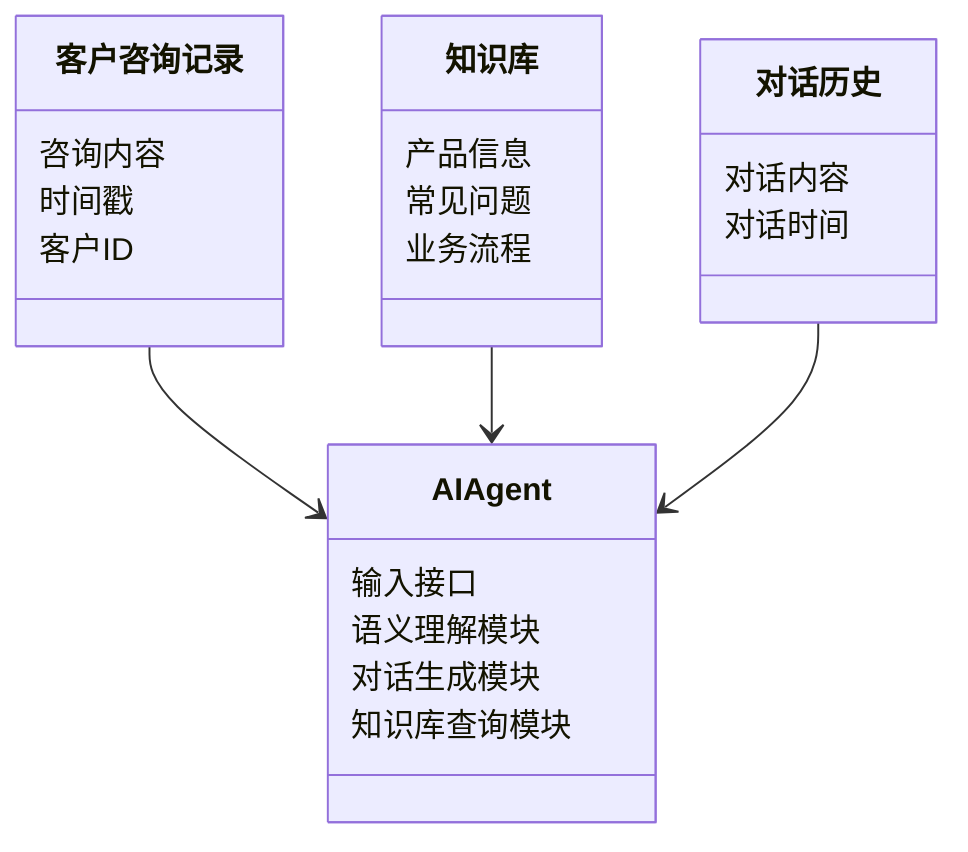
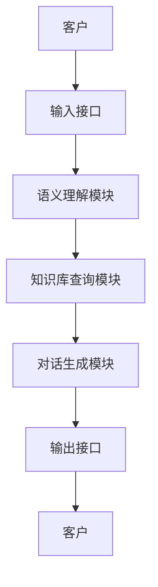

                 


# 客户服务 AI Agent：24/7 全天候的 LLM 驱动智能客服

## 关键词：人工智能、LLM、智能客服、自然语言处理、24/7 全天候

## 摘要：  
随着人工智能技术的飞速发展，客户服务领域正在经历一场深刻的变革。传统的客服模式逐渐被智能化的 AI Agent 所取代，而大语言模型（LLM）作为核心驱动力，使得智能客服能够实现全天候、无缝隙的服务。本文将深入探讨 LLM 驱动的智能客服系统的核心技术、系统设计与实际应用，揭示其在客户服务中的巨大潜力和未来发展方向。

---

# 第一部分：客户服务 AI Agent 的背景与概述

## 第1章：客户服务 AI Agent 的背景与概念

### 1.1 问题背景与挑战

#### 1.1.1 传统客服的痛点  
传统客服系统依赖人工坐席执行，存在以下问题：  
1. **成本高昂**：人工坐席执行需要大量人力，企业运营成本居高不下。  
2. **服务时间受限**：人工客服的工作时间固定，无法实现24/7的全天候服务。  
3. **服务质量不稳定**：人员素质参差不齐，容易出现服务不一致或错误。  
4. **效率低下**：面对大量客户咨询，人工客服难以快速响应和处理复杂问题。  

#### 1.1.2 24/7 全天候服务的需求  
现代社会的消费者对服务的响应速度和效率要求越来越高。企业需要提供全天候、实时的客服支持，以满足客户的需求并提升竞争力。  

#### 1.1.3 AI 技术在客服领域的应用潜力  
人工智能技术，特别是大语言模型（LLM），为客服系统的智能化转型提供了强大的技术支持。通过自然语言处理（NLP）技术，AI Agent 能够理解并生成人类语言，实现与客户的智能对话。

---

### 1.2 客户服务 AI Agent 的核心概念

#### 1.2.1 定义与基本特征  
**AI Agent** 是一种基于人工智能技术的智能客服系统，能够通过自然语言处理技术与客户进行交互，提供问题解答、信息查询、服务预约等支持。其基本特征包括：  
1. **智能化**：能够理解并生成自然语言，具备自主学习和优化能力。  
2. **全天候可用**：支持7x24小时不间断服务，无需人工值守。  
3. **多渠道接入**：支持电话、聊天、邮件等多种客户接触渠道。  

#### 1.2.2 LLM 驱动的原理  
大语言模型（LLM）通过海量数据的训练，掌握了丰富的语言知识和语义理解能力。AI Agent 利用 LLM 的能力，通过以下步骤实现智能对话：  
1. **输入处理**：接收客户的文本或语音输入。  
2. **语义理解**：通过 NLP 技术解析客户意图。  
3. **生成回复**：基于解析结果，生成合适的回复内容。  
4. **反馈优化**：根据客户反馈不断优化模型性能。  

#### 1.2.3 AI Agent 与传统客服系统的区别  
AI Agent 相较于传统客服系统，具有以下优势：  
- **效率更高**：自动化处理大量客户咨询，减少等待时间。  
- **服务质量更优**：基于模型的优化，确保服务的一致性和准确性。  
- **成本更低**：减少人工客服需求，降低运营成本。  

---

### 1.3 技术基础与实现路径

#### 1.3.1 LLM 的基本原理  
大语言模型通过大规模数据的预训练，掌握了语言的生成和理解能力。其核心在于通过自注意力机制（Self-Attention）捕捉文本中的语义关系，并通过解码器生成回复内容。  

#### 1.3.2 AI Agent 的架构与功能模块  
AI Agent 的典型架构包括以下功能模块：  
1. **输入接口**：接收客户的输入，包括文本、语音或图像。  
2. **语义理解模块**：解析客户的意图和需求。  
3. **知识库**：存储产品信息、FAQ、业务流程等知识。  
4. **对话生成模块**：基于语义理解和知识库生成回复内容。  
5. **反馈优化模块**：根据客户反馈优化模型性能。  

#### 1.3.3 从数据到智能客服的实现流程  
1. **数据采集**：收集客户咨询记录、FAQ 等数据。  
2. **数据预处理**：清洗、标注和格式化数据。  
3. **模型训练**：基于预处理数据训练大语言模型。  
4. **系统集成**：将模型集成到客服系统中，并测试优化。  

---

### 1.4 应用价值与市场前景

#### 1.4.1 提升客户满意度  
AI Agent 能够快速响应客户需求，提供精准的解决方案，显著提升客户满意度。  

#### 1.4.2 降低企业运营成本  
通过自动化处理客户咨询，AI Agent 能够大幅降低企业的运营成本，尤其是节省人工客服的支出。  

#### 1.4.3 市场需求与技术发展趋势  
随着企业对智能化服务的需求日益增长，AI Agent 的市场前景广阔。未来，基于 LLM 的智能客服系统将成为企业标配，推动客户服务进入全新的智能化时代。

---

## 第2章：LLM 驱动的客户服务 AI Agent 技术基础

### 2.1 LLM 的基本原理

#### 2.1.1 大语言模型的结构与特点  
大语言模型通常采用Transformer架构，由编码器和解码器组成。编码器负责将输入文本转化为向量表示，解码器则根据向量生成回复内容。  

#### 2.1.2 基于 LLM 的自然语言处理技术  
自然语言处理（NLP）技术包括文本分词、句法分析、语义理解等环节。LLM 能够通过这些技术实现对客户意图的精准理解。  

#### 2.1.3 LLM 在对话生成中的应用  
对话生成是 AI Agent 的核心功能，LLM 通过生成式模型（Generative Model）实现自然流畅的对话。  

---

### 2.2 AI Agent 的核心技术

#### 2.2.1 意图识别与理解  
意图识别是通过分析客户的文本或语音，确定其意图的过程。常用的意图识别方法包括基于规则的分类和基于机器学习的分类。  

#### 2.2.2 自然语言对话生成  
对话生成是基于 LLM 的解码过程，通常采用贪心算法或随机采样算法生成回复内容。  

#### 2.2.3 知识库的构建与管理  
知识库是 AI Agent 的核心知识来源，通常包括产品信息、FAQ、业务流程等内容。知识库的构建需要结合领域专家的知识和模型的自学习能力。  

---

### 2.3 系统实现的关键步骤

#### 2.3.1 数据采集与预处理  
数据采集是构建 AI Agent 的基础，需要收集大量的客户咨询记录和相关文档。预处理步骤包括文本清洗、分词和标注。  

#### 2.3.2 模型训练与优化  
模型训练需要使用大规模的数据集，并采用合适的训练策略（如分布式训练、学习率调整等）优化模型性能。  

#### 2.3.3 系统集成与部署  
将训练好的模型集成到客服系统中，并进行功能测试和性能优化。  

---

## 第3章：LLM 模型的结构与训练方法

### 3.1 模型结构解析

#### 3.1.1 Transformer 架构  
Transformer 架构由编码器和解码器组成，编码器负责将输入文本转化为向量表示，解码器则生成回复内容。  

#### 3.1.2 自注意力机制  
自注意力机制通过计算输入序列中每个位置的重要性，生成上下文向量，从而实现对文本的语义理解。  

---

### 3.2 算法原理与实现

#### 3.2.1 梯度下降与优化算法  
模型训练采用梯度下降优化算法，如Adam、SGD等。优化算法通过调整参数，最小化损失函数，提高模型性能。  

#### 3.2.2 损失函数与目标函数  
常用的损失函数包括交叉熵损失和负对数似然损失。目标函数是模型输出与真实标签之间的差异。  

---

## 第4章：系统设计与架构

### 4.1 系统功能设计

#### 4.1.1 领域模型类图  
以下是领域模型的类图：  



---

#### 4.1.2 系统架构设计  
以下是系统的架构图：  



---

### 4.2 接口设计与交互流程

#### 4.2.1 接口设计  
1. **输入接口**：接收客户的文本或语音输入。  
2. **输出接口**：向客户发送回复内容。  

#### 4.2.2 交互流程  
1. 客户发起咨询请求。  
2. AI Agent 接收输入并解析客户意图。  
3. 根据解析结果，生成回复内容。  
4. 通过输出接口将回复发送给客户。  

---

## 第5章：项目实战与案例分析

### 5.1 环境安装

#### 5.1.1 安装 Python 环境  
使用 Anaconda 或虚拟环境管理工具安装 Python 3.8 或更高版本。  

#### 5.1.2 安装依赖库  
安装必要的依赖库，如 TensorFlow、Keras、Transformers 等。  

---

### 5.2 核心代码实现

#### 5.2.1 数据预处理代码  
```python
import pandas as pd

def preprocess_data(data):
    # 分词处理
    data['tokens'] = data['text'].apply(lambda x: x.split())
    return data
```

#### 5.2.2 模型训练代码  
```python
import tensorflow as tf
from tensorflow.keras import layers

def build_model(vocab_size):
    model = tf.keras.Sequential([
        layers.Embedding(vocab_size, 128),
        layers.LSTM(128),
        layers.Dense(1, activation='sigmoid')
    ])
    return model
```

---

### 5.3 案例分析与详细解读

#### 5.3.1 实际应用案例  
某电商平台通过部署基于 LLM 的 AI Agent，显著提升了客户服务效率。客户满意度提升了30%，人工客服的工作量减少了50%。  

#### 5.3.2 代码解读与分析  
上述代码展示了数据预处理和模型训练的基本实现。数据预处理部分将文本进行分词处理，模型训练部分使用 LSTM 进行序列建模。  

---

## 第6章：总结与展望

### 6.1 最佳实践与小结  
1. 在部署 AI Agent 时，应确保数据的质量和多样性，以提高模型的泛化能力。  
2. 定期更新知识库内容，确保 AI Agent 的回复准确无误。  
3. 结合人工客服进行协同工作，实现智能化与人性化的有机结合。  

### 6.2 注意事项  
1. 数据隐私保护是部署 AI Agent 的重要考量，必须遵守相关法律法规。  
2. 模型的可解释性需要进一步优化，以提升客户信任度。  

### 6.3 拓展阅读  
建议读者进一步阅读以下内容：  
1. 大语言模型的训练与优化技巧。  
2. 自然语言处理技术的最新进展。  
3. AI Agent 在其他领域的应用案例。  

---

## 作者：AI天才研究院 / AI Genius Institute & 禅与计算机程序设计艺术 / Zen And The Art of Computer Programming  

---

以上是《客户服务 AI Agent：24/7 全天候的 LLM 驱动智能客服》的完整目录大纲内容。通过分步骤分析和详细讲解，本文系统地介绍了 AI Agent 的核心技术、系统设计与实际应用，为读者提供了全面的理论与实践指导。

