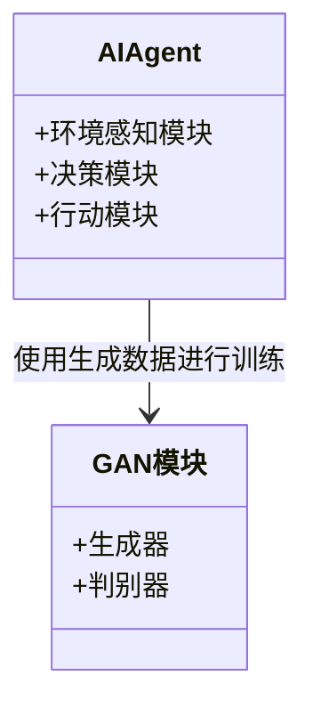
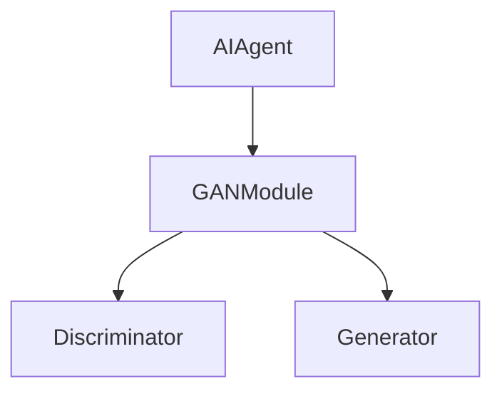
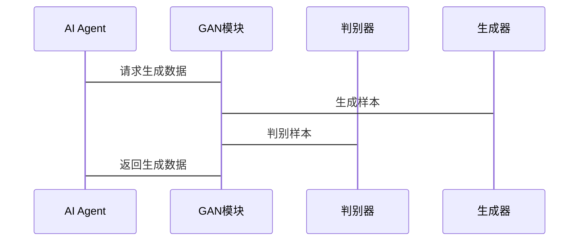

                 


# 对抗生成网络在AI Agent开发中的应用

## 关键词：对抗生成网络、AI Agent、生成模型、深度学习、强化学习、机器学习

## 摘要：  
本文深入探讨了对抗生成网络（GANs）在AI Agent开发中的应用，分析了GANs的核心原理及其如何通过生成对抗训练提升AI Agent的决策能力和行为多样性。通过具体案例和系统设计，展示了GANs在AI Agent数据生成、行为模仿和环境建模中的实际应用价值，为AI Agent的开发提供了新的思路和方法。

---

# 第1章: 对抗生成网络与AI Agent概述

## 1.1 对抗生成网络的基本概念

### 1.1.1 生成对抗网络的定义  
生成对抗网络（GANs）是一种生成模型，由Ian Goodfellow等人于2014年提出。GANs由两个神经网络构成：生成器（Generator）和判别器（Discriminator），通过对抗训练的方式生成高质量的数据样本。

### 1.1.2 对抗生成网络的核心要素  
- **生成器（Generator）**：负责生成与真实数据分布相似的样本。  
- **判别器（Discriminator）**：负责区分生成样本与真实样本。  
- **对抗训练（Adversarial Training）**：生成器和判别器通过零和博弈的方式优化目标函数。  

### 1.1.3 对抗生成网络与传统生成模型的对比  
| 特性 | GANs | 传统生成模型（如马尔可夫链） |  
|------|------|-----------------------------|  
| 数据依赖性 | 高 | 低                         |  
| 生成质量 | 高 | 中等                       |  
| 训练效率 | 中 | 高                         |  

---

## 1.2 AI Agent的基本概念

### 1.2.1 AI Agent的定义与分类  
AI Agent是一种能够感知环境、自主决策并执行任务的智能体。根据功能可分为：  
- **反应式Agent**：基于当前环境信息做出决策。  
- **认知式Agent**：具备推理、规划能力，能够处理复杂任务。  

### 1.2.2 AI Agent的核心功能与特点  
- **感知环境**：通过传感器获取环境信息。  
- **决策与推理**：基于感知信息做出决策。  
- **自主性**：能够在无外部干预的情况下运行。  

### 1.2.3 AI Agent在实际应用中的案例  
- **游戏AI**：如AlphaGo。  
- **推荐系统**：基于用户行为推荐内容。  
- **自动驾驶**：处理复杂交通场景的决策。  

---

## 1.3 对抗生成网络在AI Agent中的应用背景

### 1.3.1 对抗生成网络的优势  
- **生成多样数据**：GANs能够生成多样化且逼真的数据，为AI Agent提供丰富的训练样本。  
- **对抗训练提升性能**：通过与判别器的对抗训练，生成器能够生成更高质量的样本，从而提升AI Agent的决策能力。  

### 1.3.2 AI Agent开发中的挑战  
- **数据依赖性**：AI Agent的性能高度依赖训练数据的质量和多样性。  
- **复杂环境建模**：真实环境复杂多变，难以通过传统方法建模。  
- **实时决策能力**：需要在有限时间内做出最优决策。  

### 1.3.3 对抗生成网络如何解决AI Agent开发中的问题  
- **生成多样数据**：GANs可以通过生成对抗训练，生成大量多样化的数据，帮助AI Agent更好地适应复杂环境。  
- **提升决策能力**：通过生成模拟环境数据，GANs可以帮助AI Agent在虚拟环境中进行训练，提升其在真实环境中的决策能力。  

---

## 1.4 本章小结  
本章介绍了对抗生成网络和AI Agent的基本概念，分析了GANs在AI Agent开发中的应用背景及其优势。通过对比传统生成模型和AI Agent的特点，为后续章节的深入探讨奠定了基础。

---

# 第2章: 对抗生成网络的核心原理

## 2.1 对抗生成网络的基本架构

### 2.1.1 生成器与判别器的结构  
- **生成器**：通常采用深度神经网络结构，如卷积神经网络（CNN）或变分自编码器（VAE）。  
- **判别器**：通常采用深度神经网络结构，用于区分生成样本与真实样本。  

### 2.1.2 对抗训练的数学模型  
- **生成器的目标函数**：$ \min_G \mathbb{E}_{z \sim p_z(z)} [\text{log}D(G(z))] $  
- **判别器的目标函数**：$ \max_D \mathbb{E}_{x \sim p_data(x)} [\text{log}D(x)] + \mathbb{E}_{z \sim p_z(z)} [\text{log}(1 - D(G(z)))] $  

### 2.1.3 损失函数的定义与优化  
- **生成器的损失函数**：$ L_G = \mathbb{E}_{z \sim p_z(z)} [\text{log}(1 - D(G(z)))] $  
- **判别器的损失函数**：$ L_D = -\mathbb{E}_{x \sim p_data(x)} [\text{log}D(x)] - \mathbb{E}_{z \sim p_z(z)} [\text{log}(1 - D(G(z)))] $  
- **优化过程**：通过交替优化生成器和判别器的参数，逐步提升生成样本的质量。  

---

## 2.2 对抗生成网络的训练过程

### 2.2.1 生成器的训练策略  
- **目标函数优化**：通过梯度下降优化生成器的目标函数。  
- **生成样本评估**：定期评估生成样本的质量，调整训练策略。  

### 2.2.2 判别器的训练策略  
- **真实样本分类**：判别器在真实样本上的损失函数为$ \mathbb{E}_{x \sim p_data(x)} [\text{log}D(x)] $。  
- **生成样本分类**：判别器在生成样本上的损失函数为$ \mathbb{E}_{z \sim p_z(z)} [\text{log}(1 - D(G(z)))] $。  

### 2.2.3 对抗训练的平衡点  
- **生成器与判别器的平衡**：在对抗训练中，生成器和判别器需要达到平衡点，以生成高质量的样本。  

---

## 2.3 对抗生成网络的变体与改进

### 2.3.1 WGAN、WGAN-GP等变体的介绍  
- **WGAN**：通过使用Wasserstein距离作为损失函数，提升生成样本的质量。  
- **WGAN-GP**：引入梯度惩罚项，进一步稳定训练过程。  

### 2.3.2 提高生成质量的技术改进  
- **改进生成器结构**：采用更深的网络结构，提升生成样本的质量。  
- **优化判别器设计**：通过改进判别器的结构，提升其区分能力。  

### 2.3.3 多目标对抗生成网络的原理  
- **多目标生成**：通过多个生成器和判别器的组合，生成多样化的样本。  

---

## 2.4 本章小结  
本章详细介绍了对抗生成网络的核心原理，包括其基本架构、训练过程以及变体与改进方法。通过对抗训练的数学模型和实际应用案例，展示了GANs在生成高质量数据方面的优势。

---

# 第3章: 对抗生成网络在AI Agent中的核心应用

## 3.1 对抗生成网络在AI Agent中的应用场景

### 3.1.1 虚拟环境数据生成  
- **环境建模**：通过GANs生成虚拟环境数据，帮助AI Agent在虚拟环境中进行训练。  
- **数据增强**：通过生成多样化的数据，提升AI Agent的泛化能力。  

### 3.1.2 AI Agent行为模仿学习  
- **行为生成**：通过GANs生成模仿人类行为的样本，帮助AI Agent学习人类的决策模式。  
- **行为优化**：通过对抗训练，优化AI Agent的行为策略。  

### 3.1.3 对抗训练提升AI Agent决策能力  
- **对抗环境**：通过GANs生成对抗性环境，提升AI Agent的决策能力。  
- **多智能体协作**：通过GANs生成多个对抗性智能体，帮助AI Agent在复杂环境中进行协作。  

---

## 3.2 对抗生成网络在AI Agent中的实现流程

### 3.2.1 数据预处理与特征提取  
- **数据预处理**：对原始数据进行清洗、归一化等处理。  
- **特征提取**：通过深度学习模型提取数据的特征表示。  

### 3.2.2 生成器与判别器的联合训练  
- **生成器训练**：通过对抗训练生成多样化的样本。  
- **判别器训练**：通过判别器的反馈，优化生成器的生成策略。  

---

## 3.3 对抗生成网络在AI Agent中的系统设计

### 3.3.1 系统功能设计  
- **数据生成模块**：负责生成虚拟环境数据。  
- **行为模仿模块**：负责模仿人类行为。  
- **对抗训练模块**：负责生成对抗性环境，提升AI Agent的决策能力。  

### 3.3.2 系统架构设计  
- **生成器模块**：负责生成多样化的样本。  
- **判别器模块**：负责区分生成样本与真实样本。  
- **训练模块**：负责优化生成器和判别器的参数。  

---

## 3.4 本章小结  
本章探讨了对抗生成网络在AI Agent中的核心应用，包括其在虚拟环境数据生成、行为模仿学习以及对抗训练中的实际应用。通过对抗训练的系统设计，展示了GANs在提升AI Agent决策能力方面的巨大潜力。

---

# 第4章: 对抗生成网络的数学模型

## 4.1 对抗生成网络的损失函数

### 4.1.1 生成器的损失函数  
$$ L_G = \mathbb{E}_{z \sim p_z(z)} [\text{log}(1 - D(G(z)))] $$  

### 4.1.2 判别器的损失函数  
$$ L_D = -\mathbb{E}_{x \sim p_data(x)} [\text{log}D(x)] - \mathbb{E}_{z \sim p_z(z)} [\text{log}(1 - D(G(z)))] $$  

---

## 4.2 对抗生成网络的优化过程

### 4.2.1 生成器的优化  
通过梯度下降优化生成器的损失函数：  
$$ G \leftarrow G - \eta \frac{\partial L_G}{\partial G} $$  

### 4.2.2 判别器的优化  
通过梯度上升优化判别器的损失函数：  
$$ D \leftarrow D + \eta \frac{\partial L_D}{\partial D} $$  

---

## 4.3 对抗生成网络的改进与变体

### 4.3.1 WGAN的损失函数  
$$ L_{WGAN} = \mathbb{E}_{x \sim p_data(x)} [D(x)] - \mathbb{E}_{z \sim p_z(z)} [D(G(z))] $$  

### 4.3.2 WGAN-GP的损失函数  
$$ L_{WGAN-GP} = \mathbb{E}_{x \sim p_data(x)} [D(x)] - \mathbb{E}_{z \sim p_z(z)} [D(G(z))] + \lambda \mathbb{E}_{z \sim p_z(z)} [\|\nabla_z D(G(z))\|^2] $$  

---

## 4.4 本章小结  
本章详细探讨了对抗生成网络的数学模型，包括生成器和判别器的损失函数、优化过程以及改进变体的损失函数。通过对抗训练的数学推导，展示了GANs在生成高质量数据方面的核心原理。

---

# 第5章: 对抗生成网络在AI Agent中的系统分析与架构设计

## 5.1 系统分析

### 5.1.1 问题场景介绍  
- **需求分析**：AI Agent需要在复杂环境中进行决策，需要大量高质量的数据进行训练。  
- **挑战分析**：真实环境数据获取困难，且数据多样性不足。  

### 5.1.2 项目介绍  
本项目旨在通过对抗生成网络生成多样化的环境数据，帮助AI Agent在虚拟环境中进行训练，提升其在真实环境中的决策能力。  

---

## 5.2 系统功能设计

### 5.2.1 领域模型设计  


---

## 5.3 系统架构设计



---

## 5.4 系统接口设计

### 5.4.1 系统接口描述  
- **生成器接口**：生成虚拟环境数据。  
- **判别器接口**：区分生成样本与真实样本。  
- **训练接口**：优化生成器和判别器的参数。  

### 5.4.2 系统交互流程  


---

## 5.5 本章小结  
本章通过系统分析与架构设计，展示了对抗生成网络在AI Agent中的具体应用。通过对GAN模块、判别器和生成器的系统设计，为AI Agent的开发提供了新的思路和方法。

---

# 第6章: 项目实战

## 6.1 环境安装

### 6.1.1 安装Python与相关库  
```bash
pip install numpy matplotlib keras tensorflow
```

## 6.2 系统核心实现

### 6.2.1 生成器实现  
```python
import keras
from keras.layers import Dense, Input, Layer
from keras.models import Model

class Generator(Layer):
    def __init__(self, input_dim, output_dim):
        super(Generator, self).__init__()
        self.input_dim = input_dim
        self.output_dim = output_dim
        self_dense = Dense(output_dim, activation='sigmoid')

    def call(self, inputs):
        x = self_dense(inputs)
        return x

generator = Generator(input_dim=100, output_dim=28*28)
```

### 6.2.2 判别器实现  
```python
class Discriminator(Layer):
    def __init__(self, input_dim):
        super(Discriminator, self).__init__()
        self.input_dim = input_dim
        self.Dense1 = Dense(128, activation='leakyrelu')
        self.Dense2 = Dense(1, activation='sigmoid')

    def call(self, inputs):
        x = self.Dense1(inputs)
        x = self.Dense2(x)
        return x

discriminator = Discriminator(input_dim=28*28)
```

### 6.2.3 训练实现  
```python
from keras import losses
from keras.optimizers import Adam

generator.compile(loss='binary_crossentropy', optimizer=Adam(learning_rate=0.0002))
discriminator.compile(loss='binary_crossentropy', optimizer=Adam(learning_rate=0.0002))

# 训练循环
for epoch in range(100):
    # 生成假数据
    noise = np.random.randn(64, 100)
    generated_images = generator.predict(noise)

    # 训练判别器
    real_images = # 加载真实数据
    d_loss_real = discriminator.train_on_batch(real_images, np.ones((64, 1)))
    d_loss_fake = discriminator.train_on_batch(generated_images, np.zeros((64, 1)))

    # 训练生成器
    noise = np.random.randn(64, 100)
    g_loss = generator.train_on_batch(noise, np.ones((64, 1)))
```

## 6.3 项目小结  
本章通过具体的项目实战，展示了对抗生成网络在AI Agent开发中的实现过程。通过生成器和判别器的联合训练，生成了高质量的虚拟环境数据，为AI Agent的训练提供了丰富的数据资源。

---

# 第7章: 最佳实践

## 7.1 小结  
通过对抗生成网络，AI Agent的开发能够生成多样化的数据，提升其在复杂环境中的决策能力。  

## 7.2 注意事项  
- **数据质量问题**：生成数据的质量直接影响AI Agent的性能。  
- **模型收敛问题**：对抗训练可能面临生成器和判别器难以同时收敛的问题。  
- **计算资源需求**：对抗训练需要大量的计算资源，建议使用GPU加速。  

## 7.3 拓展阅读  
- 《生成对抗网络（GANs）：深入理解与实践》  
- 《深度学习与强化学习结合的AI Agent开发》  
- 《对抗训练在多智能体系统中的应用》  

---

# 作者：AI天才研究院 & 禅与计算机程序设计艺术

