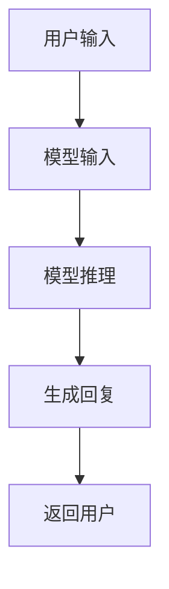
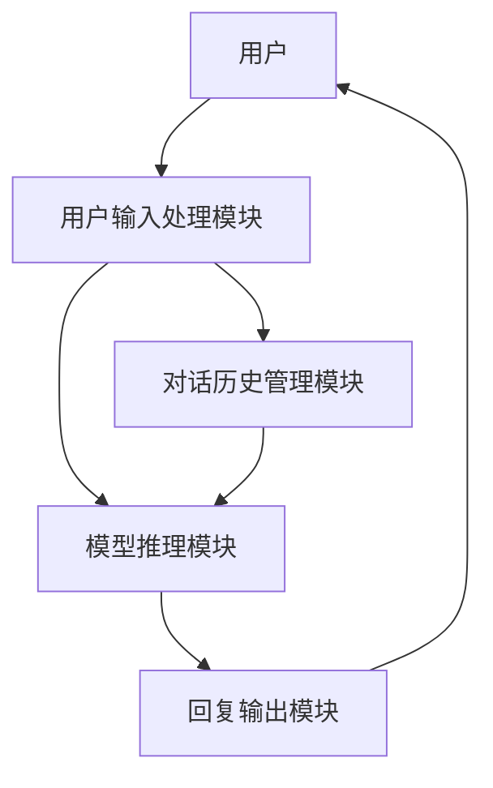
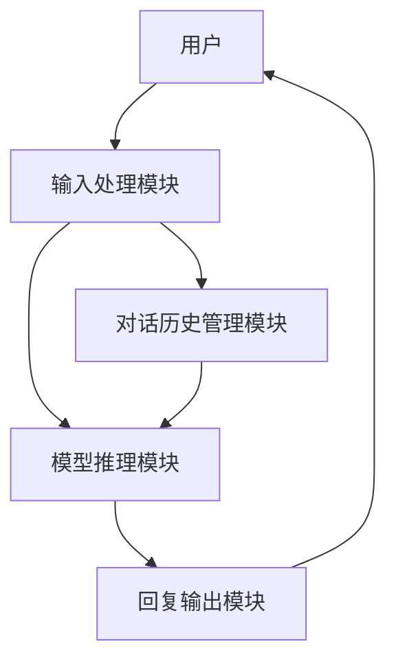

                 


# 对话式AI Agent：提升LLM的自然语言交互能力

## 关键词：对话式AI Agent，LLM，自然语言交互，大语言模型，AI助手

## 摘要：  
本文深入探讨了对话式AI Agent在提升大语言模型（LLM）自然语言交互能力方面的关键技术和实践。从背景介绍到核心概念，从算法原理到系统架构，从项目实战到最佳实践，全面解析了如何优化LLM的对话能力，使其更自然、更高效地与用户交互。文章结合理论与实践，通过详细的代码示例和系统设计，为读者提供了一套系统化的提升方案。

---

## 第一部分：对话式AI Agent的背景与核心概念

### 第1章：对话式AI Agent的背景与现状

#### 1.1 对话式AI Agent的定义与特点
##### 1.1.1 对话式AI Agent的定义
对话式AI Agent是一种基于大语言模型（LLM）的智能对话系统，能够通过自然语言处理技术与用户进行交互，理解用户的意图并生成符合上下文的回复。它不同于传统的基于规则的对话系统，而是依赖于模型的深度学习能力来实现更复杂的对话逻辑。

##### 1.1.2 对话式AI Agent的核心特点
- **上下文理解**：能够理解对话历史，保持对话的连贯性。
- **动态推理**：根据用户的输入实时推理意图，生成动态回复。
- **多轮对话**：支持长文本交互，能够处理复杂场景下的对话任务。
- **个性化交互**：能够根据用户身份、偏好等因素调整回复风格。

##### 1.1.3 对话式AI Agent与传统对话系统的区别
| 特性                | 对话式AI Agent                     | 传统对话系统                     |
|---------------------|------------------------------------|----------------------------------|
| 基础技术            | 基于LLM的深度学习                 | 基于规则或关键词匹配             |
| 对话复杂度          | 支持复杂对话，可处理歧义性问题     | 仅支持简单对话，无法处理复杂场景 |
| 自适应能力          | 高，能够根据上下文调整回复         | 低，依赖预设规则和关键词           |
| 应用场景            | 广泛应用于客服、教育、医疗等领域   | 适用于特定简单场景               |

#### 1.2 对话式AI Agent的技术背景
##### 1.2.1 大语言模型（LLM）的发展历程
- **早期阶段**：基于统计机器学习的模型，如*n-gram*和HMM。
- **深度学习时代**：基于RNN和LSTM的模型，如Siri和Cortana。
- **Transformer时代**：基于Transformer架构的模型，如BERT、GPT系列。
- **多模态发展**：结合视觉、听觉等多模态信息的模型，如CHATPGT等。

##### 1.2.2 对话式AI Agent的兴起与应用
- **技术驱动**：深度学习和大语言模型的进步推动了对话式AI Agent的发展。
- **应用场景**：广泛应用于智能客服、教育辅助、医疗咨询等领域。

#### 1.3 对话式AI Agent的应用价值
##### 1.3.1 提升用户体验的核心作用
- 提供更自然、更流畅的对话体验。
- 支持复杂场景下的对话任务，减少用户操作步骤。

##### 1.3.2 企业级应用中的价值
- **成本降低**：通过自动化对话减少人工客服需求。
- **效率提升**：快速响应用户需求，提高服务效率。
- **个性化服务**：根据用户需求提供定制化服务。

##### 1.3.3 对话式AI Agent的未来发展趋势
- **多模态交互**：结合视觉、听觉等多模态信息，提供更丰富的交互体验。
- **实时推理**：进一步提升模型的实时推理能力，支持更复杂的对话逻辑。
- **个性化优化**：根据用户行为和偏好动态调整对话策略。

#### 1.4 对话式AI Agent的挑战与机遇
##### 1.4.1 技术挑战
- **模型计算成本**：大语言模型的计算资源需求高。
- **对话连贯性**：如何保持多轮对话的连贯性和一致性。
- **上下文管理**：如何高效管理对话历史和上下文信息。

##### 1.4.2 应用中的伦理与安全问题
- **隐私泄露风险**：用户数据的安全性问题。
- **伦理问题**：如何避免生成不适当或有害的内容。
- **文化差异**：不同文化背景下的对话习惯差异。

##### 1.4.3 未来的发展方向
- **人机协作**：探索人机协作的新模式，提升人机交互的效率和体验。
- **实时反馈机制**：建立实时反馈机制，优化对话策略。
- **多模态交互**：结合视觉、听觉等多模态信息，提升交互体验。

#### 1.5 本章小结
本章从对话式AI Agent的定义、特点、技术背景、应用价值和挑战等方面进行了全面介绍，为后续章节的深入分析奠定了基础。

---

### 第2章：对话式AI Agent的核心概念与联系

#### 2.1 对话式AI Agent的核心概念
##### 2.1.1 对话式AI Agent的输入输出机制
- **输入**：用户通过自然语言输入问题或指令。
- **输出**：模型根据输入生成自然语言回复。

##### 2.1.2 对话式AI Agent的上下文处理
- **上下文理解**：模型需要理解对话历史，保持对话的连贯性。
- **上下文管理**：模型需要管理对话上下文，确保回复的相关性。

##### 2.1.3 对话式AI Agent的对话状态管理
- **对话状态**：包括用户意图、对话历史、上下文信息等。
- **状态更新**：根据用户的输入实时更新对话状态。

#### 2.2 对话式AI Agent的核心概念对比
##### 2.2.1 对话式AI Agent与传统对话系统的对比
| 特性                | 对话式AI Agent                     | 传统对话系统                     |
|---------------------|------------------------------------|----------------------------------|
| 基础技术            | 基于LLM的深度学习                 | 基于规则或关键词匹配             |
| 对话复杂度          | 支持复杂对话，可处理歧义性问题     | 仅支持简单对话，无法处理复杂场景 |
| 自适应能力          | 高，能够根据上下文调整回复         | 低，依赖预设规则和关键词           |
| 应用场景            | 广泛应用于客服、教育、医疗等领域   | 适用于特定简单场景               |

##### 2.2.2 对话式AI Agent与任务型对话系统的对比
- **任务型对话系统**：专注于完成特定任务，如预约、查询等。
- **对话式AI Agent**：更注重与用户的自然对话，支持多种任务类型。

##### 2.2.3 对话式AI Agent与其他AI助手的对比
| 特性                | 对话式AI Agent                     | 其他AI助手                       |
|---------------------|------------------------------------|----------------------------------|
| 核心能力            | 强大的自然语言理解和生成能力       | 专注于特定任务或功能             |
| 对话能力            | 支持复杂对话，提供个性化服务       | 功能有限，专注于特定任务         |

#### 2.3 对话式AI Agent的实体关系图

```mermaid
graph TD
A[User] --> B[对话式AI Agent]
B --> C[大语言模型（LLM）]
B --> D[对话历史]
B --> E[上下文信息]
C --> F[模型输出]
D --> F
E --> F
```


#### 2.4 本章小结
本章从对话式AI Agent的核心概念出发，通过对比和实体关系图，深入解析了其与传统对话系统和其他AI助手的区别，为后续章节的分析提供了理论基础。

---

## 第二部分：对话式AI Agent的算法原理

### 第3章：对话式AI Agent的算法原理

#### 3.1 对话式AI Agent的模型训练
##### 3.1.1 大语言模型（LLM）的训练目标
- **目标**：最大化模型对训练数据的似然，即让模型在给定前文的情况下，预测下一个词的概率最大化。

##### 3.1.2 对话式AI Agent的损失函数
$$ \text{损失函数} = -\sum_{i=1}^{n} \log P(w_i | w_{<i}) $$
其中，$w_i$ 表示第 $i$ 个词，$P(w_i | w_{<i})$ 表示在前文 $w_{<i}$ 下生成词 $w_i$ 的概率。

##### 3.1.3 对话式AI Agent的优化方法
- **优化目标**：最小化损失函数，优化模型参数。
- **优化算法**：常用Adam优化器，学习率调整策略如学习率衰减。

#### 3.2 对话式AI Agent的对话生成
##### 3.2.1 对话生成的策略
- **基于概率的生成**：根据模型生成的概率分布，选择概率最高的词生成回复。
- **基于强化学习的生成**：通过强化学习优化生成策略，提升生成回复的质量。

##### 3.2.2 对话生成的数学模型
$$ P(y|x) = \prod_{i=1}^{n} P(y_i | y_{<i}, x) $$
其中，$y$ 表示生成的对话内容，$x$ 表示输入，$y_{<i}$ 表示生成的前 $i-1$ 个词。

##### 3.2.3 对话生成的流程
1. **输入处理**：将用户输入的自然语言转换为模型的输入形式。
2. **模型推理**：模型根据输入生成回复的概率分布。
3. **生成策略**：根据概率分布选择生成的词，生成完整的回复。

#### 3.3 对话式AI Agent的算法实现
##### 3.3.1 算法流程图


##### 3.3.2 代码实现
```python
import torch
import torch.nn as nn
import torch.optim as optim

# 定义模型
class DialogAgent(nn.Module):
    def __init__(self, vocab_size):
        super(DialogAgent, self).__init__()
        self.embedding = nn.Embedding(vocab_size, 512)
        self.lstm = nn.LSTM(512, 512, batch_first=True)
        self.fc = nn.Linear(512, vocab_size)
    
    def forward(self, input_seq, hidden=None):
        embedded = self.embedding(input_seq)
        lstm_out, hidden = self.lstm(embedded, hidden)
        output = self.fc(lstm_out[:, -1])
        return output, hidden

# 模型训练
def train_model(model, optimizer, criterion, device, train_loader, epochs=10):
    for epoch in range(epochs):
        for inputs, labels in train_loader:
            inputs = inputs.to(device)
            labels = labels.to(device)
            outputs, _ = model(inputs)
            loss = criterion(outputs, labels)
            optimizer.zero_grad()
            loss.backward()
            optimizer.step()
        print(f'Epoch {epoch+1}, Loss: {loss.item()}')

# 模型推理
def generate_response(model, tokenizer, device, input_text):
    input_ids = tokenizer.encode(input_text, return_tensors='pt').to(device)
    with torch.no_grad():
        outputs, _ = model(input_ids)
    predicted_index = torch.argmax(outputs, dim=1).item()
    response = tokenizer.decode([predicted_index])
    return response
```

#### 3.4 本章小结
本章详细解析了对话式AI Agent的算法原理，包括模型训练、对话生成策略和代码实现，为后续章节的系统设计和项目实战提供了理论支持。

---

## 第三部分：对话式AI Agent的系统分析与架构设计

### 第4章：对话式AI Agent的系统分析与架构设计

#### 4.1 对话式AI Agent的系统架构
##### 4.1.1 系统功能模块设计
| 模块                | 功能描述                         |
|---------------------|--------------------------------|
| 用户输入处理模块    | 处理用户的自然语言输入           |
| 对话历史管理模块    | 管理对话过程中的上下文信息       |
| 模型推理模块        | 基于大语言模型生成回复           |
| 回复输出模块        | 将生成的回复返回给用户           |

##### 4.1.2 系统架构图


#### 4.2 对话式AI Agent的系统架构
##### 4.2.1 系统功能设计
- **用户输入处理**：将用户的自然语言输入转换为模型可处理的格式。
- **对话历史管理**：记录和管理对话过程中的上下文信息。
- **模型推理**：基于大语言模型生成回复。
- **回复输出**：将生成的回复返回给用户。

##### 4.2.2 系统接口设计
- **输入接口**：接收用户的自然语言输入。
- **输出接口**：返回生成的回复。

##### 4.2.3 系统交互流程图


#### 4.3 本章小结
本章从系统架构的角度，详细解析了对话式AI Agent的系统设计，包括功能模块设计、系统架构图和交互流程图，为后续章节的项目实战提供了系统设计支持。

---

## 第四部分：对话式AI Agent的项目实战

### 第5章：对话式AI Agent的项目实战

#### 5.1 环境安装与配置
##### 5.1.1 安装依赖
```bash
pip install torch transformers
```

##### 5.1.2 配置环境
- 安装PyTorch和Transformers库。
- 配置GPU支持（如果需要）。

#### 5.2 对话式AI Agent的核心实现
##### 5.2.1 数据准备
- **训练数据**：准备对话数据对。
- **测试数据**：准备测试用例。

##### 5.2.2 模型训练
```python
from transformers import AutoTokenizer, AutoModelForCausalLM
import torch

# 初始化模型和tokenizer
model_name = "gpt2"
tokenizer = AutoTokenizer.from_pretrained(model_name)
model = AutoModelForCausalLM.from_pretrained(model_name)

# 定义训练函数
def train():
    optimizer = optim.Adam(model.parameters(), lr=0.001)
    criterion = nn.CrossEntropyLoss()
    for epoch in range(num_epochs):
        for batch in train_loader:
            inputs, labels = batch
            inputs = inputs.to(device)
            labels = labels.to(device)
            outputs = model(inputs)
            loss = criterion(outputs.logits, labels)
            optimizer.zero_grad()
            loss.backward()
            optimizer.step()
        print(f'Epoch {epoch}, Loss: {loss.item()}')

# 启动训练
train()
```

##### 5.2.3 接口开发
- **API设计**：定义RESTful API接口。
- **接口实现**：使用Flask框架实现接口。

##### 5.2.4 交互测试
- **测试用例**：设计多个测试用例，验证系统的正确性。
- **测试结果**：记录测试结果，分析系统的性能和准确性。

#### 5.3 项目实战小结
本章通过具体的项目实战，详细展示了对话式AI Agent的环境配置、核心实现、接口开发和交互测试，帮助读者更好地理解和应用对话式AI Agent的技术。

---

## 第五部分：总结与展望

### 第6章：总结与展望

#### 6.1 最佳实践
##### 6.1.1 对话式AI Agent的优化技巧
- **上下文管理**：合理管理对话历史，避免信息过载。
- **模型选择**：根据具体需求选择合适的模型和参数。
- **实时反馈**：建立实时反馈机制，优化对话策略。

##### 6.1.2 对话式AI Agent的部署建议
- **本地部署**：适合小规模应用。
- **云服务部署**：适合大规模应用，利用云计算资源弹性扩展。

#### 6.2 对话式AI Agent的未来展望
##### 6.2.1 技术进步
- **多模态交互**：结合视觉、听觉等多模态信息，提升交互体验。
- **实时推理**：进一步提升模型的实时推理能力，支持更复杂的对话逻辑。
- **个性化优化**：根据用户行为和偏好动态调整对话策略。

##### 6.2.2 应用场景扩展
- **教育领域**：开发智能教育助手，提供个性化的学习指导。
- **医疗领域**：开发智能医疗助手，提供专业的医疗咨询。
- **企业服务**：开发智能客服系统，提供高效的客户支持。

#### 6.3 本章小结
本章总结了对话式AI Agent的优化技巧和部署建议，并展望了其未来的技术进步和应用场景。

---

## 作者：AI天才研究院/AI Genius Institute & 禅与计算机程序设计艺术/Zen And The Art of Computer Programming

---

以上就是《对话式AI Agent：提升LLM的自然语言交互能力》的完整目录和文章内容。

