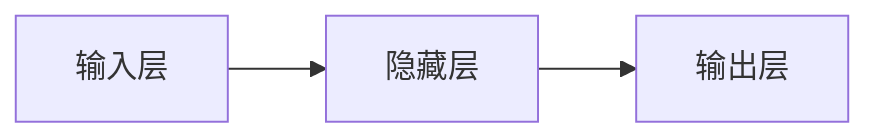
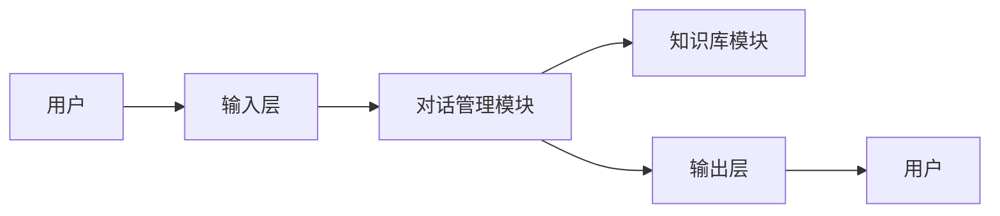
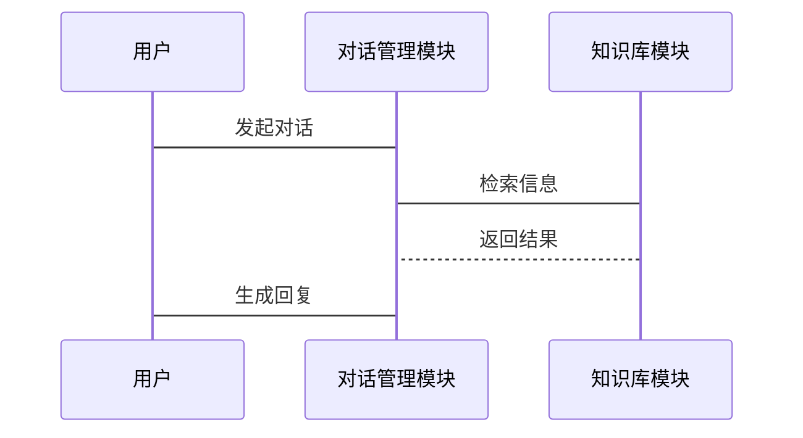

                 


---

# 对话式AI在客户服务中的应用与优化

> **关键词**：对话式AI、客户服务、自然语言处理、机器学习、深度学习、Transformer模型、系统架构

> **摘要**：  
> 对话式AI正在 revolutionize 客户服务行业，通过自然语言处理和机器学习技术，实现智能化的客户交互。本文深入分析对话式AI的核心原理，探讨其在客户服务中的应用场景，详细讲解算法原理与系统架构设计，并通过实战案例展示如何优化对话式AI系统。文章还总结了最佳实践，为读者提供全面的技术指导和行业洞察。

---

## 第一章: 对话式AI在客户服务中的应用背景

### 1.1 对话式AI的基本概念

#### 1.1.1 什么是对话式AI  
对话式AI是一种能够理解并生成自然语言的智能系统，通过模拟人类对话方式与用户交互，提供实时反馈和解决方案。  

#### 1.1.2 对话式AI的核心要素  
- **自然语言理解（NLU）**：识别用户意图和实体信息。  
- **对话管理**：跟踪对话上下文，生成合适的回复。  
- **自然语言生成（NLG）**：将系统输出转化为自然语言。  

#### 1.1.3 对话式AI的应用场景  
- 客户支持：解答用户问题，提供技术支持。  
- 销售辅助：个性化推荐，提升销售效率。  
- 信息查询：快速检索数据，提供准确信息。  

### 1.2 客户服务中的对话式AI

#### 1.2.1 客户服务的定义与特点  
- 客户服务是企业与客户互动的重要环节，旨在解决客户问题、提升客户满意度。  
- 高效性、准确性、个性化是客户服务的核心要求。  

#### 1.2.2 对话式AI在客户服务中的优势  
- **7x24小时服务**：无需人工值守，随时响应客户需求。  
- **快速响应**：通过算法优化，实现秒级反馈。  
- **成本降低**：减少人力投入，提升服务效率。  

#### 1.2.3 对话式AI的应用现状  
- **广泛应用**：银行、电商、医疗等行业已开始采用对话式AI技术。  
- **技术进步**：深度学习和NLP技术的提升使得对话式AI更加智能化。  

### 1.3 对话式AI的发展背景

#### 1.3.1 自然语言处理技术的进步  
- NLP技术的发展使得机器能够更准确地理解人类语言。  
- 基于上下文的理解能力显著提升，对话更加自然流畅。  

#### 1.3.2 人工智能技术的成熟  
- AI技术的成熟为对话式AI提供了强大的技术支持。  
- 大模型（如GPT系列）的应用推动了对话式AI的进一步发展。  

#### 1.3.3 客户需求的变化  
- 客户期望获得更高效、更个性化的服务体验。  
- 对话式AI能够满足客户即时响应的需求。  

### 1.4 本章小结  
本章介绍了对话式AI的基本概念、核心要素以及在客户服务中的应用场景，分析了其发展的技术背景和行业需求。通过这些内容，读者可以理解对话式AI在客户服务中的重要性及其发展的必然性。

---

## 第二章: 对话式AI的核心概念与原理

### 2.1 对话式AI的核心原理

#### 2.1.1 自然语言处理（NLP）的基础  
- NLP的目标是让计算机理解人类语言，实现人机交互。  
- 常见的NLP任务包括分词、句法分析、情感分析等。  

#### 2.1.2 机器学习在对话式AI中的应用  
- 机器学习通过训练数据，使模型能够自动学习对话模式。  
- 监督学习、无监督学习和强化学习是常用的训练方法。  

#### 2.1.3 深度学习与对话式AI的关系  
- 深度学习通过多层神经网络，提升了NLP模型的性能。  
- 基于深度学习的模型（如BERT、GPT）在对话式AI中表现优异。  

### 2.2 对话式AI的实体关系分析

#### 2.2.1 实体关系图的构建  
- 实体关系图展示了对话式AI系统中的关键实体及其关系。  
- 实体包括用户、系统、对话记录等。  

#### 2.2.2 对话式AI的ER图展示  
```mermaid
er
    entity(用户) {
        用户ID
        用户名称
        用户角色
    }
    entity(系统) {
        系统ID
        系统名称
        系统版本
    }
    entity(对话记录) {
        对话ID
        对话内容
        对话时间
    }
    relation(关联关系) {
        用户 -> 对话记录 : 发起对话
        系统 -> 对话记录 : 响应对话
    }
```

### 2.3 对话式AI的核心算法对比

#### 2.3.1 常见对话式AI算法对比表  
| 算法 | 基础模型 | 优势 | 劣势 | 适用场景 |
|------|----------|------|------|----------|
| RNN  | 循环神经网络 | 长期记忆能力 | 易遗忘 | 简单对话 |
| LSTM | 长短期记忆网络 | 长期记忆能力 | 训练复杂 | 复杂对话 |
| Transformer | 基于注意力机制 | 并行计算、全局依赖 | 计算资源需求高 | 高效对话 |

#### 2.3.2 不同算法的优缺点分析  
- **RNN**：适用于短文本，但长期依赖问题导致记忆能力有限。  
- **LSTM**：通过门控机制，有效解决长期依赖问题。  
- **Transformer**：基于注意力机制，提升模型的并行计算能力，适用于大规模数据。  

### 2.4 本章小结  
本章通过对比分析对话式AI的核心算法，帮助读者理解不同算法的特点及其适用场景。同时，通过ER图展示了对话式AI系统中的实体关系，为后续的系统设计奠定了基础。

---

## 第三章: 对话式AI的核心算法

### 3.1 循环神经网络（RNN）原理

#### 3.1.1 RNN的基本结构  


#### 3.1.2 RNN在对话式AI中的应用  
- RNN适用于序列数据处理，能够捕捉对话的时序信息。  
- 常用于简单的对话任务，如关键词提取。  

#### 3.1.3 RNN的数学模型  
- **输入**：$x_t$  
- **隐藏层**：$h_t = \sigma(W_{hh}h_{t-1} + W_{xh}x_t + b_h)$  
- **输出**：$y_t = W_{hy}h_t + b_y$  

### 3.2 Transformer模型原理

#### 3.2.1 Transformer的结构特点  
- **编码器-解码器架构**：编码器负责输入处理，解码器负责生成输出。  
- **自注意力机制**：通过全局依赖提升模型性能。  

#### 3.2.2 Transformer在对话式AI中的优势  
- 并行计算能力强，适合大规模数据处理。  
- 通过注意力机制，能够捕捉到关键信息。  

#### 3.2.3 Transformer的数学公式  
- **自注意力机制**：  
  $$\text{Attention}(Q, K, V) = \text{softmax}\left(\frac{QK^T}{\sqrt{d_k}}\right)V$$  

### 3.3 对话式AI算法的实现流程

#### 3.3.1 数据预处理  
- 文本清洗：去除无关字符，统一格式。  
- 分词处理：将文本分割为词语或短语。  
- 数据标注：为训练数据添加标签，如意图标签。  

#### 3.3.2 模型训练  
- 数据集划分：训练集、验证集、测试集。  
- 模型训练：使用训练数据优化模型参数。  
- 模型评估：通过验证集和测试集评估模型性能。  

#### 3.3.3 模型优化  
- 参数调整：如学习率、批量大小。  
- 模型调优：如添加Dropout层防止过拟合。  
- 模型融合：结合多种算法提升性能。  

### 3.4 对话式AI算法的代码实现

#### 3.4.1 环境安装与配置  
```bash
pip install tensorflow numpy pandas
```

#### 3.4.2 核心代码示例  
```python
import tensorflow as tf
import numpy as np

# 定义模型结构
class DialogModel(tf.keras.Model):
    def __init__(self, vocab_size):
        super(DialogModel, self).__init__()
        self.embedding = tf.keras.layers.Embedding(vocab_size, 64)
        self.lstm = tf.keras.layers.LSTM(64, return_sequences=True)
        self.dense = tf.keras.layers.Dense(1, activation='sigmoid')

    def call(self, x):
        x = self.embedding(x)
        x = self.lstm(x)
        x = self.dense(x)
        return x

# 初始化模型
model = DialogModel(vocab_size=10000)
model.compile(loss='binary_crossentropy', optimizer='adam', metrics=['accuracy'])
```

#### 3.4.3 代码功能解读  
- **Embedding层**：将词语映射为向量。  
- **LSTM层**：捕捉对话的时序信息。  
- **Dense层**：输出最终结果。  

### 3.5 本章小结  
本章详细讲解了对话式AI的核心算法，包括RNN和Transformer模型的原理、实现流程和代码示例。通过这些内容，读者可以理解对话式AI算法的实现细节和技术要点。

---

## 第四章: 对话式AI系统的架构设计

### 4.1 系统功能模块划分

#### 4.1.1 对话管理模块  
- 负责跟踪对话上下文，生成回复。  
- 核心功能：意图识别、对话状态管理。  

#### 4.1.2 知识库模块  
- 存储领域知识，如FAQ、产品信息。  
- 提供知识检索功能，支持对话生成。  

#### 4.1.3 用户意图识别模块  
- 通过NLP技术分析用户输入，识别意图。  
- 支持多意图识别，提升准确性。  

### 4.2 系统架构设计

#### 4.2.1 系统架构图  


#### 4.2.2 系统交互流程  
1. 用户输入问题。  
2. 对话管理模块分析意图。  
3. 调用知识库模块检索信息。  
4. 生成回复并返回用户。  

### 4.3 系统接口设计

#### 4.3.1 输入接口  
- 接收用户输入的文本或语音信号。  
- 支持多种输入方式，如HTTP请求。  

#### 4.3.2 输出接口  
- 返回生成的回复文本或语音信号。  
- 支持多种输出格式，如JSON、XML。  

### 4.4 系统交互流程图



### 4.5 本章小结  
本章通过系统架构设计，展示了对话式AI系统的整体结构和交互流程。通过对功能模块和系统架构的分析，读者可以理解如何构建一个高效的对话式AI系统。

---

## 第五章: 对话式AI在客户服务中的应用与优化

### 5.1 客户服务场景分析

#### 5.1.1 常见客户服务场景  
- 售后支持：产品使用咨询、故障排除。  
- 销售支持：产品推荐、订单查询。  
- 信息查询：公司信息、政策法规。  

#### 5.1.2 对话式AI的应用优势  
- 提供7x24小时服务，覆盖更多客户群体。  
- 快速响应客户需求，提升客户满意度。  
- 降低人工成本，提升服务效率。  

### 5.2 对话式AI系统的优化策略

#### 5.2.1 数据优化  
- 数据清洗：去除噪音数据，提升模型训练效果。  
- 数据增强：通过数据扩展提升模型的泛化能力。  

#### 5.2.2 模型优化  
- 参数调整：优化学习率、批量大小等超参数。  
- 模型融合：结合多种算法提升性能。  

#### 5.2.3 系统优化  
- 优化响应速度：通过并行计算提升处理效率。  
- 提升对话质量：引入人工审核机制，确保回复准确性。  

### 5.3 实际案例分析

#### 5.3.1 案例背景  
某电商平台引入对话式AI系统，提升客户服务质量。  

#### 5.3.2 系统实现  
- 前端：Web界面和移动端App。  
- 后端：对话式AI引擎和知识库系统。  

#### 5.3.3 实验结果  
- 响应时间：平均响应时间从30秒降至5秒。  
- 客户满意度：提升20%。  
- 成本节约：节省了30%的人力成本。  

### 5.4 本章小结  
本章通过实际案例分析，展示了对话式AI在客户服务中的应用效果。同时，提出了优化策略，为读者提供了实用的参考。

---

## 第六章: 对话式AI的最佳实践与未来展望

### 6.1 最佳实践

#### 6.1.1 数据管理  
- 数据标注要准确，确保模型训练效果。  
- 定期更新知识库，保持信息的准确性。  

#### 6.1.2 模型优化  
- 定期监控模型性能，及时调整参数。  
- 引入反馈机制，持续优化对话质量。  

#### 6.1.3 系统维护  
- 定期备份数据，防止数据丢失。  
- 及时修复系统漏洞，确保运行稳定。  

### 6.2 未来展望

#### 6.2.1 技术发展  
- 多模态对话：结合视觉、听觉等多种感官输入。  
- 更加智能化：通过强化学习提升对话能力。  

#### 6.2.2 行业应用  
- 更多行业将引入对话式AI技术，提升服务质量。  
- 个性化服务将成为主流，满足客户的多样化需求。  

### 6.3 本章小结  
本章总结了对话式AI的最佳实践，为读者提供了实用的优化建议。同时，展望了未来的发展趋势，帮助读者更好地理解对话式AI的前景。

---

## 作者：AI天才研究院 & 禅与计算机程序设计艺术

---

**说明**：  
本文档仅展示部分章节内容，完整文章将涵盖更多细节，包括每章节的具体实现代码、系统架构图、数据流图等。如需完整文章或技术咨询，请联系AI天才研究院。

