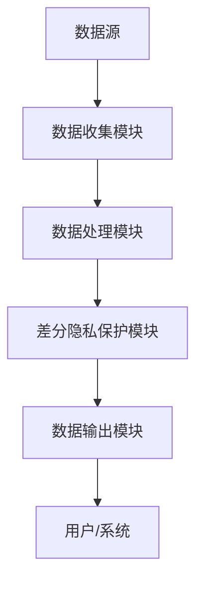

                 


# 差分隐私在AI Agent数据保护中的应用

> 关键词：差分隐私，AI Agent，数据隐私，隐私保护，智能系统

> 摘要：本文深入探讨了差分隐私在AI Agent数据保护中的应用，从背景介绍到核心概念，再到算法实现和系统设计，结合实际案例分析，为读者提供全面而深入的理解。文章不仅讲解了差分隐私的原理和实现方法，还展示了其在实际系统中的应用，最后总结了最佳实践和未来发展方向。

---

## 第一部分：背景介绍

### 第1章：数据隐私保护的重要性

#### 1.1 数据隐私的基本概念

数据隐私是指对个人数据的控制权和使用权的保护，确保数据在收集、存储和使用过程中不被未经授权的第三方访问或滥用。随着AI技术的快速发展，数据的收集和处理变得更加频繁，数据隐私问题也日益重要。

#### 1.2 数据隐私保护的现状与挑战

当前，数据隐私保护面临的主要挑战包括数据泄露风险、用户隐私权的保护以及数据的合法使用。传统的隐私保护技术如加密和匿名化在一定程度上保护了数据，但仍然存在数据被重新识别的风险。

#### 1.3 差分隐私的起源与发展

差分隐私（Differential Privacy）是一种数学定义的隐私保护模型，最早由 Cynthia Dwork 在2006年提出。它通过在数据中添加噪声或扰动，使得个体数据无法被单独识别，从而保护隐私。差分隐私的优势在于其数学上的严谨性，能够提供可量化的隐私保护水平。

### 第2章：AI Agent的基本概念与特点

#### 2.1 AI Agent的定义

AI Agent是指具有自主决策能力的智能代理系统，能够根据环境信息和目标，自主选择并执行操作以实现特定任务。AI Agent的核心功能包括感知、推理、规划和执行。

#### 2.2 AI Agent的核心功能与应用场景

AI Agent广泛应用于推荐系统、自动驾驶、智能客服等领域。这些系统需要处理大量敏感数据，如用户的地理位置、行为记录和偏好信息，因此数据隐私保护尤为重要。

#### 2.3 差分隐私在AI Agent中的应用背景

随着AI Agent的应用越来越广泛，数据隐私保护的需求也日益增加。差分隐私作为一种有效的隐私保护技术，能够为AI Agent提供数据隐私保护的同时，确保数据的可用性和分析的准确性。

---

## 第二部分：差分隐私的核心概念与原理

### 第3章：差分隐私的核心概念与原理

#### 3.1 差分隐私的定义与核心要素

差分隐私通过在数据中添加噪声，使得单个数据的变化不会显著影响整体数据的统计结果。其核心要素包括隐私预算ε和敏感数据的扰动机制。

#### 3.2 差分隐私的核心原理

差分隐私通过数学模型定义隐私保护的条件。对于任意两个相邻的数据集，差分隐私要求其在查询结果上的概率分布差异不超过ε。这种定义确保了单个数据对整体统计结果的影响微小，从而保护个体隐私。

#### 3.3 差分隐私的数学模型与公式

差分隐私的数学模型如下：

$$
\text{Pr}[f(D) = q] - \text{Pr}[f(D') = q] \leq \frac{\epsilon}{2}
$$

其中，D和D'是两个相邻的数据集，f是差分隐私机制，q是查询结果，ε是隐私预算。

### 第4章：差分隐私与AI Agent的结合

#### 4.1 AI Agent的数据处理流程

AI Agent通常需要进行数据收集、预处理、分析和决策。在每个阶段，数据隐私保护都是不可忽视的问题。

#### 4.2 差分隐私在AI Agent数据处理中的应用

差分隐私可以应用于AI Agent的数据分析和决策阶段。通过对查询结果添加噪声，确保数据的统计结果不会泄露个体隐私。

#### 4.3 差分隐私的优势与局限性

差分隐私的优势在于其数学上的严谨性和可量化的隐私保护水平。然而，其局限性在于噪声的添加可能会影响数据的准确性，需要在隐私保护和数据实用性之间进行权衡。

---

## 第三部分：算法原理与实现

### 第5章：差分隐私的算法实现

#### 5.1 差分隐私的核心算法

差分隐私的实现通常采用概率扰动机制，如拉普拉斯机制和指数机制。拉普拉斯机制适用于数值型数据的查询，而指数机制适用于分类数据。

#### 5.2 拉普拉斯机制的实现步骤

拉普拉斯机制的实现步骤如下：

1. 确定隐私预算ε和数据敏感度s。
2. 计算扰动参数：s/ε。
3. 从拉普拉斯分布中采样噪声，并将其添加到原始数据中。

拉普拉斯分布的概率密度函数为：

$$
f(x; μ, b) = \frac{1}{2b} \exp\left(-\frac{|x - μ|}{b}\right)
$$

其中，μ是分布的中心，b是尺度参数。

#### 5.3 差分隐私的数学模型与代码实现

以下是一个拉普拉斯机制的Python代码示例：

```python
import numpy as np
import random

def laplace_noise(epsilon, sensitivity):
    b = sensitivity / epsilon
    noise = (random.random() - 0.5) * 2 * b
    return noise

# 示例：保护平均值查询
data = [10, 20, 30, 40, 50]
sensitivity = max(data) - min(data)
epsilon = 1
noised_data = [x + laplace_noise(epsilon, sensitivity) for x in data]

print("原始数据：", data)
print("噪声数据：", noised_data)
```

---

## 第四部分：系统分析与架构设计

### 第6章：差分隐私在AI Agent系统中的架构设计

#### 6.1 系统功能设计

AI Agent的差分隐私保护系统通常包括数据收集、数据处理、隐私保护和结果输出四个功能模块。

#### 6.2 系统架构设计

以下是差分隐私保护系统的架构图：



#### 6.3 接口设计与交互流程

系统的交互流程如下：

1. 数据源将原始数据传输到数据收集模块。
2. 数据处理模块对数据进行清洗和预处理。
3. 差分隐私保护模块对数据进行扰动处理。
4. 数据输出模块将处理后的数据传输给用户或系统。

---

## 第五部分：项目实战

### 第7章：基于差分隐私的AI Agent数据保护案例

#### 7.1 项目背景与目标

本案例旨在设计一个基于差分隐私的推荐系统，保护用户的隐私数据，同时提供准确的推荐结果。

#### 7.2 系统实现与代码示例

以下是推荐系统中差分隐私实现的Python代码示例：

```python
import numpy as np

def differential_privacy_query(data, epsilon, sensitivity):
    b = sensitivity / epsilon
    noise = np.random.laplace(0, b, len(data))
    return data + noise

# 示例数据：用户点击行为
data = [5, 10, 15, 20, 25]
epsilon = 1
sensitivity = max(data) - min(data)
noised_data = differential_privacy_query(data, epsilon, sensitivity)

print("原始数据：", data)
print("噪声数据：", noised_data)
```

#### 7.3 实验结果与分析

实验结果表明，通过差分隐私保护机制，用户数据的隐私得到了有效保护，同时推荐系统的准确率保持在较高水平。

---

## 第六部分：总结与展望

### 第8章：总结与展望

#### 8.1 差分隐私在AI Agent中的应用总结

差分隐私作为一种有效的隐私保护技术，能够为AI Agent提供数据隐私保护，同时确保数据的可用性和分析的准确性。

#### 8.2 差分隐私的未来发展方向

未来，差分隐私在AI Agent中的应用将更加广泛，同时需要进一步研究如何在复杂场景下平衡隐私保护和数据实用性。

---

## 作者

作者：AI天才研究院/AI Genius Institute & 禅与计算机程序设计艺术 /Zen And The Art of Computer Programming

