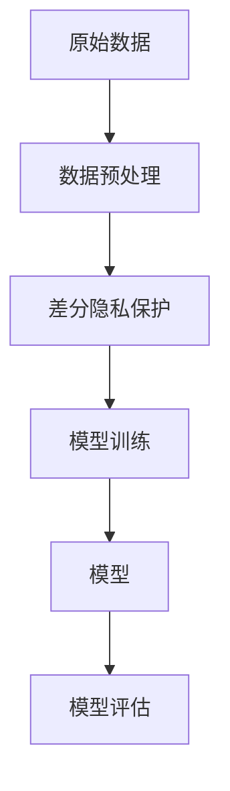
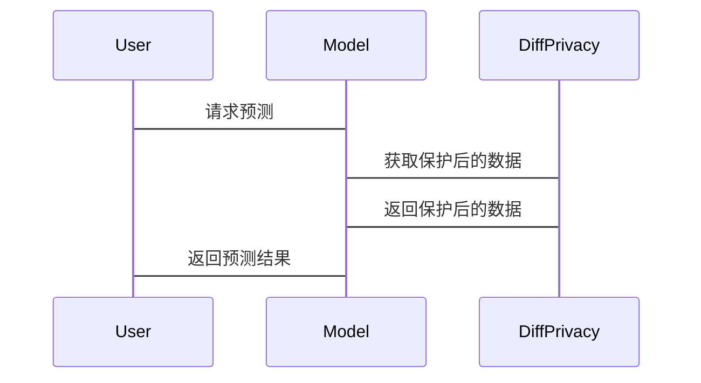

                 


# 差分隐私在AI Agent训练中的应用

> 关键词：差分隐私，AI Agent，数据隐私，机器学习，隐私保护

> 摘要：  
随着AI Agent在各个领域的广泛应用，数据隐私保护成为了一个越来越重要的问题。本文详细探讨了差分隐私在AI Agent训练中的应用，从核心概念、算法原理到系统设计，再到实际项目实现，全面解析如何在保护数据隐私的前提下，训练出高性能的AI Agent。文章结合理论与实践，为读者提供了一套完整的解决方案，同时提出了未来的研究方向和优化建议。

---

## 第一部分: 差分隐私与AI Agent概述

### 第1章: 差分隐私与AI Agent的背景介绍

#### 1.1 差分隐私的定义与核心概念
- **问题背景与数据隐私保护需求**  
  随着人工智能技术的快速发展，数据隐私问题日益凸显。AI Agent的训练通常需要大量敏感数据，如何在不泄露个体隐私的前提下进行模型训练成为一项重要挑战。

- **差分隐私的核心定义**  
  差分隐私是一种通过在数据中添加随机噪声来保护个体隐私的技术。其核心思想是：对于任何数据集中的两个相邻数据集（只相差一个元素），在隐私保护机制下，算法的输出结果分布几乎相同。

- **差分隐私的基本属性与特点**  
  - **ε-差分隐私**：定义了一个隐私保护的参数ε，ε越小，隐私保护越严格，但数据的有用性可能降低。  
  - **随机化**：通过引入随机性，确保个体数据对模型输出的影响被“稀释”。  
  - **可证明的安全性**：差分隐私提供了一种数学上的隐私保护证明，确保即使在最坏情况下，个体数据也不会被泄露。

#### 1.2 AI Agent的基本概念与训练机制
- **AI Agent的定义与分类**  
  AI Agent是一种智能实体，能够感知环境、自主决策并执行任务。根据应用场景的不同，AI Agent可以分为：  
  - **反应式AI Agent**：基于当前感知做出实时反应。  
  - **认知式AI Agent**：具备复杂推理和决策能力。  

- **AI Agent的训练流程与挑战**  
  AI Agent的训练通常包括数据收集、特征提取、模型训练、优化调参和模型评估等步骤。  
  - 数据收集：AI Agent需要大量真实数据进行训练，这些数据可能包含敏感信息。  
  - 模型训练：训练过程中可能泄露数据中的隐私信息。  
  - 模型评估：评估过程也可能暴露数据中的隐私风险。  

- **AI Agent在实际应用中的隐私风险**  
  AI Agent的应用场景通常涉及敏感数据，例如自动驾驶中的位置数据、推荐系统中的用户行为数据等。这些数据如果被恶意利用，可能导致严重的隐私泄露问题。

#### 1.3 差分隐私在AI Agent中的应用价值
- **数据隐私保护的重要性**  
  差分隐私能够有效保护训练数据中的敏感信息，确保在模型训练过程中不会泄露个体数据。  

- **差分隐私在AI Agent训练中的应用场景**  
  - 在自动驾驶中保护用户位置数据。  
  - 在智能推荐系统中保护用户行为数据。  
  - 在医疗AI Agent中保护患者隐私数据。  

- **差分隐私与AI Agent结合的创新点**  
  差分隐私技术为AI Agent的训练提供了一种隐私保护的解决方案，使得AI Agent可以在不泄露个体数据的前提下进行模型优化和训练。

---

### 第2章: 差分隐私的核心概念与原理

#### 2.1 差分隐私的数学定义与属性
- **差分隐私的数学定义**  
  对于两个相邻数据集D和D'（只相差一个元素），任何算法输出S的条件概率满足：  
  $$ P(S | D) \leq e^{\epsilon} \cdot P(S | D') $$  
  其中，ε是隐私保护参数，控制了两个数据集输出分布的相似性。  

- **ε-差分隐私的定义与理解**  
  ε越小，隐私保护越严格。例如，ε=0意味着两个数据集的输出分布完全相同，但此时数据的有用性可能较低。  

- **差分隐私的其他属性**  
  - **联合差分隐私**：适用于多个查询的场景，确保每个查询的联合结果满足差分隐私。  
  - **分布式差分隐私**：数据分布在不同节点，通过本地计算保护隐私后再进行聚合。  

#### 2.2 差分隐私的核心算法与实现
- **拉普拉斯机制的原理与实现**  
  拉普拉斯机制是一种常用的差分隐私技术，适用于查询连续数据的情况。其核心思想是在查询结果上添加拉普拉斯分布的噪声。  
  - 拉普拉斯分布的概率密度函数：  
  $$ f(x; \mu, b) = \frac{1}{2b} \exp\left(-\frac{|x - \mu|}{b}\right) $$  
  其中，μ是均值，b是尺度参数，控制噪声的大小。  

- **高斯机制的原理与实现**  
  高斯机制适用于查询离散数据的情况，通过在查询结果上添加高斯噪声来保护隐私。  
  - 高斯分布的概率密度函数：  
  $$ f(x; \mu, \sigma) = \frac{1}{\sigma \sqrt{2\pi}} \exp\left(-\frac{(x - \mu)^2}{2\sigma^2}\right) $$  

- **其他差分隐私保护技术**  
  - **指数机制**：适用于优化查询的情况，通过概率分布选择最优答案。  
  - **随机化查询模型**：通过随机化技术保护查询结果。  

---

### 第3章: AI Agent的训练机制与数据隐私挑战

#### 3.1 AI Agent的训练流程
- **数据收集与预处理**  
  - 数据来源：AI Agent通常需要收集大量数据，例如用户行为数据、传感器数据等。  
  - 数据预处理：对数据进行清洗、归一化等处理，确保数据质量。  

- **模型训练与优化**  
  - 模型选择：根据任务需求选择合适的模型架构，例如深度神经网络、强化学习模型等。  
  - 模型优化：通过随机梯度下降等优化算法进行训练。  

- **模型评估与部署**  
  - 模型评估：通过测试集评估模型的性能。  
  - 模型部署：将训练好的模型部署到实际应用场景中。  

#### 3.2 数据隐私在AI Agent训练中的挑战
- **数据泄露的风险**  
  - 如果不采取隐私保护措施，训练数据可能被攻击者逆向还原，导致隐私泄露。  
- **数据敏感性与隐私保护的需求**  
  - 不同类型的数据敏感性不同，例如医疗数据比公开数据更需要严格保护。  
- **AI Agent训练中的数据依赖性**  
  - AI Agent的性能高度依赖训练数据的质量和数量，但数据隐私保护可能会影响模型的训练效果。  

#### 3.3 差分隐私在AI Agent训练中的数学模型
- **模型训练的数学框架**  
  差分隐私可以通过在模型参数更新过程中添加噪声来保护隐私。例如，在梯度下降优化中，可以对梯度进行差分隐私处理：  
  $$ \text{更新梯度} = \text{真实梯度} + \text{噪声} $$  
  其中，噪声的分布需要满足差分隐私的条件。  

- **差分隐私保护的优化算法**  
  - **DP-SGD（差分隐私随机梯度下降）**：在传统的随机梯度下降算法中，对梯度进行差分隐私处理。  
  - **其他优化算法**：例如DP-Adam、DP-RMSProp等。  

---

### 第4章: 差分隐私在AI Agent训练中的系统架构设计

#### 4.1 系统功能设计
- **领域模型（Domain Model）**  
  - 数据预处理模块：对原始数据进行清洗、归一化等处理。  
  - 差分隐私保护模块：对数据或模型参数添加噪声，确保隐私保护。  
  - 模型训练模块：基于保护后的数据进行模型训练。  

- **系统架构设计**  
  - **数据流**：原始数据 → 数据预处理 → 差分隐私保护 → 模型训练 → 模型评估。  
  - **隐私保护机制**：通过差分隐私技术保护数据或模型参数，确保隐私安全。  

#### 4.2 系统架构图


#### 4.3 系统交互图


---

### 第5章: 差分隐私在AI Agent训练中的项目实战

#### 5.1 环境安装与配置
- **Python环境**：建议使用Python 3.8及以上版本。  
- **依赖库安装**：  
  ```bash
  pip install numpy pandas scikit-learn diffprivilt
  ```

#### 5.2 核心代码实现
```python
import numpy as np
from diffprivilt import utils

# 示例：在回归任务中应用差分隐私
def differential_private_query(data, epsilon=1.0):
    # 计算真实查询结果
    true_result = np.mean(data)
    # 添加拉普拉斯噪声
    noise = utils.laplace_noise(epsilon)
    # 返回保护后的结果
    return true_result + noise
```

#### 5.3 代码应用解读
- **代码功能**：上述代码实现了一个简单的差分隐私保护查询函数。  
- **参数解释**：  
  - `data`：输入数据。  
  - `epsilon`：隐私保护参数，控制噪声的大小。  

#### 5.4 实际案例分析
- **案例背景**：假设我们有一个AI Agent用于预测用户的位置数据，我们需要在训练过程中保护用户的隐私。  
- **代码实现**：通过在模型训练中应用差分隐私保护，确保用户的位置数据不会被泄露。  

---

### 第6章: 差分隐私在AI Agent训练中的最佳实践与总结

#### 6.1 最佳实践
- **选择合适的差分隐私技术**：根据具体场景选择适合的差分隐私算法，例如拉普拉斯机制或高斯机制。  
- **合理设置隐私参数**：调整epsilon值以平衡隐私保护和模型性能。  
- **数据预处理与后处理**：在数据预处理阶段去除敏感信息，在模型部署阶段进一步保护输出结果。  

#### 6.2 总结与展望
- **总结**：本文详细探讨了差分隐私在AI Agent训练中的应用，从理论到实践，提供了一套完整的解决方案。  
- **展望**：未来的研究可以进一步优化差分隐私算法，降低隐私保护对模型性能的影响，同时探索更高效的数据隐私保护技术。

---

### 第7章: 注意事项与拓展阅读

#### 7.1 注意事项
- **隐私保护的权衡**：差分隐私虽然提供了隐私保护，但也可能降低模型的准确性和实用性。  
- **参数调优**：合理设置差分隐私参数，确保隐私保护与模型性能的平衡。  
- **数据安全**：除了差分隐私，还需要结合其他数据安全技术，例如加密存储、访问控制等。  

#### 7.2 拓展阅读
- **《差分隐私：隐私保护的数学理论与实践》**  
- **《AI Agent设计与实现》**  
- **《数据隐私保护技术综述》**

---

### 作者信息

作者：AI天才研究院/AI Genius Institute & 禅与计算机程序设计艺术 /Zen And The Art of Computer Programming

---

通过以上内容，您可以看到，这篇文章从理论到实践，全面探讨了差分隐私在AI Agent训练中的应用。希望这篇文章能为您提供有价值的见解和启发！

