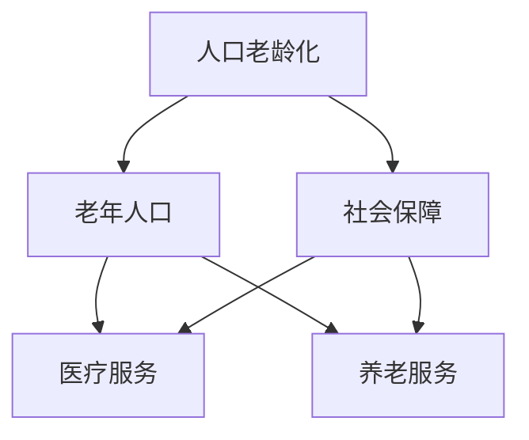
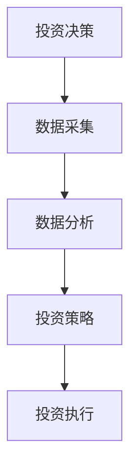
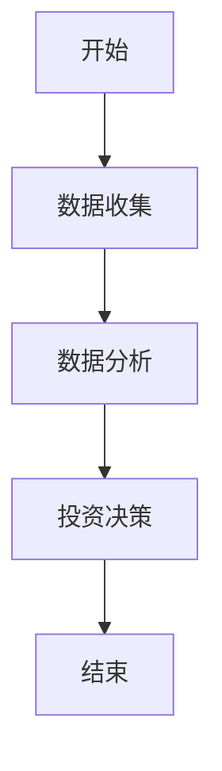
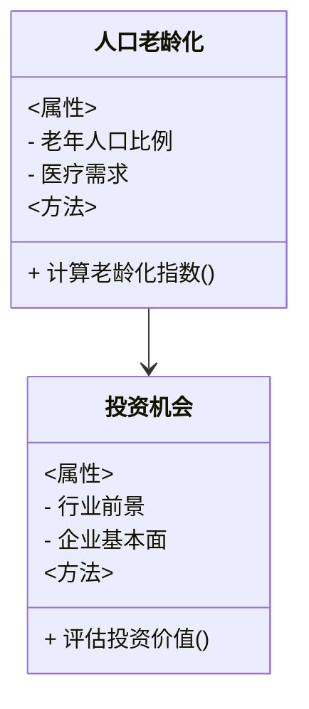
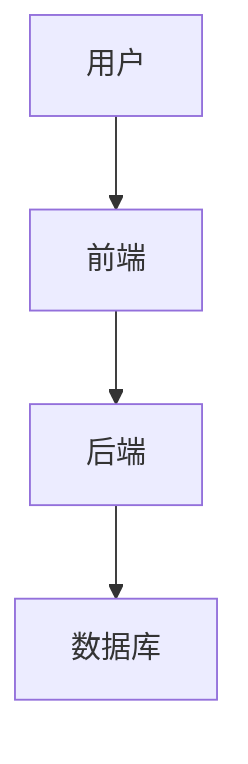
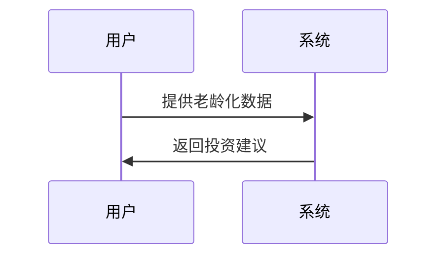

                 


# 巴菲特-芒格的人口老龄化投资：社会变迁中的机遇

> 关键词：巴菲特、芒格、人口老龄化、投资机会、社会变迁

> 摘要：本文探讨了人口老龄化背景下巴菲特和芒格的投资策略，分析了社会变迁中的投资机会，并提出了风险管理的建议。通过详细阐述每个章节的核心内容，为投资者提供深度的见解和指导。

---

# 第一部分: 人口老龄化与投资机遇的背景

## 第1章: 人口老龄化概述

### 1.1 人口老龄化的基本概念

#### 1.1.1 人口老龄化定义与特征
人口老龄化是指人口中65岁及以上老年人口比例不断上升的趋势。其主要特征包括人口结构失衡、劳动年龄人口减少、社会保障压力增大等。

#### 1.1.2 人口老龄化的历史演变
人口老龄化是一个逐步发展的全球现象，从发达国家开始，逐步蔓延至发展中国家。这一趋势在20世纪后期加速，预计在21世纪将更加显著。

#### 1.1.3 全球人口老龄化现状与趋势
根据联合国数据，全球65岁及以上人口比例将从2020年的9.1%上升至2050年的16.5%。这一趋势将对全球经济和社会产生深远影响。

### 1.2 人口老龄化对社会经济的影响

#### 1.2.1 经济领域的影响
- 人口老龄化导致劳动力短缺，推高劳动力成本。
- 传统产业面临转型压力，新兴产业如医疗健康、养老服务等快速发展。

#### 1.2.2 社会领域的影响
- 社会保障体系压力加大，政府财政支出增加。
- 家庭结构变化，传统养老模式面临挑战。

#### 1.2.3 人口老龄化与投资机会的关联
- 人口老龄化催生了医疗、养老等新投资领域。
- 企业通过技术创新和模式创新应对老龄化挑战，带来投资机会。

### 1.3 巴菲特与芒格的投资理念

#### 1.3.1 巴菲特的价值投资理论
巴菲特强调长期投资、价值投资，寻找具有持续竞争优势的企业。

#### 1.3.2 芒格的多元思维模型
芒格提倡通过跨学科思维，识别投资机会，降低投资风险。

#### 1.3.3 两人投资理念的结合与应用
巴菲特和芒格的理念结合，注重基本面分析和长期趋势，抓住人口老龄化带来的投资机会。

---

## 第2章: 人口老龄化与社会变迁

### 2.1 人口老龄化对产业结构的影响

#### 2.1.1 传统产业的衰退与转型
- 制造业、零售业等传统产业因劳动力短缺面临转型压力。
- 企业通过自动化、智能化技术降低成本，提升效率。

#### 2.1.2 新兴产业的崛起与发展
- 医疗健康、养老服务、智能设备等新兴产业快速发展。
- 技术创新推动产业升级，带来新的投资机会。

#### 2.1.3 人口老龄化对就业市场的冲击与机遇
- 部分行业劳动力需求减少，但新兴行业就业机会增加。
- 远程办公、灵活就业模式兴起，适应老龄化社会需求。

### 2.2 人口老龄化对消费模式的影响

#### 2.2.1 老龄人口的消费特征
- 更加注重健康、医疗、养老服务。
- 消费习惯从物质转向服务。

#### 2.2.2 医疗健康、养老服务等领域的消费增长
- 医疗设备、药品需求增加。
- 养老服务市场规模扩大，吸引投资。

#### 2.2.3 新型消费模式的出现与发展趋势
- 网上购物、移动支付等数字化消费模式普及。
- 共享经济、定制化服务满足老龄人口需求。

### 2.3 人口老龄化对政策环境的影响

#### 2.3.1 政府政策的变化与调整
- 社会保障制度改革，扩大覆盖范围。
- 鼓励企业创新，支持新兴产业。

#### 2.3.2 社会保障体系的改革与创新
- 养老金制度优化，引入市场化运营。
- 推动医养结合，整合医疗和养老服务资源。

#### 2.3.3 人口老龄化对资本市场的影响
- 资本市场关注老龄化相关企业，推动股价上涨。
- 投资者更倾向于长期稳定的投资，减少短期波动。

---

## 第3章: 人口老龄化投资的核心概念

### 3.1 人口老龄化投资的定义与范围

#### 3.1.1 投资的定义与分类
- 人口老龄化投资：关注与老龄化相关的行业和企业，寻找长期增长机会。

#### 3.1.2 人口老龄化投资的特殊性与独特性
- 依赖于社会结构变化，具有较强的政策依赖性。
- 投资周期长，回报稳定。

#### 3.1.3 投资范围的界定与外延
- 医疗健康、养老服务、智能设备等领域。
- 包括上市公司股票、债券、基金等多种投资工具。

### 3.2 核心概念的属性特征对比

| 特性       | 传统产业          | 新兴产业          |
|------------|-------------------|-------------------|
| 劳动力需求 | 高               | 低               |
| 技术依赖   | 低               | 高               |
| 市场前景   | 缩小             | 扩大             |

### 3.3 实体关系与架构设计

#### ER实体关系图


#### 系统架构设计


---

## 第4章: 人口老龄化投资的算法原理

### 4.1 算法原理概述

#### 4.1.1 算法的基本原理
- 通过数据分析识别老龄化趋势。
- 结合企业基本面和行业前景，评估投资价值。

#### 4.1.2 算法的核心步骤
1. 数据收集：获取老龄化相关数据。
2. 数据分析：识别投资机会。
3. 投资决策：制定投资策略。

#### 4.1.3 算法的优缺点分析
- 优点：数据驱动，减少主观判断。
- 缺点：依赖数据质量，可能忽略市场变化。

### 4.2 算法的数学模型与公式

#### 4.2.1 数学模型的建立与求解
$$ 投资回报率 = (未来现金流现值 - 现金初始投资) / 现金初始投资 $$

#### 4.2.2 关键公式的推导与应用
$$ 预期收益 = 现金流 \times 折现率 $$

#### 4.2.3 数学模型的可视化与解释
通过折线图展示投资回报率随时间的变化趋势。

### 4.3 算法的流程图



---

## 第5章: 系统分析与架构设计方案

### 5.1 系统功能设计

#### 5.1.1 领域模型类图


#### 5.1.2 系统架构设计


#### 5.1.3 系统接口设计
- 用户输入：老龄化相关数据
- 系统输出：投资建议

#### 5.1.4 系统交互设计


---

## 第6章: 项目实战

### 6.1 环境安装
- 安装Python、数据分析工具等。

### 6.2 核心实现源代码

```python
import pandas as pd
import numpy as np

def calculate_return():
    # 示例计算投资回报率
    cash_flow = [100, 200, 300]
    discount_rate = 0.1
    present_value = sum([cf / (1 + discount_rate)**i for i, cf in enumerate(cash_flow)])
    return present_value

print(calculate_return())
```

### 6.3 代码应用解读与分析
- 代码实现现金流的现值计算，评估投资回报率。

### 6.4 实际案例分析
- 分析某医疗公司股票，结合老龄化趋势，评估投资价值。

### 6.5 项目小结
- 通过案例分析，验证算法的有效性，总结投资策略。

---

## 第7章: 风险管理

### 7.1 风险识别与评估

| 风险因素 | 影响程度 | 应对措施 |
|----------|----------|----------|
| 市场波动 | 高       | 分散投资 |
| 政策变化 | 中       | 保持关注 |
| 企业基本面 | 低       | 深度调研 |

### 7.2 应对策略

#### 7.2.1 风险分散
- 投资多样化，降低单一风险。

#### 7.2.2 风险对冲
- 利用金融衍生工具，对冲市场波动风险。

#### 7.2.3 风险监控
- 定期评估投资组合，及时调整策略。

---

## 第8章: 最佳实践 tips、小结、注意事项、拓展阅读

### 8.1 最佳实践 tips
- 长期投资，避免短期波动影响决策。
- 结合基本面和技术分析，制定投资策略。

### 8.2 小结
人口老龄化带来投资机会，巴菲特和芒格的投资理念提供有效指导。

### 8.3 注意事项
- 关注政策变化，避免投资风险。
- 深入研究企业基本面，确保投资质量。

### 8.4 拓展阅读
推荐阅读巴菲特和芒格的经典著作，深入理解投资哲学。

---

作者：AI天才研究院/AI Genius Institute & 禅与计算机程序设计艺术 /Zen And The Art of Computer Programming

