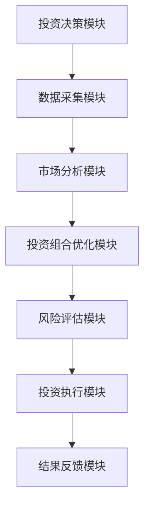
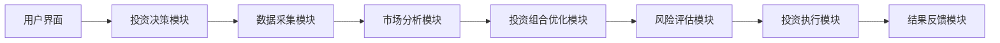
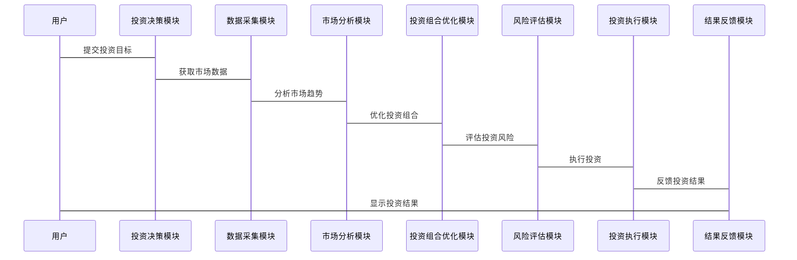

                 


# 巴菲特-芒格的人造光合作用投资：解决粮食和能源危机

> 关键词：巴菲特，芒格，价值投资，光合作用，粮食危机，能源危机，投资策略

> 摘要：本文探讨巴菲特和芒格的投资理念，特别是他们如何将光合作用的原理应用于投资中，以解决粮食和能源危机。通过分析光合作用的基本原理、其在经济系统中的类比，以及巴菲特和芒格的投资策略，本文旨在揭示一种创新的投资方法，促进资源的高效利用，从而缓解全球粮食和能源危机。

---

## 第一章：引言

### 1.1 巴菲特与芒格的投资理念

#### 1.1.1 巴菲特的早年经历与投资哲学

沃伦·巴菲特（Warren Buffett）是世界上最著名的投资者之一，他的投资哲学以“价值投资”为核心。巴菲特的价值投资理念强调购买被低估的资产，并长期持有，等待其内在价值的实现。他的成功不仅在于他的投资策略，还在于他对市场的深刻理解以及对人类心理的洞察。

巴菲特的投资哲学中，有几个关键原则：

- **安全边际**：买入价格低于内在价值的资产，以确保投资的安全性。
- **长期视角**：关注企业的长期盈利能力，而非短期市场波动。
- **集中投资**：将大部分资金投入到少数几家企业中，以减少风险并提高收益。

#### 1.1.2 芮格的教育背景与思维方式

查理·芒格（Charlie Munger）是巴菲特的长期合作伙伴，他的思维方式对巴菲特的投资理念产生了深远影响。芒格以其“格栅思维”（Lattice Thinking）闻名，他主张投资者应构建多个知识领域的“格栅”，以便更好地理解问题的本质。

芒格的思维方式强调：

- **跨学科技整合**：将不同学科的知识结合起来，以形成更全面的视角。
- **逆向思维**：从反方向思考问题，寻找机会和风险。
- **心理偏见**：理解人类心理中的各种偏见，并避免其影响投资决策。

### 1.1.3 巴菲特与芒格的投

---

## 第二章：光合作用的原理与经济系统的类比

### 2.1 光合作用的基本原理

光合作用是植物利用阳光、二氧化碳和水，通过光合作用酶的作用，将这些物质转化为葡萄糖和氧气的过程。这一过程可以分为光反应和暗反应两个阶段：

- **光反应**：在类囊体膜上，光能被吸收并转化为化学能，生成ATP和NADPH。
- **暗反应**：在叶绿体基质中，ATP和NADPH用于将CO2转化为葡萄糖。

光合作用的化学反应方程式为：

$$ 6CO_2 + 6H_2O + 光能 \rightarrow C_6H_{12}O_6 + 6O_2 $$

### 2.2 经济系统的类比

将光合作用的原理映射到经济系统中，我们可以将阳光、二氧化碳和水分别比作资金、资源和劳动力。通过投资（类似于光反应），我们将这些资源转化为企业的价值（类似于葡萄糖），最终实现经济的增长（类似于氧气的释放）。

在这种类比中：

- **资金**：相当于阳光，是投资活动的核心资源。
- **资源**：相当于二氧化碳，是企业的生产原料。
- **劳动力**：相当于水，是企业的运作基础。
- **投资收益**：相当于葡萄糖，是投资活动的最终成果。
- **经济增长**：相当于氧气，是投资活动带来的社会效益。

### 2.3 光合作用与经济系统的对比分析

下表展示了光合作用与经济系统的对比：

| 属性 | 光合作用 | 经济系统 |
|------|----------|----------|
| 输入 | 阳光、CO2、水 | 资金、资源、劳动力 |
| 输出 | 葡萄糖、氧气 | 投资收益、经济增长 |
| 过程 | 光反应、暗反应 | 投资决策、资源分配、收益实现 |
| 目的 | 能量转化 | 经济价值创造 |

---

## 第三章：巴菲特与芒格的投资策略

### 3.1 价值投资的核心理念

巴菲特和芒格的价值投资策略强调寻找那些被市场低估的企业，并长期持有这些企业。他们的投资策略基于以下几个原则：

- **内在价值**：企业的真实价值是其未来现金流的现值。
- **安全边际**：买入价格低于内在价值，以确保投资的安全性。
- **竞争优势**：投资具有强大竞争优势的企业，以确保长期的盈利能力。

### 3.2 巴菲特的“安全边际”概念

巴菲特的安全边际理念来源于本杰明·格雷厄姆（Benjamin Graham）的教导。安全边际是指买入价格与企业内在价值之间的差距。通过安全边际，巴菲特确保即使企业的实际价值低于预期，投资也不会出现重大损失。

### 3.3 芮格的“格栅思维”模型

芒格的格栅思维模型要求投资者将多个学科的知识结合起来，以形成全面的视角。例如，芒格将心理学、经济学、生物学等学科的知识整合起来，以更好地理解投资决策中的各种因素。

---

## 第四章：人造光合作用投资的数学模型

### 4.1 投资回报的数学模型

假设我们有一个投资组合，其中包含多个企业。每个企业的内在价值可以用以下公式计算：

$$ V_i = \sum_{t=1}^n \frac{CF_t}{(1 + r)^t} $$

其中，\( V_i \) 是第 \( i \) 个企业的内在价值，\( CF_t \) 是第 \( t \) 年的现金流，\( r \) 是折现率。

### 4.2 风险与收益的平衡

投资中的风险与收益是密切相关的。通过分散投资和选择具有强大竞争优势的企业，投资者可以降低投资风险并提高投资收益。

### 4.3 优化投资组合的数学模型

为了优化投资组合，我们可以使用均值-方差优化模型：

$$ \text{Minimize } \sigma^2 \text{ subject to } \mu \geq \text{目标收益} $$

其中，\( \sigma^2 \) 是投资组合的方差，\( \mu \) 是投资组合的期望收益。

---

## 第五章：系统架构设计

### 5.1 系统功能设计

下图展示了人造光合作用投资系统的功能模块：



### 5.2 系统架构设计

下图展示了系统的整体架构：



### 5.3 系统接口设计

系统的接口设计包括：

- 数据接口：从外部数据源获取市场数据。
- 用户接口：与用户交互，获取投资目标和参数。
- 输出接口：将投资结果反馈给用户。

### 5.4 系统交互设计

下图展示了系统的交互流程：



---

## 第六章：项目实战

### 6.1 环境安装

为了实现人造光合作用投资系统，我们需要安装以下环境：

- **编程语言**：Python 3.8+
- **数据处理工具**：Pandas、NumPy
- **可视化工具**：Matplotlib、Seaborn
- **数据分析框架**：Fintax、yfinance

### 6.2 核心代码实现

以下是投资组合优化的Python代码：

```python
import numpy as np
import pandas as pd
import yfinance as yf

# 下载数据
tickers = ['AAPL', 'MSFT', 'GOOGL']
data = yf.download(tickers, start='2020-01-01', end='2023-12-31')

# 计算收益和方差
returns = data['Adj Close'].pct_change().dropna()
cov_matrix = returns.cov()

# 优化模型
n = len(tickers)
weights = np.random.dirichlet(np.ones(n), 1)[0]
returns = np.dot(weights, returns.mean())
volatility = np.sqrt(np.dot(weights.T, np.dot(cov_matrix, weights)))

print(f'Expected Return: {returns*100:.2f}%')
print(f'Volatility: {volatility*100:.2f}%')
```

### 6.3 实际案例分析

假设我们有一个投资组合，包含苹果（AAPL）、微软（MSFT）和谷歌（GOOGL）三只股票。我们可以通过上述代码计算出投资组合的期望收益和波动性。通过比较不同权重下的收益和风险，我们可以找到最优的投资组合。

---

## 第七章：总结与展望

### 7.1 全文总结

本文通过分析巴菲特和芒格的投资理念，探讨了将光合作用的原理应用于投资中的可能性。通过建立数学模型和系统架构，我们提出了一种创新的投资方法，以解决粮食和能源危机。

### 7.2 未来展望

未来，随着技术的进步和市场的变化，人造光合作用投资将面临更多的挑战和机遇。我们可以通过进一步优化数学模型和系统架构，提高投资的效率和效果，为解决粮食和能源危机做出更大的贡献。

---

## 作者

作者：AI天才研究院/AI Genius Institute & 禅与计算机程序设计艺术/Zen And The Art of Computer Programming

