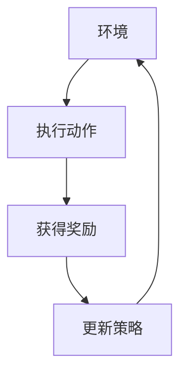
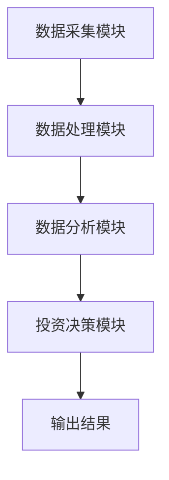

                 


# 巴菲特-芒格的仿生机器人投资：未来劳动力的革命

## 关键词：巴菲特，芒格，仿生机器人，投资，人工智能，劳动力革命

## 摘要：本文探讨了巴菲特和芒格的投资理念如何应用于仿生机器人技术，分析了仿生机器人在劳动力市场的潜力，并详细介绍了投资的核心概念、算法原理和系统架构，结合实际案例进行深入分析。

---

## 第三章: 仿生机器人投资的核心概念

### 3.1 仿生机器人投资的定义与特点

#### 3.1.1 仿生机器人投资的定义
仿生机器人投资是指将巴菲特和芒格的价值投资理念与仿生机器人技术相结合，通过分析机器人技术的创新性、市场需求和经济效益，进行长期投资的策略。

#### 3.1.2 与传统投资的区别
仿生机器人投资与传统投资的区别主要体现在以下几个方面：
- **技术驱动**：传统投资更多依赖于经济指标，而仿生机器人投资则依赖于技术进步和创新。
- **长期视角**：仿生机器人投资强调长期主义，关注技术的持续迭代和市场渗透。
- **跨界融合**：传统投资可能只关注单一领域，而仿生机器人投资需要结合人工智能、机器人技术和投资学的多学科知识。

#### 3.1.3 仿生机器人投资的优势与劣势
- **优势**：技术进步的确定性较高，市场需求巨大，潜在回报丰厚。
- **劣势**：技术风险高，研发周期长，市场波动性大。

### 3.2 仿生机器人投资的核心要素

#### 3.2.1 技术创新性
技术创新性是仿生机器人投资的核心要素之一，主要体现在以下几个方面：
- **处理能力**：仿生机器人需要具备强大的数据处理能力，以实现高效的决策和执行。
- **学习速度**：仿生机器人应能够快速学习和适应新的任务，以应对复杂多变的市场需求。
- **灵活性**：机器人需要具备灵活性，能够适应不同工作环境和任务要求。

#### 3.2.2 市场需求
市场需求是仿生机器人投资的另一个核心要素，具体包括：
- **行业需求**：不同行业对仿生机器人的需求不同，例如制造业需要高效的生产机器人，服务业需要智能服务机器人。
- **用户接受度**：市场需求不仅取决于技术可行性，还取决于用户的接受度和使用习惯。
- **市场规模**：市场规模决定了投资的潜力和回报周期。

#### 3.2.3 经济效益
经济效益是仿生机器人投资的最终目标，主要体现在以下几个方面：
- **成本节约**：仿生机器人可以替代部分人工劳动，降低企业的劳动力成本。
- **效率提升**：机器人能够提高生产效率，缩短生产周期，从而提高企业的整体效益。
- **投资回报**：通过技术进步和市场渗透，机器人投资能够带来丰厚的投资回报。

---

## 第四章: 巴菲特-芒格投资理念与仿生机器人投资的关系

### 4.1 巴菲特-芒格理念在仿生机器人投资中的应用

#### 4.1.1 价值投资与技术创新的结合
价值投资强调购买被市场低估的资产，长期持有，等待其价值的回归。在仿生机器人投资中，价值投资者需要识别那些具有强大技术创新能力和市场潜力的机器人公司，即使当前市场估值较低，也具备长期增值的潜力。

#### 4.1.2 长期主义与技术周期的匹配
芒格的长期主义理念强调投资的长期价值，而不是短期收益。在仿生机器人投资中，投资者需要关注技术的长期发展趋势，如人工智能的不断进步和机器人技术的持续创新，这些趋势将决定投资的最终回报。

#### 4.1.3 多元思维模型在技术评估中的应用
芒格的多元思维模型强调将不同学科的知识结合起来，以更全面地看待问题。在仿生机器人投资中，投资者需要将技术、市场、经济等多个维度的知识结合起来，进行全面的技术评估和市场分析。

### 4.2 仿生机器人投资

---

## 第五章: 仿生机器人投资的算法原理

### 5.1 仿生机器人投资的核心算法

#### 5.1.1 价值投资模型
价值投资模型的核心是寻找被市场低估的资产，计算其内在价值，并与市场价格进行比较。以下是价值投资模型的数学表达式：

$$
\text{内在价值} = \frac{\text{未来现金流的现值}}{\text{折现率}}
$$

#### 5.1.2 强化学习算法
强化学习算法是一种通过试错来优化决策的算法，广泛应用于机器人投资决策中。以下是强化学习的基本框架：



---

## 第六章: 系统分析与架构设计

### 6.1 系统功能设计

#### 6.1.1 投资决策系统
投资决策系统是仿生机器人投资的核心系统，主要包括以下几个功能模块：
- **数据采集**：收集机器人公司的财务数据、技术指标和市场信息。
- **数据分析**：对数据进行清洗、处理和分析，生成投资建议。
- **决策制定**：基于分析结果，制定投资策略和决策。

#### 6.1.2 系统架构设计
以下是投资决策系统的架构图：



---

## 第七章: 项目实战

### 7.1 环境安装

#### 7.1.1 安装Python环境
```bash
python --version
pip install numpy pandas matplotlib
```

### 7.2 核心代码实现

#### 7.2.1 价值投资模型实现
```python
import numpy as np
import pandas as pd

def calculate_intrinsic_value(cash_flows, discount_rate):
    present_value = np.sum(cash_flows / (1 + discount_rate) ** np.arange(len(cash_flows)))
    return present_value / discount_rate
```

### 7.3 案例分析

#### 7.3.1 投资决策案例
案例：假设我们有一家机器人公司，未来5年的现金流分别为100万、120万、150万、180万和200万，折现率为8%。计算其内在价值：

```python
cash_flows = [100, 120, 150, 180, 200]
discount_rate = 0.08

intrinsic_value = calculate_intrinsic_value(cash_flows, discount_rate)
print(intrinsic_value)
```

### 7.4 项目总结
通过以上实战，我们可以看到，仿生机器人投资需要结合价值投资理念和先进技术，通过系统的分析和算法的支持，制定科学的投资策略。

---

## 第八章: 最佳实践与小结

### 8.1 小结
本文详细探讨了巴菲特和芒格的投资理念在仿生机器人投资中的应用，分析了核心概念、算法原理和系统架构，并通过实际案例进行了深入分析。

### 8.2 注意事项
- **技术风险**：仿生机器人投资技术风险较高，投资者需谨慎评估技术可行性。
- **市场波动**：市场波动较大，投资者需具备长期持有的耐心。
- **法律合规**：投资需遵守相关法律法规，避免违规操作。

### 8.3 拓展阅读
- 巴菲特和芒格的其他投资理念
- 人工智能在投资领域的其他应用
- 机器人技术的最新发展

---

## 作者：AI天才研究院/AI Genius Institute & 禅与计算机程序设计艺术 /Zen And The Art of Computer Programming

