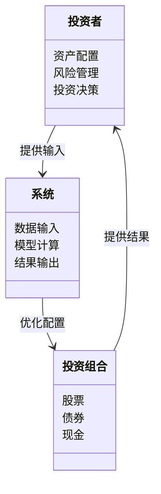

                 


# 巴菲特-芒格的全球化投资视角：机遇与挑战

> 关键词：巴菲特, 芒格, 全球化投资, 价值投资, 投资策略, 风险管理, 投资组合优化

> 摘要：本文从巴菲特和芒格的经典投资理念出发，探讨其在全球化经济背景下的应用，分析全球化投资的机遇与挑战。通过详细解析价值投资的核心要素、风险管理策略及投资组合优化算法，结合实际案例，展示如何将巴菲特和芒格的智慧应用于现代投资决策中，为投资者提供深度的理论支持和实践指导。

---

## 第一部分：巴菲特与芒格的投资理念

### 第1章：巴菲特的投资哲学与实践

#### 1.1 巴菲特的生平与投资理念

**1.1.1 巴菲特的生平简介**

沃伦·巴菲特（Warren Buffett），1934年8月30日出生于美国内布拉斯州奥马哈市，是世界著名的投资家、企业家和慈善家。他以价值投资闻名，被誉为“股神”。巴菲特的投资理念深刻影响了全球投资者，他的成功不仅在于其卓越的投资业绩，更在于他将投资视为一门艺术，强调长期价值和安全边际。

**1.1.2 巴菲特的价值投资理论**

巴菲特的价值投资理论强调买入被市场低估的优质股票，并长期持有。他认为，市场短期是投票机，长期是称重机，投资的本质是寻找具有持续竞争优势的企业，并以合理的价格买入。

**1.1.3 巴菲特的投资策略与成功案例**

巴菲特的成功案例包括对可口可乐、美国运通等公司的投资。他注重企业的财务健康、管理层素质以及行业地位，强调安全边际和长期价值。

#### 1.2 芒格的智慧与决策思维

**1.2.1 芒格的生平简介**

查理·芒格（Charlie Munger），1924年1月17日出生于美国密歇根州，是巴菲特的长期合作伙伴，伯克希尔哈撒韦公司的重要决策者之一。芒格以其多元思维模型闻名，强调跨学科思考，将心理学、经济学、认知科学等领域的知识整合到投资决策中。

**1.2.2 芒格的多元思维模型**

芒格的多元思维模型强调将多个学科的原理和方法结合起来，以更全面的视角分析问题。他认为，投资决策需要考虑人类心理、市场趋势、企业财务等多个因素，避免单一视角的局限性。

**1.2.3 芒格的决策哲学与风险管理**

芒格注重风险管理，认为投资的本质是管理风险，而非追求收益。他强调保守决策，避免过度冒险，并注重企业治理结构和管理层道德。

### 第2章：巴菲特与芒格的投资哲学在全球化背景下的应用

#### 2.1 全球化投资的背景与趋势

**2.1.1 全球化经济的定义与特点**

全球化是指经济活动跨越国界，资本、技术、人才在全球范围内自由流动。全球化促进了跨国公司的发展，但也带来了经济波动和风险。

**2.1.2 全球化投资的机遇与挑战**

全球化为投资者提供了更广泛的市场机会，但也带来了汇率风险、政治风险和市场波动等挑战。投资者需要在全球范围内分散投资，以降低风险。

**2.1.3 巴菲特与芒格投资哲学的全球化视角**

巴菲特和芒格的投资哲学在全球化背景下依然适用，但需要结合全球经济趋势和市场特点进行调整。他们强调长期投资、价值发现和风险管理，为全球化投资提供了理论指导。

---

## 第二部分：全球化投资的机遇与挑战

### 第3章：全球化投资的机遇分析

#### 3.1 全球化经济中的投资机会

**3.1.1 新兴市场的投资潜力**

新兴市场如中国、印度等经济增长迅速，企业盈利能力强，为投资者提供了丰富的投资机会。但新兴市场也伴随着较高的风险，需要谨慎评估。

**3.1.2 全球产业链重构的投资机会**

全球产业链的重构带来了新的投资机会，特别是在科技、制造和服务业领域。投资者需要关注产业趋势，抓住结构性机会。

**3.1.3 数字经济与科技领域的投资机会**

数字经济和科技领域的快速发展为投资者提供了新的机遇，如人工智能、区块链、5G等技术的应用。

#### 3.2 巴菲特与芒格视角下的全球化投资机会

**3.2.1 巴菲特对全球市场的长期看法**

巴菲特认为，全球化促进了经济一体化，但投资应关注企业的内在价值，而非短期市场波动。

**3.2.2 芒格对新兴技术与商业模式的判断**

芒格强调跨学科思考，关注科技对企业和社会的影响，寻找具有持续竞争优势的企业。

**3.2.3 巴菲特与芒格策略在全球化投资中的应用**

将巴菲特的价值投资理念与芒格的多元思维模型结合起来，投资者可以在全球化市场中发现优质企业，分散风险，实现长期收益。

### 第4章：全球化投资的挑战与风险管理

#### 4.1 全球化投资的主要挑战

**4.1.1 汇率风险**

汇率波动直接影响跨国投资的收益，投资者需要通过 hedging 等方式管理汇率风险。

**4.1.2 政治风险**

政治风险包括政策变化、地缘政治冲突等，对全球化投资构成威胁。投资者需要关注各国政策和政治稳定性。

**4.1.3 市场波动风险**

全球化市场的波动性较高，投资者需要具备风险管理能力，避免过度杠杆和集中投资。

#### 4.2 巴菲特与芒格的风险管理策略

**4.2.1 巴菲特的风险管理哲学**

巴菲特强调安全边际和长期投资，认为风险管理的核心是避免永久性本金损失。

**4.2.2 芒格的保守决策与分散投资**

芒格注重分散投资，避免过度集中，同时关注企业治理和管理层道德，降低投资风险。

**4.2.3 巴菲特与芒格的风险管理工具**

使用期权、保险等金融工具对冲风险，结合多元化的投资组合，降低整体风险。

---

## 第三部分：系统分析与架构设计

### 第5章：全球化投资的系统分析

#### 5.1 问题场景介绍

在全球化背景下，投资者需要构建一个能够适应市场波动、分散风险的投资系统，实现长期收益。

#### 5.2 系统功能设计

**5.2.1 领域模型 mermaid 类图**



**5.2.2 系统架构设计 mermaid 架构图**


---

## 第四部分：项目实战

### 第6章：全球化投资实战案例

#### 6.1 环境安装与数据准备

**6.1.1 环境配置**

安装 Python、Pandas、Matplotlib 等工具，准备全球化市场数据。

#### 6.2 核心代码实现

```python
import pandas as pd
import numpy as np

# 示例代码：计算投资组合的最优配置
def optimize_portfolio(returns, weights):
    # 计算投资组合的期望收益和风险
    expected_return = np.dot(returns.mean(), weights)
    portfolio_volatility = np.sqrt(weights.T @ np.cov(returns) @ weights)
    return expected_return, portfolio_volatility

# 示例数据：假设 returns 是一个 DataFrame，weights 是一个权重向量
expected_return, portfolio_volatility = optimize_portfolio(returns, weights)
```

---

## 第五部分：最佳实践与总结

### 第7章：总结与展望

#### 7.1 本书总结

巴菲特和芒格的投资哲学在全球化背景下依然适用，但需要结合全球经济趋势和市场特点进行调整。投资者应注重长期价值、分散风险，并具备跨学科的思考能力。

#### 7.2 未来展望

随着全球化进程的深入，投资者需要更加关注新兴市场、科技领域和可持续发展，巴菲特和芒格的智慧将继续为投资决策提供指导。

---

## 作者：AI天才研究院/AI Genius Institute & 禅与计算机程序设计艺术/Zen And The Art of Computer Programming

