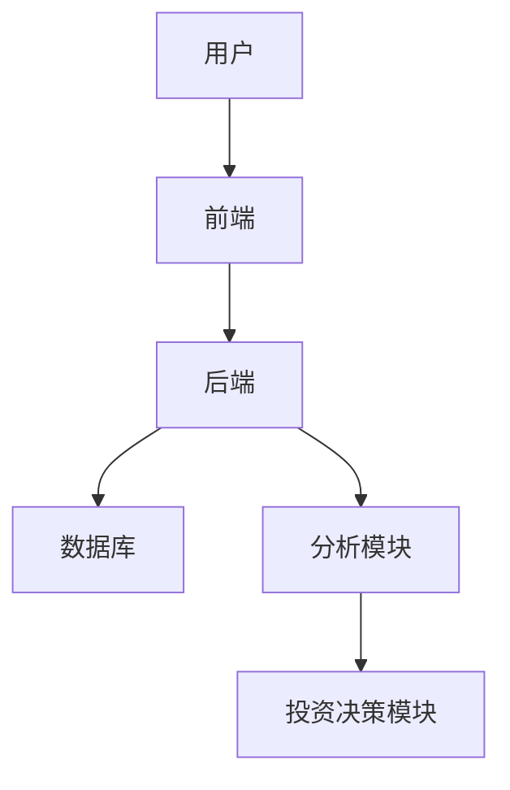
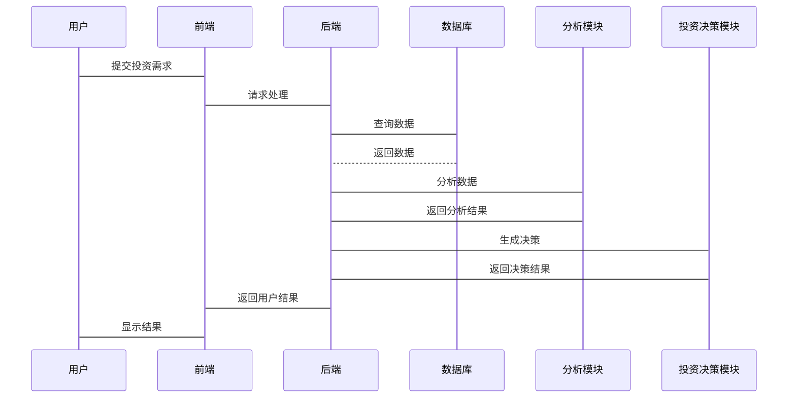

                 


# 巴菲特-芒格的共享经济投资：新商业模式的潜力

> 关键词：巴菲特，芒格，共享经济，投资策略，商业模式，长期价值

摘要：本文探讨了巴菲特和芒格在共享经济领域的投资策略，分析了共享经济的商业模式、潜力以及如何结合他们的投资理念进行投资决策。文章通过详细的技术分析和实际案例，展示了如何在共享经济中应用价值投资和多元思维模型，以实现长期稳定的收益。

---

# 第一部分: 共享经济投资的背景与基础

## 第1章: 共享经济概述

### 1.1 共享经济的基本概念

#### 1.1.1 共享经济的定义与特征
共享经济是一种基于互联网平台的经济模式，通过闲置资源的共享实现资源利用效率的最大化。其核心特征包括去中心化、协作性和数字化。

#### 1.1.2 共享经济的起源与发展
共享经济起源于21世纪初，随着互联网技术的发展逐渐兴起，代表平台包括Airbnb、滴滴出行等。

#### 1.1.3 共享经济的商业模式
主要模式包括P2P共享、B2C共享和C2B共享，通过平台连接供给方和需求方，降低交易成本。

### 1.2 巴菲特与芒格的投资理念

#### 1.2.1 巴菲特的价值投资理论
巴菲特强调长期持有具有持续竞争优势的企业，注重企业的内在价值和安全边际。

#### 1.2.2 芒格的多元思维模型
芒格主张通过多学科思维模型来分析问题，强调知识的跨界整合。

#### 1.2.3 巴菲特与芒格投资理念的结合
将价值投资的长期视角与多元思维模型的分析方法相结合，形成独特的投资策略。

### 1.3 巴菲特与芒格在共享经济中的投资实践

#### 1.3.1 巴菲特的经典投资案例
以可口可乐为例，巴菲特定价收购具有强大品牌和竞争优势的企业。

#### 1.3.2 芒格的经典投资案例
芒格投资比亚迪，看重其在新能源领域的长期发展潜力。

#### 1.3.3 巴菲特与芒格投资理念的异同
巴菲特定位长期价值，芒格注重多维度分析，两者互补形成完整的投资框架。

---

## 第2章: 共享经济的商业模式与潜力

### 2.1 共享经济的主要模式

#### 2.1.1 P2P共享模式
通过平台直接连接个人供给方和需求方，降低中间成本。

#### 2.1.2 B2C共享模式
企业通过平台向消费者提供共享服务，如滴滴出行。

#### 2.1.3 C2B共享模式
消费者通过平台将闲置资源提供给其他消费者，如Airbnb。

### 2.2 共享经济的行业应用

#### 2.2.1 共享交通
包括共享单车和共享汽车，解决城市交通拥堵问题。

#### 2.2.2 共享住宿
如Airbnb，提供闲置房源，满足旅行者住宿需求。

#### 2.2.3 共享办公
提供灵活的办公空间，满足初创企业和自由职业者的需求。

### 2.3 共享经济的潜力与挑战

#### 2.3.1 市场潜力
随着互联网技术的发展，共享经济市场规模持续扩大。

#### 2.3.2 模式创新
共享经济需要不断创新商业模式，以适应市场需求。

#### 2.3.3 挑战与风险
包括政策监管、信任机制和资源分配不均等问题。

---

## 第3章: 巴菲特与芒格投资理念的核心要素

### 3.1 巴菲特的价值投资模型

#### 3.1.1 内在价值的计算公式
$$ \text{内在价值} = \sum_{t=1}^{\infty} \frac{\text{现金流}_t}{(1+r)^t} $$
其中，r为折现率，现金流为未来现金流预测。

#### 3.1.2 安全边际的重要性
巴菲特定价收购低于内在价值的企业，确保投资安全。

#### 3.1.3 长期投资的哲学
强调长期持有，避免短期波动的干扰。

### 3.2 芒格的多元思维模型

#### 3.2.1 多元思维模型的定义
将多个学科的知识模型整合，形成全面的分析框架。

#### 3.2.2 多元思维模型的构成要素
包括心理学、经济学、物理学等多学科的思维方式。

#### 3.2.3 多元思维模型的应用
在投资决策中，结合不同学科的视角进行综合分析。

### 3.3 巴菲特与芒格投资理念的结合

#### 3.3.1 价值投资与多元思维的结合
将多元思维模型应用于价值投资的筛选过程中，确保分析的全面性。

#### 3.3.2 投资决策中的心理因素
关注投资者心理，避免情绪化决策的影响。

#### 3.3.3 风险控制与投资组合优化
通过分散投资和风险评估，优化投资组合的稳定性。

---

## 第4章: 共享经济中的投资机会分析

### 4.1 共享经济的主要投资领域

#### 4.1.1 数字经济与共享经济的结合
随着数字化转型，共享经济平台的技术创新成为关键。

#### 4.1.2 共享经济的数字化转型
利用大数据和人工智能技术优化资源配置效率。

#### 4.1.3 共享经济中的技术创新
包括区块链技术的应用，提升共享经济的信任机制。

### 4.2 巴菲特与芒格视角下的共享经济投资机会

#### 4.2.1 长期价值视角下的共享经济
寻找具有持续竞争优势和稳定现金流的企业。

#### 4.2.2 多元思维视角下的共享经济
通过多维度分析，识别具有长期发展潜力的共享经济模式。

#### 4.2.3 共享经济中的风险
包括政策变化、技术风险和市场需求波动。

---

## 第5章: 共享经济投资的系统分析与架构设计

### 5.1 共享经济投资的系统分析

#### 5.1.1 问题场景介绍
以共享住宿为例，分析其商业模式和投资机会。

#### 5.1.2 项目介绍
选择Airbnb作为案例，分析其平台模式和市场潜力。

#### 5.1.3 系统功能设计
设计一个基于价值投资模型的共享经济投资决策框架，包括数据采集、分析、评估和决策四个模块。

#### 5.1.4 系统架构设计
使用mermaid图展示系统的架构设计，包括前端、后端和数据库模块。

### 5.2 共享经济投资的架构设计

#### 5.2.1 系统功能模块
- 数据采集模块：收集共享经济平台的运营数据。
- 数据分析模块：基于多元思维模型进行数据分析。
- 投资评估模块：计算企业的内在价值和安全边际。
- 投资决策模块：基于分析结果做出投资决策。

#### 5.2.2 系统架构图


### 5.3 系统接口设计

#### 5.3.1 数据接口
- 数据采集接口：从共享经济平台获取实时数据。
- 数据分析接口：将数据传输到分析模块。

#### 5.3.2 交互设计
- 用户通过前端提交投资需求。
- 系统通过后端处理请求并返回结果。

### 5.4 系统交互流程图



---

## 第6章: 项目实战与案例分析

### 6.1 项目环境安装

#### 6.1.1 安装Python环境
使用Anaconda安装Python 3.8及以上版本。

#### 6.1.2 安装依赖库
```bash
pip install numpy pandas matplotlib
```

### 6.2 核心代码实现

#### 6.2.1 数据采集代码
```python
import requests
import pandas as pd

def get_data(url):
    response = requests.get(url)
    data = response.json()
    df = pd.DataFrame(data)
    return df
```

#### 6.2.2 数据分析代码
```python
import numpy as np

def calculate_intrinsic_value(FCF, growth_rate, discount_rate):
    if growth_rate == 0:
        return FCF / discount_rate
    else:
        return FCF / (discount_rate - growth_rate)
```

#### 6.2.3 投资决策代码
```python
def investment_decision(intrinsic_value, price):
    if intrinsic_value > price:
        return "买入"
    elif intrinsic_value < price:
        return "卖出"
    else:
        return "观望"
```

### 6.3 案例分析

#### 6.3.1 环境安装与数据采集
以Airbnb为例，采集其财务数据和市场数据。

#### 6.3.2 数据分析与评估
使用价值投资模型计算Airbnb的内在价值，评估其投资价值。

#### 6.3.3 投资决策与总结
基于分析结果，做出买入、卖出或观望的投资决策。

---

## 第7章: 总结与展望

### 7.1 投资要点总结
- 价值投资与多元思维模型的结合是关键。
- 注重企业的内在价值和长期发展潜力。

### 7.2 注意事项
- 风险控制是投资的重要部分。
- 数据分析需要结合实际市场情况。

### 7.3 未来展望
随着技术的发展，共享经济将更加智能化和数字化，投资机会也将更加丰富。

---

# 作者：AI天才研究院/AI Genius Institute & 禅与计算机程序设计艺术 /Zen And The Art of Computer Programming

---

这篇文章系统地分析了巴菲特和芒格在共享经济中的投资策略，通过理论与实践相结合的方式，深入探讨了共享经济的商业模式和投资机会。结合实际案例和技术分析，为投资者提供了宝贵的参考和指导。

