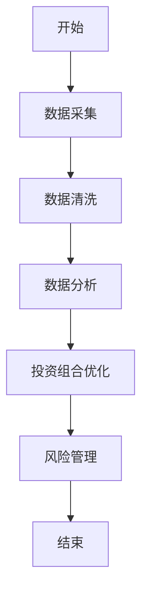
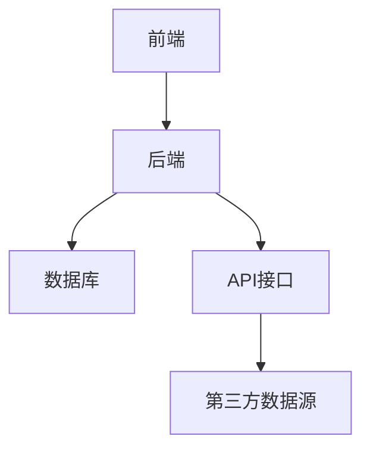

                 


# 巴菲特-芒格的可持续发展投资：长期价值创造的新维度

---

## 关键词：
- 巴菲特, 芒格, 可持续发展投资, 长期价值创造, 价值投资, ESG, 投资组合优化

---

## 摘要：
本文探讨了巴菲特和芒格的可持续发展投资理念，分析了其长期价值创造的新维度。通过结合传统价值投资与现代可持续发展因素，文章揭示了如何在投资决策中融入环境、社会和治理（ESG）要素，以实现长期稳健的收益。本文从背景介绍、核心概念、算法原理、系统架构到项目实战，层层深入，为读者提供了全面的理解和实践指南。

---

## 第一部分：巴菲特与芒格的投资理念

### 第1章：巴菲特与芒格的投资理念概述

#### 1.1 巴菲特与芒格的背景介绍

##### 1.1.1 巴菲特的投资哲学

沃伦·巴菲特（Warren Buffett）被誉为“股神”，他的投资哲学以价值投资为核心。他强调购买价格低于内在价值的股票，并长期持有。巴菲特的投资理念基于对企业基本面的深入分析，包括企业的盈利能力、财务状况和行业地位。

##### 1.1.2 芒格的多元思维模型

查理·芒格（Charlie Munger）是巴菲特的长期合作伙伴，他的多元思维模型强调跨学科思考。芒格认为，投资者需要理解各个领域的基本原理，以避免错误决策。这种思维方式帮助巴菲特和芒格在投资中避免了常见错误，并抓住了长期价值。

##### 1.1.3 巴菲特与芒格合作的历程

自1956年芒格加入巴菲特的投资合伙公司以来，两人共同打造了伯克希尔哈撒韦（Berkshire Hathaway）帝国。他们的合作基于对价值投资的共同信仰和长期视角，这为他们赢得了巨大的成功。

#### 1.2 价值投资的核心理念

##### 1.2.1 价值投资的定义

价值投资是一种投资策略，强调以低于内在价值的价格购买优质资产。巴菲特的价值投资理念强调安全边际，即购买价格远低于企业未来现金流的现值。

##### 1.2.2 价值投资的核心原则

- **安全边际**：购买价格低于内在价值。
- **长期视角**：关注企业的长期盈利能力。
- **基本面分析**：深入研究企业的财务状况和行业地位。

##### 1.2.3 价值投资的实践方法

巴菲特和芒格通过分析企业的财务报表、行业地位和竞争优势，选择具有长期增长潜力的公司。他们注重企业的ROE（净资产收益率）和ROA（资产回报率），并关注企业的管理层和治理结构。

#### 1.3 长期投资的重要性

##### 1.3.1 长期投资的优势

- **复利效应**：长期投资能够最大化复利效应，实现资产的指数增长。
- **降低波动性**：长期投资能够平滑市场波动，减少短期波动对投资组合的影响。
- **时间价值**：长期投资能够充分挖掘企业的长期增长潜力。

##### 1.3.2 长期投资的风险与挑战

- **市场波动**：长期投资仍需应对市场的短期波动。
- **企业风险**：企业可能面临经营风险或行业变化。
- **流动性风险**：长期投资可能面临流动性不足的问题。

##### 1.3.3 长期投资与短期投资的对比

长期投资强调稳健增长和风险控制，而短期投资则注重快速收益和市场操作。巴菲特和芒格认为，长期投资更符合价值投资的理念，能够为投资者创造可持续的收益。

#### 1.4 可持续发展投资的背景

##### 1.4.1 可持续发展投资的定义

可持续发展投资（Sustainable Investment）是指在投资决策中融入环境、社会和治理（ESG）因素的投资策略。这种投资方式不仅关注企业的财务表现，还关注其对社会和环境的长期影响。

##### 1.4.2 可持续发展投资的兴起

随着全球环保意识的增强和企业社会责任的崛起，可持续发展投资逐渐成为主流。投资者意识到，企业对环境和社会的影响不仅关系到企业的长期生存，也影响到投资组合的风险和收益。

##### 1.4.3 可持续发展投资与传统投资的区别

传统投资主要关注财务指标，而可持续发展投资则将ESG因素纳入考量。传统投资可能忽视企业的社会责任和环境影响，而可持续发展投资则注重企业的长期可持续性。

---

### 第2章：可持续发展投资的核心要素

#### 2.1 环境、社会和治理（ESG）因素

##### 2.1.1 环境因素的定义与影响

环境因素包括企业的碳排放、能源使用和环保措施。企业对环境的影响不仅关系到其自身的可持续性，也影响到投资组合的风险和收益。

##### 2.1.2 社会因素的定义与影响

社会因素包括企业的社会责任、员工待遇和社区参与。企业对社会的影响关系到其品牌形象和长期发展。

##### 2.1.3 治理因素的定义与影响

治理因素包括企业的管理层结构、董事会治理和公司治理透明度。良好的公司治理能够提高企业的管理效率和抗风险能力。

##### 2.1.4 ESG因素与投资决策的关系

ESG因素能够帮助投资者识别企业的长期风险和机会。通过关注企业的环境、社会和治理表现，投资者可以更好地评估企业的长期价值。

##### 2.1.5 ESG投资的案例分析

以特斯拉为例，其在电动汽车领域的领先地位和环保承诺使其成为ESG投资的理想选择。特斯拉的高估值部分得益于其在环境和技术创新方面的优势。

---

#### 2.2 投资组合优化的数学模型

##### 2.2.1 现代投资组合理论（MPT）

现代投资组合理论（MPT）由哈里·马科维茨（Harry Markowitz）提出，强调通过分散投资来降低风险。MPT认为，投资者可以通过优化投资组合的资产配置来实现收益最大化，同时最小化风险。

##### 2.2.2 风险与收益的平衡

投资组合优化的目标是在给定风险水平下实现最大收益，或在给定收益下实现最小风险。这可以通过优化资产配置和权重来实现。

##### 2.2.3 可持续发展投资的数学公式

在MPT框架下，可持续发展投资可以通过引入ESG因子来优化投资组合。具体来说，投资者可以通过引入ESG权重来调整资产配置，以反映企业的可持续发展表现。

##### 2.2.4 投资组合优化的步骤

1. 确定投资目标和风险承受能力。
2. 收集相关资产的财务数据和ESG评级。
3. 构建投资组合的优化模型，包括资产权重和约束条件。
4. 计算优化后的投资组合，并进行风险和收益分析。

##### 2.2.5 投资组合优化的Python实现

以下是一个简单的投资组合优化的Python代码示例：

```python
import numpy as np
import pandas as pd
from scipy.optimize import minimize

# 示例数据：资产的预期收益和协方差矩阵
mu = np.array([0.1, 0.15, 0.08])
sigma = np.array([[0.05, 0.02, 0.03],
                 [0.02, 0.1, 0.04],
                 [0.03, 0.04, 0.06]])

# 定义优化目标函数
def objective(weights):
    return np.dot(weights.T, np.dot(sigma, weights)) * 2

# 约束条件
cons = ({'type': 'eq', 'fun': lambda weights: np.sum(weights) - 1})

# 初始猜测
weights_guess = np.array([1/3, 1/3, 1/3])

# 使用scipy.optimize.minimize进行优化
result = minimize(objective, weights_guess, constraints=cons)

# 最优权重
print("最优权重:", result.x)
print("最优收益:", np.dot(result.x.T, mu))
print("最优风险:", np.sqrt(np.dot(result.x.T, np.dot(sigma, result.x))))
```

---

#### 2.3 价值投资与可持续发展的结合

##### 2.3.1 价值投资中的可持续发展因素

巴菲特和芒格的价值投资理念强调企业的长期可持续性。他们不仅关注企业的财务表现，还关注企业的社会责任和环境影响。

##### 2.3.2 可持续发展投资中的长期视角

可持续发展投资注重企业的长期价值，这与巴菲特和芒格的长期投资理念一致。通过关注企业的ESG表现，投资者可以更好地评估企业的长期风险和收益。

##### 2.3.3 巴菲特与芒格的经典案例分析

以伯克希尔哈撒韦为例，其投资组合中包含许多具有长期可持续性优势的企业，如可再生能源公司NextEra Energy。NextEra Energy在环保和技术创新方面的优势使其成为可持续发展投资的理想选择。

---

### 第3章：长期价值创造的新维度

#### 3.1 可持续发展投资的长期视角

##### 3.1.1 长期视角下的投资策略

长期视角强调投资的稳健性和可持续性，注重企业的长期增长潜力和风险控制。

##### 3.1.2 可持续发展与长期价值的关系

可持续发展投资通过关注企业的ESG表现，帮助投资者识别长期风险和机会，从而实现长期价值创造。

##### 3.1.3 长期视角下的风险管理

长期视角下的风险管理注重企业的长期风险因素，如环境政策变化和社会责任履行情况。

#### 3.2 价值投资与ESG因素的融合

##### 3.2.1 ESG因素在价值投资中的应用

通过将ESG因素纳入价值评估，投资者可以更好地识别企业的长期风险和机会。

##### 3.2.2 可持续发展投资中的长期视角

可持续发展投资通过长期视角关注企业的ESG表现，从而实现长期价值创造。

##### 3.2.3 巴菲特与芒格的经典案例分析

伯克希尔哈撒韦的投资组合中包含许多具有长期可持续性优势的企业，如苹果和可口可乐。这些企业的长期增长潜力和稳健的财务表现使其成为价值投资的理想选择。

---

## 第四部分：系统架构与项目实战

### 第4章：系统架构设计

#### 4.1 系统功能设计

##### 4.1.1 系统功能模块

- 数据采集模块：收集企业的财务数据和ESG评级。
- 数据分析模块：对数据进行清洗、转换和分析。
- 投资组合优化模块：基于数据分析结果，优化投资组合。
- 风险管理模块：评估投资组合的风险并进行调整。

##### 4.1.2 系统功能流程图



#### 4.2 系统架构设计

##### 4.2.1 系统架构图



---

## 第五部分：结论与展望

### 第5章：结论与展望

#### 5.1 研究结论

通过将巴菲特和芒格的价值投资理念与可持续发展投资相结合，投资者可以更好地实现长期价值创造。可持续发展投资不仅关注企业的财务表现，还关注其对环境和社会的长期影响。

#### 5.2 未来展望

随着全球环保意识的增强和企业社会责任的崛起，可持续发展投资将成为未来的主流。投资者需要更加关注企业的ESG表现，并将其纳入投资决策中。

---

## 作者

作者：AI天才研究院/AI Genius Institute & 禅与计算机程序设计艺术 /Zen And The Art of Computer Programming

