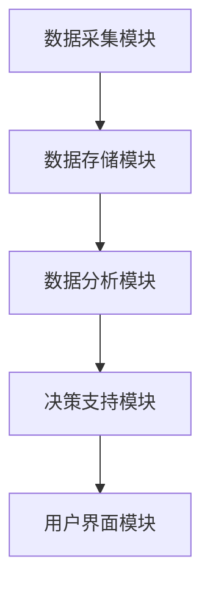

                 


# 巴菲特-芒格的可持续海洋经济投资：蓝色经济的未来

## 关键词：巴菲特，芒格，可持续投资，蓝色经济，海洋经济，系统架构

## 摘要：本文探讨了巴菲特和芒格的投资哲学在蓝色经济中的应用，分析了海洋经济的可持续性，并通过技术与创新、系统架构与项目实战，展示了如何将这些理念转化为实际投资策略。文章结合了理论分析和实际案例，深入探讨了蓝色经济的未来发展方向。

---

## 第一部分：巴菲特与芒格的投资理念

### 1.1 巴菲特与芒格的基本投资哲学

#### 1.1.1 巴菲特与芒格的概述
巴菲特和芒格是投资界的传奇人物，他们的投资哲学以价值投资为核心，强调长期稳定和风险管理。巴菲特认为投资的本质是寻找具有持续竞争优势的企业，而芒格则强调独立思考和多元思维模型。

#### 1.1.2 投资的核心理念
- **长期投资**：巴菲特强调长期持有优质资产，避免短期波动。
- **安全边际**：芒格提倡在投资中留有安全边际，避免过度风险。
- **企业基本面**：关注企业的财务状况、管理层和行业前景。

#### 1.1.3 蓝色经济的定义与现状
蓝色经济指的是与海洋资源相关的经济活动，包括渔业、航运、可再生能源等。当前，蓝色经济面临资源枯竭、环境破坏等挑战，但其潜力巨大，尤其是在可持续发展的推动下。

---

### 1.2 可持续投资的重要性

#### 1.2.1 可持续投资的定义
可持续投资是指在追求财务回报的同时，考虑环境、社会和治理（ESG）因素的投资策略。

#### 1.2.2 可持续投资与传统投资的区别
- **传统投资**：主要关注财务指标，忽视环境和社会影响。
- **可持续投资**：综合考虑财务、环境、社会和治理因素，注重长期价值。

#### 1.2.3 蓝色经济中的可持续投资
在蓝色经济中，可持续投资强调保护海洋资源，避免过度捕捞和污染，同时推动清洁能源和可持续渔业的发展。

---

## 第二部分：海洋经济的可持续性分析

### 2.1 海洋资源的现状与挑战

#### 2.1.1 海洋资源的分布
海洋资源分布不均，主要集中在热带和亚热带地区，但过度捕捞导致资源枯竭。

#### 2.1.2 过度捕捞的问题
过度捕捞导致鱼类数量锐减，破坏海洋生态平衡，影响蓝色经济的可持续发展。

#### 2.1.3 海洋污染的影响
塑料污染和工业排放导致海洋环境恶化，威胁海洋生物和人类健康。

### 2.2 可持续海洋经济的核心要素

#### 2.2.1 生态保护的重要性
生态保护是可持续海洋经济的基础，通过建立保护区和限制捕捞量来保护海洋生物多样性。

#### 2.2.2 经济效益的实现
通过技术创新和产业升级，提高海洋资源的利用效率，实现经济效益。

#### 2.2.3 社会责任的承担
企业应承担社会责任，推动公平和可持续的海洋资源分配。

### 2.3 技术在可持续海洋经济中的应用

#### 2.3.1 渔业管理的技术创新
- **渔业监测系统**：使用卫星和传感器监控海洋资源，优化捕捞策略。
- **智能渔业管理**：通过大数据分析预测鱼类分布，提高捕捞效率。

#### 2.3.2 海洋能源的开发技术
- **海洋能发电**：利用潮汐、波浪和海流的能量发电，减少对化石燃料的依赖。
- **技术创新**：开发高效能的海洋能转换设备，降低发电成本。

#### 2.3.3 环境监测的技术进步
- **环境传感器**：实时监测海洋水质和污染情况，及时采取措施。
- **无人机监测**：使用无人机监控海洋生态，评估环境变化。

---

## 第三部分：蓝色经济的技术与创新

### 3.1 技术创新在蓝色经济中的作用

#### 3.1.1 渔业管理的技术创新
- **数据驱动的渔业管理**：通过数据分析优化捕捞计划，减少资源浪费。
- **智能渔网技术**：使用智能渔网减少误捕，提高捕捞效率。

#### 3.1.2 可再生能源技术的应用
- **海上风电场**：在海洋中建设风电场，利用风能发电。
- **潮汐能发电**：利用潮汐的动能发电，减少对环境的影响。

#### 3.1.3 环境监测与保护技术
- **环境传感器网络**：实时监测海洋环境，及时发现和处理污染问题。
- **海洋生态修复技术**：通过人工干预修复被破坏的海洋生态系统。

---

## 第四部分：系统架构与项目实战

### 4.1 系统架构设计

#### 4.1.1 系统功能设计
- **数据采集模块**：收集海洋环境数据，如温度、盐度、氧气含量等。
- **数据分析模块**：处理数据，预测鱼类分布和环境变化。
- **决策支持模块**：提供优化建议，如最佳捕捞时间、地点等。

#### 4.1.2 系统架构图


### 4.2 项目实战

#### 4.2.1 项目背景
假设我们投资一个可持续渔业项目，目标是通过技术创新提高捕捞效率，减少对环境的影响。

#### 4.2.2 系统实现
- **数据采集**：使用传感器和无人机收集海洋数据。
- **数据分析**：利用机器学习算法预测鱼类分布。
- **决策支持**：根据分析结果优化捕捞计划。

#### 4.2.3 代码实现
```python
import numpy as np
from sklearn import linear_model

# 示例数据
X = np.array([[1, 2], [3, 4], [5, 6]])
y = np.array([7, 8, 9])

# 线性回归模型
model = linear_model.LinearRegression()
model.fit(X, y)

# 预测结果
print(model.predict([[7, 8]]))
```

---

## 第五部分：结论与展望

### 5.1 结论
巴菲特和芒格的投资哲学为蓝色经济提供了宝贵的指导，强调长期价值和风险管理。通过技术创新和系统优化，蓝色经济可以在保护环境的同时实现经济效益。

### 5.2 展望
未来，蓝色经济将更加依赖技术进步和可持续发展模式。投资者应关注海洋能、智能渔业管理和环境监测等领域，推动蓝色经济的可持续发展。

---

## 作者：AI天才研究院 & 禅与计算机程序设计艺术

这篇文章结合了巴菲特和芒格的投资理念与蓝色经济的可持续发展，通过技术分析和系统设计，展示了如何将投资哲学转化为实际的经济活动。希望对读者在蓝色经济领域有所启发。

