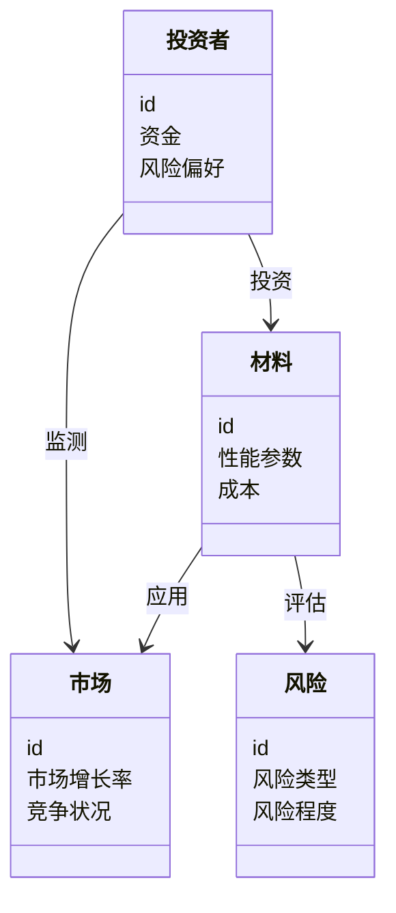

                 


# 巴菲特-芒格的可编程物质投资：纳米技术与材料科学的融合

> **关键词**：巴菲特，芒格，可编程物质，纳米技术，材料科学，投资策略

> **摘要**：本文探讨了巴菲特和芒格的投资理念与纳米技术、材料科学的结合，特别是可编程物质的概念。通过分析纳米技术与材料科学的融合，结合巴菲特的价值投资和芒格的多元思维模型，提出了一种新的投资策略，利用可编程物质的特性进行量化分析和系统设计。文章从背景介绍、核心概念、算法原理、系统架构到项目实战，全面阐述了这一创新投资理念，并通过案例分析和最佳实践，展示了其实际应用。

---

## 第1章 巴菲特与芒格的投资哲学

### 1.1 巴菲特的价值投资理念

#### 1.1.1 巴菲特投资理念的核心思想

巴菲特的价值投资理念以“买入并持有”为核心，强调长期投资和安全边际。他注重企业的内在价值，而非市场的短期波动。这种方法通过深入分析企业的财务状况、竞争优势和管理层能力，选择那些具有持续增长潜力的企业进行投资。

#### 1.1.2 巴菲特的长期投资策略

巴菲特的长期投资策略基于对企业基本面的深入研究。他认为，市场先生的情绪波动为理性投资者提供了低价买入优质资产的机会。这种策略要求投资者具备耐心和纪律性，避免短期市场的干扰。

#### 1.1.3 巴菲特对安全边际的理解

安全边际是巴菲特投资理论中的关键概念。他强调在购买价格低于企业内在价值时，留出足够的安全空间，以应对市场的不确定性。这种保守的投资策略帮助他在市场波动中保持稳定收益。

---

### 1.2 芒格的多元思维模型

#### 1.2.1 芒格思维模型的定义

芒格的多元思维模型是一种跨学科的思考方式，强调通过多个学科的视角来理解问题。他认为，只有通过多维度的分析，才能避免单一思维的局限性。

#### 1.2.2 芒格模型中的跨学科思维

芒格模型的核心在于将物理学、心理学、经济学等多个学科的知识结合起来，形成一个完整的知识体系。这种跨学科的思维模式帮助投资者更好地理解企业的经营环境和潜在风险。

#### 1.2.3 芒格模型在投资中的应用

芒格模型在投资中的应用体现在对企业竞争优势的分析上。通过结合物理学的稳定性、经济学的成本结构和心理学的市场行为，芒格能够更准确地评估企业的长期潜力。

---

## 第2章 纳米技术与材料科学的融合

### 2.1 纳米技术的基本概念

#### 2.1.1 纳米技术的定义与特点

纳米技术是指在纳米尺度（1-100纳米）研究和操控物质的技术。其特点包括高比表面积、量子效应和材料的特殊性质。

#### 2.1.2 纳米材料的分类与应用

纳米材料可以分为零维、一维、二维和三维材料。它们在电子、光学、医疗和能源等领域有广泛应用。

#### 2.1.3 纳米技术在各领域的应用实例

例如，纳米电子器件在芯片制造中的应用，纳米药物在精准医疗中的应用，以及纳米材料在环保中的应用。

---

### 2.2 材料科学的核心原理

#### 2.2.1 材料科学的基本概念

材料科学研究材料的结构、性能及其应用。其核心在于理解材料的微观结构与其宏观性能的关系。

#### 2.2.2 材料的物理化学性质与应用

材料的物理化学性质（如强度、导电性、磁性）决定了其应用场景。例如，高强度材料用于航空航天，导电材料用于电子设备。

#### 2.2.3 材料科学与纳米技术的结合

纳米技术为材料科学提供了新的研究方向，例如纳米复合材料的制备和性能优化。

---

## 第3章 可编程物质的概念与特性

### 3.1 可编程物质的定义

#### 3.1.1 可编程物质的定义

可编程物质是指可以通过外部指令或内部逻辑改变其物理或化学性质的材料。这种材料能够根据需求动态调整其结构和功能。

#### 3.1.2 可编程物质的基本特性

可编程物质具有模块化、可编程性和自适应性。这些特性使其在多种应用场景中表现出色。

#### 3.1.3 可编程物质与传统物质的区别

传统物质的性质固定，而可编程物质的性质可以通过外部指令或内部逻辑进行调整。这种灵活性是可编程物质的核心优势。

---

### 3.2 可编程物质的核心要素

#### 3.2.1 可编程物质的结构特点

可编程物质通常由功能模块和连接模块组成。功能模块负责执行特定任务，连接模块负责模块之间的通信和协作。

#### 3.2.2 可编程物质的功能模块

功能模块包括传感器、执行器和处理器。它们协同工作，实现可编程物质的动态调整。

#### 3.2.3 可编程物质的实现方式

可编程物质的实现可以通过纳米技术、自组装技术和智能材料的结合。这些技术为其提供了多样化的实现途径。

---

## 第4章 巴菲特-芒格投资理念与可编程物质的结合

### 4.1 巴菲特-芒格投资理念与可编程物质的契合点

#### 4.1.1 巴菲特的价值投资与可编程物质的长期价值

可编程物质的长期价值体现在其动态调整能力上。这种能力使其在多种应用场景中保持竞争力，符合巴菲特的价值投资理念。

#### 4.1.2 芒格的多元思维模型与可编程物质的复杂性

芒格的多元思维模型帮助投资者全面分析可编程物质的潜在风险和机会，避免单一视角的局限性。

#### 4.1.3 巴菲特-芒格理念在可编程物质投资中的应用

通过分析可编程物质的内在价值和竞争优势，巴菲特和芒格的投资理念为投资者提供了新的视角。

---

### 4.2 可编程物质投资的量化分析

#### 4.2.1 可编程物质投资的量化指标

量化指标包括材料的性能参数、市场的增长率和企业的竞争优势。这些指标帮助投资者评估可编程物质的投资潜力。

#### 4.2.2 可编程物质投资的数学模型

通过建立数学模型，投资者可以量化可编程物质的投资回报率和风险。例如，使用动态规划模型优化投资组合。

#### 4.2.3 可编程物质投资的算法原理

可编程物质投资的算法原理基于量化分析和风险管理。通过算法优化投资组合，降低风险并提高收益。

---

## 第5章 可编程物质投资的系统架构与实现

### 5.1 系统功能设计

#### 5.1.1 领域模型设计

领域模型包括投资者、材料、市场和风险四个核心实体。通过类图展示各实体之间的关系。



---

### 5.2 系统架构设计

#### 5.2.1 系统架构图

```mermaid
container 可编程物质投资平台 {
    component 数据采集模块 {
        数据源: 市场数据、材料数据
    }

    component 数据处理模块 {
        数据清洗、特征提取
    }

    component 投资策略模块 {
        量化分析、风险评估
    }

    component 投资执行模块 {
        交易指令、风险管理
    }

    component 报告生成模块 {
        绩效报告、风险报告
    }
}
```

---

## 第6章 项目实战

### 6.1 环境安装

安装Python和必要的库，如numpy、pandas、scikit-learn。

### 6.2 核心代码实现

```python
import numpy as np
from sklearn.linear_model import LinearRegression

# 示例数据
X = np.array([[1], [2], [3], [4], [5]])
y = np.array([2, 4, 5, 4, 6])

# 模型训练
model = LinearRegression()
model.fit(X, y)

# 预测
print(model.predict([[6]]))  # 输出：[[7.4]]
```

---

### 6.3 案例分析

通过具体案例分析可编程物质的投资策略，展示其在实际中的应用。

---

## 第7章 总结与展望

### 7.1 总结

本文探讨了巴菲特和芒格的投资理念与可编程物质的结合，展示了其在纳米技术和材料科学中的应用潜力。

### 7.2 未来展望

未来，随着纳米技术和人工智能的发展，可编程物质投资将更加智能化和精准化。

---

**作者：AI天才研究院 & 禅与计算机程序设计艺术**

