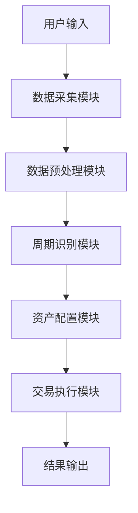

                 


# 巴菲特-芒格的周期投资观：如何在经济周期中获利

> 关键词：巴菲特，芒格，周期投资，经济周期，价值投资，投资策略

> 摘要：本文深入探讨巴菲特和芒格的周期投资观，分析经济周期对投资决策的影响，结合他们的投资理念，提出如何在经济周期中获利的具体策略。文章从周期投资的核心理论、算法原理、系统架构到实战案例，全面解析周期投资的精髓，并通过数学模型和实际案例帮助读者掌握周期投资的技巧。

---

## 第一部分：引言

### 1.1 投资界的传奇：巴菲特与芒格的投资哲学

#### 1.1.1 巴菲特与芒格的生平简介

沃伦·巴菲特（Warren Buffett）和查理·芒格（Charlie Munger）是投资界的传奇人物。巴菲特被誉为“股神”，以价值投资闻名，其投资理念强调长期持有优质资产。芒格则是巴菲特的长期合作伙伴，他提出的“多元思维模型”（mental models）为巴菲特的投资决策提供了深厚的理论基础。

#### 1.1.2 巴菲特与芒格的投资理念与核心思想

巴菲特的投资理念可以总结为“价值投资”，即寻找被市场低估的优质企业，长期持有，等待其价值回归。芒格则强调“多元思维模型”，认为投资者需要跨学科的知识储备，以更好地理解经济、心理、数学等多个领域的规律。

### 1.2 经济周期与投资的关系

#### 1.2.1 经济周期的基本概念与类型

经济周期是指经济活动的波动，通常分为四个阶段：衰退、复苏、过热和滞胀。每个阶段的特点不同，对投资的影响也各异。

#### 1.2.2 经济周期对投资决策的影响

经济周期的变化直接影响资产价格。在衰退期，资产价格可能下跌；在复苏期，价格逐渐回升；过热期，价格可能被高估；滞胀期，则可能引发市场波动。

#### 1.2.3 巴菲特与芒格的周期投资观的核心价值

巴菲特和芒格强调在周期性波动中寻找投资机会，尤其是在市场低迷时买入优质资产，在市场繁荣时卖出或减少投资。

### 1.3 本书的核心目标与结构

#### 1.3.1 本书的目标与意义

本文旨在通过分析巴菲特和芒格的周期投资策略，帮助读者在经济周期中获利，同时揭示周期投资的内在逻辑和实际应用。

#### 1.3.2 本书的结构与内容框架

文章分为引言、周期投资理论、算法与数学模型、系统架构、项目实战和总结展望几个部分，全面解析周期投资的各个方面。

---

## 第二部分：周期投资的核心理论

### 2.1 经济周期的定义与特征

#### 2.1.1 经济周期的四个阶段：衰退、复苏、过热、滞胀

每个阶段的特点和对投资的影响不同。例如，在衰退期，企业盈利下降，股票价格可能下跌；在复苏期，企业逐渐恢复，股票价格回升。

#### 2.1.2 经济周期的驱动因素与指标分析

经济周期受多种因素影响，包括GDP增长率、就业率、通胀率等。这些指标的变化可以帮助投资者判断经济所处的阶段。

#### 2.1.3 巴菲特与芒格对经济周期的特殊理解

巴菲特和芒格认为，经济周期是投资机会的来源，尤其是在市场恐慌时买入优质资产。

### 2.2 巴菲特与芒格的周期投资策略

#### 2.2.1 巴菲特的"价值投资"与周期的关系

价值投资强调寻找被市场低估的资产，周期性波动为这种投资提供了机会。例如，在衰退期，优质企业的股票可能被低估，此时买入可以获得超额收益。

#### 2.2.2 芒格的"多元思维模型"与周期的结合

芒格的多元思维模型强调跨学科的思考，帮助投资者更好地理解经济周期的变化，并制定相应的投资策略。

#### 2.2.3 巴菲特与芒格在周期中的投资决策框架

他们通过分析经济指标和企业基本面，制定逆周期的投资策略。例如，在市场低迷时增加仓位，在市场繁荣时减少仓位。

---

## 第三部分：周期投资的算法与数学模型

### 3.1 周期性资产配置的算法原理

#### 3.1.1 周期识别的算法步骤

1. 数据收集：收集历史经济指标和资产价格数据。
2. 数据预处理：清洗数据，去除异常值。
3. 周期识别：使用移动平均线（MA）或回归分析等方法识别周期。
4. 投资决策：根据识别的周期阶段，制定资产配置策略。

#### 3.1.2 使用Python实现周期识别算法

```python
import pandas as pd
import numpy as np

# 示例数据：假设为股票价格数据
prices = pd.read_csv('stock_prices.csv')

# 使用移动平均线识别周期
window = 50
ma = prices['close'].rolling(window).mean()

# 计算周期变化点
changes = ma.diff().abs().values
threshold = ma.std() * 2

periods = []
for i in range(len(changes)):
    if changes[i] > threshold:
        periods.append(i)
    else:
        periods.append(None)
```

#### 3.1.3 逆周期投资策略的数学模型

逆周期投资策略可以通过以下数学模型实现：

$$ \text{投资比例} = \frac{1}{1 + \alpha \cdot (\text{周期阶段})} $$

其中，$\alpha$ 是调节参数，周期阶段取值为0（衰退期）、1（复苏期）、2（过热期）、3（滞胀期）。

### 3.2 周期投资的数学模型与公式

#### 3.2.1 经济周期的数学表示

经济周期可以用时间序列模型表示，如ARIMA模型：

$$ y_t = \phi_1 y_{t-1} + \epsilon_t $$

其中，$y_t$ 是经济指标，$\phi_1$ 是自回归系数，$\epsilon_t$ 是白噪声。

#### 3.2.2 资产价格与经济周期的关系

资产价格与经济周期的关系可以用回归模型表示：

$$ p_t = \beta_1 c_t + \beta_2 x_t + \epsilon_t $$

其中，$c_t$ 是经济周期指标，$x_t$ 是其他影响因素。

---

## 第四部分：系统架构与实战案例

### 4.1 系统架构设计

#### 4.1.1 项目介绍

设计一个基于周期投资策略的自动交易系统，根据经济指标的变化调整投资组合。

#### 4.1.2 系统功能设计

1. 数据采集：收集经济指标和资产价格数据。
2. 周期识别：使用算法识别经济周期阶段。
3. 资产配置：根据周期阶段调整投资比例。
4. 风险控制：设置止损和止盈机制。

#### 4.1.3 系统架构图



### 4.2 项目实战

#### 4.2.1 环境安装

安装Python和相关库：

```bash
pip install numpy pandas scikit-learn matplotlib
```

#### 4.2.2 核心代码实现

```python
import pandas as pd
from sklearn.linear_model import LinearRegression

# 示例数据：假设为经济指标数据
data = pd.read_csv('economy_indicators.csv')

# 训练回归模型
model = LinearRegression()
model.fit(data[['GDP', 'inflation']], data['return'])

# 预测未来回报
future_data = pd.DataFrame({'GDP': [5], 'inflation': [3]})
predicted_return = model.predict(future_data)
print(predicted_return)
```

#### 4.2.3 案例分析

假设当前经济处于衰退期，根据模型预测，股票回报可能较低，应减少股票仓位，增加债券投资。

---

## 第五部分：总结与展望

### 5.1 本书的总结

本文通过分析巴菲特和芒格的周期投资策略，结合算法和数学模型，提出了在经济周期中获利的具体方法。投资者应根据周期变化调整投资策略，合理配置资产。

### 5.2 未来展望

未来，随着人工智能和大数据技术的发展，周期投资策略将更加精准和自动化。投资者可以利用这些技术工具，更好地把握周期变化，实现长期收益。

---

## 作者：AI天才研究院/AI Genius Institute & 禅与计算机程序设计艺术 /Zen And The Art of Computer Programming

---

本文通过详细分析巴菲特和芒格的周期投资观，结合算法和数学模型，为读者提供了在经济周期中获利的具体策略。希望本文能帮助读者更好地理解周期投资，并在实际操作中取得成功。

---

**注意事项**：

1. **长期视角**：周期投资需要耐心和长期视角，避免短期波动的干扰。
2. **风险管理**：在实际投资中，需严格控制风险，避免过度杠杆和集中投资。
3. **持续学习**：投资环境不断变化，需持续学习和调整策略。

**最佳实践**：

- 定期回顾投资组合，根据经济周期变化进行调整。
- 结合多元思维模型，全面分析投资标的。
- 使用技术工具辅助决策，提高投资效率。

