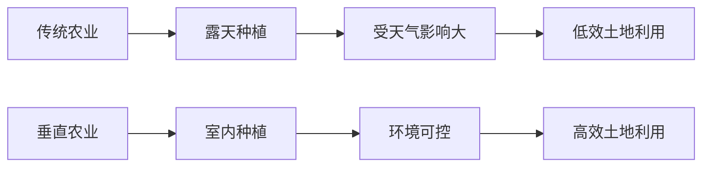
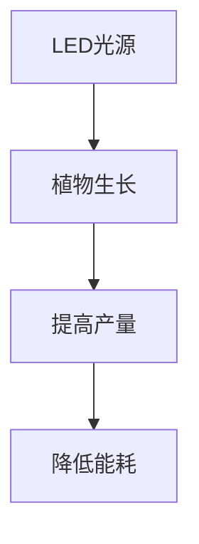

                 

# 《巴菲特-芒格的垂直农业投资：未来食品生产的新模式》

---

## 关键词

- 巴菲特
- 芒格
- 垂直农业
- 投资模式
- 未来食品生产

---

## 摘要

本文探讨了巴菲特和芒格在垂直农业领域的投资理念，分析了垂直农业作为未来食品生产新模式的潜力和挑战。通过结合投资分析框架和实际案例，本文揭示了垂直农业在技术驱动、商业模式创新和可持续发展方面的优势，并为投资者提供了深入的分析和见解。

---

## 第一部分：垂直农业的背景与潜力

### 第1章：垂直农业的基本概念与发展趋势

#### 1.1 垂直农业的定义与特点

**1.1.1 垂直农业的定义**

垂直农业是一种通过垂直空间利用和技术手段（如LED照明、自动化控制等）进行农作物种植的新型农业模式。其核心在于最大化土地利用率和生产效率，同时减少对自然环境的依赖。

**1.1.2 垂直农业的核心特点**

| 特点 | 描述 |
|------|------|
| 高效性 | 高密度种植，单位面积产量远超传统农业 |
| 可控性 | 环境条件（温度、湿度、光照等）可精确控制 |
| 可持续性 | 节水、节地、减少农药使用，符合环保要求 |
| 技术驱动 | 依赖先进的农业技术与数字化管理 |

**1.1.3 垂直农业与传统农业的对比**

---

#### 1.2 垂直农业的兴起背景

**1.2.1 全球人口增长与粮食需求**

全球人口预计将在2050年达到90亿，粮食需求将增长50%。传统农业难以满足日益增长的需求，尤其是在土地资源有限的城市地区。

**1.2.2 土地资源有限与城市化趋势**

城市化加速，可用土地减少，传统农业难以满足城市居民的食品需求。垂直农业通过室内种植解决了这一问题。

**1.2.3 环境保护与可持续发展的需求**

传统农业导致的环境问题（如水污染、土壤退化）严重。垂直农业通过减少农药使用和资源浪费，符合可持续发展的理念。

---

#### 1.3 垂直农业的技术驱动因素

**1.3.1 LED照明技术在垂直农业中的应用**

LED照明技术是垂直农业的核心技术之一。通过优化光照条件，可以提高作物生长效率并降低能源消耗。

---

### 第2章：巴菲特与芒格的投资理念

#### 2.1 巴菲特的价值投资原则

**2.1.1 价值投资的核心理念**

巴菲特的价值投资理念强调买入被市场低估的优质资产，长期持有，等待其价值回归。他注重企业的基本面分析，尤其是企业的盈利能力和竞争优势。

**2.1.2 巴菲特的投资策略与成功案例**

巴菲特成功投资的案例包括可口可乐和苹果公司。他的投资策略强调企业的长期盈利能力、管理团队和行业地位。

**2.1.3 巴菲特对垂直农业的潜在兴趣**

垂直农业作为一种高效率、可持续的农业模式，符合巴菲特对长期盈利和可持续发展的关注。他可能对具备技术优势和商业模式创新的垂直农业企业感兴趣。

---

#### 2.2 芒格的多元思维模型

**2.2.1 多元思维模型的定义与应用**

芒格的多元思维模型强调通过多个学科的交叉应用来解决问题。他主张投资者应具备广泛的知识储备，以更好地分析和预测市场趋势。

**2.2.2 芒格在投资中的思维框架**

芒格的思维框架包括对企业的微观分析（如财务状况、管理团队）和宏观分析（如行业趋势、政策环境）。他注重企业的竞争优势和长期发展前景。

**2.2.3 芒格对垂直农业的分析视角**

芒格可能从技术、市场、政策等多个角度分析垂直农业的投资价值。他关注企业的技术优势、市场需求和政策支持。

---

### 第3章：垂直农业的商业模式与经济可行性

#### 3.1 垂直农业的商业模式分析

**3.1.1 农业生产模式的创新**

垂直农业通过室内种植和技术创新实现了农业生产的工业化和高效化。其商业模式包括：

- 产品销售：直接向消费者或零售商销售农产品。
- 订阅服务：提供定期订阅的农产品配送服务。
- 技术输出：向其他企业输出种植技术和设备。

**3.1.2 技术驱动的成本优势**

垂直农业通过技术手段（如LED照明、自动化控制）降低了生产成本，提高了效率。例如，LED照明可以节省能源成本，自动化控制可以减少人工成本。

**3.1.3 市场需求与供应链管理**

垂直农业需要满足城市居民对新鲜、高质量农产品的需求。其供应链管理包括：

- 原料采购：与供应商合作，确保种子、肥料等的供应。
- 加工与包装：对农产品进行加工和包装，满足市场需求。
- 物流配送：通过高效的物流系统将产品送达消费者手中。

---

#### 3.2 垂直农业的经济可行性评估

**3.2.1 投资成本与回收周期**

垂直农业的投资成本较高，主要包括设备购置、场地租赁和人工成本。回收周期可能在3-5年之间，具体取决于企业的运营效率和市场需求。

**3.2.2 经营效率与生产成本比较**

垂直农业的生产效率远高于传统农业，但前期投资较大。例如，垂直农业的单位面积产量可能是传统农业的5-10倍。

**3.2.3 市场价格与消费者接受度**

垂直农业的农产品价格可能较高，但消费者对高质量、新鲜农产品的需求逐渐增加。垂直农业可以通过品牌建设和差异化竞争提高市场接受度。

---

### 第4章：垂直农业的投资分析框架

#### 4.1 投资分析的核心要素

**4.1.1 行业分析**

行业分析包括市场规模、增长潜力、竞争格局等。垂直农业的市场规模可能迅速增长，尤其是在城市地区。

**4.1.2 财务分析**

财务分析包括企业的收入、利润、现金流等指标。投资者需要关注企业的盈利能力、资产负债状况和现金流健康度。

**4.1.3 技术分析**

技术分析包括企业的技术优势、研发能力等。垂直农业的核心技术包括LED照明、自动化控制等，技术优势是企业竞争力的关键。

---

#### 4.2 投资决策的关键因素

**4.2.1 市场需求与消费者接受度**

垂直农业的市场需求取决于消费者对新鲜、高质量农产品的需求。消费者接受度高，市场需求大。

**4.2.2 技术可行性与创新潜力**

垂直农业的技术可行性取决于企业的技术水平和创新能力。技术优势是企业竞争力的关键。

**4.2.3 财务可持续性与盈利能力**

企业的财务可持续性和盈利能力是投资决策的重要因素。投资者需要关注企业的盈利能力、现金流和财务健康状况。

---

## 第五章：垂直农业的未来趋势与投资机会

### 5.1 垂直农业的未来发展趋势

**5.1.1 技术创新与产业升级**

未来，垂直农业将更加依赖技术创新，如人工智能、物联网、5G等技术将推动行业升级。

**5.1.2 市场扩展与全球化**

随着城市化进程加快，垂直农业将在全球范围内扩展，尤其是在人口密集的城市地区。

**5.1.3 政策支持与行业规范**

政府可能出台政策支持垂直农业的发展，包括税收优惠、补贴等。同时，行业规范和标准也将逐步完善。

---

## 第六章：结论与展望

### 6.1 结论

垂直农业作为一种高效、可持续的农业模式，符合巴菲特和芒格的投资理念。其技术创新和商业模式创新为其带来了巨大的市场潜力。投资者应关注企业的技术优势、市场需求和财务可持续性。

### 6.2 展望

未来，垂直农业将在技术创新、市场扩展和政策支持下继续发展。投资者应抓住这一新兴行业的投资机会，关注具备技术优势和竞争优势的企业。

---

## 作者：AI天才研究院/AI Genius Institute & 禅与计算机程序设计艺术 /Zen And The Art of Computer Programming

---

**本文基于技术原理和实际案例，深入分析了巴菲特和芒格在垂直农业领域的投资理念和商业模式。通过结合技术分析和投资框架，为读者提供了全面的视角和深入的见解。**

