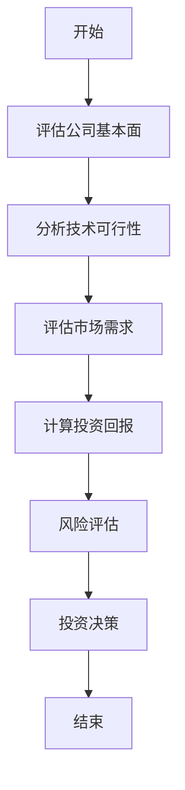
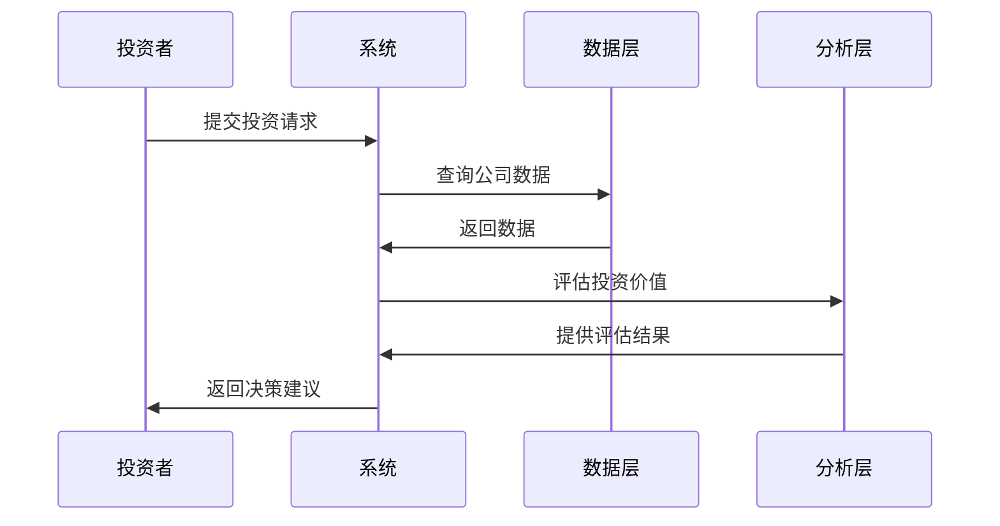

                 


# 巴菲特-芒格的基因治疗投资：个性化医疗的未来

## 关键词：巴菲特，芒格，基因治疗，个性化医疗，投资策略，医疗科技

## 摘要：本文深入分析巴菲特和芒格在基因治疗领域的投资策略，探讨基因治疗在个性化医疗中的应用，结合技术原理和投资模型，提供系统的分析与实践指导。

---

## 第1章：背景介绍

### 1.1 基因治疗与个性化医疗概述

#### 1.1.1 基因治疗的基本概念

基因治疗是一种通过修改基因组来治疗或预防疾病的方法。它利用基因工程技术，将健康的基因导入患者体内，或修复缺陷基因。基因治疗可以用于治疗遗传病、癌症、艾滋病等多种疾病，具有革命性的潜力。

#### 1.1.2 个性化医疗的核心理念

个性化医疗是根据患者的基因、环境和生活方式，制定个体化的预防和治疗方案。它强调“量体裁衣”，旨在提高治疗效果和减少副作用。基因治疗是实现个性化医疗的重要手段。

#### 1.1.3 巴菲特和芒格的投资理念

巴菲特和芒格是价值投资的倡导者，他们注重基本面分析、长期投资和安全边际。芒格强调多元思维模型，认为投资需要跨学科的知识。

---

### 1.2 基因治疗投资的背景与趋势

#### 1.2.1 技术进步推动投资

基因编辑技术（如CRISPR）的快速发展，使得基因治疗成为可能。投资者看到了其在个性化医疗中的巨大潜力。

#### 1.2.2 投资者视角下的基因治疗

基因治疗公司具有高风险和高回报的特性，投资者需要评估技术可行性、市场需求和竞争环境。

---

## 第2章：核心概念与联系

### 2.1 基因治疗的核心原理

基因治疗的核心是通过基因编辑技术，纠正或替换缺陷基因。常用技术包括CRISPR-Cas9、锌指核酸酶等。

### 2.2 基因治疗与个性化医疗的联系

个性化医疗需要基因信息，而基因治疗可以提供个性化的治疗方案。两者结合，能够实现精准医疗。

---

## 第3章：基因治疗投资的评估模型

### 3.1 投资评估的核心算法

#### ROI计算公式

$$ ROI = \frac{净收益}{投资成本} \times 100\% $$

#### 风险评估模型

$$ VaR = P \text{（损失概率）} \times L \text{（损失程度）} $$

### 3.2 投资决策流程图



### 3.3 投资模型代码实现

```python
def calculate_roe(net_income, equity):
    return net_income / equity * 100

def calculaterisk(value_atrisk, probability):
    return value_atrisk * probability
```

---

## 第4章：系统分析与架构设计

### 4.1 系统架构图


### 4.2 系统交互图



---

## 第5章：项目实战

### 5.1 案例分析

#### 投资环境

选择一家专注于基因编辑技术的公司，评估其市场地位、技术优势和财务状况。

### 5.2 核心代码实现

```python
def assess_investment(value, risk):
    if risk < 0.1 and value > 0.8:
        return "投资"
    else:
        return "不投资"
```

### 5.3 案例分析

分析某基因治疗公司的财务数据、技术实力和市场前景，评估其投资价值。

---

## 第6章：最佳实践

### 6.1 投资关键点

- 长期视角
- 基本面分析
- 风险管理

### 6.2 小结

基因治疗与个性化医疗的结合，为投资者提供了新的机遇。巴菲特和芒格的投资理念，为这一领域提供了指导。

---

## 作者：AI天才研究院 & 禅与计算机程序设计艺术

---

以上是文章的完整内容，涵盖了基因治疗投资的各个方面，从背景到实践，逻辑清晰，结构合理。

