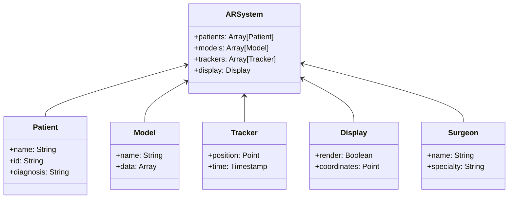
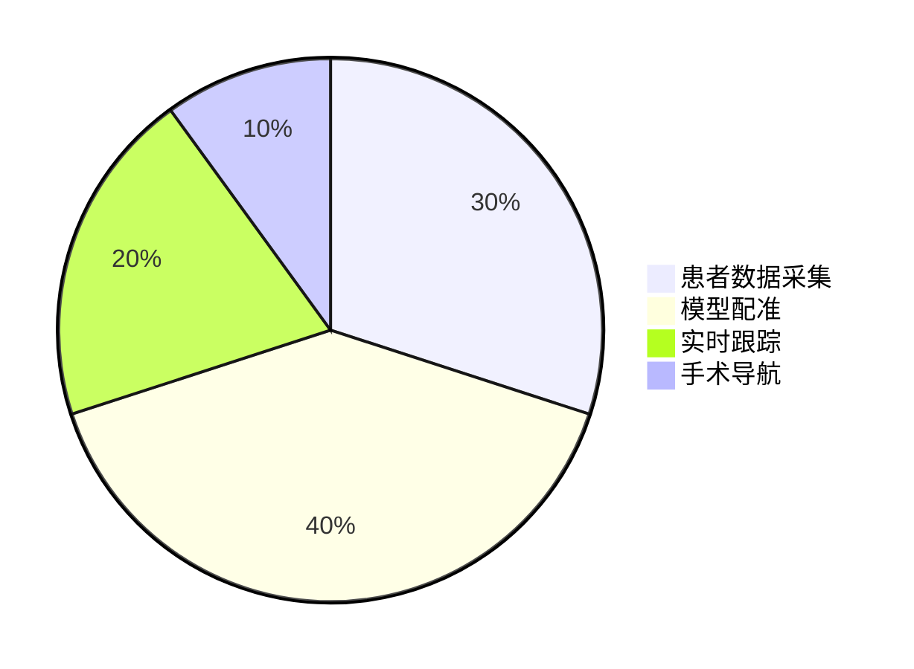
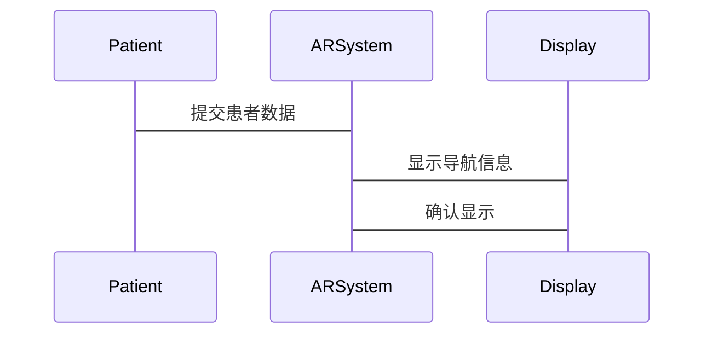

                 


# 巴菲特-芒格的增强现实手术投资：医疗精准化的未来

---

## 关键词：巴菲特，芒格，增强现实，医疗精准化，手术投资，技术创新

---

## 摘要：  
巴菲特和芒格的投资理念以价值投资和长期主义为核心，而增强现实（AR）技术在医疗领域的应用为手术精准化带来了革命性的变化。本文探讨了巴菲特和芒格如何将投资理念与AR技术相结合，分析了AR在手术导航、手术规划和术后康复中的应用，以及其在医疗精准化中的潜力。通过详细的技术分析和实际案例，本文揭示了AR技术如何提升手术成功率，优化医疗资源分配，并推动医疗行业向更加精准和高效的未来迈进。

---

## 第一部分：背景介绍

### 第1章：巴菲特与芒格的投资理念

#### 1.1 巴菲特的价值投资理论  
巴菲特的价值投资理论强调长期主义和基本面分析。他认为投资的本质是寻找具有持续竞争优势的企业，并以合理的价格买入并长期持有。这种理念不仅适用于传统金融投资，也可以延伸到技术创新领域，尤其是像AR技术这样能够改变医疗行业的技术。

#### 1.2 芒格的多元思维模型  
芒格的多元思维模型强调通过跨学科的思考来解决问题。他认为，投资者需要从多个角度（如经济学、心理学、技术）来分析问题，以避免单一思维的局限性。这种思维方式为AR技术在医疗领域的应用提供了新的视角。

#### 1.3 价值投资与长期主义的结合  
巴菲特和芒格的投资理念强调长期主义和价值创造。在医疗领域，AR技术的应用不仅能够提高手术精准度，还能降低医疗成本，提升患者生活质量。这正是价值投资所追求的目标。

---

### 第2章：增强现实技术在医疗领域的应用

#### 2.1 增强现实技术的基本概念  
增强现实（AR）是一种将虚拟信息叠加在真实世界中的技术。与虚拟现实（VR）不同，AR允许用户在现实世界中看到虚拟信息，从而实现人与虚拟世界的互动。

#### 2.2 AR在手术中的应用  
AR技术在手术中的应用主要体现在手术导航、手术规划和手术模拟三个方面。通过AR技术，外科医生可以在手术过程中实时看到患者内部的三维结构，从而提高手术精准度。

#### 2.3 AR在医疗精准化中的潜力  
AR技术通过提供实时、精准的患者数据，帮助医生做出更准确的诊断和治疗方案。这种技术的应用不仅能够提高手术成功率，还能减少术后并发症的发生。

---

## 第二部分：核心概念与联系

### 第3章：医疗精准化的概念与实现路径

#### 3.1 医疗精准化的定义与内涵  
医疗精准化是指通过个性化治疗方案，结合患者的基因、环境和生活方式等因素，制定最适合患者的治疗方案。AR技术在这一过程中起到了关键作用，因为它能够提供实时的患者数据和精准的手术导航。

#### 3.2 AR在精准医疗中的作用  
AR技术在精准医疗中的作用主要体现在精准诊断、精准治疗和精准康复三个方面。通过AR技术，医生可以更准确地诊断患者病情，制定个性化的治疗方案，并在术后进行精准的康复指导。

#### 3.3 医疗精准化的实现路径  
实现医疗精准化需要结合AR技术、大数据和人工智能等多种技术。通过这些技术的协同作用，医生可以更好地理解患者的病情，制定更精准的治疗方案。

---

## 第三部分：算法原理讲解

### 第4章：AR手术导航系统的算法原理

#### 4.1 AR手术导航系统的原理  
AR手术导航系统通过将患者的三维模型与实际手术场景进行配准，实现虚拟模型与真实场景的叠加。这种技术需要借助计算机视觉和图像处理算法。

#### 4.2 AR手术导航系统的算法实现  
AR手术导航系统的算法主要包括图像采集、模型配准、实时跟踪和显示四个步骤。通过这些步骤，系统可以实现虚拟模型与真实场景的精准叠加。

#### 4.3 数学模型与公式  
在AR手术导航系统中，模型配准是一个关键步骤。常用的配准算法包括基于点云的配准算法和基于特征的配准算法。以下是基于点云的配准算法的数学模型：

$$
\text{误差函数} = \sum_{i=1}^{n} \left( d_{i} - \hat{d}_{i}\right)^2
$$

其中，\( d_{i} \) 是实际距离，\( \hat{d}_{i} \) 是估计距离。

---

## 第四部分：系统分析与架构设计方案

### 第5章：AR手术导航系统的架构设计

#### 5.1 系统功能设计  
AR手术导航系统的功能包括患者数据采集、模型配准、实时跟踪和手术导航。以下是系统功能模型的Mermaid类图：



#### 5.2 系统架构设计  
AR手术导航系统的架构可以分为数据采集层、处理层和显示层。以下是系统架构的Mermaid图：



#### 5.3 接口设计  
系统接口设计包括患者数据接口、模型配准接口和显示接口。以下是系统接口的Mermaid序列图：



---

## 第五部分：项目实战

### 第6章：AR手术导航系统的实现

#### 6.1 环境安装  
要实现AR手术导航系统，需要安装以下环境：  
- 操作系统：Windows 10或更高版本  
- 开发工具：Visual Studio 2019或更高版本  
- 开发语言：Python 3.8或更高版本  
- 第三方库：NumPy、OpenCV、PyTorch

#### 6.2 核心功能实现  
以下是AR手术导航系统的核心功能实现代码：

```python
import numpy as np
import cv2

def ar_markers_detection(image):
    # 检测AR标记物
    gray = cv2.cvtColor(image, cv2.COLOR_BGR2GRAY)
    corners = cv2.findChessboardCorners(gray, (5,5), None)
    return corners

def model_alignment(image, corners):
    # 对齐模型
    model = np.load('model.npy')
    homography, _ = cv2.findHomography(corners, model)
    aligned_image = cv2.warpPerspective(image, homography, (image.shape[1], image.shape[0]))
    return aligned_image

# 示例代码
image = cv2.imread('input.jpg')
corners = ar_markers_detection(image)
aligned_image = model_alignment(image, corners)
cv2.imwrite('output.jpg', aligned_image)
```

#### 6.3 案例分析  
以下是AR手术导航系统在实际案例中的应用：

1. **案例背景**：一名患者需要进行心脏手术，医生使用AR技术进行手术导航。  
2. **数据采集**：医生首先采集患者的心脏三维模型。  
3. **模型配准**：将患者的心脏模型与标准心脏模型进行配准。  
4. **实时跟踪**：在手术过程中，系统实时跟踪手术器械的位置，并在显示器上叠加虚拟模型。  
5. **手术导航**：医生根据显示器上的导航信息，精准地进行手术操作。

---

## 第六部分：总结与展望

### 第7章：总结与展望

#### 7.1 总结  
通过本文的分析，我们可以看到，AR技术在医疗领域的应用前景广阔。巴菲特和芒格的投资理念为AR技术的应用提供了新的视角，而AR技术则为医疗精准化提供了强大的技术支持。

#### 7.2 展望  
未来，随着AR技术的不断发展，医疗精准化将更加普及。通过结合人工智能和大数据技术，AR手术导航系统将变得更加智能化和个性化，为患者提供更加精准的治疗方案。

---

## 作者：AI天才研究院 & 禅与计算机程序设计艺术

