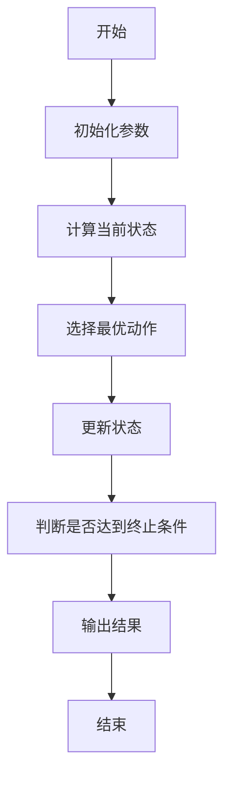
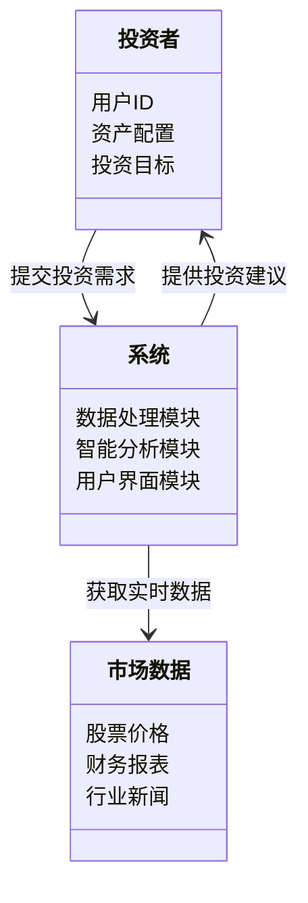
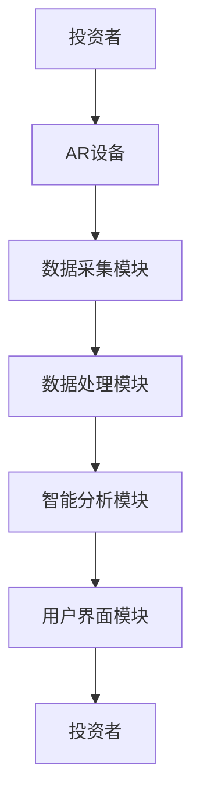

                 


# 巴菲特-芒格的增强现实技术投资：改变人机交互的未来

## 关键词

- 增强现实技术（AR）
- 巴菲特投资理念
- 人机交互
- 人工智能
- 数学模型
- 算法优化

## 摘要

本文探讨了巴菲特和芒格如何利用增强现实（AR）技术改变投资领域的人机交互方式。文章从AR技术的基本原理出发，结合巴菲特的价值投资策略，分析了AR在投资决策中的应用优势。通过详细阐述AR系统的架构设计、算法优化和项目实战，本文展示了AR技术如何提升投资效率，优化投资组合，从而实现更精准的投资决策。

---

## 第一部分：AR技术与巴菲特投资理念的背景介绍

### 第1章：AR技术的基本概念与发展历程

#### 1.1 AR技术的定义与基本原理

**1.1.1 增强现实（AR）的定义**

增强现实（Augmented Reality，AR）是一种将数字信息叠加在现实世界上的技术，通过计算机视觉、传感器和显示技术，使用户能够看到虚拟物体与真实环境的结合。AR的核心在于将虚拟信息无缝融入现实世界，提升用户的交互体验。

**1.1.2 AR技术的发展历程**

AR技术起源于20世纪60年代的军事应用，经历了从简单的图像叠加到如今的实时3D渲染和交互。近年来，随着智能手机和平板电脑的普及，AR技术得到了快速发展，应用领域涵盖游戏、教育、医疗和金融等多个行业。

#### 1.2 巴菲特与芒格的投资理念

**1.2.1 巴菲特的价值投资策略**

沃伦·巴菲特的价值投资策略强调长期持有优质股票，关注公司的基本面，寻找具有持续竞争优势和良好管理团队的企业。他主张以合理的价格买入优质的资产，长期持有，获得稳定的收益。

**1.2.2 芒格的多元思维模型**

查理·芒格的多元思维模型强调广泛涉猎各个领域的知识，通过跨学科的思考来解决复杂问题。他认为，投资者应该建立一个多元的思维框架，以更好地理解市场和企业的真实价值。

#### 1.3 AR技术在投资中的应用背景

**1.3.1 投资决策中的信息处理需求**

投资决策需要处理大量的信息，包括市场数据、公司财务报表、行业趋势等。传统的投资分析依赖于人工筛选和分析，效率较低，容易受到主观因素的影响。

**1.3.2 AR技术如何提升投资决策效率**

AR技术可以通过实时数据叠加，帮助投资者快速获取关键信息，提升分析效率。例如，投资者可以通过AR设备查看实时股价走势、公司财务数据和行业新闻，从而做出更明智的投资决策。

---

## 第二部分：AR技术的核心概念与投资应用

### 第2章：AR技术的核心原理

#### 2.1 AR技术的基本原理

**2.1.1 AR的核心技术组成**

AR系统主要由传感器、处理器、显示屏和应用程序组成。传感器用于捕捉真实环境的数据，处理器负责处理和渲染虚拟信息，显示屏将AR内容呈现给用户，应用程序实现用户交互。

**2.1.2 AR与VR的区别**

AR将虚拟内容叠加在现实世界中，而VR则完全沉浸在一个虚拟环境中。AR的特点是虚实结合，保持真实环境的连贯性，而VR则是完全虚拟的。

#### 2.2 AR技术在投资中的关键组成部分

**2.2.1 数据采集与处理**

AR系统需要实时采集市场数据，包括股票价格、财务报表、行业新闻等，通过数据处理模块进行清洗、分析和建模，为投资决策提供支持。

**2.2.2 智能分析与决策支持**

基于AR技术的智能分析系统可以实时预测市场趋势，评估投资风险，优化投资组合。通过机器学习算法，系统能够识别市场中的潜在机会和风险，为投资者提供决策支持。

#### 2.3 AR技术与传统投资方式的对比

**2.3.1 传统投资分析的局限性**

传统投资分析依赖于人工筛选和分析，效率较低，且容易受到主观因素的影响。此外，传统分析方法难以处理海量数据，难以发现潜在的投资机会。

**2.3.2 AR技术的优势与劣势**

AR技术的优势在于其高效的数据处理能力和实时的交互体验，能够显著提升投资决策的效率。然而，AR技术也存在一定的局限性，例如依赖硬件设备，数据处理的复杂性等。

---

## 第三部分：AR技术的算法原理与数学模型

### 第3章：AR技术的算法优化

#### 3.1 投资组合优化的数学模型

**3.1.1 投资组合优化的数学模型**

投资组合优化的目标是在风险可控的前提下，最大化投资收益。常见的优化模型包括均值-方差模型和风险中性模型。AR技术可以通过优化算法，帮助投资者找到最优的投资组合。

$$
\text{目标函数：} \quad \max \sum_{i=1}^{n} w_i r_i - \lambda \sum_{i=1}^{n} \sum_{j=1}^{n} w_i w_j \sigma_{ij}
$$

其中，\( w_i \) 是第 \( i \) 个资产的权重，\( r_i \) 是预期收益率，\( \sigma_{ij} \) 是资产 \( i \) 和资产 \( j \) 的协方差，\( \lambda \) 是风险厌恶系数。

**3.1.2 优化算法**

为了实现投资组合优化，AR系统采用动态规划算法。动态规划算法通过分解问题，找到子问题的最优解，进而得到整体问题的最优解。



#### 3.2 机器学习算法在AR中的应用

**3.2.1 机器学习算法**

AR系统可以通过机器学习算法预测市场趋势。常用的算法包括线性回归、支持向量机（SVM）和神经网络。

**3.2.2 算法流程**

1. 数据预处理：清洗和归一化数据。
2. 模型训练：使用训练数据训练机器学习模型。
3. 模型预测：利用训练好的模型预测市场趋势。
4. 结果评估：评估预测结果的准确性，调整模型参数。

---

## 第四部分：系统分析与架构设计

### 第4章：系统功能设计

#### 4.1 领域模型



#### 4.2 系统架构设计



#### 4.3 接口设计

系统主要接口包括：

- 投资者与系统交互接口：提交投资需求，接收投资建议。
- 系统内部接口：数据采集模块与数据处理模块的接口，智能分析模块与用户界面模块的接口。

---

## 第五部分：项目实战

### 第5章：AR投资系统实现

#### 5.1 环境安装

安装必要的开发工具，包括Python、Jupyter Notebook、OpenCV和AR框架（如ARKit或ARCore）。

#### 5.2 核心代码实现

以下是AR投资系统的Python代码示例：

```python
import numpy as np
import cv2

# 数据处理模块
def preprocess_data(data):
    # 数据清洗和归一化
    normalized_data = (data - np.mean(data)) / np.std(data)
    return normalized_data

# 智能分析模块
def predict_market(data):
    # 使用机器学习模型预测市场趋势
    model = load_model()
    prediction = model.predict(data)
    return prediction

# 用户界面模块
def display_ar(asset_data):
    # 使用OpenCV绘制AR界面
    cv2.putText(image, f"预测收益：{asset_data}", (10, 30), cv2.FONT_HERSHEY_SIMPLEX, 1, (0, 255, 0), 2)
    cv2.imshow("AR界面", image)
    cv2.waitKey(0)
    cv2.destroyAllWindows()

# 主程序
def main():
    data = get_market_data()
    processed_data = preprocess_data(data)
    prediction = predict_market(processed_data)
    display_ar(prediction)

if __name__ == "__main__":
    main()
```

#### 5.3 代码解读与分析

- `preprocess_data`函数用于清洗和归一化数据，确保数据输入模型前的一致性。
- `predict_market`函数使用预训练的机器学习模型进行市场预测，返回预测结果。
- `display_ar`函数利用OpenCV在图像上叠加预测信息，帮助投资者直观了解市场趋势。

#### 5.4 实际案例分析

假设我们有一个包含股票价格、财务报表和行业新闻的数据集，我们可以使用上述代码进行预测和分析。通过AR设备，投资者可以实时查看预测的收益和风险，做出更明智的投资决策。

---

## 第六部分：最佳实践与总结

### 第6章：总结与注意事项

#### 6.1 最佳实践

- 投资者应选择可靠的AR设备和系统，确保数据的准确性和实时性。
- 定期更新模型和数据，保持系统的高效性和准确性。

#### 6.2 总结

通过AR技术，投资者能够以更高效的方式处理信息，做出更明智的投资决策。AR技术的应用不仅提升了投资效率，还为投资领域带来了新的可能性。

#### 6.3 注意事项

- AR技术依赖硬件设备，投资者需要考虑设备的成本和维护。
- 数据处理的复杂性和模型的准确性也是需要重点关注的问题。

---

## 作者

作者：AI天才研究院/AI Genius Institute & 禅与计算机程序设计艺术 /Zen And The Art of Computer Programming

---

本文通过详细阐述AR技术在投资中的应用，结合巴菲特和芒格的投资理念，展示了AR技术如何改变人机交互的未来。希望本文能够为投资者和技术爱好者提供有价值的见解和启发。

