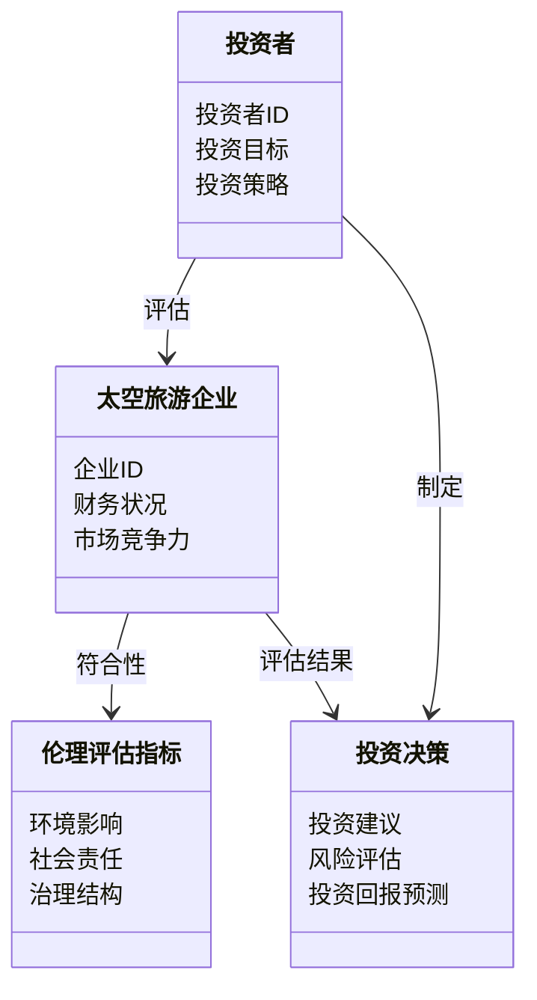
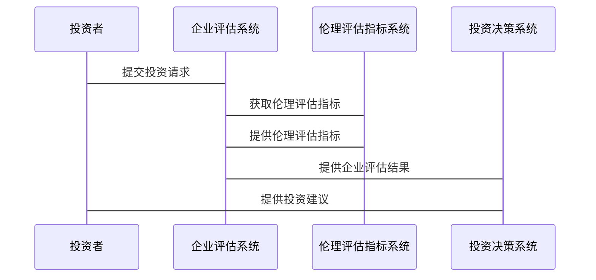

                 


# 巴菲特-芒格的太空旅游伦理投资：探索与保护的平衡

## 关键词：巴菲特，芒格，太空旅游，伦理投资，可持续发展，技术与伦理

## 摘要：  
本文探讨了巴菲特和芒格的投资理念在太空旅游领域的应用，分析了太空旅游产业的现状、挑战及伦理问题，提出了如何在探索与保护之间实现平衡的伦理投资框架。通过结合投资哲学与技术创新，本文为投资者提供了在太空旅游领域进行可持续投资的策略和方法，强调了技术与伦理的和谐统一。

---

# 第一部分：巴菲特-芒格投资理念概述

## 第1章：巴菲特-芒格投资哲学的核心思想

### 1.1 巴菲特的价值投资理论

- **价值投资的核心**：巴菲特的价值投资理念强调购买被低估的资产，长期持有，关注企业的内在价值而非市场波动。
- **安全边际的重要性**：通过分析企业的财务状况、竞争优势和管理团队，巴菲特确保投资的安全性。
- **长期主义**：巴菲特相信长期投资能够带来稳定的回报，避免短期市场的干扰。

### 1.2 芒格的多元思维模型

- **多元思维模型的定义**：芒格提出，投资者需要构建一个由多个学科知识组成的思维框架，以更好地理解复杂问题。
- **跨学科分析**：通过物理学、心理学、经济学等多学科的交叉分析，芒格能够更全面地评估投资机会。
- **决策的智慧**：芒格强调在决策中避免认知偏差，注重逻辑和事实。

### 1.3 两人投资理念的共同点与差异

- **共同点**：长期投资、价值发现、风险管理。
- **差异**：巴菲特更注重企业的财务指标，芒格更强调思维模型的构建。

## 第2章：太空旅游产业的现状与挑战

### 2.1 太空旅游的定义与发展

- **定义**：太空旅游指通过商业航班进入地球低轨，体验失重和地球视角的活动。
- **历史发展**：从早期的政府主导到如今的私人企业主导，太空旅游经历了从技术验证到商业化的转变。
- **市场现状**：市场规模快速增长，参与者包括SpaceX、Blue Origin等。

### 2.2 太空旅游的伦理与环境问题

- **环境影响**：太空旅游对地球环境的影响，如太空垃圾的产生和轨道资源的占用。
- **伦理争议**：太空资源的开发是否应该受到限制，如何平衡探索与保护。

### 2.3 技术与伦理的平衡

- **技术创新**：SpaceX等企业在降低太空旅行成本方面的技术突破。
- **伦理约束**：如何在技术创新中避免对环境和资源的过度消耗。

## 第3章：巴菲特-芒格投资理念与太空旅游的结合

### 3.1 价值投资与太空旅游企业的评估

- **企业评估**：通过分析太空旅游企业的财务状况、市场竞争力和管理团队，评估其投资价值。
- **安全边际**：确保投资的安全性，避免高风险企业。

### 3.2 多元思维模型在太空旅游投资中的应用

- **跨学科分析**：结合物理学、经济学和环境科学，评估太空旅游的技术可行性、市场潜力和环境影响。
- **风险管理**：通过多元思维模型，识别潜在风险并制定应对策略。

### 3.3 长期投资与太空旅游产业的发展

- **长期投资策略**：巴菲特和芒格的长期投资理念在太空旅游中的应用，关注企业的长期增长潜力。
- **可持续发展**：通过长期投资推动太空旅游的可持续发展，平衡探索与保护。

---

# 第二部分：太空旅游的伦理投资框架

## 第4章：伦理投资的核心原则

### 4.1 可持续发展原则

- **定义**：在投资过程中，注重环境、社会和治理（ESG）因素，确保投资的可持续性。
- **实施方法**：通过评估企业的环境影响、社会责任和治理结构，选择符合可持续发展原则的企业。

### 4.2 社会责任投资（SRI）

- **社会责任投资的定义**：将社会责任作为投资决策的重要因素，关注企业的社会影响。
- **投资策略**：选择在社会责任方面表现良好的企业，避免投资对环境和社会有害的企业。

### 4.3 环境、社会与治理（ESG）标准

- **环境因素**：评估企业在环境保护方面的表现，如能源消耗、碳排放等。
- **社会因素**：关注企业在社会责任、员工福利等方面的表现。
- **治理因素**：评估企业的治理结构和管理团队的透明度。

## 第5章：太空旅游的伦理评估指标

### 5.1 环境影响评估

- **环境影响的定义**：评估太空旅游活动对地球环境和外层空间的影响。
- **具体指标**：如太空垃圾的数量、轨道资源的消耗等。

### 5.2 社会责任履行

- **社会责任的定义**：企业在太空旅游活动中对社会和环境的责任。
- **具体指标**：如是否遵守国际太空法、是否采取措施减少环境影响等。

### 5.3 可持续发展与伦理投资的结合

- **可持续发展与伦理投资的定义**：在投资过程中，注重企业的可持续发展和社会责任，实现经济效益与社会价值的统一。
- **实施方法**：通过制定和执行可持续发展目标，推动企业在技术和伦理方面的平衡发展。

---

# 第三部分：系统分析与架构设计

## 第6章：系统功能设计

### 6.1 系统功能概述

- **目标**：构建一个基于巴菲特-芒格投资理念的太空旅游伦理投资系统，实现对太空旅游企业的全面评估和伦理投资决策。

### 6.2 领域模型设计



## 第7章：系统架构设计

### 7.1 系统架构概述


## 第8章：系统接口设计

### 8.1 接口概述

- **投资者接口**：投资者提交投资请求，获取评估结果和投资建议。
- **企业评估系统接口**：接收投资者的评估请求，提供企业评估数据。
- **伦理评估指标系统接口**：提供伦理评估指标，评估企业是否符合可持续发展原则。

## 第9章：系统交互设计

### 9.1 交互流程



---

# 第四部分：项目实战与最佳实践

## 第10章：环境安装与系统实现

### 10.1 环境安装

- **开发工具**：使用Python和相关库（如pandas、numpy）进行数据分析。
- **框架选择**：采用Django或Flask框架进行系统开发。

### 10.2 核心代码实现

```python
# 投资评估函数
def investment_assessment(company_data, ethicoal_factors):
    # 公司数据：包括财务状况、市场竞争力、治理结构等
    # 伦理因素：包括环境影响、社会责任、治理结构等
    # 计算投资价值
    value = company_data['财务状况'] * 0.4 + company_data['市场竞争力'] * 0.3 + company_data['治理结构'] * 0.3
    # 伦理评分
    ethicoal_score = ethicoal_factors['环境影响'] * 0.4 + ethicoal_factors['社会责任'] * 0.3 + ethicoal_factors['治理结构'] * 0.3
    # 综合评分
    total_score = value + ethicoal_score
    return total_score

# 示例调用
company_data = {
    '财务状况': 85,
    '市场竞争力': 90,
    '治理结构': 80
}
ethicoal_factors = {
    '环境影响': 75,
    '社会责任': 85,
    '治理结构': 85
}
print(investment_assessment(company_data, ethicoal_factors))
```

## 第11章：案例分析与解读

### 11.1 案例分析

- **案例背景**：SpaceX的太空旅游项目，评估其投资价值和伦理影响。
- **数据分析**：通过巴菲特-芒格的投资理念和伦理评估指标，分析SpaceX的投资价值和环境影响。

## 第12章：项目小结与最佳实践

### 12.1 项目小结

- **项目成果**：构建了一个基于巴菲特-芒格投资理念的太空旅游伦理投资系统，能够对太空旅游企业进行全面评估，提供伦理投资建议。
- **经验总结**：在投资过程中，需要结合技术与伦理，注重长期发展和可持续性。

### 12.2 最佳实践

- **技术方面**：采用先进的数据分析技术和系统架构，确保评估的准确性和效率。
- **伦理方面**：注重企业的社会责任和环境影响，推动太空旅游的可持续发展。
- **长期投资**：关注企业的长期增长潜力，避免短期波动的影响。

---

# 作者信息

作者：AI天才研究院/AI Genius Institute & 禅与计算机程序设计艺术 /Zen And The Art of Computer Programming

---

通过本文的分析和实践，我们展示了如何将巴菲特和芒格的投资理念应用到太空旅游领域，构建了一个伦理投资框架，平衡了探索与保护的关系。这一框架不仅为投资者提供了科学的决策依据，也为太空旅游产业的可持续发展提供了重要的指导。

