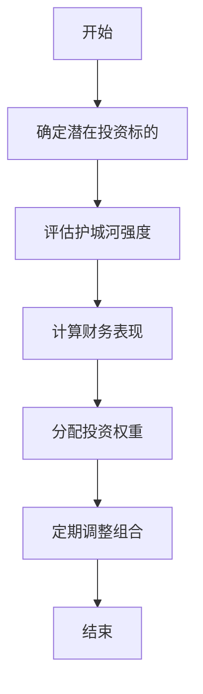
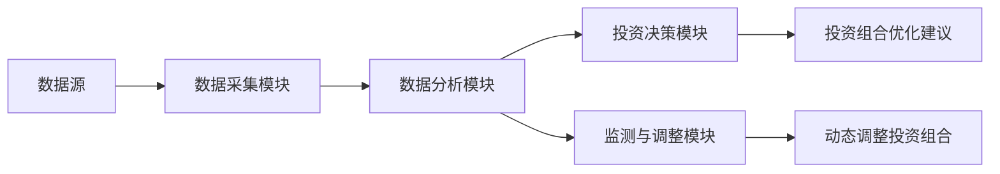

                 


# 巴菲特-芒格的太空经济投资：探索未来增长 frontier

> 关键词：巴菲特，芒格，太空经济，投资策略，价值投资，护城河理论，商业航天

> 摘要：本文深入分析了巴菲特和芒格在太空经济领域的投资策略，探讨了他们的投资哲学如何应用于新兴的商业航天和太空资源开发领域。通过结合具体案例和系统分析，文章揭示了太空经济的投资机会，并提供了从理论到实践的详细指导。

---

## 第一部分：背景介绍

### 第1章：太空经济的定义与现状

#### 1.1 太空经济的定义与范围
- 1.1.1 太空经济的定义
  太空经济是指涉及地球轨道及外层空间的商业活动，涵盖卫星通信、太空资源开发、深空探索等领域。
- 1.1.2 太空经济的主要领域
  - 卫星通信与互联网
  - 商业航天发射服务
  - 太空资源开发（如小行星采矿）
- 1.1.3 太空经济的全球发展趋势
  近年来，随着技术进步和成本下降，商业航天市场迅速增长，全球太空经济规模预计在未来十年内达到数万亿美元。

#### 1.2 巴菲特与芒格的投资哲学
- 1.2.1 巴菲特的价值投资理念
  - 长期持有的投资策略
  - 买入具有强大护城河的公司
  - 注重公司基本面和管理层
- 1.2.2 芒格的多元思维模型
  - 跨学科思考
  - 逆向思维
  - 寻找“安全边际”
- 1.2.3 两人投资哲学的异同
  巴菲特更注重财务指标，芒格更强调思维模型的应用。

#### 1.3 太空经济与投资的结合
- 1.3.1 太空经济的投资机会
  - 卫星通信技术的商业化
  - 商业航天企业的崛起
  - 太空资源开发的潜力
- 1.3.2 巴菲特与芒格投资风格与太空经济的契合点
  - 巴菲特的护城河理论适用于评估太空企业的竞争地位。
  - 芒格的多元思维模型有助于识别太空投资的风险和机会。
- 1.3.3 太空经济投资的未来潜力
  随着技术进步和市场需求增长，太空经济将呈现指数级增长，成为未来的重要投资领域。

---

## 第二部分：核心概念与联系

### 第2章：太空经济的商业模式

#### 2.1 太空经济的主要商业模式
- 2.1.1 发射服务
  - 提供火箭发射服务，如SpaceX的猎鹰9号。
  - 业务模式：按发射次数收费，重复使用火箭降低成本。
- 2.1.2 卫星制造与发射
  - 制造卫星并提供发射服务，如Space Systems Loral。
  - 业务模式：按卫星数量收费，提供后续运维服务。
- 2.1.3 太空资源开发
  - 开采小行星上的资源，如水、金属等。
  - 业务模式：技术开发与资源商业化结合。

#### 2.2 巴菲特与芒格投资策略的核心要素
- 2.2.1 巴菲特的护城河理
  - 护城河的定义：公司竞争优势的持久性。
  - 护城河的类型：成本优势、网络效应、品牌影响力等。
- 2.2.2 芒格的多元思维模型
  - 思维模型的分类：数学、物理、生物、心理学等。
  - 思维模型的应用：跨学科分析投资标的。

---

### 第3章：太空经济与巴菲特、芒格投资策略的联系

#### 3.1 太空经济的商业模式与巴菲特投资策略的契合
- 3.1.1 投资发射服务企业的护城河分析
  - 技术壁垒高，难以被竞争对手复制。
  - � 规模经济效应，成本优势明显。
- 3.1.2 卫星制造企业的护城河分析
  - 技术研发能力强，专利众多。
  - 与发射服务企业形成协同效应。

#### 3.2 芒格多元思维模型在太空经济投资中的应用
- 3.2.1 跨学科视角分析太空企业
  - 工程学：评估技术可行性。
  - 商业学：分析市场需求和竞争格局。
  - 法律：了解国际太空法对商业活动的影响。
- 3.2.2 逆向思维在太空投资中的应用
  - 寻找市场低估的太空企业。
  - 识别行业周期性低谷的投资机会。

---

## 第三部分：算法原理讲解

### 第4章：基于巴菲特投资策略的太空经济投资组合优化算法

#### 4.1 算法原理
- 4.1.1 算法目标
  构建一个符合巴菲特投资理念的太空经济投资组合，最大化投资回报率。
- 4.1.2 算法步骤
  1. 确定潜在投资标的（发射服务、卫星制造、太空资源开发企业）。
  2. 评估每个标的的护城河强度。
  3. 计算每个标的的历史财务表现。
  4. 根据护城河强度和财务表现分配投资权重。
  5. 定期调整投资组合，以保持最优配置。

#### 4.2 算法实现

##### 4.2.1 算法流程图（Mermaid）


##### 4.2.2 Python代码实现
```python
import pandas as pd
import numpy as np

# 数据准备
companies = ['SpaceX', 'Blue Origin', 'Satellite Company A', 'Satellite Company B']
护城河强度 = [0.9, 0.7, 0.8, 0.6]
财务表现 = [0.15, 0.1, 0.12, 0.08]

# 创建数据框
df = pd.DataFrame({
    '公司': companies,
    '护城河强度': 护城河强度,
    '财务表现': 财务表现
})

# 计算投资权重
df['权重'] = df['护城河强度'] * df['财务表现']
df['权重'] = df['权重'] / df['权重'].sum()

# 显示结果
print(df)
```

#### 4.3 数学模型与公式
- 投资权重计算公式：
  $$ 权重_i = \frac{护城河强度_i \times 财务表现_i}{\sum_{j} (护城河强度_j \times 财务表现_j)} $$
- 投资组合预期回报率：
  $$ E[R] = \sum_{i} (权重_i \times R_i) $$
  其中，\( R_i \) 是第i个标的的预期回报率。

---

## 第四部分：系统分析与架构设计

### 第5章：太空经济投资系统架构设计

#### 5.1 系统功能设计
- 5.1.1 功能模块
  - 数据采集：收集太空企业的财务数据和市场信息。
  - 数据分析：评估护城河强度和财务表现。
  - 投资决策：生成投资组合优化建议。
  - 监测与调整：跟踪投资表现并进行动态调整。

#### 5.2 系统架构设计（Mermaid图）


#### 5.3 系统接口设计
- 数据采集接口：从财经数据库获取企业财务数据。
- 数据分析接口：调用机器学习模型评估护城河强度。
- 投资决策接口：生成投资组合优化建议。

#### 5.4 系统交互流程（Mermaid图）


---

## 第五部分：项目实战

### 第6章：太空经济投资实战指南

#### 6.1 环境搭建
- 安装必要的工具和库：
  - Python 3.8+
  - Pandas, NumPy, Scikit-learn
  - Matplotlib或Seaborn

#### 6.2 数据收集与预处理
- 数据源：从财经数据库获取太空企业的财务数据。
- 数据清洗：处理缺失值和异常值。

#### 6.3 模型训练与优化
- 使用历史数据训练护城河强度评估模型。
- 验证模型准确性和稳定性。

#### 6.4 投资组合优化与实施
- 根据模型结果生成投资组合建议。
- 分配投资权重并执行交易。

#### 6.5 实际案例分析
- 案例：SpaceX的投资分析
  - 公司概况：SpaceX的护城河（技术领先、成本优势）。
  - 财务表现：历史收益与增长率。
  - 投资建议：配置较高权重于SpaceX。

---

## 第六部分：总结与展望

### 第7章：总结与展望

#### 7.1 最佳实践 tips
- 保持对太空经济趋势的关注。
- 结合巴菲特和芒格的投资哲学进行分析。
- 定期评估和调整投资组合。

#### 7.2 小结
本文详细探讨了巴菲特和芒格的投资策略在太空经济中的应用，通过理论分析和实战指导，为投资者提供了有效的投资框架。

#### 7.3 注意事项
- 投资需谨慎，注意市场风险。
- 保持对行业动态的敏感性。
- 确保投资决策基于充分的数据分析。

#### 7.4 拓展阅读
- 推荐书籍：《巴菲特传》、《芒格的思考艺术》。
- 推荐报告：SpaceX、Blue Origin等企业的财务报告和行业分析。

---

## 作者信息

作者：AI天才研究院/AI Genius Institute & 禅与计算机程序设计艺术 /Zen And The Art of Computer Programming

---

这篇文章通过背景介绍、核心概念、算法原理、系统架构、项目实战等部分，全面探讨了巴菲特和芒格的太空经济投资策略，为投资者提供了从理论到实践的详细指导。

