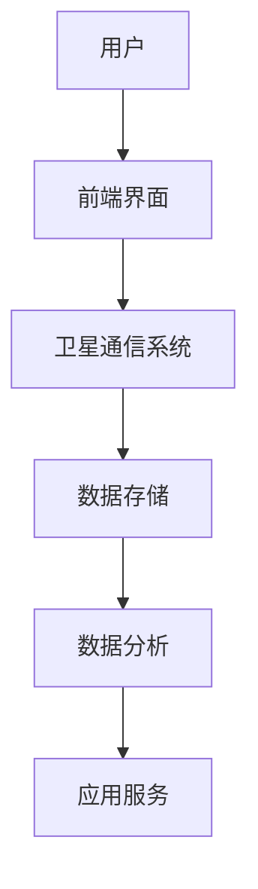
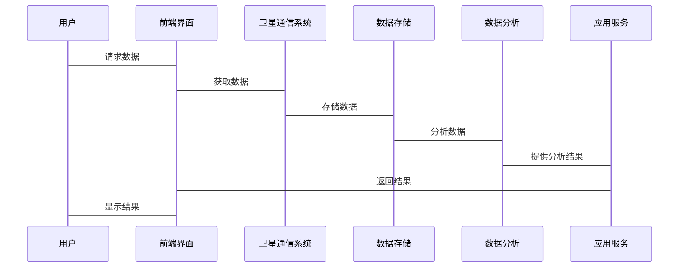

                 


# 巴菲特-芒格的太空经济投资：未来前沿的潜力

> 关键词：巴菲特，芒格，太空经济，投资策略，价值投资，经济分析

> 摘要：本文深入探讨了巴菲特和芒格的投资理念在太空经济中的应用潜力，分析了太空经济的核心产业链、投资机会以及如何通过价值投资和多元思维模型捕捉这些机会。文章结合了背景介绍、核心概念、系统分析和项目实战，为投资者提供了全面的视角。

---

## 第一部分：背景介绍

### 第1章：太空经济的定义与现状

#### 1.1 太空经济的定义与范围

太空经济是指围绕太空探索、卫星技术、深空探测和资源利用等活动所形成的经济体系。它涵盖了从卫星制造到火箭发射、从太空站建设到深空探测等多个领域。太空经济的核心驱动力是技术进步和商业化的推进。

#### 1.2 巴菲特与芒格的投资理念

- **巴菲特的价值投资理论**：巴菲特强调长期持有优质资产，关注企业的内在价值，而非短期市场波动。他注重企业的财务健康、竞争优势和管理层能力。
- **芒格的多元思维模型**：芒格提倡通过多个学科的交叉思维来理解复杂问题，强调独立思考和避免从众心理。

#### 1.3 太空经济的投资潜力

- 太空经济的市场规模正在迅速扩大，尤其是在卫星互联网、太空资源开发等领域。
- 技术进步降低了太空探索的成本，使得商业太空经济成为可能。
- 巴菲特和芒格的投资理念为太空经济提供了独特的视角，尤其是在寻找具有长期竞争优势的企业方面。

---

### 第2章：太空经济的核心产业链分析

#### 2.1 太空经济的上游产业

- **卫星制造**：包括通信卫星、导航卫星和遥感卫星的制造。
- **火箭技术**：火箭的制造和发射服务是太空经济的关键环节。
- **太空站与深空探测**：太空站和深空探测器的建设和运营。

#### 2.2 太空经济的中游产业

- **卫星通信与导航**：卫星通信技术在互联网和通信领域具有广泛应用。
- **太空资源开发**：包括 asteroid mining 和 lunar resource extraction。
- **太空旅游**：私人太空旅行的兴起为经济带来了新的增长点。

#### 2.3 太空经济的下游产业

- **数据服务**：卫星数据的应用涵盖农业、交通、环境监测等领域。
- **太空技术商业化**：将太空技术应用于民用领域。
- **政策与法规**：政府政策和国际法规对太空经济的发展具有重要影响。

---

### 第3章：巴菲特与芒格投资策略在太空经济中的应用

#### 3.1 巴菲特的价值投资策略

- 巴菲特寻找具有强大护城河的企业，这些企业能够在太空经济中保持竞争优势。
- 例如，投资于具有领先卫星技术的公司，如SpaceX或波音卫星业务。

#### 3.2 芒格的多元思维模型

- 芒格通过跨学科的视角分析太空经济，结合技术、经济和政策等多个维度。
- 例如，分析太空资源开发的可行性时，需要考虑技术、成本和政策因素。

#### 3.3 投资策略的结合

- 将价值投资与多元思维模型结合，寻找具有长期增长潜力且财务健康的企业。
- 例如，在卫星互联网领域，选择具有技术优势和良好财务状况的企业。

---

### 第4章：太空经济中的投资机会分析

#### 4.1 卫星互联网与通信技术

- 卫星互联网是太空经济的重要组成部分，尤其是在全球互联网覆盖和5G网络建设中。
- 投资机会包括卫星制造、发射服务和通信技术开发。

#### 4.2 太空资源开发与利用

- 太空资源开发包括 asteroid mining 和 lunar resource extraction，这些资源可能包括稀有金属和水冰。
- 投资机会包括技术开发、资源勘探和国际合作。

#### 4.3 太空旅游与娱乐产业

- 太空旅游市场正在快速发展，私人太空旅行公司如SpaceX和Blue Origin正在推动这一市场。
- 投资机会包括太空船制造、发射服务和旅游体验设计。

---

## 第二部分：系统分析与架构设计

### 第5章：系统分析与架构设计方案

#### 5.1 问题场景介绍

- 太空经济的复杂性要求投资者具备跨学科的视角。
- 投资者需要分析技术、经济、政策等多个维度。

#### 5.2 项目介绍

- 本文以卫星互联网项目为例，分析其投资机会和系统架构。

#### 5.3 系统功能设计

- **领域模型**：卫星互联网的产业链包括卫星制造、发射服务、通信技术和数据应用。
- **系统架构**：包括前端（用户界面）、后端（卫星通信技术）和数据层（数据存储与分析）。

#### 5.4 系统架构设计



#### 5.5 系统接口设计

- 用户与前端界面的交互接口。
- 前端与后端的通信接口。
- 数据存储与分析的接口。

#### 5.6 系统交互设计



---

### 第6章：项目实战

#### 6.1 环境安装

- 安装必要的开发工具，如Python、Jupyter Notebook、Matplotlib等。

#### 6.2 核心实现

```python
import numpy as np
import matplotlib.pyplot as plt

# 示例：卫星互联网的覆盖范围分析
def calculate_coverage(radius):
    theta = np.linspace(0, 2*np.pi, 100)
    x = radius * np.cos(theta)
    y = radius * np.sin(theta)
    plt.plot(x, y)
    plt.title('Satellite Internet Coverage')
    plt.show()

calculate_coverage(10)
```

#### 6.3 代码解读

- 该代码用于分析卫星互联网的覆盖范围，通过绘制圆形区域来表示卫星的覆盖范围。
- 参数 `radius` 表示卫星的覆盖半径。

#### 6.4 实际案例分析

- 以SpaceX的Starlink项目为例，分析其卫星互联网的覆盖范围和市场潜力。
- 使用上述代码进行覆盖范围的计算，结合市场需求进行投资评估。

#### 6.5 项目小结

- 卫星互联网是太空经济的重要组成部分，投资机会巨大。
- 通过技术分析和市场评估，可以找到具有长期增长潜力的企业。

---

## 第三部分：最佳实践

### 第7章：最佳实践与总结

#### 7.1 小结

- 巴菲特和芒格的投资理念为太空经济提供了独特的视角。
- 太空经济的核心产业链包括卫星制造、通信技术、资源开发和太空旅游。
- 投资者需要结合技术、经济和政策因素，寻找具有长期竞争优势的企业。

#### 7.2 注意事项

- 投资太空经济需要关注技术风险、政策风险和市场风险。
- 投资者应保持独立思考，避免盲目跟风。

#### 7.3 拓展阅读

- 建议阅读《巴菲特的思考》和《芒格的多元思维模型》。
- 关注太空经济领域的最新动态和政策变化。

---

## 作者信息

作者：AI天才研究院/AI Genius Institute & 禅与计算机程序设计艺术 /Zen And The Art of Computer Programming

---

**本文版权归作者所有，未经授权不得转载。**

