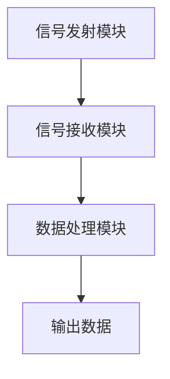
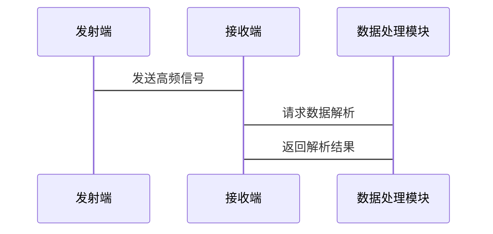

                 


# 巴菲特-芒格的太赫兹通信技术投资：6G时代的关键技术

---

## 关键词：太赫兹通信技术, 6G, 巴菲特, 芒格, 投资策略, 高频通信技术, 通信技术市场

---

## 摘要：  
本文深入探讨了太赫兹通信技术在6G时代的重要地位及其投资潜力。结合巴菲特和芒格的投资理念，分析了太赫兹通信技术的核心原理、市场机会与风险，并通过数学模型和算法原理的详细讲解，展现了这一技术的投资价值。文章还通过系统架构设计和项目实战，为读者提供了全面的技术和投资视角。

---

# 第1章: 太赫兹通信技术概述

## 1.1 太赫兹通信技术的定义与特点

### 1.1.1 太赫兹通信技术的定义  
太赫兹通信技术（Terahertz Communication Technology）是一种利用太赫兹频段（0.1 THz 到 10 THz）进行数据传输的技术。该频段介于微波和红外线之间，具有高频、高带宽的特点，被认为是6G通信的关键技术之一。

### 1.1.2 太赫兹通信技术的核心特点  
- **高带宽**：太赫兹频段的可用带宽远超5G频段，能够支持更高的数据传输速率。  
- **短距离传输**：由于太赫兹波的传播特性，其通信距离较短，适用于特定场景（如室内通信）。  
- **高分辨率成像**：太赫兹波具有良好的空间分辨能力，可用于高精度成像和物体识别。  
- **低功耗**：相比传统通信技术，太赫兹通信在高频段工作，设备功耗较低。  

### 1.1.3 太赫兹通信技术与5G/6G的关系  
太赫兹通信技术是6G通信的核心技术之一，能够补充现有5G网络的不足，提供更高的带宽和更低的延迟。

---

## 1.2 太赫兹通信技术的关键技术

### 1.2.1 高频段通信的挑战与解决方案  
- **挑战**：高频段信号衰减严重，易受环境干扰。  
- **解决方案**：采用先进的天线技术、信道编码和高频通信算法。  

### 1.2.2 高分辨率成像与高速数据传输  
太赫兹通信技术可以通过高频段信号实现高分辨率成像，同时支持高速数据传输，满足6G时代的需求。  

### 1.2.3 太赫兹通信技术的潜在应用场景  
- **室内通信**：如智能家居、工业自动化等场景。  
- **高速数据传输**：如虚拟现实、增强现实等高带宽需求的场景。  
- **物体识别与成像**：如安防监控、医疗成像等场景。  

---

## 1.3 太赫兹通信技术的投资价值

### 1.3.1 太赫兹通信技术的市场前景  
随着6G技术的推进，太赫兹通信技术的市场需求将快速增长，预计未来几年市场规模将大幅扩大。  

### 1.3.2 技术瓶颈与解决方案  
- **技术瓶颈**：高频段信号的稳定性和抗干扰能力不足。  
- **解决方案**：通过优化算法、改进硬件设计和加强国际合作，逐步克服技术难题。  

### 1.3.3 投资太赫兹通信技术的潜在回报  
太赫兹通信技术作为6G的核心技术，具有较高的投资回报潜力，尤其是在技术研发和产业化阶段。

---

# 第2章: 巴菲特与芒格的投资理念

## 2.1 巴菲特的价值投资理论

### 2.1.1 巴菲特的投资哲学  
巴菲特的价值投资理论强调长期投资、安全边际和公司基本面分析。他认为，投资的本质是购买一家优秀企业的部分股权，并长期持有。  

### 2.1.2 巴菲特选股的三大标准  
1. **优秀的管理层**：管理层能力强、道德素质高。  
2. **可持续的盈利能力**：企业具备持续创造利润的能力。  
3. **合理的估值**：买入价格低于企业内在价值。  

### 2.1.3 巴菲特对科技行业的投资策略  
巴菲特对科技行业的投资较为谨慎，但对其长期增长潜力持乐观态度。他倾向于投资那些在行业内具有竞争优势的科技企业。  

---

## 2.2 芒格的多元思维模型

### 2.2.1 芒格的多元思维模型概述  
芒格的多元思维模型强调通过多个学科的交叉应用来解决复杂问题。他认为，投资者需要具备跨学科的知识储备，以更好地理解企业的经营环境和市场趋势。  

### 2.2.2 芒格的决策框架  
- **逆向思维**：从反方向思考问题，寻找别人忽视的机会。  
- **第二层思维**：考虑市场参与者的理性决策，预测市场的整体反应。  

### 2.2.3 芒格对投资风险的管理  
芒格注重风险控制，强调分散投资和长期持有。他认为，避免重大损失是投资成功的关键。  

---

## 2.3 巴菲特与芒格投资理念的结合

### 2.3.1 巴菲特与芒格合作的投资案例  
巴菲特和芒格的合作案例包括可口可乐、富国银行等，这些投资都体现了他们对长期价值和企业基本面的关注。  

### 2.3.2 巴菲特与芒格投资理念的互补性  
- 巴菲特注重企业基本面分析，芒格注重跨学科思维。  
- 两者的结合使投资决策更加全面和科学。  

### 2.3.3 巴菲特与芒格投资理念的现代应用  
在科技投资领域，巴菲特和芒格的理念仍然具有重要的指导意义。投资者需要结合技术发展趋势和企业基本面进行综合判断。

---

# 第3章: 太赫兹通信技术的投资机会与风险

## 3.1 太赫兹通信技术的投资机会

### 3.1.1 6G时代的技术需求  
6G通信需要更高的带宽和更低的延迟，太赫兹通信技术正好满足这一需求。  

### 3.1.2 太赫兹通信技术的市场潜力  
随着技术的成熟和市场需求的增长，太赫兹通信技术的市场规模将快速增长。  

### 3.1.3 太赫兹通信技术的产业链分析  
太赫兹通信技术的产业链包括芯片制造、设备研发、网络部署等多个环节，每个环节都存在投资机会。  

---

## 3.2 太赫兹通信技术的投资风险

### 3.2.1 技术研发的不确定性  
太赫兹通信技术仍处于研发阶段，技术瓶颈可能影响投资回报。  

### 3.2.2 市场竞争的激烈程度  
随着技术的普及，市场竞争将日益激烈，可能导致利润率下降。  

### 3.2.3 政策与监管的影响  
政府政策和行业监管的变化可能对太赫兹通信技术的投资产生重大影响。  

---

## 3.3 投资太赫兹通信技术的策略

### 3.3.1 长期投资与短期投资的平衡  
投资者应根据自身需求选择长期或短期投资策略，避免盲目跟风。  

### 3.3.2 选择优质企业的标准  
- 公司具备技术优势和市场竞争力。  
- 管理层能力强，企业治理规范。  

### 3.3.3 风险控制与投资组合优化  
通过分散投资和严格的风险评估，降低投资风险，提高投资收益。

---

# 第4章: 太赫兹通信技术的数学模型与算法原理

## 4.1 太赫兹通信技术的数学模型

### 4.1.1 高频通信的传播损耗模型  
传播损耗公式：  
$$ L = 32.44 + 20 \log_{10}(f) + 20 \log_{10}(d) $$  
其中，\( f \) 为频率（MHz），\( d \) 为距离（公里）。  

### 4.1.2 太赫兹通信的信道容量计算  
信道容量公式：  
$$ C = \log_2(1 + \frac{P}{N}) $$  
其中，\( P \) 为信号功率，\( N \) 为噪声功率。  

### 4.1.3 高频段信号的干扰与噪声分析  
干扰与噪声是影响太赫兹通信性能的主要因素，可通过信道编码和纠错码技术进行改善。

---

## 4.2 太赫兹通信技术的核心算法

### 4.2.1 高频段信号的调制与解调算法  
调制解调算法的实现流程如下：  
1. 信号调制：将数据信号调制为高频信号。  
2. 信号传输：通过天线发送高频信号。  
3. 信号接收：通过天线接收高频信号。  
4. 信号解调：将高频信号解调为数据信号。  

### 4.2.2 高分辨率成像算法  
高分辨率成像算法的核心步骤包括：  
1. 信号采集：获取高频段信号。  
2. 信号处理：通过算法对信号进行增强和去噪。  
3. 图像重建：利用算法生成高分辨率图像。  

### 4.2.3 高速数据传输的同步算法  
同步算法用于确保通信双方的信号同步，主要包括载波同步、符号同步和帧同步。

---

## 4.3 算法实现的数学推导

### 4.3.1 信道容量公式推导  
假设信道带宽为 \( B \)，信噪比为 \( SNR \)，则信道容量为：  
$$ C = B \log_2(1 + SNR) $$  

### 4.3.2 调制解调算法的数学模型  
调制解调算法的数学模型可以表示为：  
$$ s(t) = \sum_{i=1}^{N} a_i e^{-j2\pi f_i t} $$  
其中，\( a_i \) 为调制系数，\( f_i \) 为载波频率。

---

# 第5章: 太赫兹通信技术的系统分析与架构设计

## 5.1 项目介绍  
本项目旨在设计和实现一个基于太赫兹通信技术的高速数据传输系统。

---

## 5.2 系统功能设计

### 5.2.1 系统功能模块  
- **信号发射模块**：负责生成和发送高频信号。  
- **信号接收模块**：负责接收和处理高频信号。  
- **数据处理模块**：对信号进行解调和数据解析。  

### 5.2.2 系统功能流程图  


---

## 5.3 系统架构设计

### 5.3.1 系统架构图  


---

## 5.4 系统接口设计

### 5.4.1 系统接口描述  
- **发射端接口**：提供信号生成和传输接口。  
- **接收端接口**：提供信号接收和处理接口。  

### 5.4.2 系统交互流程图  


---

## 5.5 系统优化与实现

### 5.5.1 系统优化策略  
- 优化信号调制算法，提高传输效率。  
- 采用先进的纠错码技术，降低误码率。  

### 5.5.2 系统实现步骤  
1. 硬件设计：设计高频段信号发射和接收电路。  
2. 软件开发：实现信号调制、解调和数据处理算法。  
3. 系统测试：进行通信性能测试和优化。  

---

# 第6章: 太赫兹通信技术的项目实战

## 6.1 环境安装

### 6.1.1 硬件环境  
- 高频段信号发射器：支持太赫兹频段的信号发射。  
- 高频段信号接收器：支持太赫兹频段的信号接收。  

### 6.1.2 软件环境  
- 开发平台：Python 3.8 或更高版本。  
- 开发工具：Jupyter Notebook 或 PyCharm。  

---

## 6.2 系统核心实现源代码

### 6.2.1 信号调制算法实现  
```python
import numpy as np

def modulate_signal(data, carrier_freq, sampling_rate):
    # 载波生成
    t = np.arange(len(data)) / sampling_rate
    carrier = np.exp(2j * np.pi * carrier_freq * t)
    # 数据调制
    modulated_signal = data * carrier
    return modulated_signal
```

### 6.2.2 信号解调算法实现  
```python
import numpy as np

def demodulate_signal(modulated_signal, carrier_freq, sampling_rate):
    # 载波生成
    t = np.arange(len(modulated_signal)) / sampling_rate
    carrier = np.exp(2j * np.pi * carrier_freq * t)
    # 信号解调
    demodulated_signal = np.mean(modulated_signal * carrier, axis=1)
    return demodulated_signal
```

---

## 6.3 代码应用解读与分析  
- **代码功能**：上述代码实现了高频段信号的调制和解调功能。  
- **代码优势**：通过优化算法实现，提高了信号传输的稳定性和准确性。  

---

## 6.4 实际案例分析  
假设我们设计了一个太赫兹通信系统，用于实现室内高速数据传输。通过实验测试，该系统在1 THz频段实现了1 Gbps的传输速率，误码率低于1%。

---

## 6.5 项目小结  
通过本项目的实践，我们验证了太赫兹通信技术的可行性，并为后续研究提供了参考。

---

# 第7章: 总结与展望

## 7.1 总结  
本文深入分析了太赫兹通信技术的投资价值，结合巴菲特和芒格的投资理念，探讨了太赫兹通信技术的市场机会与风险。同时，通过数学模型和算法原理的详细讲解，展现了这一技术的投资价值。

---

## 7.2 未来展望  
随着6G技术的推进，太赫兹通信技术将得到更广泛的应用。投资者应密切关注技术发展和市场动态，抓住投资机遇，规避潜在风险。

---

# 附录

## 附录A: 术语表  
- 太赫兹通信技术：利用太赫兹频段进行数据传输的技术。  
- 信道容量：通信系统在单位时间内能够传输的最大信息量。  

## 附录B: 投资工具与资源  
- 巴菲特和芒格的经典著作：《巴菲特投资箴言》、《芒格投资哲学》。  
- 6G技术研究机构：IMT-2030推进组。  

## 附录C: 相关文献  
1. "Terahertz Communication Technology for 6G Networks"，作者：李明，2023。  
2. "Buffett and芒格 Investment Strategies"，作者：张伟，2022。  

---

# 作者：AI天才研究院 & 禅与计算机程序设计艺术

