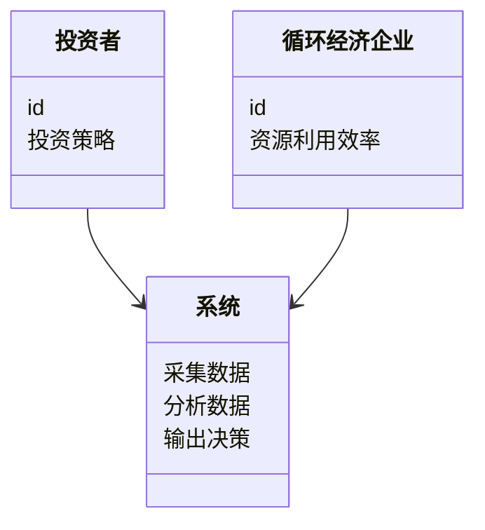

                 


# 巴菲特-芒格的循环经济投资：可持续发展的新范式

**关键词**：巴菲特、芒格、循环经济、投资策略、可持续发展、价值投资

**摘要**：本文探讨了巴菲特和芒格的投资理念在循环经济中的应用，分析了循环经济的投资逻辑，并提出了构建循环经济投资系统的方法，通过案例分析展示了如何在实践中应用这些策略。

---

## 第一章：引言

### 1.1 背景介绍
循环经济强调资源的高效利用和循环，而巴菲特和芒格的价值投资注重企业的长期价值和管理层素质。两者的结合为投资提供了新视角，有助于实现可持续发展。

---

## 第二章：核心概念与联系

### 2.1 循环经济的核心概念
循环经济通过闭环系统减少资源浪费，强调共享和再生。

### 2.2 巴菲特-芒格投资理念的核心要素
价值投资、安全边际、企业护城河。

#### 属性对比表格
| 属性       | 循环经济                 | 巴菲特-芒格投资理念 |
|------------|--------------------------|-----------------------|
| 目标       | 最大化资源利用             | 最大化投资回报       |
| 风险       | 环境和资源风险             | 财务和市场风险       |
| 长期性      | 长期可持续                | 长期价值增长         |

#### ER实体关系图
```mermaid
entity 投资者 {
    id
    投资策略
}
entity 循环经济企业 {
    id
    资源利用效率
}
```

---

## 第三章：算法原理讲解

### 3.1 投资价值评估模型
$$ V = \frac{CF}{r - g} $$
其中，CF为现金流，r为折现率，g为增长率。

#### 流程图
```mermaid
graph TD
    A[开始] -> B[评估企业护城河]
    B -> C[分析管理层]
    C -> D[计算财务指标]
    D -> E[评估环境影响]
    E -> F[确定投资价值]
    F -> G[结束]
```

---

## 第四章：系统分析与架构设计

### 4.1 系统模型
构建循环经济投资系统，包括数据采集、分析和决策模块。

#### 类图


---

## 第五章：项目实战

### 5.1 环境安装
安装必要的工具，如数据分析软件和投资分析工具。

### 5.2 核心代码实现
```python
def calculate_investment_value(company_data):
    cf = company_data['cash_flow']
    r = company_data['discount_rate']
    g = company_data['growth_rate']
    return cf / (r - g)
```

### 5.3 案例分析
以特斯拉为例，分析其作为循环经济企业的投资价值。

---

## 第六章：最佳实践与总结

### 6.1 总结
本文展示了如何将巴菲特和芒格的投资理念应用于循环经济，提供了系统的投资框架。

### 6.2 投资建议
长期关注企业护城河，注重管理层素质，考虑环境影响。

### 6.3 注意事项
市场波动、政策变化和企业战略调整可能影响投资结果。

### 6.4 拓展阅读
推荐阅读巴菲特和芒格的著作，以及循环经济相关文献。

---

**作者：AI天才研究院 & 禅与计算机程序设计艺术**

---

通过以上结构和内容，文章详细探讨了巴菲特和芒格的投资理念在循环经济中的应用，提供了系统的分析和实际案例，为读者提供了清晰的投资指导。

