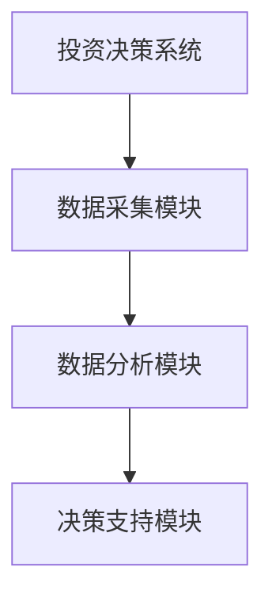
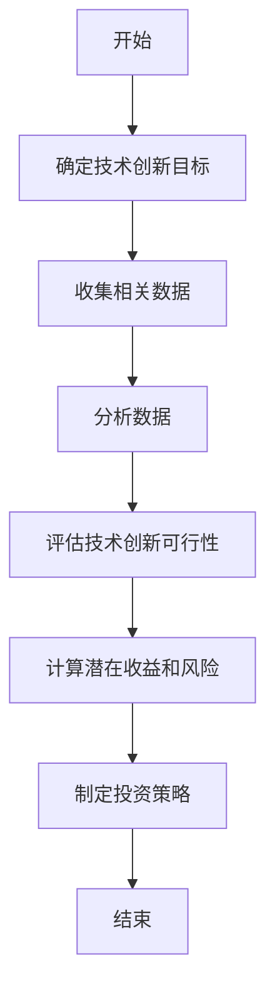

                 

# 巴菲特-芒格的技术创新观：如何在变革中把握投资机会

## 关键词：巴菲特，芒格，技术创新，投资策略，风险管理，价值投资，技术评估

## 摘要：  
本文深入探讨了巴菲特和芒格的投资哲学，特别是他们如何在技术创新的背景下把握投资机会。通过分析技术创新的基本概念、分类、评估模型以及风险管理策略，结合实际案例和系统架构设计，本文为投资者提供了一套在快速变革的技术环境中做出明智投资决策的方法论。文章还通过数学模型和算法原理的详细讲解，展示了如何将技术创新与投资策略相结合，帮助投资者在复杂多变的市场中捕捉长期价值。

---

# 第一部分：巴菲特与芒格的投资哲学

## 第1章：巴菲特与芒格的投资哲学概述

### 1.1 投资的基本概念

#### 1.1.1 投资的定义与分类
- **投资的定义**：投资是指将资金投入到能够产生未来收益的资产或项目中，以实现资产增值的过程。
- **投资的分类**：根据资产类型，投资可以分为股票、债券、房地产、货币市场工具等。根据风险水平，投资可以分为低风险（如政府债券）和高风险（如初创企业）。

#### 1.1.2 巴菲特与芒格的投资理念
- **巴菲特的价值投资理念**：巴菲特强调以合理价格买入具有强大竞争优势的公司，长期持有，获得复利收益。
- **芒格的多元思维模型**：芒格主张通过多个学科的交叉应用，形成全面的决策框架，避免单一思维的局限性。

#### 1.1.3 技术创新在投资中的重要性
- 技术创新是推动企业增长的核心动力，尤其是在科技行业，技术创新往往决定企业的生死存亡。
- 投资者需要识别那些能够持续创新并保持竞争优势的企业。

### 1.2 巴菲特的价值投资理论

#### 1.2.1 价值投资的核心原则
- **安全边际**：巴菲чу强调以低于内在价值的价格买入资产，以确保投资的安全性。
- **长期视角**：价值投资不是短期交易，而是关注企业的长期盈利能力。

#### 1.2.2 巴菲特的“护城河”概念
- **护城河的定义**：护城河是指企业拥有的独特竞争优势，使其能够抵御竞争对手的侵蚀。
- **护城河的类型**：包括成本优势、品牌优势、技术壁垒、网络效应等。

#### 1.2.3 长期投资与复利效应
- 长期投资通过复利效应，能够显著提升资产的增值速度。
- 巴菲特的“雪球投资法”强调通过持续买入优质资产，滚雪球式地积累财富。

### 1.3 芒格的多元思维模型

#### 1.3.1 多元思维模型的定义
- 多元思维模型是指通过多个学科和领域的知识，形成一个立体的思维方式，从而更好地理解和解决复杂问题。
- 芒格认为，单一的思维方式容易导致决策失误，而多元思维模型能够帮助投资者全面分析问题。

#### 1.3.2 芒格的“ inversion”思维
- **inversion思维**：芒格强调从反向思考问题，即先思考“我希望避免什么”，然后再思考“我想要什么”。
- 例如，在投资中，先考虑“什么情况下企业会失败”，然后再寻找成功的机会。

#### 1.3.3 复杂决策中的思维模型应用
- 在复杂的投资决策中，芒格建议投资者将多个思维模型结合起来，形成一个综合的判断框架。
- 例如，在评估技术创新型公司时，可以结合技术评估模型、市场分析模型和财务模型。

---

## 第2章：技术创新的基本概念与分类

### 2.1 技术创新的定义与特征

#### 2.1.1 技术创新的定义
- 技术创新是指在现有技术基础上，通过改进或发明新的技术、产品或服务，以满足市场需求的过程。

#### 2.1.2 技术创新的分类
- **产品创新**：开发新产品或改进现有产品。
- **服务创新**：引入新的服务模式或优化现有服务。
- **流程创新**：优化生产流程或管理流程。
- **商业模式创新**：创新企业的盈利模式。

#### 2.1.3 技术创新的核心要素
- **技术可行性**：技术创新必须能够在实际应用中实现。
- **市场潜力**：技术创新必须能够满足市场需求并带来商业价值。
- **竞争优势**：技术创新必须能够为企业带来竞争优势。

### 2.2 技术创新与投资的关系

#### 2.2.1 技术创新对投资的影响
- 技术创新能够提升企业的竞争力，从而提高企业的盈利能力。
- 技术创新也带来了新的投资机会，尤其是在科技领域。

#### 2.2.2 技术创新周期与投资机会
- 技术创新通常经历引入期、成长期、成熟期和衰退期，投资者需要根据技术创新所处的周期阶段，制定相应的投资策略。

#### 2.2.3 技术创新风险与收益的平衡
- 技术创新的高风险与高收益并存，投资者需要在风险可控的前提下，追求最大的收益。

### 2.3 技术创新的评估标准

#### 2.3.1 技术创新的市场潜力
- 市场潜力包括市场规模、增长速度和竞争对手情况。

#### 2.3.2 技术创新的可行性分析
- 技术创新的可行性分析包括技术可行性、经济可行性和市场可行性。

#### 2.3.3 技术创新的经济价值
- 技术创新的经济价值包括成本节约、收入增加和竞争优势提升。

---

## 第3章：技术创新的评估与分析

### 3.1 技术创新的评估模型

#### 3.1.1 技术创新的生命周期模型
- 技术创新的生命周期包括引入期、成长期、成熟期和衰退期。

#### 3.1.2 技术创新的SWOT分析
- **SWOT分析**：SWOT分析包括优势（Strengths）、劣势（Weaknesses）、机会（Opportunities）和威胁（Threats）四个维度。

#### 3.1.3 技术创新的财务评估指标
- **净现值（NPV）**：NPV是技术创新项目未来现金流的现值与初始投资的差额。
- **内部收益率（IRR）**：IRR是技术创新项目未来现金流的现值等于初始投资时的折现率。

### 3.2 技术创新的风险管理

#### 3.2.1 技术创新的风险来源
- **技术风险**：技术创新可能失败或被替代。
- **市场风险**：市场需求可能不足或变化。
- **财务风险**：技术创新可能需要大量资金投入，导致财务压力。

#### 3.2.2 技术创新风险的量化方法
- **概率加权法**：将不同风险的可能性和影响程度进行加权计算。
- **蒙特卡罗模拟**：通过模拟不同情景，评估技术创新的潜在风险。

#### 3.2.3 风险控制的策略与工具
- **分散投资**：通过投资多个技术创新项目，降低风险。
- **风险管理模型**：使用数学模型量化风险，制定应对策略。

---

## 第4章：技术创新投资的数学模型与算法

### 4.1 价值评估模型

#### 4.1.1 股票内在价值的计算公式
股票的内在价值可以通过未来现金流的现值计算：
$$ V = \sum_{t=1}^{n} \frac{C_t}{(1 + r)^t} $$
其中，\( C_t \) 是第 \( t \) 年的现金流，\( r \) 是贴现率。

#### 4.1.2 股东权益价值
股东权益价值可以通过以下公式计算：
$$ V_{\text{equity}} = V_{\text{firm}} - V_{\text{debt}} $$

### 4.2 风险管理模型

#### 4.2.1 技术创新风险的量化
技术创新风险可以通过以下步骤量化：
1. 确定技术创新的潜在风险因素。
2. 评估每个风险因素的发生概率和影响程度。
3. 使用概率加权法计算总体风险值。

#### 4.2.2 风险控制策略
- **风险分散**：通过投资多个项目降低风险。
- **风险对冲**：使用金融工具对冲特定风险。

---

## 第5章：系统分析与架构设计

### 5.1 投资决策系统架构设计

#### 5.1.1 系统功能设计
- **数据采集模块**：收集企业的财务数据、市场数据和技术创新数据。
- **数据分析模块**：对数据进行处理和分析，生成投资报告。
- **决策支持模块**：提供投资建议和风险预警。

#### 5.1.2 系统架构设计
使用Mermaid图展示系统架构：

### 5.2 技术创新评估的流程图

---

## 第6章：项目实战

### 6.1 实际案例分析

#### 6.1.1 苹果公司的技术创新
- 苹果公司通过不断创新（如iPhone、iPad、Mac等）保持了其在科技领域的领先地位。
- 投资者可以通过分析苹果公司的技术创新能力和市场潜力，制定相应的投资策略。

#### 6.1.2 特斯拉的技术创新
- 特斯拉在电动汽车和可再生能源领域进行了大量创新，推动了行业的技术进步。
- 投资者可以分析特斯拉的技术创新周期和市场潜力，评估其投资价值。

### 6.2 投资策略与风险管理

#### 6.2.1 投资策略
- **长期持有**：选择具有持续创新能力的企业，长期持有。
- **分散投资**：通过投资多个技术创新项目降低风险。

#### 6.2.2 风险管理
- 定期评估技术创新项目的进展，及时调整投资策略。

---

## 第7章：总结与展望

### 7.1 经验总结

#### 7.1.1 技术创新的重要性
技术创新是企业长期发展的核心动力，也是投资者的重要关注点。

#### 7.1.2 投资策略的有效性
通过结合巴菲特的价值投资理念和芒格的多元思维模型，投资者可以更好地把握技术创新带来的投资机会。

### 7.2 未来展望

#### 7.2.1 技术创新的趋势
随着人工智能、区块链等技术的快速发展，技术创新将继续推动企业的变革和投资机会的出现。

#### 7.2.2 投资者的角色
投资者需要不断提升自身的知识储备和分析能力，以更好地应对技术创新带来的挑战和机遇。

---

## 附录：工具与资源

### 附录A：技术创新评估工具
- **SWOT分析工具**
- **NPV和IRR计算工具**
- **风险管理模型工具**

### 附录B：相关书籍与文献
- 巴菲特的《巴菲特致股东的信》
- 芒格的《Poor Charlie's Almanack》
- 技术创新相关的学术文献和研究报告

---

## 作者：AI天才研究院/AI Genius Institute & 禅与计算机程序设计艺术 /Zen And The Art of Computer Programming

---

**摘要**：  
本文通过分析巴菲特和芒格的投资哲学，结合技术创新的基本概念和分类，详细探讨了技术创新在投资中的重要性。通过数学模型和系统架构设计，本文为投资者提供了一套在快速变革的技术环境中做出明智投资决策的方法论。文章还通过实际案例分析，展示了如何将技术创新与投资策略相结合，帮助投资者在复杂多变的市场中捕捉长期价值。

