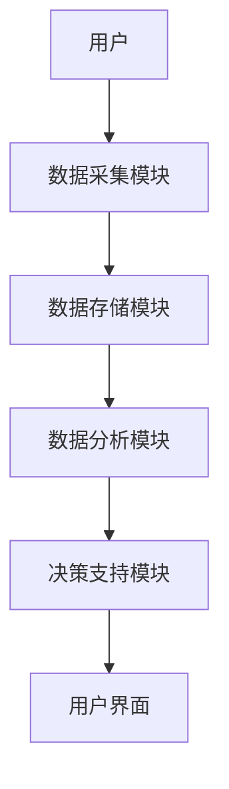
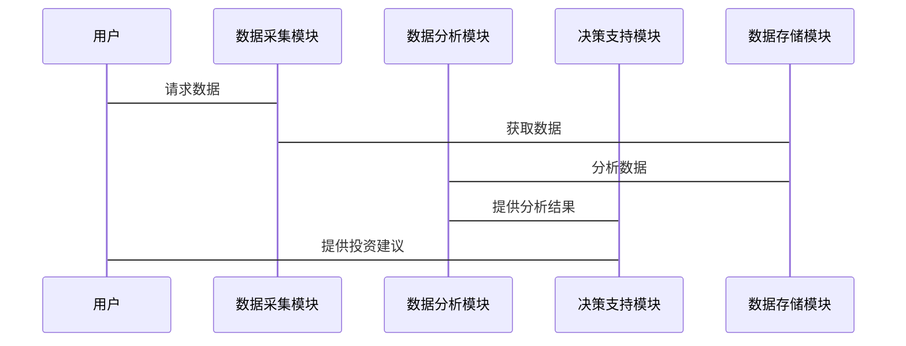

                 


# 巴菲特-芒格的数字经济投资策略：传统智慧在新经济中的应用

---

## 关键词：
- 巴菲特-芒格投资策略
- 数字经济
- 价值投资
- 数字化转型
- 风险管理

---

## 摘要：
本文深入探讨了巴菲特和芒格的传统投资策略在数字经济中的应用。通过分析数字经济的特点和挑战，结合传统投资理念，提出了将价值投资、安全边际和长期思维等策略应用于数字领域的具体方法。文章从背景介绍、核心概念、算法原理、系统架构到项目实战，全面解析了如何将传统智慧与现代技术结合，为投资者提供了新的视角和工具。

---

## 第一部分：背景与基础

### 第1章：巴菲特-芒格投资策略概述

#### 1.1 核心理念
- **价值投资**：寻找具有持续竞争优势的企业，关注内在价值而非市场波动。
- **安全边际**：在投资中留有余地，确保在合理价格范围内买入。
- **长期思维**：关注企业的长期价值，而非短期收益。

#### 1.2 投资哲学
- **知识的局限性**：认识到自身的知识边界，避免过度自信。
- **风险管理**：将风险视为投资决策的核心因素，而非单纯追求收益。
- **综合评估**：结合财务、市场和技术等多方面因素，评估企业的长期潜力。

#### 1.3 策略演变
- **传统投资策略的数字化转型**：从实体企业转向数字资产和科技公司。
- **新经济中的挑战**：数据驱动、网络效应和平台经济对企业估值的影响。
- **策略调整**：动态调整投资组合，适应数字经济的变化。

### 第2章：数字经济的基本概念与特征

#### 2.1 数字经济的定义与范围
- **定义**：数字经济是以数据为生产要素，以数字技术为核心驱动力的经济形态。
- **领域**：包括互联网、人工智能、大数据、区块链等。
- **与传统经济的区别**：数据资源化、技术驱动、网络效应强。

#### 2.2 数字经济的核心驱动力
- **数据资源**：数据成为企业竞争的核心资源。
- **技术创新**：人工智能、大数据等技术推动商业模式变革。
- **数字化转型**：企业通过数字化提升效率和竞争力。

#### 2.3 投资机会与风险
- **机会**：数字技术带来的新商业模式和高增长企业。
- **风险**：数据安全、技术快速迭代、市场波动大。
- **风险评估**：如何在数字经济中评估和管理投资风险。

---

## 第二部分：巴菲特-芒格策略在数字经济中的应用

### 第3章：策略与数字经济的结合

#### 3.1 价值投资的数字化应用
- **寻找具有持续竞争优势的企业**：关注数据和技术驱动的企业，评估其护城河。
- **内在价值评估**：使用DCF模型评估数字企业的未来现金流。
- **长期投资机会**：选择具有长期增长潜力的数字经济企业。

#### 3.2 安全边际的数字化考量
- **安全边际的概念**：在数字经济中，安全边际需要考虑数据和技术的风险。
- **价格评估**：动态调整估值模型，考虑数据贬值和技术过时的风险。
- **风险管理**：在数字经济中，安全边际的计算需要考虑市场波动和技术不确定性。

#### 3.3 长期思维与复利效应
- **长期投资的重要性**：数字经济中的技术和商业模式变化快，长期投资需要耐心和持续学习。
- **复利效应的应用**：通过长期投资，利用复利效应在数字资产中实现财富增长。

### 第4章：数字经济中的投资策略优化

#### 4.1 数字经济中的价值评估模型
- **模型概述**：结合传统DCF模型和数字技术评估。
- **公式**：$$企业价值 = \frac{未来现金流}{折现率}$$
  其中，折现率需要考虑数据和技术的风险。

#### 4.2 风险管理与心理因素
- **风险管理框架**：构建多层次风险管理策略，包括市场风险、技术风险和运营风险。
- **心理因素**：克服短期波动带来的心理压力，坚持长期投资策略。

#### 4.3 投资组合管理
- **资产配置**：在数字经济中，合理配置数字资产和传统资产。
- **动态调整**：根据市场变化和企业情况，动态调整投资组合。

### 第5章：案例分析与实战技巧

#### 5.1 案例分析：某科技企业的投资决策
- **背景**：一家人工智能公司，数据驱动，技术领先。
- **分析**：评估其市场地位、技术优势和财务状况。
- **决策**：基于价值投资和安全边际原则，决定投资。

#### 5.2 投资策略的实战技巧
- **数据驱动决策**：利用数据分析工具，评估企业的内在价值。
- **技术评估**：关注企业的技术优势和创新能力。
- **风险管理**：制定风险管理计划，应对市场波动和技术风险。

---

## 第三部分：系统设计与架构

### 第6章：数字经济投资系统的架构设计

#### 6.1 系统功能设计
- **数据采集**：收集企业的财务数据、市场数据和技术数据。
- **数据分析**：使用机器学习模型进行数据挖掘和预测。
- **决策支持**：基于分析结果，提供投资建议。

#### 6.2 系统架构图


#### 6.3 接口设计
- **数据接口**：与财务系统、市场数据源对接。
- **用户接口**：提供友好的用户界面，展示分析结果和投资建议。

#### 6.4 交互流程图


### 第7章：项目实战

#### 7.1 环境安装
- **工具安装**：安装Python、Pandas、NumPy、Scikit-learn等工具。
- **数据源**：获取企业的财务数据和市场数据。

#### 7.2 核心代码实现
- **价值评估模型**：
  ```python
  def calculate_intrinsic_value(revenue, growth_rate, discount_rate):
      cash_flow = revenue * (1 + growth_rate)
      intrinsic_value = cash_flow / (1 + discount_rate)
      return intrinsic_value
  ```
- **风险评估模型**：
  ```python
  def calculate_risk_adjusted_rate(risk_free_rate, beta, market_return):
      return risk_free_rate + beta * (market_return - risk_free_rate)
  ```

#### 7.3 案例分析
- **案例选择**：选择一家科技公司进行分析。
- **数据分析**：使用Python工具进行数据清洗和建模。
- **结果解读**：基于模型结果，提供投资建议。

#### 7.4 项目小结
- **总结**：通过项目实战，验证了巴菲特-芒格策略在数字经济中的可行性。
- **改进建议**：未来可以进一步优化模型，引入更多数据源和分析方法。

---

## 第四部分：结论与展望

### 第8章：结论与最佳实践

#### 8.1 结论
- 巴菲特-芒格的投资策略在数字经济中依然适用。
- 需要结合数字化特点，动态调整策略。

#### 8.2 最佳实践
- **持续学习**：关注数字经济的趋势和技术发展。
- **风险管理**：制定详细的风险管理计划。
- **长期思维**：坚持长期投资，避免短期波动影响决策。

### 第9章：展望与拓展阅读

#### 9.1 未来展望
- 数字经济将继续发展，投资策略需要不断创新。
- 结合人工智能和大数据，优化投资决策。

#### 9.2 拓展阅读
- 推荐书籍：《巴菲特的彼得·林奇的投资策略》。
- 推荐文章：《数字经济发展趋势与投资机会》。

---

## 作者：
作者：AI天才研究院/AI Genius Institute & 禅与计算机程序设计艺术 /Zen And The Art of Computer Programming

---

通过本文，读者可以全面了解巴菲特-芒格投资策略在数字经济中的应用，从理论到实践，从策略到系统设计，为投资者提供了系统的指导和实用的工具。

