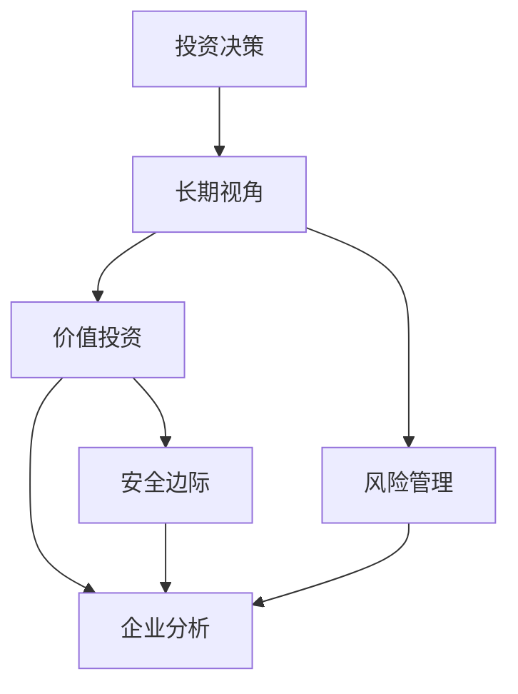
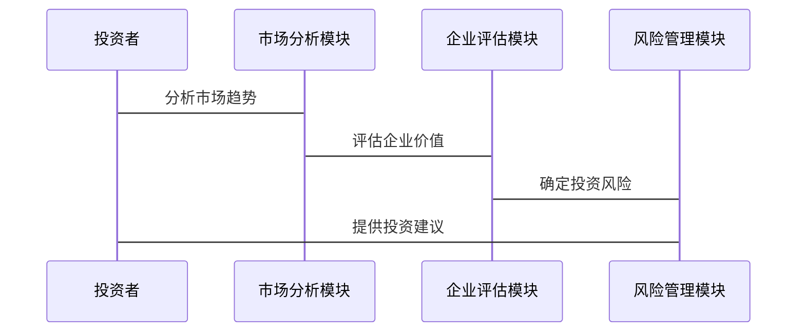

                 


# 巴菲特-芒格的新兴市场投资哲学：长期视角的重要性

> 关键词：巴菲特，芒格，投资哲学，长期视角，新兴市场，价值投资，风险管理

> 摘要：本文探讨了巴菲特和芒格的投资哲学，特别是长期视角在新兴市场中的重要性。通过分析价值投资、安全边际、风险管理等核心概念，结合数学模型和实际案例，展示了如何在新兴市场中运用长期视角进行投资决策。文章还提出了基于Python的系统架构和投资组合构建方法，为投资者提供了实用的工具和策略。

---

# 第一部分: 巴菲特-芒格投资哲学概述

## 第1章: 巴菲特与芒格的投资哲学概述

### 1.1 巴菲特与芒格的背景介绍

#### 1.1.1 巴菲特的生平与投资理念
沃伦·巴菲特（Warren Buffett）是全球著名的投资者和慈善家，被誉为“股神”。他出生于1934年，早年通过阅读和实践掌握了投资的基本原理，1956年创立了合伙公司，逐步发展为伯克希尔哈撒韦（Berkshire Hathaway）。巴菲特的投资理念以“价值投资”为核心，强调寻找具有持续竞争优势的企业，长期持有，避免频繁交易。

#### 1.1.2 芒格的哲学与思维方式
查理·芒格（Charlie Munger）是巴菲特的长期合作伙伴，担任伯克希尔哈撒韦的副主席。芒格是一位卓越的投资者和心理学家，他的思维方式强调“多元思维模型”，即通过多个学科的视角来分析问题，避免单一思维的局限性。芒格的投资哲学注重安全边际和风险控制，强调“先保护本金，再追求收益”。

#### 1.1.3 巴菲特与芒格合作的历程
巴菲特和芒格的合作始于1959年，两人共同创立了伯克希尔哈撒韦，并逐步将其打造成一个多元化的投资帝国。他们的合作基于共同的价值观和投资理念，芒格的多元思维模型和巴菲特的价值投资理念相辅相成，形成了独特的投资哲学。

### 1.2 巴菲特-芒格投资哲学的核心理念

#### 1.2.1 价值投资的定义与特征
价值投资是一种以低于内在价值的价格买入优质股票的投资策略。巴菲特和芒格认为，投资的本质是寻找具有持续竞争优势、良好管理层和合理估值的企业。他们强调企业内在价值的计算，而不是市场的短期波动。

#### 1.2.2 长期视角的重要性
巴菲特和芒格始终坚持长期投资的理念，认为市场的短期波动是噪音，而企业的长期价值才是决定投资收益的关键。长期视角使得投资者能够避免短期市场的干扰，专注于企业的基本面和长期发展潜力。

#### 1.2.3 安全边际的概念与应用
安全边际是指投资价格低于企业内在价值的部分，它是巴菲特和芒格投资策略的核心。通过寻找具有安全边际的企业，投资者能够在市场波动中降低风险，确保投资的稳健性。

### 1.3 新兴市场的投资机会与挑战

#### 1.3.1 新兴市场的定义与特点
新兴市场是指那些经济快速发展、市场规模较小、但增长潜力巨大的国家或地区的市场。新兴市场通常具有较高的波动性和不确定性，但也伴随着更高的收益机会。

#### 1.3.2 新兴市场的投资机会
新兴市场中的企业往往具有较高的增长潜力，尤其是在科技、消费、金融等领域。此外，新兴市场的估值通常较低，为价值投资者提供了寻找具有安全边际的机会。

#### 1.3.3 新兴市场的风险与挑战
新兴市场的风险主要来自于政治风险、经济波动、市场流动性不足以及信息不对称等问题。此外，新兴市场的波动性较高，容易受到外部环境的影响。

### 1.4 巴菲特-芒格投资哲学的现代意义

#### 1.4.1 传统投资理论的局限性
传统的投资理论往往注重短期收益和技术分析，而忽视了企业的基本面和长期发展潜力。巴菲特和芒格的投资哲学弥补了这一缺陷，为投资者提供了更加全面的投资视角。

#### 1.4.2 巴菲特-芒格哲学的创新性
巴菲特和芒格的投资哲学结合了价值投资和长期视角，强调安全边际和风险管理。这种投资哲学不仅适用于成熟市场，也适合新兴市场的投资。

#### 1.4.3 长期视角在现代投资中的应用
在现代投资中，长期视角的重要性更加凸显。随着全球经济的不确定性增加，投资者需要更加注重企业的长期价值，而不是短期的市场波动。

---

## 第2章: 长期视角在投资中的重要性

### 2.1 长期视角的定义与特征

#### 2.1.1 长期视角的内涵
长期视角是指在投资决策中，关注企业的长期价值和潜在增长，而不是短期的市场波动。这种视角要求投资者具备耐心和纪律性，能够在市场低谷中坚持持有优质资产。

#### 2.1.2 长期视角与短期视角的对比
- 短期视角关注市场的波动和短期收益，容易受到情绪影响。
- 长期视角关注企业的基本面和长期增长，能够抵御短期市场的干扰。

#### 2.1.3 长期视角的核心要素
- 企业的内在价值
- 管理层的诚信和能力
- 行业的竞争格局
- 宏观经济的趋势

### 2.2 长期视角在投资决策中的应用

#### 2.2.1 长期视角与资产配置
长期视角要求投资者在资产配置上注重分散投资，避免过度集中于某一资产或行业。通过合理的资产配置，投资者可以在不同市场条件下保持稳健的收益。

#### 2.2.2 长期视角与个股选择
在个股选择上，长期视角要求投资者寻找具有持续竞争优势的企业，关注企业的财务健康和管理层能力。通过长期持有优质资产，投资者能够获得超额收益。

#### 2.2.3 长期视角与风险管理
长期视角与风险管理密切相关。投资者需要在选择标的时考虑安全边际，通过分散投资和风险对冲来降低整体投资组合的风险。

### 2.3 长期视角与新兴市场的结合

#### 2.3.1 新兴市场的长期发展趋势
新兴市场的经济增长潜力巨大，尤其是在科技和消费升级领域。长期视角能够帮助投资者捕捉到这些领域的投资机会。

#### 2.3.2 长期视角在新兴市场中的应用
在新兴市场中，长期视角要求投资者关注企业的基本面和长期增长，而不是短期的市场波动。通过选择具有强大竞争优势和良好治理的企业，投资者能够在新兴市场中获得超额收益。

#### 2.3.3 长期视角与新兴市场风险的平衡
新兴市场的风险较高，但通过长期视角，投资者可以通过分散投资和风险对冲来降低整体风险。同时，长期视角还要求投资者具备耐心和纪律性，能够在市场低谷中坚持持有优质资产。

### 2.4 长期视角的数学模型与公式

#### 2.4.1 长期投资的复利效应
复利效应是长期投资的核心，它能够帮助投资者实现财富的指数级增长。复利公式如下：
$$
A = P \times (1 + r)^n
$$
其中，$A$ 是终值，$P$ 是本金，$r$ 是年化收益率，$n$ 是投资期限（年）。

#### 2.4.2 长期投资的风险调整回报模型
风险调整回报模型通过考虑投资的风险因素，帮助投资者评估投资的真正收益。常用的风险调整回报模型包括夏普比率和特雷纳比率：
$$
\text{夏普比率} = \frac{R_p - R_f}{\sigma_p}
$$
其中，$R_p$ 是投资组合的平均收益，$R_f$ 是无风险收益率，$\sigma_p$ 是投资组合的收益标准差。

---

## 第3章: 巴菲特-芒格投资哲学的系统架构与实现

### 3.1 投资决策的系统架构

#### 3.1.1 系统架构设计
以下是巴菲特-芒格投资哲学的系统架构图：


#### 3.1.2 系统功能设计
- 长期视角：分析企业的长期发展潜力和竞争优势。
- 价值投资：评估企业的内在价值和市场估值。
- 安全边际：确定投资的安全空间和风险承受能力。
- 风险管理：制定风险管理策略，分散投资风险。

### 3.2 投资组合的构建与管理

#### 3.2.1 系统交互流程
以下是投资组合构建的交互流程图：


#### 3.2.2 系统实现
以下是投资组合构建的Python代码示例：
```python
import pandas as pd
import numpy as np

# 假设我们有一个包含企业基本面数据的DataFrame
df = pd.DataFrame({
    '企业名称': ['企业A', '企业B', '企业C'],
    '市盈率': [15, 20, 25],
    'ROE': [10, 15, 20],
    '行业': ['科技', '消费', '金融']
})

# 计算内在价值（简化模型）
def calculate_intrinsic_value(row):
    # 假设使用市盈率倒数法
    if row['市盈率'] < 15:
        return '低估'
    elif row['市盈率'] == 15:
        return '合理'
    else:
        return '高估'

# 应用模型并筛选低估企业
df['内在价值'] = df.apply(calculate_intrinsic_value, axis=1)
低估企业 = df[df['内在价值'] == '低估']
```

---

## 第4章: 项目实战与案例分析

### 4.1 环境安装与数据准备

#### 4.1.1 环境安装
为了运行以下代码，需要安装以下Python库：
```
pip install pandas numpy matplotlib
```

#### 4.1.2 数据准备
以下是数据准备的Python代码：
```python
import pandas as pd
import numpy as np

# 模拟新兴市场的股票数据
data = {
    '股票代码': ['A', 'B', 'C', 'D', 'E'],
    '股票名称': ['科技公司', '消费公司', '金融公司', '工业公司', '能源公司'],
    '收盘价': [50, 60, 45, 70, 30],
    '市盈率': [10, 15, 20, 12, 8],
    'ROE': [15, 18, 12, 16, 10]
}

df = pd.DataFrame(data)
```

### 4.2 投资组合构建与分析

#### 4.2.1 筛选具有安全边际的企业
```python
# 计算安全边际
def calculate_margin_of_safety(row):
    if row['市盈率'] < 15 and row['ROE'] > 12:
        return '具备安全边际'
    else:
        return '不具备安全边际'

df['安全边际'] = df.apply(calculate_margin_of_safety, axis=1)
具备安全边际的企业 = df[df['安全边际'] == '具备安全边际']
```

#### 4.2.2 投资组合管理与优化
```python
# 计算投资组合的预期收益和风险
import numpy as np
import matplotlib.pyplot as plt

# 假设我们有3只股票：A、B、C
returns = np.array([0.1, 0.15, 0.08])
weights = np.array([1/3, 1/3, 1/3])

# 计算预期收益
expected_return = np.sum(weights * returns)

# 计算风险（标准差）
cov_matrix = np.array([
    [0.02, 0.01, 0.01],
    [0.01, 0.03, 0.01],
    [0.01, 0.01, 0.02]
])
risk = np.sqrt(np.dot(weights, np.dot(cov_matrix, weights)))
```

### 4.3 案例分析与结果解读

#### 4.3.1 投资组合构建的案例分析
假设我们选择科技公司（股票代码：A）和消费公司（股票代码：B）作为投资组合的组成部分。根据计算，这两家公司在新兴市场中具有较高的ROE和合理的市盈率，具备安全边际。

#### 4.3.2 投资组合的长期表现预测
通过复利公式，我们可以预测投资组合的长期表现：
$$
A = P \times (1 + r)^n
$$
假设初始投资为10,000元，年化收益率为12%，投资期限为10年：
$$
A = 10000 \times (1 + 0.12)^{10} \approx 31,050.4 \text{元}
$$

---

## 第5章: 总结与展望

### 5.1 总结
巴菲特和芒格的投资哲学强调长期视角、价值投资和安全边际，为新兴市场的投资提供了重要的指导。通过系统化的分析和数学模型的支持，投资者可以在新兴市场中找到具有长期增长潜力的企业，实现稳健的投资收益。

### 5.2 展望
随着全球经济的进一步发展，新兴市场的投资机会将更加多样化。未来，投资者需要更加注重企业的基本面和长期发展潜力，结合大数据和人工智能技术，优化投资决策，降低投资风险。

---

## 附录

### 附录A: 术语表
- 价值投资：以低于内在价值的价格买入优质股票的投资策略。
- 安全边际：投资价格低于企业内在价值的部分，用于降低投资风险。
- 复利效应：长期投资的核心，通过时间的积累实现财富的指数级增长。

### 附录B: 进一步阅读
- 巴菲特的经典著作《巴菲特致股东的信》
- 芒格的《Poor Charlie's Almanack》
- 《投资学原理》（作者：理查德·A·阿什沃斯）

### 附录C: 巴菲特与芒格的经典语录
- “时间是伟大企业的朋友。” —— 巴菲特
- “投资的第一条规则是保住本金，第二条规则是永远记住第一条。” —— 芒格

---

# 作者：AI天才研究院 & 禅与计算机程序设计艺术

感谢阅读！希望本文能为您提供有价值的投资哲学视角和系统化的投资方法，帮助您在新兴市场中实现长期稳健的投资收益！

