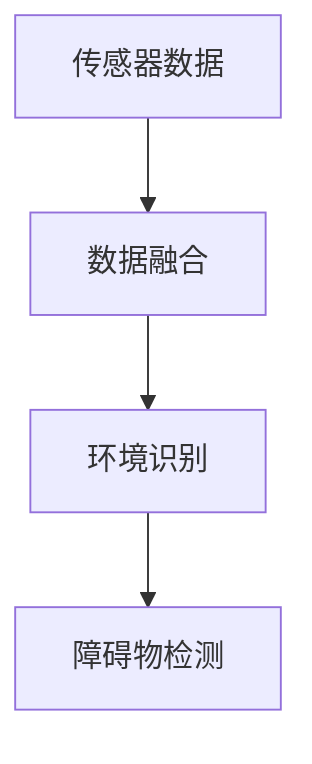
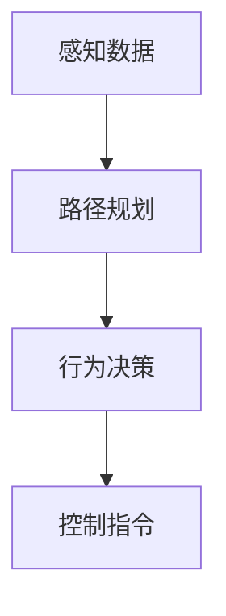
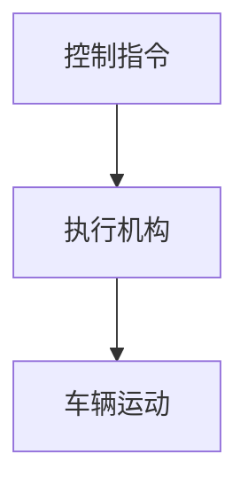
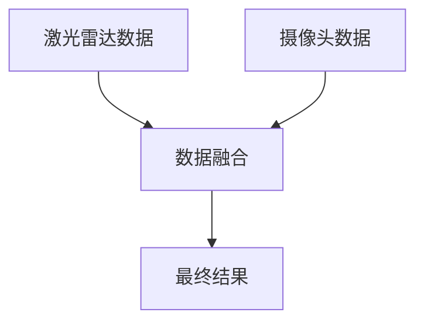
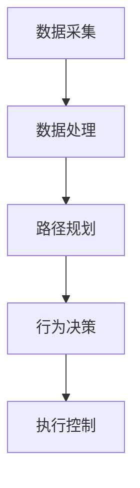

                 


# 巴菲特-芒格的无人驾驶技术投资：交通革命的前夜

> 关键词：无人驾驶技术、巴菲特、芒格、价值投资、交通革命、系统架构

> 摘要：本文深入探讨了巴菲特和芒格在无人驾驶技术领域的投资策略，分析了无人驾驶技术的核心概念、算法原理、系统架构及其对交通革命的影响。文章结合了价值投资哲学与技术创新，为投资者提供了全面的分析框架和实战案例。

---

## 第1章: 无人驾驶技术的背景与发展

### 1.1 无人驾驶技术的定义与核心概念

无人驾驶技术，又称自动驾驶技术，是指通过先进的传感器、人工智能算法和执行系统，使车辆能够实现自主导航和操作的技术。其核心目标是通过技术手段替代或辅助人类驾驶员完成驾驶任务。

#### 1.1.1 无人驾驶技术的定义
无人驾驶技术基于多传感器融合、深度学习算法和高精度地图，能够实时感知环境、规划路径并控制车辆，实现从起点到终点的自主行驶。

#### 1.1.2 无人驾驶技术的核心要素
无人驾驶技术的核心要素包括：
- **感知系统**：通过激光雷达、摄像头、雷达等传感器获取环境信息。
- **决策系统**：基于感知数据，利用AI算法做出驾驶决策。
- **执行系统**：通过车辆控制系统执行驾驶动作。

#### 1.1.3 无人驾驶技术的演进历程
无人驾驶技术的发展经历了从早期的实验阶段到如今的商业化应用阶段，主要经历了以下几个阶段：
1. **概念阶段**：20世纪初，科学家们开始研究自动驾驶技术的概念。
2. **实验阶段**：20世纪80年代，各国开始进行无人驾驶汽车的实验。
3. **技术突破阶段**：21世纪初，随着AI和传感器技术的进步，无人驾驶技术取得了显著进展。
4. **商业化阶段**：近年来，多家汽车制造商和科技公司推出了自动驾驶功能的车辆。

### 1.2 无人驾驶技术的市场背景

#### 1.2.1 全球汽车行业的变革
随着环保压力、交通拥堵和人口老龄化的加剧，全球汽车行业正在向电动化、智能化和共享化方向转型。无人驾驶技术作为汽车智能化的核心，成为行业变革的重要驱动力。

#### 1.2.2 无人驾驶技术的市场需求
无人驾驶技术能够显著提升驾驶安全、降低交通事故率，同时提高交通效率。此外，无人驾驶技术还能降低能源消耗，减少碳排放，符合可持续发展的目标。

#### 1.2.3 政策支持与行业趋势
全球多个国家和地区已经出台相关政策，支持无人驾驶技术的研发和应用。例如，美国、中国、欧盟等地都在积极推动无人驾驶技术的法规制定和基础设施建设。

### 1.3 巴菲特与芒格的投资哲学

#### 1.3.1 巴菲特的价值投资理念
巴菲特的价值投资理念强调长期投资、安全边际和企业基本面分析。他认为，投资的本质是寻找那些具有持续竞争优势、良好管理和优秀管理团队的企业。

#### 1.3.2 芒格的多元思维模型
芒格的多元思维模型强调跨学科思考，通过将不同领域的知识结合起来，形成对问题的全面理解。他认为，投资决策需要考虑技术、经济、法律、心理等多个因素。

#### 1.3.3 价值投资与技术投资的结合
巴菲特和芒格的投资策略结合了价值投资和技术创新。他们不仅关注企业的财务表现，还关注技术的可行性和市场潜力。

### 1.4 无人驾驶技术的投资价值

#### 1.4.1 无人驾驶技术的经济价值
无人驾驶技术能够降低交通事故率、提高交通效率、降低能源消耗，具有巨大的经济价值。

#### 1.4.2 无人驾驶技术的社会影响
无人驾驶技术的应用将改变人们的出行方式，减少交通拥堵，提高道路利用率，同时为老年人和残障人士提供更多的出行便利。

#### 1.4.3 无人驾驶技术的投资机会
无人驾驶技术的商业化应用正在快速推进，投资者可以通过投资相关企业或技术开发项目，分享这一领域的增长红利。

---

## 第2章: 无人驾驶技术的核心技术分析

### 2.1 无人驾驶技术的核心系统

#### 2.1.1 感知系统
感知系统是无人驾驶技术的核心模块，负责获取车辆周围的环境信息。

##### 感知系统的组成
- **激光雷达（LiDAR）**：通过激光扫描环境，获取高精度的三维点云数据。
- **摄像头**：通过图像识别技术，识别交通标志、车道线和障碍物。
- **雷达**：通过无线电波检测障碍物的距离和速度。

##### 感知系统的流程图


#### 2.1.2 决策系统
决策系统基于感知数据，利用人工智能算法做出驾驶决策。

##### 决策系统的组成
- **路径规划**：计算车辆从起点到终点的最优路径。
- **行为决策**：根据环境信息做出转向、加速或减速的决策。

##### 决策系统的流程图


#### 2.1.3 执行系统
执行系统根据决策系统的指令，控制车辆的运动。

##### 执行系统的组成
- **转向系统**：控制车辆的转向角度。
- **加速系统**：控制车辆的加速和减速。
- **制动系统**：控制车辆的刹车。

##### 执行系统的流程图


### 2.2 无人驾驶技术的关键算法

#### 2.2.1 人工智能算法
人工智能算法是无人驾驶技术的核心，主要包括以下几种：
- **深度学习**：用于图像识别和目标检测。
- **强化学习**：用于路径规划和行为决策。

##### 深度学习的数学模型
深度学习的核心是神经网络，其数学模型如下：
$$ y = f(x) = Wx + b $$
其中，$W$ 是权重矩阵，$x$ 是输入向量，$b$ 是偏置向量。

#### 2.2.2 传感器融合算法
传感器融合算法用于将不同传感器的数据进行融合，提高感知的准确性。

##### 传感器融合的流程图


#### 2.2.3 路径规划算法
路径规划算法用于计算车辆的最优行驶路径。

##### 路径规划的数学模型
路径规划可以通过以下公式表示：
$$ \text{路径} = \argmin_{x} \sum_{i=1}^{n} (x_i - x_{i-1})^2 $$
其中，$x_i$ 是路径上的点，$x_{i-1}$ 是前一点。

### 2.3 无人驾驶技术的硬件基础

#### 2.3.1 激光雷达
激光雷达是无人驾驶技术的核心硬件，用于获取环境的三维信息。

##### 激光雷达的结构
激光雷达由激光器、接收器和信号处理单元组成。

##### 激光雷达的工作原理
激光雷达通过发射激光束，并测量反射信号的时间差，计算物体的距离和位置。

### 2.4 无人驾驶技术的数学模型

#### 2.4.1 传感器数据融合模型
传感器数据融合模型用于将不同传感器的数据进行融合，提高感知的准确性。

##### 数据融合的数学模型
数据融合可以通过以下公式表示：
$$ z = w_1 x_1 + w_2 x_2 + \dots + w_n x_n $$
其中，$w_i$ 是权重，$x_i$ 是传感器的数据。

#### 2.4.2 路径规划模型
路径规划模型用于计算车辆的最优行驶路径。

##### 路径规划的优化目标
路径规划的优化目标是找到从起点到终点的最短路径，同时避开障碍物。

##### 路径规划的数学模型
路径规划可以通过以下公式表示：
$$ \text{路径} = \argmin_{x} \sum_{i=1}^{n} (x_i - x_{i-1})^2 $$

#### 2.4.3 决策算法模型
决策算法模型用于根据环境信息做出驾驶决策。

##### 决策算法的数学模型
决策算法可以通过以下公式表示：
$$ a = f(x) $$
其中，$x$ 是输入环境信息，$a$ 是输出决策动作。

---

## 第3章: 巴菲特与芒格的投资策略

### 3.1 巴菲特的投资哲学

#### 3.1.1 价值投资的核心理念
价值投资的核心理念是寻找那些被市场低估的企业，长期持有，等待其价值的回归。

#### 3.1.2 长期投资与复利效应
巴菲特强调长期投资的重要性，认为复利效应是投资成功的关键。

#### 3.1.3 安全边际的重要性
安全边际是指企业在市场中的竞争优势和财务健康状况，是投资决策的重要考量因素。

### 3.2 芒格的多元思维模型

#### 3.2.1 多学科交叉分析
芒格的多元思维模型强调跨学科思考，通过将不同领域的知识结合起来，形成对问题的全面理解。

#### 3.2.2 格栅理论的应用
格栅理论认为，投资者需要通过多个学科的交叉分析，才能做出正确的决策。

#### 3.2.3 系统思维与决策
芒格认为，投资决策需要考虑系统的整体性，而不是单一因素。

### 3.3 无人驾驶技术的投资评估

#### 3.3.1 技术可行性评估
技术可行性评估包括对无人驾驶技术的核心算法、硬件和系统架构的分析。

#### 3.3.2 市场潜力分析
市场潜力分析包括对无人驾驶技术的市场需求、竞争格局和商业化前景的评估。

#### 3.3.3 企业竞争优势分析
企业竞争优势分析包括对企业的技术实力、管理团队和财务状况的评估。

### 3.4 巴菲特与芒格的投资决策框架

#### 3.4.1 价值与成长的平衡
巴菲特和芒格的投资决策框架强调价值与成长的平衡，寻找那些具有持续竞争优势的企业。

#### 3.4.2 风险控制与安全边际
风险控制与安全边际是投资决策的重要考量因素，巴菲特和芒格非常注重企业的财务健康状况和市场风险。

#### 3.4.3 长期视角与耐心资本
长期视角与耐心资本是巴菲特和芒格投资成功的关键，他们相信长期的价值创造。

---

## 第4章: 无人驾驶技术对交通革命的影响

### 4.1 无人驾驶技术的交通变革

#### 4.1.1 交通效率的提升
无人驾驶技术能够优化交通流量，减少交通拥堵，提高道路利用率。

#### 4.1.2 交通事故率的降低
无人驾驶技术通过减少人为错误，显著降低交通事故率。

#### 4.1.3 交通模式的创新
无人驾驶技术推动了共享出行、MaaS（ Mobility as a Service）等新型交通模式的发展。

### 4.2 无人驾驶技术的社会影响

#### 4.2.1 对城市规划的影响
无人驾驶技术的应用将改变城市交通网络的设计和优化。

#### 4.2.2 对能源消耗的影响
无人驾驶技术通过优化交通流量，降低能源消耗和碳排放。

#### 4.2.3 对社会公平的影响
无人驾驶技术能够为老年人和残障人士提供更多的出行便利，促进社会公平。

### 4.3 无人驾驶技术的经济影响

#### 4.3.1 对汽车行业的变革
无人驾驶技术推动了汽车行业的智能化和电动化转型。

#### 4.3.2 对就业市场的影响
无人驾驶技术的应用可能对传统驾驶行业产生冲击，但也可能创造新的就业机会。

#### 4.3.3 对保险行业的变革
无人驾驶技术的应用将改变传统的保险模式，推动保险行业的创新。

---

## 第5章: 无人驾驶技术的投资分析框架

### 5.1 投资框架的核心要素

#### 5.1.1 技术评估
技术评估包括对无人驾驶技术的核心算法、硬件和系统架构的分析。

#### 5.1.2 市场分析
市场分析包括对无人驾驶技术的市场需求、竞争格局和商业化前景的评估。

#### 5.1.3 企业评估
企业评估包括对企业的技术实力、管理团队和财务状况的分析。

### 5.2 投资框架的实施步骤

#### 5.2.1 明确投资目标
投资者需要明确自己的投资目标，包括投资期限、风险承受能力和收益预期。

#### 5.2.2 收集相关信息
投资者需要收集与无人驾驶技术相关的行业信息、企业信息和技术信息。

#### 5.2.3 进行深入分析
投资者需要对收集的信息进行深入分析，评估技术的可行性和企业的竞争优势。

#### 5.2.4 制定投资策略
投资者需要根据分析结果，制定合适的投资策略，包括资产配置和风险管理。

### 5.3 投资框架的实战案例

#### 5.3.1 案例分析
以某家无人驾驶技术公司为例，分析其技术优势、市场地位和财务状况。

#### 5.3.2 投资决策
基于分析结果，制定对该公司的投资策略。

---

## 第6章: 无人驾驶技术的系统架构设计

### 6.1 系统架构的核心模块

#### 6.1.1 数据采集模块
数据采集模块负责获取车辆的环境信息，包括激光雷达、摄像头和雷达的数据。

#### 6.1.2 数据处理模块
数据处理模块负责对采集的数据进行预处理、融合和分析。

#### 6.1.3 路径规划模块
路径规划模块负责计算车辆的最优行驶路径。

#### 6.1.4 行为决策模块
行为决策模块负责根据环境信息做出驾驶决策。

#### 6.1.5 执行控制模块
执行控制模块负责根据决策结果，控制车辆的运动。

### 6.2 系统架构的实现

#### 6.2.1 系统架构图


#### 6.2.2 数据流分析
数据流从传感器流向数据处理模块，经过融合和分析后，流向路径规划模块，最终流向执行控制模块。

### 6.3 系统架构的优化

#### 6.3.1 并行计算
通过并行计算优化系统的处理速度，提高系统的实时性。

#### 6.3.2 分布式架构
通过分布式架构优化系统的扩展性，提高系统的容错能力。

#### 6.3.3 自适应优化
通过自适应优化算法，动态调整系统的参数，提高系统的鲁棒性。

---

## 第7章: 无人驾驶技术的项目实战

### 7.1 项目环境安装

#### 7.1.1 安装Python环境
使用Anaconda安装Python 3.8及以上版本。

#### 7.1.2 安装相关库
安装NumPy、Pandas、Matplotlib、TensorFlow等库。

### 7.2 项目核心实现

#### 7.2.1 数据采集模块
编写代码采集激光雷达和摄像头的数据。

##### 代码示例
```python
import numpy as np
import matplotlib.pyplot as plt

# 激光雷达数据
laser_data = np.random.rand(100, 2)

# 绘制激光雷达数据
plt.scatter(laser_data[:, 0], laser_data[:, 1])
plt.show()
```

#### 7.2.2 数据处理模块
编写代码对采集的数据进行预处理和融合。

##### 代码示例
```python
import numpy as np
from sklearn import preprocessing

# 数据预处理
data = np.array([[1, 2], [3, 4], [5, 6]])
normalized_data = preprocessing.normalize(data)

print(normalized_data)
```

#### 7.2.3 路径规划模块
编写代码实现路径规划算法。

##### 代码示例
```python
import numpy as np

def path_planning(start, end):
    # 简单路径规划算法
    return np.linspace(start, end, 100)

start = 0
end = 100
path = path_planning(start, end)

print(path)
```

### 7.3 项目小结

#### 7.3.1 项目总结
通过项目实战，我们掌握了无人驾驶技术的核心实现方法，包括数据采集、数据处理和路径规划。

#### 7.3.2 经验总结
在项目实施过程中，我们发现数据融合和路径规划是技术难点，需要进一步优化算法和系统架构。

---

## 第8章: 总结与展望

### 8.1 投资要点总结

#### 8.1.1 无人驾驶技术的核心价值
无人驾驶技术具有巨大的经济价值和社会价值，是未来交通革命的核心驱动力。

#### 8.1.2 投资策略总结
投资者需要结合价值投资和技术创新，选择具有持续竞争优势的企业。

### 8.2 未来展望

#### 8.2.1 技术发展
无人驾驶技术将向更高阶的自动驾驶发展，实现完全无人驾驶。

#### 8.2.2 市场发展
无人驾驶技术的商业化应用将加速，市场规模将快速增长。

#### 8.2.3 投资机会
无人驾驶技术的投资机会将更加多元化，投资者需要关注技术创新和市场趋势。

---

## 附录

### 附录A: 进一步阅读

#### 1. 推荐书籍
- 《巴菲特传》
- 《芒格传》
- 《无人驾驶技术入门与实践》

#### 2. 推荐工具
- TensorFlow
- PyTorch
- OpenCV

---

## 作者

作者：AI天才研究院/AI Genius Institute & 禅与计算机程序设计艺术 /Zen And The Art of Computer Programming

