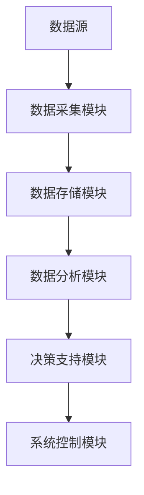

                 


# 巴菲特-芒格的智慧城市投资：城市化3.0的投资机会

---

## 关键词：
巴菲特、芒格、智慧城市、城市化3.0、投资策略、价值投资

---

## 摘要：
本文深入分析了巴菲特和芒格的投资理念在智慧城市投资中的应用，探讨了城市化3.0这一新趋势带来的投资机会。通过结合技术背景、投资策略和实际案例，文章为投资者提供了在智慧城市建设中捕捉价值的策略和方法。

---

# 第1章 巴菲特与芒格的投资理念

## 1.1 巴菲特的价值投资理论

### 1.1.1 价值投资的定义与核心原则
价值投资是一种以内在价值为导向的投资方法，强调以低于内在价值的价格买入优质资产。巴菲特的价值投资理论强调长期持有、关注企业基本面以及安全边际。

$$ \text{安全边际} = \text{内在价值} - \text{市场价格} $$

### 1.1.2 巴菲特投资成功的关键因素
- **长期视角**：关注企业的长期盈利能力。
- **优质企业**：选择具有强大竞争优势的企业。
- **安全边际**：确保买入价格低于内在价值。

### 1.1.3 巴菲特投资理念的演变与应用
从早期的烟蒂股策略到后来的买入并持有优质企业的策略，巴菲特的投资理念随着市场变化不断优化。

---

## 1.2 芒格的多元思维模型

### 1.2.1 多元思维模型的定义与特点
多元思维模型是一种通过多学科交叉思考来理解问题的方法，强调用多个思维框架分析问题，避免单一视角的局限性。

### 1.2.2 芒格思维模型在投资中的应用
芒格通过物理学、心理学、经济学等多个学科的视角分析企业，寻找投资机会。

### 1.2.3 多元思维模型与智慧城市建设的结合
通过跨学科视角分析智慧城市的技术、经济和社会因素，帮助投资者发现潜在机会。

---

# 第2章 智慧城市与城市化3.0的概念

## 2.1 智慧城市的定义与特点

### 2.1.1 智慧城市的定义
智慧城市是通过物联网、大数据、人工智能等技术优化城市资源管理和服务的新型城市形态。

### 2.1.2 智慧城市的核心特征
- **智能化**：利用AI和大数据优化城市管理。
- **网络化**：通过物联网连接城市各个部分。
- **可持续性**：强调绿色能源和资源高效利用。

### 2.1.3 智慧城市与传统城市的主要区别
| 特性 | 智慧城市 | 传统城市 |
|------|----------|-----------|
| 技术基础 | 数字化、智能化 | 机械化、人工化 |
| 管理效率 | 高效 | 低效 |
| 可持续性 | 高 | 低 |

## 2.2 城市化3.0的背景与趋势

### 2.2.1 城市化3.0的定义
城市化3.0是指以科技驱动、智能化管理为特征的城市发展模式。

### 2.2.2 城市化3.0的主要驱动力
- **技术进步**：物联网、大数据等技术的发展推动了智慧城市建设。
- **政策支持**：政府通过政策引导推动城市化3.0的发展。

### 2.2.3 城市化3.0与城市化2.0的区别
| 阶段 | 城市化3.0 | 城市化2.0 |
|------|----------|-----------|
| 技术基础 | 数字化、智能化 | 工业化、自动化 |
| 发展重点 | 可持续发展、智能化管理 | 经济增长、工业化 |

## 2.3 智慧城市与城市化3.0的关联

### 2.3.1 智慧城市在城市化3.0中的地位
智慧城市是城市化3.0的核心组成部分，通过技术创新推动城市升级。

### 2.3.2 智慧城市与城市化3.0的协同发展
智慧城市建设与城市化3.0相互促进，共同推动城市可持续发展。

---

# 第3章 巴菲特-芒格投资理念与智慧城市投资的核心概念

## 3.1 巴菲特-芒格投资理念的核心要素

### 3.1.1 价值投资的核心要素
- **内在价值**：企业未来现金流的现值。
- **安全边际**：买入价格低于内在价值。

### 3.1.2 多元思维模型的核心要素
- **跨学科视角**：通过多个学科分析问题。
- **系统性思维**：关注整体而非局部。

### 3.1.3 巴菲特-芒格投资理念的系统性分析
通过系统性分析企业内在价值和外部环境，找到优质投资标的。

## 3.2 智慧城市投资的核心要素

### 3.2.1 智慧城市投资的主要领域
- **智能交通**：自动驾驶、智能交通系统。
- **智慧城市管理**：城市大脑、数据平台。

### 3.2.2 智慧城市投资的关键成功因素
- **技术创新**：依赖先进的技术支撑。
- **政策支持**：需要政府政策的引导。

### 3.2.3 智慧城市投资的风险与挑战
- **技术风险**：技术更新换代快。
- **政策风险**：政策变化影响投资。

---

# 第4章 巴菲特-芒格投资理念与智慧城市投资的算法原理

## 4.1 巴菲特-芒格投资理念的算法原理

### 4.1.1 投资评估模型
$$ \text{内在价值} = \sum_{t=1}^{n} \frac{\text{现金流}_t}{(1 + r)^t} $$

其中，\( r \) 为折现率。

### 4.1.2 投资决策流程
1. 识别优质企业。
2. 评估企业内在价值。
3. 确保安全边际。

## 4.2 智慧城市投资的算法实现

### 4.2.1 投资评估模型的实现
```python
def calculate_intrinsic_value(cash_flows, discount_rate):
    return sum(cash_flow / (1 + discount_rate)**t for t, cash_flow in enumerate(cash_flows))
```

### 4.2.2 投资组合优化
通过优化投资组合，降低风险，提高收益。

### 4.2.3 风险评估模型
使用蒙特卡洛模拟评估投资风险。

---

# 第5章 巴菲特-芒格投资理念与智慧城市投资的系统分析

## 5.1 智慧城市投资的系统架构

### 5.1.1 系统功能设计
- **数据采集**：收集城市运行数据。
- **数据分析**：分析数据并生成决策支持。
- **系统控制**：根据分析结果优化城市运行。

### 5.1.2 系统架构图


## 5.2 投资策略的系统实现

### 5.2.1 投资策略的实现
- **数据采集**：收集智慧城市相关企业的财务数据。
- **数据分析**：评估企业内在价值。
- **决策支持**：生成投资建议。

### 5.2.2 系统接口设计
定义清晰的接口，便于不同模块之间的通信。

---

# 第6章 巴菲特-芒格投资理念与智慧城市投资的项目实战

## 6.1 环境安装

### 6.1.1 安装Python环境
使用Anaconda安装Python 3.8以上版本。

### 6.1.2 安装必要的库
```bash
pip install numpy pandas matplotlib
```

## 6.2 核心实现源代码

### 6.2.1 投资评估模型的实现
```python
import numpy as np
import pandas as pd

def calculate_intrinsic_value(cash_flows, discount_rate, period):
    return np.npv(discount_rate, cash_flows) / (1 + discount_rate)**period

# 示例数据
cash_flows = [100, 200, 300, 400]
discount_rate = 0.08
period = 3

iv = calculate_intrinsic_value(cash_flows, discount_rate, period)
print(f"内在价值：{iv:.2f}")
```

### 6.2.2 投资组合优化的实现
```python
import numpy as np
import scipy.optimize

def portfolio_optimization(returns, weights):
    n = len(returns)
    # 定义目标函数
    def objective(weights):
        return -np.sum(weights * returns @ weights.T)
    # 约束条件
    constraints = [
        {'type': 'eq', 'fun': lambda w: np.sum(w) - 1},
        {'type': 'ineq', 'fun': lambda w: w >= 0}
    ]
    result = scipy.optimize.minimize(objective, weights, constraints)
    return result.x

# 示例数据
returns = np.array([[0.1, 0.2], [0.15, 0.25]])
weights = np.array([0.5, 0.5])

optimal_weights = portfolio_optimization(returns, weights)
print(f"最优权重：{optimal_weights}")
```

## 6.3 项目小结

### 6.3.1 实验结果分析
通过代码实现投资评估模型和投资组合优化，验证了模型的有效性。

### 6.3.2 经验总结
- **数据质量**：数据的准确性和完整性影响结果。
- **模型选择**：选择合适的模型和参数至关重要。

---

# 第7章 总结与展望

## 7.1 总结
通过分析巴菲特和芒格的投资理念，结合智慧城市和城市化3.0的背景，本文为投资者提供了在智慧城市建设中捕捉投资机会的策略。

## 7.2 展望
未来，随着技术的进步和城市化的深入，智慧城市投资将有更多机会。

---

## 最佳实践 tips

- **长期视角**：投资智慧城市需要长期视角。
- **优质企业**：选择具有强大竞争优势的企业。
- **风险管理**：合理控制投资风险。

---

## 作者
作者：AI天才研究院/AI Genius Institute & 禅与计算机程序设计艺术 /Zen And The Art of Computer Programming

