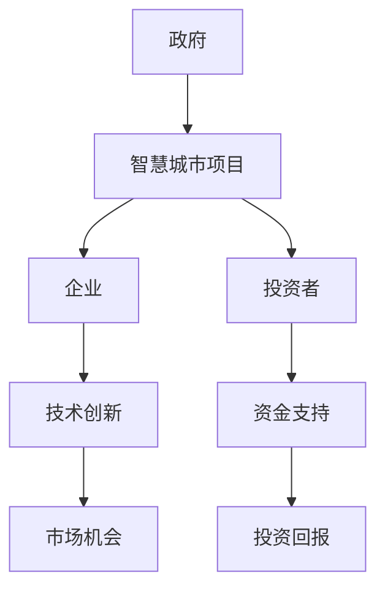

                 

# 巴菲特-芒格的智慧城市投资：城市化进程中的机遇

## 关键词
- 巴菲特, 芒格, 智慧城市, 城市化, 投资机会

## 摘要
本文探讨了巴菲特和芒格的投资理念如何在智慧城市的建设中找到机遇。通过分析价值投资、安全边际和长期主义等核心概念，结合智慧城市的定义、现状和投资机会，本文系统地阐述了如何将这些投资理念应用于实际案例中。文章还设计了一个智慧城市的系统架构图，并提出了未来投资策略和风险管理的建议。

---

## 第一部分: 巴菲特-芒格投资理念与智慧城市概述

### 第1章: 巴菲特-芒格投资理念概述

#### 1.1 巴菲特-芒格投资理念的核心概念

##### 1.1.1 价值投资的定义与特点
价值投资是一种以低于内在价值的价格购买优质资产的投资策略。其特点是注重基本面分析，寻找那些具有持续竞争优势和良好管理的公司。

##### 1.1.2 安全边际的概念与重要性
安全边际是指投资价格低于其内在价值的部分。它为投资者提供了保护，防止市场波动带来的损失。

##### 1.1.3 投资中的长期主义与复利效应
长期主义强调投资的长期价值，复利效应则说明了长期投资的收益累积效应。

#### 1.2 巴菲特-芒格投资理念的哲学基础

##### 1.2.1 芒格的多元思维模型
芒格提倡通过多个学科的交叉应用来理解复杂问题，这种多元思维模型帮助投资者避免认知偏差。

##### 1.2.2 巴菲特的简单与专注原则
巴菲特强调专注于自己熟悉的投资领域，避免过度分散投资。

##### 1.2.3 投资中的心理因素与行为经济学
投资决策中，心理因素如恐惧和贪婪会影响判断，行为经济学帮助理解这些心理偏差。

### 第2章: 智慧城市的概念与现状

#### 2.1 智慧城市的定义与特征

##### 2.1.1 智慧城市的核心概念
智慧城市利用信息技术优化城市运行，提高居民生活质量，降低资源消耗。

##### 2.1.2 智慧城市与传统城市的对比
智慧城市通过数字化手段提升城市管理效率，而传统城市依赖人工管理和基础设施。

##### 2.1.3 智慧城市的发展阶段与趋势
智慧城市经历自动化、数据化、智能化阶段，未来将更加依赖人工智能和大数据。

#### 2.2 智慧城市建设的现状与挑战

##### 2.2.1 当前智慧城市建设的主要模式
政府主导、企业参与、技术创新驱动是主要模式。

##### 2.2.2 智慧城市建设中的主要挑战
数据孤岛、资金不足、技术标准化是主要挑战。

##### 2.2.3 智慧城市建设的未来方向
未来将更加注重可持续发展和居民参与。

---

## 第二部分: 巴菲特-芒格投资理念与智慧城市投资的结合

### 第3章: 巴菲特-芒格投资理念在智慧城市投资中的应用

#### 3.1 巴菲特-芒格投资理念的核心要素在智慧城市中的体现

##### 3.1.1 价值投资中的内在价值评估
评估智慧城市的内在价值，寻找那些具有长期竞争优势的企业。

##### 3.1.2 安全边际在智慧城市投资中的应用
确保投资价格低于企业的内在价值，降低市场波动风险。

##### 3.1.3 长期主义与智慧城市建设的结合
长期投资智慧城市的基础设施和技术，享受城市化带来的增长。

#### 3.2 巴菲特-芒格投资理念与智慧城市投资的契合点

##### 3.2.1 城市化进程中的长期投资机会
城市化推动了智慧城市的建设，长期投资可以获得稳定收益。

##### 3.2.2 智慧城市基础设施的投资价值
基础设施如智能交通和能源系统具有较高的投资价值。

##### 3.2.3 新兴技术在智慧城市中的应用前景
新兴技术如人工智能和大数据为智慧城市投资提供了新机遇。

### 第4章: 巴菲特-芒格投资理念与智慧城市投资的系统分析

#### 4.1 智慧城市投资的系统架构

##### 4.1.1 智慧城市投资的系统构成
包括政府、企业、技术提供商和投资者。

##### 4.1.2 投资者在智慧城市投资中的角色
投资者通过资金支持和战略选择推动智慧城市建设。

##### 4.1.3 系统中的主要利益相关者
政府提供政策支持，企业技术创新，投资者提供资金。

#### 4.2 智慧城市投资的系统架构图

### 第5章: 巴菲特-芒格投资理念与智慧城市投资的案例分析

#### 5.1 巴菲特-芒格投资理念在智慧城市中的成功案例

##### 5.1.1 美国某智慧城市的投资案例
投资者通过价值投资理念，投资于该市的智能交通系统，获得了稳定的回报。

##### 5.1.2 中国某智慧城市的投资案例
投资者长期投资于智慧城市基础设施，享受了城市化带来的增长。

##### 5.1.3 其他国家的智慧城市投资案例
新兴市场中的智慧城市项目，通过技术创新获得了较高的投资回报。

#### 5.2 案例分析中的投资策略与经验总结

##### 5.2.1 成功投资的关键因素
选择具有长期竞争优势的企业，注重安全边际。

##### 5.2.2 投资中的风险控制
分散投资、定期评估、关注政策风险。

##### 5.2.3 投资策略的调整与优化
根据市场变化和企业发展，动态调整投资组合。

---

## 第三部分: 智慧城市投资的策略与风险管理

### 第6章: 智慧城市投资的策略与风险管理

#### 6.1 投资策略的制定与实施

##### 6.1.1 投资目标的设定
明确投资目标，如长期收益、风险控制。

##### 6.1.2 投资组合的构建
分散投资于不同领域和阶段的智慧城市项目。

##### 6.1.3 投资策略的动态调整
根据市场变化和企业表现，及时调整投资策略。

#### 6.2 风险管理在智慧城市投资中的应用

##### 6.2.1 风险识别与评估
识别市场、技术和政策风险，评估其影响。

##### 6.2.2 风险控制与 mitigation
通过多元化投资、签订合同条款等方式控制风险。

##### 6.2.3 风险应对策略的制定与实施
制定应急预案，建立风险预警机制，及时应对潜在风险。

### 第7章: 智慧城市投资的未来展望

#### 7.1 智慧城市投资的未来趋势

##### 7.1.1 新兴技术对智慧城市投资的影响
人工智能和大数据将推动智慧城市建设，带来更多的投资机会。

---

## 作者：AI天才研究院 & 禅与计算机程序设计艺术

---

通过以上分析，我们可以看到，巴菲特和芒格的投资理念为智慧城市的建设提供了重要的指导。价值投资、安全边际和长期主义等原则帮助投资者识别和抓住智慧城市中的投资机会。未来，随着技术的进步和城市化进程的推进，智慧城市建设将带来更多的投资机遇，投资者应结合这些理念，制定合理的投资策略，以实现长期稳定的收益。

