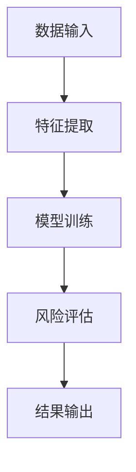
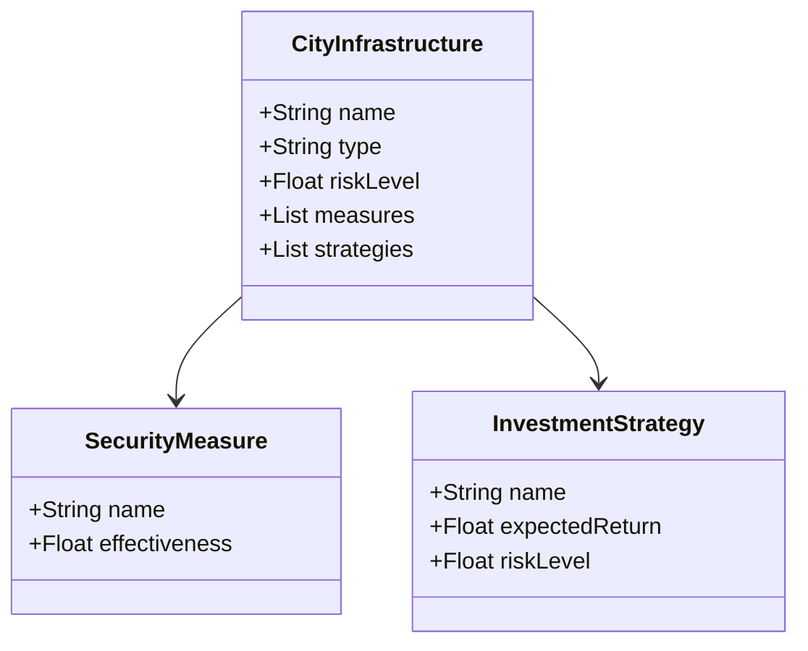

                 


# 巴菲特-芒格的智能城市安全投资：科技与隐私的平衡

---

## 关键词：智能城市, 安全投资, 巴菲特, 芒格, 科技, 隐私, 投资策略

---

## 摘要：本文探讨了巴菲特和芒格的投资理念在智能城市安全投资中的应用，分析了科技发展与隐私保护之间的平衡。通过详细的技术分析和实际案例，展示了如何在智能城市建设中进行安全投资，平衡技术创新与隐私保护，确保长期可持续发展。

---

# 第一部分: 巴菲特-芒格投资理念与智能城市安全投资背景

## 第1章: 巴菲特-芒格投资理念概述

### 1.1 巴菲特与芒格的投资哲学

#### 1.1.1 巴菲特的价值投资理论
- **核心思想**：长期投资优质资产，关注公司的基本面，寻找具有持续竞争优势的企业。
- **案例分析**：巴菲特的“护城河”概念，如何识别具有长期竞争优势的公司。
- **实际应用**：在智能城市中，选择那些在技术、数据或市场方面具有竞争优势的企业进行投资。

#### 1.1.2 芒格的多元思维模型
- **核心思想**：通过多个学科的知识框架，形成多元化的思维方式，避免单一视角的局限性。
- **具体应用**：在智能城市投资中，芒格的多元思维模型可以帮助投资者更好地识别风险，平衡科技发展与隐私保护之间的关系。

#### 1.1.3 价值投资与长期主义的结合
- **长期主义的重要性**：在智能城市建设中，需要考虑长期的社会效益和经济效益，而不仅仅是短期的收益。
- **实际案例**：巴菲特对可再生能源的投资，如何在智能城市中应用类似的长期投资策略。

---

## 第2章: 智能城市与安全投资的背景

### 2.1 智能城市的定义与构成

#### 2.1.1 智慧城市建设的基本概念
- **定义**：智能城市是利用信息技术和数据驱动的方式，优化城市资源分配，提高居民生活质量的城市发展模式。
- **核心组成部分**：物联网、大数据、人工智能、云计算等技术的应用。

#### 2.1.2 智能城市核心技术与应用场景
- **核心技术**：
  - 物联网：实现城市基础设施的智能化监控和管理。
  - 大数据：分析城市运行数据，优化资源配置。
  - 人工智能：提供智能化决策支持。
  - 云计算：提供高效的数据存储和计算能力。
- **应用场景**：
  - 智慧交通：优化交通流量，减少拥堵。
  - 智慧能源：提高能源使用效率，降低碳排放。
  - 智慧医疗：提升医疗服务效率，优化资源配置。

#### 2.1.3 智能城市与社会经济发展的关系
- **经济发展**：智能城市通过优化资源配置，提高生产效率，促进经济增长。
- **社会影响**：智能城市可以提高居民生活质量，减少资源浪费，促进可持续发展。

---

## 第3章: 巴菲特-芒格理念与智能城市投资的结合

### 3.1 巴菲特-芒格投资理念在智能城市中的应用

#### 3.1.1 价值投资与智能城市基础设施
- **基础设施投资的重要性**：智能城市的基础设施是城市运行的核心，具有长期稳定的需求。
- **如何选择投资标的**：关注具有技术优势、管理能力和市场地位的企业。
- **案例分析**：巴菲特对可再生能源的投资，如何在智能城市中应用类似的策略。

#### 3.1.2 长期主义与智能城市可持续发展
- **长期投资的重要性**：智能城市是一个长期的过程，需要持续的投资和优化。
- **如何平衡短期收益与长期目标**：关注企业的长期价值，避免短期波动的影响。

#### 3.1.3 多元思维模型与智能城市风险管理
- **风险管理的重要性**：智能城市投资中存在技术和市场风险，需要通过多元思维模型来识别和应对。
- **如何应用多元思维模型**：从技术、经济、法律等多个角度分析风险，制定全面的风险管理策略。

### 3.2 智能城市安全投资的核心要素

#### 3.2.1 投资标的筛选标准
- **技术优势**：选择具有先进技术的企业，确保投资的技术可行性。
- **市场地位**：选择在行业内具有竞争优势的企业，确保投资的市场可行性。
- **管理能力**：选择管理能力强、能够持续优化运营的企业。

#### 3.2.2 投资风险的识别与评估
- **技术风险**：新技术的应用可能面临技术瓶颈或失败的风险。
- **市场需求风险**：智能城市的应用可能面临市场需求不足的风险。
- **政策风险**：政策变化可能对智能城市的投资产生重大影响。

#### 3.2.3 投资组合的优化与调整
- **分散投资**：通过分散投资降低风险，避免过度集中于单一领域。
- **动态调整**：根据市场变化和企业表现，动态调整投资组合。

---

# 第二部分: 智能城市安全投资的核心概念与联系

## 第4章: 智能城市安全投资的核心概念

### 4.1 数据安全与隐私保护

#### 4.1.1 数据安全的定义与分类
- **定义**：数据安全是指保护数据的机密性、完整性和可用性。
- **分类**：分为数据在传输、存储和处理过程中的安全保护。

#### 4.1.2 隐私保护的法律框架与技术手段
- **法律框架**：介绍相关法律法规，如欧盟的GDPR（通用数据保护条例）。
- **技术手段**：数据加密、匿名化处理、访问控制等技术手段的应用。

#### 4.1.3 数据安全与隐私保护的平衡
- **平衡的重要性**：在智能城市建设中，需要在技术创新和隐私保护之间找到平衡点。
- **实际案例**：如何在智能交通系统中保护用户隐私，同时发挥数据的潜在价值。

### 4.2 智能城市中的风险管理

#### 4.2.1 智能城市的风险来源
- **技术风险**：技术漏洞可能导致数据泄露或系统崩溃。
- **市场风险**：市场需求不足可能导致投资失败。
- **政策风险**：政策变化可能对智能城市的投资产生重大影响。

#### 4.2.2 风险评估的指标与方法
- **指标**：风险发生的概率、潜在损失的严重程度。
- **方法**：定量分析和定性分析相结合，利用概率论和统计学方法进行评估。

#### 4.2.3 风险控制的策略
- **技术手段**：采用加密、访问控制等技术手段降低技术风险。
- **管理措施**：建立完善的风险管理制度，定期进行风险评估和调整。

---

## 第5章: 智能城市安全投资的算法原理

### 5.1 数据安全评估算法

#### 5.1.1 算法原理
- **核心思想**：通过分析数据的敏感性、数据的使用场景和数据的生命周期，评估数据的安全风险。
- **数学模型**：基于概率论的贝叶斯网络模型，用于评估数据泄露的可能性。

#### 5.1.2 算法实现
```python
import numpy as np
from sklearn.metrics import accuracy_score

# 示例数据：0表示低风险，1表示高风险
X = np.array([[0.2, 0.5],
              [0.7, 0.3],
              [0.4, 0.8],
              [0.6, 0.2]])
y = np.array([0, 1, 1, 0])

# 使用逻辑回归模型进行分类
from sklearn.linear_model import LogisticRegression
model = LogisticRegression()
model.fit(X, y)

# 预测新样本
new_sample = np.array([[0.5, 0.5]])
print("预测结果：", model.predict(new_sample))
print("准确率：", accuracy_score(y, model.predict(X)))
```

#### 5.1.3 算法流程图


---

## 第6章: 智能城市安全投资的系统架构设计

### 6.1 系统功能设计

#### 6.1.1 领域模型


#### 6.1.2 系统架构


---

## 第7章: 智能城市安全投资的项目实战

### 7.1 智能交通系统的投资分析

#### 7.1.1 项目背景
- 智能交通系统的建设可以提高交通效率，减少拥堵，降低碳排放。

#### 7.1.2 投资策略
- 投资于具有领先技术的企业，如自动驾驶技术、交通管理系统的开发公司。
- 通过分散投资降低风险，同时关注企业的长期发展潜力。

#### 7.1.3 投资组合优化
- 根据企业的技术实力、市场地位和管理能力，动态调整投资组合。

---

## 第8章: 智能城市安全投资的最佳实践

### 8.1 投资策略总结

#### 8.1.1 小结
- 在智能城市建设中，需要平衡技术创新与隐私保护。
- 投资者应关注企业的长期价值，选择具有竞争优势的企业。
- 风险管理是投资成功的关键，需要通过多元思维模型识别和应对风险。

#### 8.1.2 注意事项
- 避免过度集中投资，分散风险。
- 关注政策变化，确保投资符合法律法规。
- 定期评估投资组合，根据市场变化进行调整。

#### 8.1.3 拓展阅读
- 推荐阅读《巴菲特的智慧》和《芒格的投资心理》。
- 关注智能城市领域的最新技术发展和政策动态。

---

## 作者：AI天才研究院/AI Genius Institute & 禅与计算机程序设计艺术 /Zen And The Art of Computer Programming

---

通过以上结构和内容的详细规划，我们确保文章内容丰富、逻辑清晰，能够为读者提供有价值的技术见解和投资策略。

