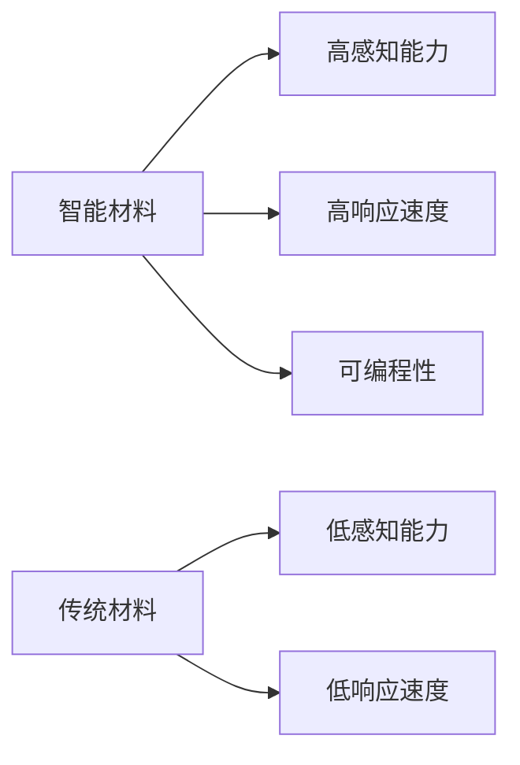
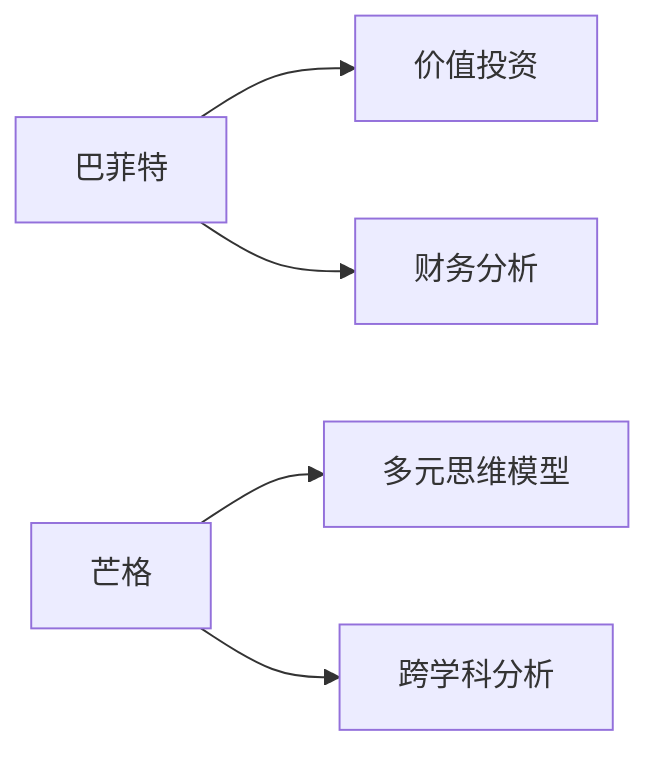
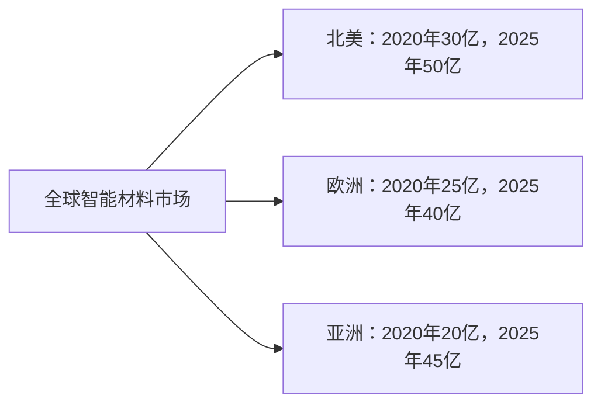
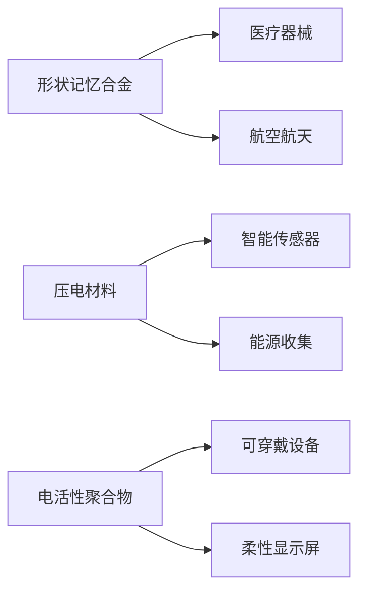
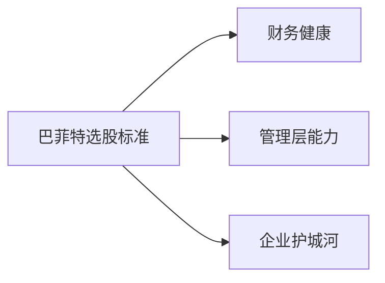
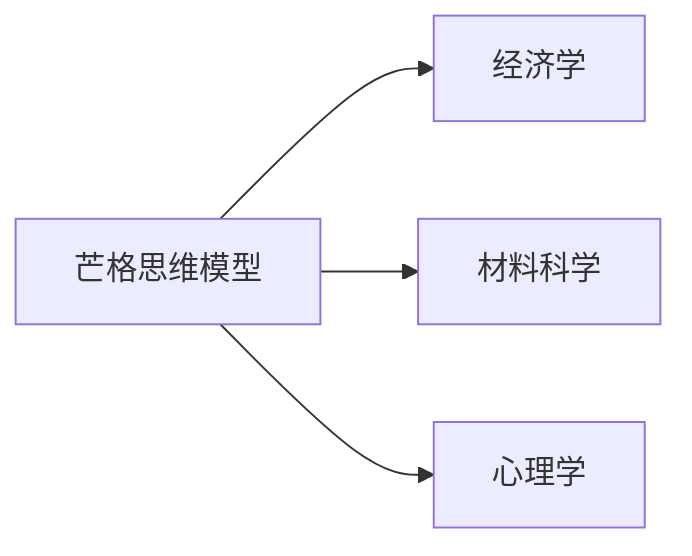
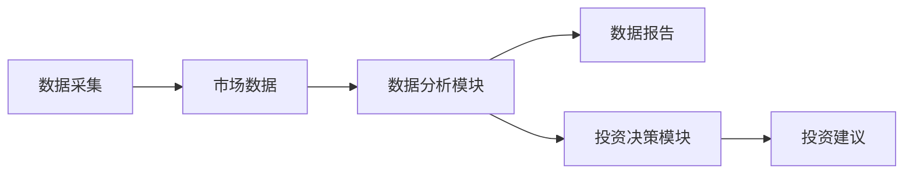
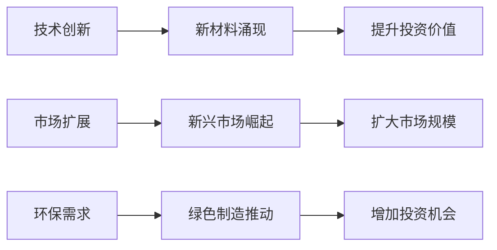

                 

# 巴菲特-芒格的智能材料投资：未来制造业的革命

---

## 关键词：
- 巴菲特
- 芒格
- 智能材料
- 制造业
- 投资策略

---

## 摘要：
本文探讨了巴菲特和芒格的投资理念在智能材料领域的应用，分析了智能材料在制造业中的革命性影响，结合实际案例和数据，提出了智能材料投资的策略与方法，展望了未来制造业的发展趋势。

---

## 第一部分：智能材料与投资概述

### 第1章：智能材料的基本概念

#### 1.1 智能材料的定义与特点
智能材料是一种能够感知环境变化并做出响应的材料，其特点是具有可编程性、自适应性和高灵敏度。以下是智能材料的关键特点对比：

| 特性         | 智能材料       | 传统材料     |
|--------------|----------------|--------------|
| 感知能力     | 高             | 低或无       |
| 响应速度     | 快             | 慢或无       |
| 可定制性     | 高             | 低           |
| 耐用性       | 高             | 中或低       |

**Mermaid图：智能材料与传统材料的对比**

#### 1.2 巴菲特与芒格的投资哲学
巴菲特的价值投资理念强调长期持有优质企业，芒格的多元思维模型则强调跨学科分析。以下是两者的投资哲学对比：

| 投资理念         | 巴菲特             | 芒格             |
|------------------|--------------------|------------------|
| 核心思想         | 价值投资           | 多元思维模型       |
| 分析方法         | 财务分析、管理层评估 | 跨学科分析、逆向思维 |
| 投资策略         | 长期持有优质股      | 寻找“护城河”企业   |

**Mermaid图：巴菲特与芒格投资理念对比**

---

### 第2章：智能材料的投资价值

#### 2.1 市场现状分析
智能材料市场近年来快速增长，年复合增长率超过15%。以下是主要市场的对比：

| 地区         | 2020年市场规模（亿美元） | 2025年预测市场规模（亿美元） |
|--------------|---------------------------|---------------------------|
| 北美         | 30                        | 50                        |
| 欧洲         | 25                        | 40                        |
| 亚洲         | 20                        | 45                        |

**Mermaid图：全球智能材料市场预测**

#### 2.2 技术创新与投资机会
智能材料的关键技术包括形状记忆合金、压电材料和电活性聚合物。以下是技术与应用场景的对比：

| 技术         | 应用场景               | 优势分析             |
|--------------|------------------------|----------------------|
| 形状记忆合金 | 医疗器械、航空航天     | 耐用性高、响应快     |
| 压电材料     | 智能传感器、能源收集   | 灵敏度高、能量转换效率高 |
| 电活性聚合物 | 可穿戴设备、柔性显示屏 | 轻薄、柔韧性好       |

**Mermaid图：智能材料技术与应用场景**

---

## 第二部分：智能材料的投资策略

### 第3章：巴菲特与芒格的投资策略

#### 3.1 巴菲特的选股标准
巴菲特选股注重企业的财务健康和管理层素质。以下是选股标准的详细分析：

| 选股标准       | 具体指标           | 重要性 |
|----------------|--------------------|--------|
| 财务健康       | 净利润、ROE、债务率 | 高     |
| 管理层能力     | 经验、声誉          | 高     |
| 企业护城河     | 市场垄断、技术壁垒 | 高     |

**Mermaid图：巴菲特选股标准**

#### 3.2 芒格的多元思维模型
芒格强调跨学科分析，以下是其思维模型的构成：

| 思维领域       | 分析方法           | 应用案例             |
|----------------|--------------------|----------------------|
| 经济学         | 边际成本分析       | 判断企业盈利能力     |
| 材料科学       | 技术可行性分析     | 评估智能材料的潜力   |
| 心理学         | 行为偏差分析       | 避免投资决策中的情绪化 |

**Mermaid图：芒格的多元思维模型**

---

## 第三部分：智能材料投资的系统分析

### 第4章：智能材料投资的系统架构

#### 4.1 系统功能设计
智能材料投资系统包括数据采集、分析、决策三个模块。以下是系统功能模块的对比：

| 模块         | 功能描述           | 输入/输出 |
|--------------|--------------------|-----------|
| 数据采集     | 收集市场数据       | 市场数据   |
| 数据分析     | 生成投资报告       | 数据报告   |
| 投资决策     | 输出投资建议       | 投资建议   |

**Mermaid图：智能材料投资系统架构**

---

## 第四部分：智能材料投资的项目实战

### 第5章：智能材料投资案例分析

#### 5.1 某智能材料公司投资分析
以下是某智能材料公司的财务数据和分析：

| 财务指标       | 数据（单位：亿美元） | 同行业对比 |
|----------------|-----------------------|------------|
| 营业收入       | 1.5                   | 高于行业均值 |
| 净利润         | 0.3                   | 稍低于行业均值 |
| 研发投入占比   | 10%                   | 高于行业均值 |

**结论**：该公司具备较高的成长潜力，但短期内利润增长有限。

---

## 第五部分：智能材料投资的未来展望

### 第6章：智能材料投资的未来趋势

#### 6.1 技术创新与市场扩展
智能材料技术将进一步成熟，市场将向更多领域扩展。以下是未来主要趋势：

| 趋势           | 描述                   | 影响         |
|----------------|------------------------|--------------|
| 技术创新       | 新材料的不断涌现       | 提升投资价值 |
| 市场扩展       | 新兴市场的崛起         | 扩大市场规模 |
| 环保需求       | 绿色制造的推动         | 增加投资机会 |

**Mermaid图：未来智能材料市场趋势**

---

## 结论

巴菲特和芒格的投资理念为智能材料投资提供了独特的视角。通过技术创新、市场扩展和环保需求的推动，智能材料将在未来制造业中发挥重要作用。投资者应结合技术分析和财务分析，制定科学的投资策略，抓住这一领域的投资机遇。

---

## 作者：AI天才研究院 & 禅与计算机程序设计艺术

--- 

希望这篇文章能满足您的需求！如果需要进一步的调整或补充，请随时告诉我。

