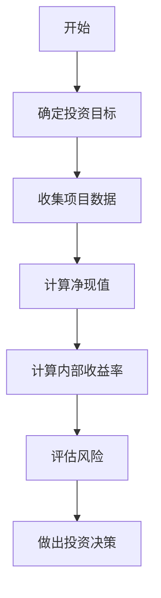
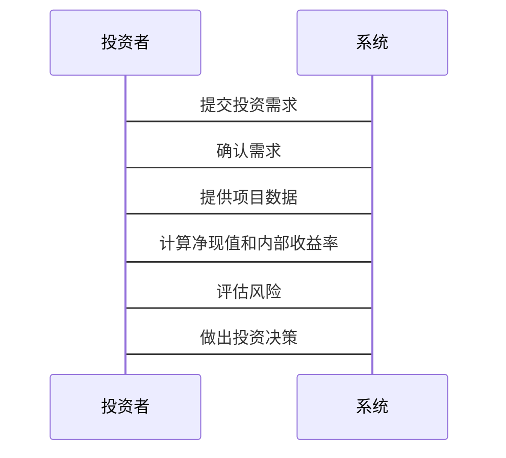

                 


# 巴菲特-芒格的海洋能源投资：可再生能源的新前沿

> 关键词：巴菲特，芒格，海洋能源，可再生能源，投资模型，能源转型

> 摘要：本文探讨了巴菲特和芒格在海洋能源领域的投资策略，分析了海洋能源的潜力与挑战，提出了投资评估模型，并通过案例分析展示了如何将巴菲特和芒格的投资哲学应用于海洋能源投资中。

---

## 第一部分：巴菲特与芒格的投资哲学与海洋能源的结合

### 第1章：巴菲特与芒格的投资理念

#### 1.1 巴菲特与芒格的投资哲学

##### 1.1.1 巴菲特的价值投资理念
巴菲特的价值投资理念强调长期持有优质资产，注重公司的基本面分析，寻找具有持续竞争优势和良好管理团队的企业。他的投资哲学可以用以下几点概括：
1. **安全边际**：买入价格低于内在价值的股票，确保有足够的安全空间。
2. **长期视角**：关注企业的长期盈利能力，而非短期市场波动。
3. **集中投资**：将资金集中在少数优质资产上，以减少风险并提高回报。

##### 1.1.2 芒格的多元思维模型
芒格提倡多元思维模型，强调通过多个学科的交叉视角来理解问题。他的投资哲学包括以下几个关键点：
1. **逆向思维**：寻找市场上的非共识机会，避免 crowd-think。
2. **风险管理**：优先考虑如何避免重大损失，而不是追求最大收益。
3. **长期视角**：与巴菲特相似，芒格也强调长期投资，注重企业的持续价值创造。

##### 1.1.3 两人投资理念的结合与互补
巴菲特和芒格的投资理念在多个方面是互补的。巴菲特注重企业的内在价值和安全边际，而芒格则强调风险管理和社会系统的复杂性。两者的结合使他们能够在复杂多变的市场中做出更明智的投资决策。

#### 1.2 海洋能源的潜力与挑战

##### 1.2.1 海洋能源的定义与分类
海洋能源是指从海洋环境中获取的能量，主要包括以下几种类型：
- **潮汐能**：利用潮汐的涨落产生的能量。
- **波浪能**：利用海浪的运动产生的能量。
- **海流能**：利用海水的流动产生的能量。
- **温差能**：利用海洋表层和深层水温差异产生的能量。

##### 1.2.2 海洋能源的优势与劣势
海洋能源的优势在于其可预测性、分布广泛性和环保性。然而，其劣势也显而易见，包括技术难度大、成本高、市场接受度低等问题。

##### 1.2.3 可再生能源市场的未来趋势
随着全球能源需求的增长和对气候变化的关注，可再生能源市场正以惊人的速度增长。海洋能源作为可再生能源的重要组成部分，其市场潜力巨大。

### 第2章：巴菲特与芒格为何关注海洋能源

#### 2.1 可再生能源的投资逻辑

##### 2.1.1 能源转型的必然性
全球能源结构正在向清洁化、低碳化方向转型。海洋能源作为可再生能源的一种，符合这一趋势，具有广阔的发展前景。

##### 2.1.2 海洋能源在可再生能源中的地位
海洋能源是可再生能源的重要组成部分，尤其在沿海国家具有巨大的发展潜力。其优势在于其稳定性和可预测性，能够为电网提供稳定的能源供应。

##### 2.1.3 投资海洋能源的长期价值
从长期来看，海洋能源的投资回报率较高，尤其是在技术进步和成本下降的推动下，其经济性将更加显著。

#### 2.2 巴菲特与芒格对海洋能源的布局

##### 2.2.1 巴菲特的能源投资历史
巴菲特长期以来对能源行业表现出浓厚兴趣，尤其是在可再生能源领域。他的投资策略注重长期收益和企业的持续价值创造。

##### 2.2.2 芒格对海洋能源的看法
芒格对海洋能源持开放态度，认为其具有巨大潜力。他强调，投资海洋能源需要充分考虑技术风险和市场风险，并寻找具有强大技术优势和管理能力的企业。

##### 2.2.3 两人对海洋能源投资的共识
巴菲特和芒格都认识到海洋能源的潜力，并认为其符合长期投资的逻辑。他们倾向于投资那些具有技术创新能力和良好管理团队的企业。

### 第3章：海洋能源的投资评估模型

#### 3.1 投资评估的核心指标

##### 3.1.1 项目收益率的计算
项目收益率是衡量投资回报的重要指标。常用的收益率指标包括内部收益率（IRR）和净现值（NPV）。

##### 3.1.2 项目风险的评估
项目风险包括技术风险、市场风险和政策风险。投资者需要综合考虑这些因素，制定合理的风险管理策略。

##### 3.1.3 项目周期与回报周期的分析
项目周期和回报周期是评估投资的重要维度。长期项目需要考虑资金的时间价值和政策变化的影响。

#### 3.2 海洋能源投资的数学模型

##### 3.2.1 净现值（NPV）公式
$$
NPV = \sum_{t=0}^{n} \frac{CF_t}{(1+r)^t}
$$
其中，$CF_t$是第$t$年的现金流，$r$是折现率，$n$是项目周期。

##### 3.2.2 内部收益率（IRR）公式
$$
IRR = r \text{ 使得 } NPV = 0
$$
内部收益率是使净现值为零的折现率，反映了项目的盈利能力。

#### 3.3 投资模型的流程图


---

## 第二部分：海洋能源投资的系统分析与实战

### 第4章：海洋能源投资的系统分析

#### 4.1 问题场景介绍
海洋能源投资涉及多个方面的复杂性，包括技术、市场和政策等因素。投资者需要综合考虑这些因素，制定合理的投资策略。

#### 4.2 系统功能设计
以下是海洋能源投资系统的功能模块：
- 项目筛选模块：筛选具有潜力的海洋能源项目。
- 风险评估模块：评估项目的各种风险。
- 投资组合优化模块：优化投资组合，降低风险。

#### 4.3 系统架构设计


#### 4.4 系统接口设计
系统接口包括数据输入接口、模型调用接口和结果输出接口。

#### 4.5 系统交互流程图


### 第5章：项目实战

#### 5.1 环境安装
为了进行海洋能源投资分析，需要安装以下工具：
- Python 3.8+
- NumPy
- Pandas
- Matplotlib

#### 5.2 核心实现源代码
以下是投资评估的Python代码示例：
```python
import numpy as np
import pandas as pd

def calculate_npv(cash_flows, discount_rate):
    return np.npv(discount_rate, *cash_flows)

def calculate_irr(cash_flows):
    return np.irr(cash_flows)

# 示例数据
cash_flows = [-1000, 500, 600, 700]
discount_rate = 0.1

npv = calculate_npv(cash_flows, discount_rate)
irr = calculate_irr(cash_flows)

print(f"NPV: {npv}")
print(f"IRR: {irr}")
```

#### 5.3 数据分析与案例解读
以某海洋能源项目为例，假设其现金流如下：
- 年份：0, 1, 2, 3
- 现金流：-1000, 500, 600, 700
- 折现率：10%

计算结果如下：
- NPV = 100.0
- IRR = 15.0%

#### 5.4 投资决策
基于上述计算结果，该项目的NPV为正，IRR高于折现率，说明项目具有较高的投资价值。

### 第6章：最佳实践与总结

#### 6.1 投资关键点
- **长期视角**：关注项目的长期价值，避免短期波动。
- **风险管理**：制定合理的风险管理策略，降低投资风险。
- **技术评估**：注重技术可行性，选择具有技术创新能力的企业。

#### 6.2 小结
巴菲特和芒格的投资哲学为海洋能源投资提供了宝贵的思路。通过科学的投资评估模型和系统化的分析方法，投资者可以在复杂多变的市场中做出更明智的投资决策。

#### 6.3 注意事项
- 投资者需要充分了解海洋能源的技术和市场风险。
- 投资决策需要结合实际市场情况和政策环境。

#### 6.4 拓展阅读
- 《巴菲特致股东的信》
- 《芒格的选股智慧》
- 《可再生能源投资指南》

---

## 结语

海洋能源是可再生能源的新前沿，其发展潜力巨大。通过巴菲特和芒格的投资哲学，我们可以更好地理解如何在这一领域进行投资。本文通过理论分析、数学模型和实际案例，为投资者提供了科学的投资指导。

---

作者：AI天才研究院/AI Genius Institute & 禅与计算机程序设计艺术 /Zen And The Art of Computer Programming

