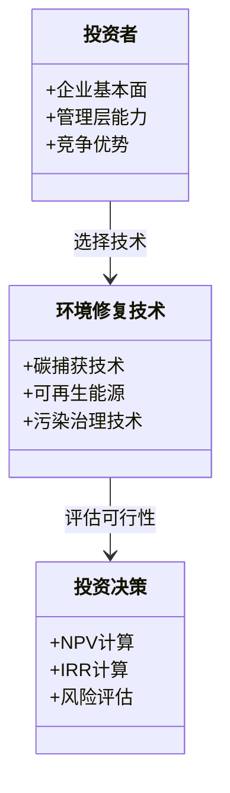

                 


# 巴菲特-芒格的环境修复技术投资：应对气候危机

> 关键词：巴菲特，芒格，环境修复技术，气候变化，投资策略，可再生能源

> 摘要：本文探讨了巴菲特和芒格在环境修复技术领域的投资策略，分析了他们在应对气候变化中的角色和影响。通过介绍环境修复技术的分类、投资模型的构建、系统架构设计以及实际案例分析，本文为投资者提供了如何在气候变化背景下进行技术投资的深度见解。

---

## 第一部分：环境修复技术与投资背景

### 第1章：环境修复技术的背景与意义

#### 1.1 环境问题的全球性挑战

环境问题，尤其是气候变化，已经成为全球性的挑战。根据IPCC的报告，全球气温的持续上升正在导致极端天气事件的频率增加，生态系统受到破坏，以及海平面上升等严重后果。这些问题不仅威胁到自然环境，还对经济和社会发展构成了重大风险。因此，环境修复技术的开发和应用变得尤为重要，它不仅是应对气候变化的关键手段，也是实现可持续发展的重要途径。

#### 1.2 巴菲特与芒格的投资理念

巴菲特和芒格是投资界的传奇人物，他们的投资哲学以价值投资为核心，强调长期投资、基本面分析和管理层能力的重要性。巴菲特的价值投资理念强调购买具有强大竞争优势和良好治理的企业，并长期持有。芒格则强调多元思维模型，认为投资者需要通过多学科的视角来理解问题，并在决策中考虑复利效应和时间的价值。

#### 1.3 环境修复技术投资的重要性

在应对气候变化的过程中，环境修复技术（如碳捕获、可再生能源和污染治理技术）被认为是减少温室气体排放、改善环境质量的重要手段。巴菲特和芒格的投资理念与环境修复技术的目标高度契合，尤其是在长期性和可持续性方面。通过投资环境修复技术，不仅能够帮助应对气候变化，还能够在长期创造经济价值。

---

### 第2章：环境修复技术的分类与特点

#### 2.1 环境修复技术的主要类型

环境修复技术可以分为以下几类：

1. **碳捕获与封存技术**：通过化学或物理方法捕获二氧化碳，并将其封存在地下或转化为有用的产品。
2. **可再生能源技术**：包括太阳能、风能、生物质能等，用于减少化石燃料的使用。
3. **污染治理技术**：用于处理空气、水和土壤污染，恢复生态环境。

#### 2.2 各类环境修复技术的优缺点对比

| 技术类型       | 优点                               | 缺点                               |
|----------------|------------------------------------|------------------------------------|
| 碳捕获技术     | 高效减少碳排放，技术成熟           | 成本高，大规模应用的技术障碍       |
| 可再生能源     | 可持续性强，环境友好               | 依赖自然资源，间歇性问题           |
| 污染治理技术   | 多样化解决方案，适用性强            | 处理成本高，技术复杂性大           |

---

### 第3章：巴菲特-芒格投资策略与环境修复技术的结合

#### 3.1 巴菲特-芒格投资策略的核心要素

1. **企业基本面分析**：关注企业的财务状况、盈利能力和发展潜力。
2. **管理层能力评估**：选择有能力且有良好声誉的管理团队。
3. **行业周期与竞争优势**：选择处于成长期的行业，并具有竞争优势的企业。

#### 3.2 环境修复技术投资的可行性分析

1. **技术成熟度评估**：确保技术已经经过验证，并具备商业化潜力。
2. **市场需求预测**：分析环境修复技术的市场需求，判断其是否具有长期增长空间。
3. **政策支持与风险评估**：考虑政府政策的支持力度，评估技术应用中的政策风险和市场风险。

---

### 第4章：环境修复技术投资的数学模型与决策分析

#### 4.1 投资决策的数学模型

##### 净现值（NPV）模型

净现值（Net Present Value, NPV）是评估投资项目 profitability 的常用方法。公式如下：

$$
NPV = \sum_{t=0}^{n} \frac{C_t}{(1 + r)^t}
$$

其中，\( C_t \) 是第 \( t \) 年的现金流，\( r \) 是折现率，\( n \) 是项目寿命。

##### 内部收益率（IRR）模型

内部收益率（Internal Rate of Return, IRR）是使 NPV 等于零的折现率：

$$
NPV = 0 = \sum_{t=0}^{n} \frac{C_t}{(1 + IRR)^t}
$$

##### 投资回收期（Payback Period）模型

投资回收期是项目回收初始投资所需的时间，通常用于评估项目的流动性。

#### 4.2 环境修复技术投资的风险评估

1. **技术风险**：技术是否成熟，是否存在技术瓶颈。
2. **市场风险**：市场需求是否稳定，是否存在替代技术。
3. **政策风险**：政策变化是否会影响技术的应用。

---

### 第5章：环境修复技术投资的系统分析与架构设计

#### 5.1 问题场景介绍

为了应对气候变化，投资者需要选择合适的环境修复技术，并制定有效的投资策略。

#### 5.2 系统功能设计

以下是系统功能设计的领域模型：



#### 5.3 系统架构设计

以下是系统架构设计的架构图：


---

## 第六章：项目实战

### 6.1 环境修复技术投资的案例分析

#### 6.1.1 案例背景

以巴菲特和芒格投资某可再生能源项目为例，分析他们的投资决策过程。

#### 6.1.2 技术实现

以下是项目的系统实现：

```python
def calculate_NPV(cash_flows, discount_rate):
    npv = sum(c / (1 + discount_rate) ** t for t, c in enumerate(cash_flows))
    return npv

cash_flows = [-100, 50, 60, 70]
discount_rate = 0.1

npv = calculate_NPV(cash_flows, discount_rate)
print(f"净现值为：{npv}")
```

#### 6.1.3 案例分析

通过对该项目的NPV计算，发现项目的净现值为正，具有较好的投资价值。这表明巴菲特和芒格的投资决策是基于科学的财务模型和对技术潜力的准确判断。

---

## 第七章：最佳实践与总结

### 7.1 小结

环境修复技术投资是应对气候变化的重要手段。巴菲特和芒格的投资策略为投资者提供了宝贵的经验，尤其是在长期投资和风险管理方面。

### 7.2 注意事项

1. **技术风险**：在选择环境修复技术时，需评估其技术成熟度和商业化潜力。
2. **政策变化**：密切关注相关政策的变化，确保投资的合规性。
3. **市场波动**：注意市场的波动性，合理配置资产。

### 7.3 拓展阅读

1. 巴菲特和芒格的其他投资案例。
2. 环境修复技术的最新发展。

---

作者：AI天才研究院/AI Genius Institute & 禅与计算机程序设计艺术 /Zen And The Art of Computer Programming

