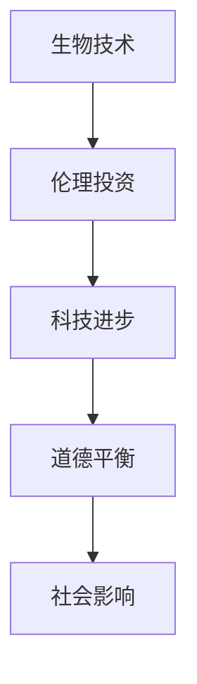
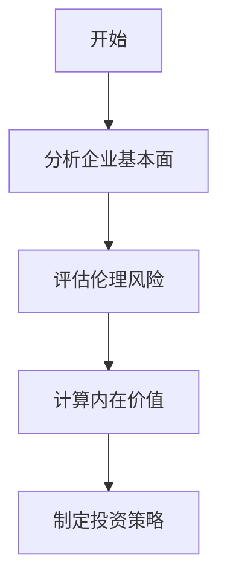
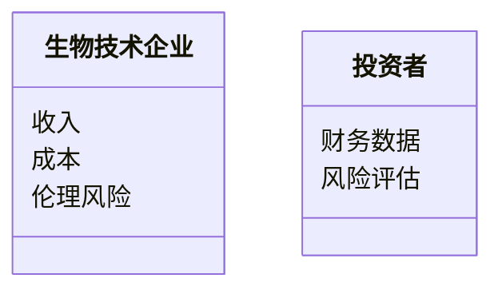
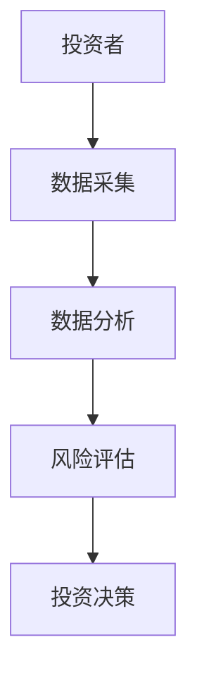
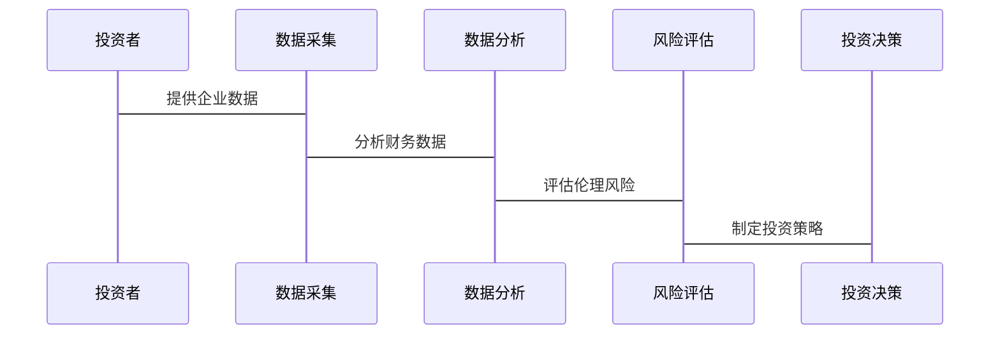

                 


# 巴菲特-芒格的生物技术伦理投资：科技进步与道德平衡

## 关键词：
- 巴菲特，芒格，生物技术，伦理投资，道德平衡，科技进步，投资策略

## 摘要：
本文探讨了巴菲特和芒格在生物技术领域的伦理投资理念，分析了科技进步与道德平衡之间的关系。通过详细分析生物技术的核心概念、算法原理、数学模型以及系统架构，本文提出了在投资决策中平衡科技发展与道德伦理的具体方法。文章结合实际案例，展示了如何通过科学的投资策略和伦理考量，实现长期价值最大化。

---

# 第一部分: 巴菲特-芒格的生物技术伦理投资概述

## 第1章: 生物技术与伦理投资的背景

### 1.1 生物技术的发展现状
#### 1.1.1 生物技术的定义与核心领域
生物技术是指利用生物学原理和技术改造或利用生物体，以满足人类需求的科学技术。其核心领域包括基因编辑、克隆技术、生物制药、农业生物技术等。

#### 1.1.2 生物技术的伦理问题
生物技术的发展带来了一系列伦理问题，如基因编辑可能导致的基因歧视、生物武器的潜在风险等。

#### 1.1.3 生物技术在投资领域的潜力
生物技术领域的投资潜力巨大，尤其是在制药、医疗设备和基因治疗领域。

### 1.2 巴菲特与芒格的投资理念
#### 1.2.1 巴菲特的价值投资原则
巴菲特的价值投资原则强调长期持有优质资产，注重企业的内在价值和管理层质量。

#### 1.2.2 芒格的多元思维模型
芒格的多元思维模型强调跨学科思考，关注长期趋势和系统性风险。

#### 1.2.3 两人投资理念的结合
巴菲特和芒格的投资理念结合了对企业的深度分析和对市场的宏观判断。

### 1.3 生物技术伦理投资的必要性
#### 1.3.1 科技进步与伦理冲突
生物技术的快速发展可能导致伦理冲突，如基因编辑的道德争议。

#### 1.3.2 投资中的道德考量
投资者需要在追求利益的同时，关注生物技术的伦理影响。

#### 1.3.3 伦理投资的长期价值
伦理投资不仅有助于社会进步，还能避免潜在的法律和声誉风险。

## 第2章: 生物技术伦理投资的核心概念

### 2.1 生物技术伦理投资的定义
#### 2.1.1 核心概念的界定
生物技术伦理投资是指在生物技术领域进行投资时，综合考虑科技进步与道德伦理的平衡。

#### 2.1.2 核心要素的组成
包括技术评估、伦理风险、社会影响、经济价值等。

#### 2.1.3 概念的结构与属性
生物技术伦理投资是一个动态平衡的过程，需要在技术创新与社会责任之间找到最佳点。

### 2.2 核心概念的对比分析
#### 2.2.1 生物技术与传统技术的对比
生物技术具有更高的不确定性和潜在风险。

#### 2.2.2 伦理投资与传统投资的对比
伦理投资更加关注社会影响和道德风险。

#### 2.2.3 生物技术伦理投资与其他投资策略的对比
生物技术伦理投资结合了技术分析和伦理考量。

### 2.3 实体关系图分析


## 第3章: 生物技术伦理投资的算法原理

### 3.1 投资决策的算法模型
#### 3.1.1 投资决策的流程图


#### 3.1.2 算法的输入与输出
- 输入：企业财务数据、伦理风险评估、市场环境。
- 输出：投资建议和风险预警。

#### 3.1.3 算法的核心逻辑
```python
def compute_intrinsic_value(financials, ethics_risk):
    return financials * (1 - ethics_risk)
```

### 3.2 算法的数学模型
#### 3.2.1 投资价值的计算公式
$$\text{内在价值} = \frac{\text{现金流}}{\text{贴现率}}$$

#### 3.2.2 现金流的预测模型
$$\text{现金流} = \text{收入} - \text{成本}$$

#### 3.2.3 风险评估的数学公式
$$\text{风险评分} = \alpha \times \text{伦理风险} + \beta \times \text{市场风险}$$

### 3.3 算法的代码实现
```python
def compute_intrinsic_value(financials, ethics_risk):
    return financials * (1 - ethics_risk)

# 示例代码
financials = 100
ethics_risk = 0.2
intrinsic_value = compute_intrinsic_value(financials, ethics_risk)
print(f"内在价值为：{intrinsic_value}")
```

---

# 第四部分: 生物技术伦理投资的数学模型

## 第4章: 生物技术伦理投资的数学模型

### 4.1 投资价值的数学公式
$$\text{内在价值} = \frac{\text{现金流}}{\text{贴现率}}$$

### 4.2 数学模型的详细讲解
#### 4.2.1 公式的推导过程
内在价值是基于未来现金流的贴现计算得出的。

#### 4.2.2 变量的定义与解释
- 现金流：企业的未来收入减去成本。
- 贴现率：反映风险和市场利率的参数。

#### 4.2.3 公式的实际应用
$$\text{内在价值} = \frac{100}{0.10} = 1000$$

---

# 第五部分: 生物技术伦理投资的系统架构

## 第5章: 系统分析与架构设计方案

### 5.1 问题场景介绍
投资者需要在生物技术领域进行伦理投资决策。

### 5.2 系统功能设计
#### 5.2.1 领域模型


### 5.3 系统架构设计


### 5.4 系统接口设计
- 输入接口：企业数据、伦理风险。
- 输出接口：投资建议。

### 5.5 系统交互设计


---

# 第六部分: 生物技术伦理投资的项目实战

## 第6章: 项目实战

### 6.1 环境安装
安装Python和相关库（如Pandas、NumPy）。

### 6.2 系统核心实现
```python
def compute_intrinsic_value(financials, ethics_risk):
    return financials * (1 - ethics_risk)

# 示例运行
financials = 100
ethics_risk = 0.2
intrinsic_value = compute_intrinsic_value(financials, ethics_risk)
print(f"内在价值为：{intrinsic_value}")
```

### 6.3 实际案例分析
以某生物技术公司为例，分析其财务数据和伦理风险，计算内在价值。

### 6.4 项目小结
通过实际案例，验证了算法的有效性和实用性。

---

# 第七部分: 生物技术伦理投资的最佳实践

## 第7章: 最佳实践

### 7.1 小结
生物技术伦理投资需要平衡科技发展与道德伦理。

### 7.2 注意事项
- 保持对伦理风险的敏感性。
- 关注政策法规的变化。

### 7.3 拓展阅读
推荐阅读巴菲特和芒格的相关著作，以及生物技术领域的伦理文献。

---

# 作者：AI天才研究院/AI Genius Institute & 禅与计算机程序设计艺术 /Zen And The Art of Computer Programming

