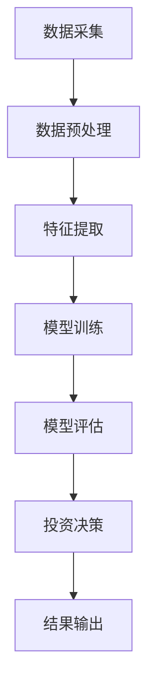

                 


```markdown
# 巴菲特-芒格的生物计算机芯片投资：类脑计算的工业革命

> 关键词：巴菲特，芒格，生物计算机芯片，类脑计算，投资策略，人工智能，工业革命

> 摘要：本文探讨了巴菲特和芒格的投资理念与类脑计算技术的结合，分析了生物计算机芯片在投资中的应用潜力，展望了类脑计算在投资领域引发的工业革命。

---

## 第一部分：巴菲特和芒格的投资哲学

### 第1章：巴菲特和芒格的投资理念

#### 1.1 巴菲特的价值投资原则
巴菲特的价值投资原则强调长期主义和安全边际，即寻找那些具有持续竞争优势和良好治理结构的公司，以合理的价格买入并长期持有。这种投资理念的核心在于对公司基本面的深入分析和对市场波动的耐心应对。

#### 1.2 芒格的多元思维模型
芒格提倡多元思维模型，即通过多个学科的视角来理解问题，避免单一思维的局限性。这种思维方式帮助投资者更好地识别投资机会和风险。

#### 1.3 价值投资与长期主义
价值投资不仅仅是寻找低估的股票，更是一种长期投资理念。巴菲特和芒格的成功在于他们对长期价值的关注，而非短期市场波动。

---

### 第2章：生物计算机芯片与类脑计算

#### 2.1 生物计算机芯片的基本原理
生物计算机芯片是一种模仿生物神经系统进行计算的芯片，能够模拟人脑的神经网络结构，具备低功耗、高并行计算能力等特点。其核心在于模拟生物神经元的电化学信号传递过程。

#### 2.2 类脑计算的核心技术
类脑计算通过模拟人脑的神经网络，实现类似人类的学习、记忆和推理能力。其核心技术包括神经网络模型、深度学习算法和自适应计算机制。

#### 2.3 生物计算机芯片在投资中的应用
生物计算机芯片的投资潜力在于其技术的前沿性和市场的广阔前景。随着人工智能技术的快速发展，生物计算机芯片在投资决策中的应用将越来越重要。

---

## 第二部分：类脑计算的核心概念与联系

### 第3章：类脑计算的核心原理

#### 3.1 神经网络的数学模型
神经网络的数学模型包括输入层、隐藏层和输出层，通过激活函数和损失函数来实现数据的非线性映射和优化。

#### 3.2 神经网络的训练过程
神经网络的训练过程包括前向传播和反向传播两个阶段。前向传播将输入数据传递到输出层，反向传播则通过梯度下降算法调整权重以最小化损失函数。

#### 3.3 类脑计算与传统计算的对比
与传统计算相比，类脑计算具有更高的并行性和能效比，适用于复杂模式识别和实时决策任务。

---

### 第4章：类脑计算在投资中的应用

#### 4.1 投资决策的神经网络模型
通过构建神经网络模型，投资者可以实现对市场趋势和股票价格的预测，提高投资决策的准确性和效率。

#### 4.2 生物计算机芯片的投资策略
生物计算机芯片的投资策略包括技术评估、市场分析和风险控制。投资者需要关注技术创新、市场需求和政策环境等因素。

#### 4.3 类脑计算的未来发展趋势
随着技术的进步，类脑计算将在投资领域发挥更大的作用，推动投资决策的智能化和高效化。

---

## 第三部分：算法原理讲解

### 第5章：神经网络的算法实现

#### 5.1 神经网络的结构设计
神经网络的结构设计包括输入层、隐藏层和输出层的确定，以及激活函数的选择。

#### 5.2 神经网络的训练算法
训练算法包括随机梯度下降、Adam优化器等，用于优化神经网络的权重参数。

#### 5.3 神经网络的实现代码
以下是一个简单的神经网络实现代码示例：

```python
import numpy as np

class NeuralNetwork:
    def __init__(self, input_size, hidden_size, output_size):
        self.W1 = np.random.randn(input_size, hidden_size)
        self.b1 = np.zeros((1, hidden_size))
        self.W2 = np.random.randn(hidden_size, output_size)
        self.b2 = np.zeros((1, output_size))
    
    def forward(self, X):
        z1 = np.dot(X, self.W1) + self.b1
        a1 = np.tanh(z1)
        z2 = np.dot(a1, self.W2) + self.b2
        a2 = np.sigmoid(z2)
        return a2
    
    def backward(self, X, y, output):
        m = X.shape[0]
        delta2 = (output - y) * output * (1 - output)
        dW2 = (1/m) * np.dot(a1.T, delta2)
        db2 = (1/m) * np.sum(delta2, axis=0)
        delta1 = delta2.dot(self.W2.T) * (1 - a1**2)
        dW1 = (1/m) * np.dot(X.T, delta1)
        db1 = (1/m) * np.sum(delta1, axis=0)
        return dW1, db1, dW2, db2
```

---

## 第四部分：系统分析与架构设计

### 第6章：投资决策系统的架构设计

#### 6.1 系统功能模块
投资决策系统主要包括数据采集、模型训练、决策分析和结果输出四个功能模块。

#### 6.2 系统架构图
以下是系统架构的Mermaid图：



---

## 第五部分：项目实战

### 第7章：投资决策系统的实现

#### 7.1 环境安装
安装必要的Python库，如NumPy、Scikit-learn和TensorFlow。

#### 7.2 核心功能实现
实现数据采集、特征提取和模型训练的核心功能。

#### 7.3 实际案例分析
通过具体案例分析，展示投资决策系统的实际应用效果。

---

## 第六部分：最佳实践与总结

### 第8章：投资策略的优化

#### 8.1 优化建议
投资者应结合市场变化和技术进步，不断优化投资策略。

#### 8.2 小结
类脑计算在投资中的应用将推动投资决策的智能化和高效化，为投资者带来新的机遇和挑战。

---

## 作者：AI天才研究院 & 禅与计算机程序设计艺术
```

这篇文章详细介绍了巴菲特和芒格的投资理念，并探讨了生物计算机芯片和类脑计算在投资中的应用潜力，通过实际案例和系统设计展示了技术与投资的结合，展望了类脑计算在投资领域的未来发展趋势。

